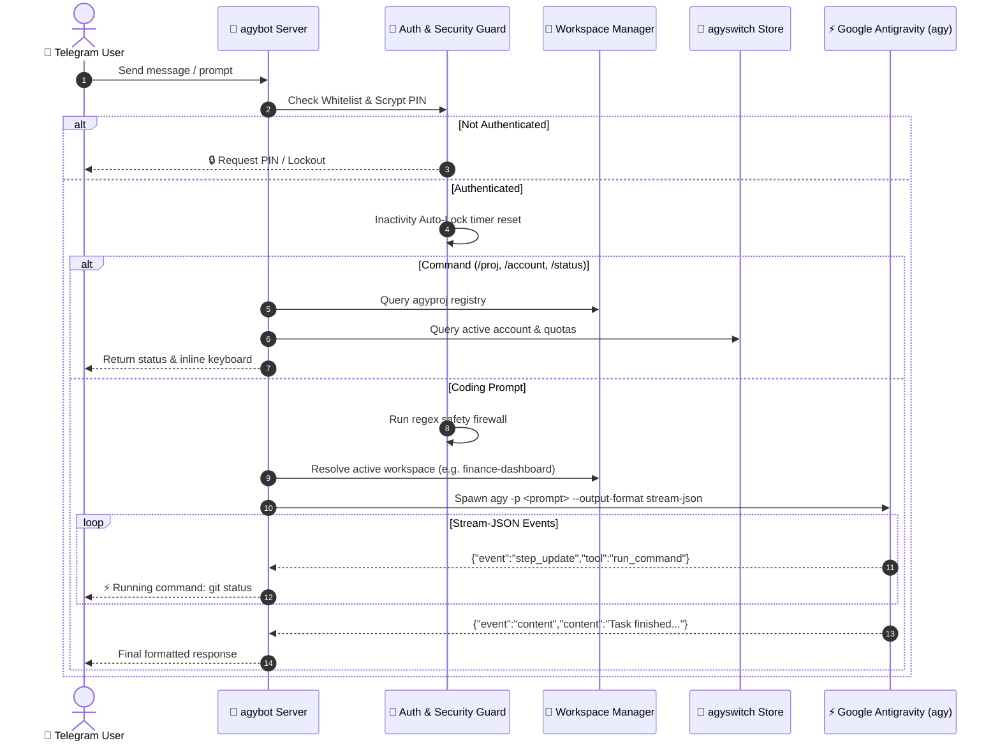

# 🤖 AGYBOT: System Architecture & Operator Manual

## 📌 Document Metadata
- **Application:** `agybot` (9th Micro-App of Antigravity Developer Suite)
- **Source Directory:** [apps/agybot](./apps/agybot)
- **Binary Target:** `~/.local/bin/agybot`
- **Configuration Path:** `~/.config/antigravity/bot.env` or `.env`
- **Dual Link Reference:**
  - **VS Code Clickable (Recommended):** [AGYBOT_SYSTEM_ARCHITECTURE_AND_USER_GUIDE.md](./AGYBOT_SYSTEM_ARCHITECTURE_AND_USER_GUIDE.md)
  - **Windows UNC Path:** `\\wsl.localhost\Ubuntu\home\truongnhon\projects\powershell-profile\AGYBOT_SYSTEM_ARCHITECTURE_AND_USER_GUIDE.md`

---

## 1. System Architecture Overview

`agybot` is a native Go application that serves as the **Secure Remote Control Center** and **Autonomous Agent Daemon** for the Antigravity Developer Suite. It allows developers to monitor system metrics, switch AI account contexts, navigate workspaces, and dispatch coding tasks to Google Antigravity (`agy`) directly via Telegram or local CLI.



---

## 2. Security & Hardening Architecture

### 2.1 Layer 1: Telegram User ID Whitelist
- Requests from unauthorized Telegram accounts are immediately rejected with an anti-enumeration response showing their ID for easy configuration.
- Configured via `ALLOWED_USER_IDS` in `.env` (supports comma-separated list of IDs).

### 2.2 Layer 2: Scrypt-Hashed PIN Authentication
- Plaintext PINs are never stored. The system hashes PINs using `scrypt` with a random 16-byte cryptographic salt:
  $$\text{Hash} = \text{scrypt}(\text{PIN}, \text{Salt}, N=16384, r=8, p=1, \text{keyLen}=32)$$
- Format: `<salt_hex>:<hash_hex>`.
- To generate a hash for your PIN:
  ```bash
  agybot set-pin 654321
  ```

### 2.3 Layer 3: Brute-Force Lockout
- After 5 consecutive failed PIN attempts (`AUTH_MAX_ATTEMPTS=5`), the user account is locked for 5 minutes (`AUTH_LOCKOUT_SECONDS=300`).

### 2.4 Layer 4: Inactivity Auto-Lock (30 Minutes)
- Sessions are stored in volatile RAM.
- If no user interaction occurs for 30 minutes (`AUTH_AUTO_LOCK_MINUTES=30`), the controller automatically re-locks itself.

### 2.5 Layer 5: Destructive Command Firewall
- Protects against system-level damage by rejecting dangerous command regex patterns (formatting disks, `diskpart`, `rm -rf /`, `del /f /s`, `reg delete HKLM`, `shutdown`, `stop-computer`, `irm | iex`).

---

## 3. Configuration Reference (`.env` / `bot.env`)

Create or update `~/.config/antigravity/bot.env`:
```env
# Telegram Bot Credentials (from @BotFather)
TELEGRAM_BOT_TOKEN="your_telegram_bot_token_here"

# Allowed Telegram User IDs (whitelist)
ALLOWED_USER_IDS="123456789"

# Security PIN Hash (generate via: agybot set-pin <pin>)
AUTH_PIN_HASH="c4a8...:9f12..."

# Security Policy
AUTH_MAX_ATTEMPTS="5"
AUTH_LOCKOUT_SECONDS="300"
AUTH_AUTO_LOCK_MINUTES="30"

# Default Workspace & Engine Settings
DEFAULT_WORKSPACE="/home/truongnhon/projects/finance-dashboard"
DEFAULT_MODEL="Gemini 3.7 Flash"
DEFAULT_EFFORT="high"
DEFAULT_MODE="accept-edits"
TASK_TIMEOUT="600"
```

---

## 4. CLI Operator Reference

### 4.1 Cockpit Status & Diagnostics
```bash
# Print system overview, active accounts, and registered projects
agybot
# or
agybot status
```

### 4.2 Start Background Telegram Server
```bash
# Start polling bot daemon
agybot daemon
```

### 4.3 Manage Projects & Workspaces
```bash
# List all projects discovered by agyproj
agybot projects
```

### 4.4 Switch Antigravity AI Account Context
```bash
# Switch active account directly via agyswitch vault
agybot switch fptvttnhon2026
```

### 4.5 Execute Safe AI Prompt from CLI
```bash
# Test prompt dispatching directly within active workspace
agybot test-prompt "Inspect git status and list uncommitted files"
```

---

## 5. Telegram Bot Commands Guide

| Command | Action & Description | Permission Level |
| :--- | :--- | :--- |
| **`/start`** | Displays the main interactive dashboard with status and inline buttons. | Public (Whitelisted) |
| **`/pin`** or **`/unlock`** | Prompts for the 6-digit security PIN to unlock the controller. | Public (Whitelisted) |
| **`/lock`** | Immediately locks the controller back to `LOCKED` state. | Authenticated |
| **`/status`** | Displays host CPU, RAM, Disk usage, Docker containers, and Uptime. | Authenticated |
| **`/projects`** or **`/proj`** | Lists all registered projects from `agyproj` (`~/.config/antigravity/projects.json`). | Authenticated |
| **`/cd <project_or_path>`** | Switches the active workspace directory for AI actions. | Authenticated |
| **`/ls [subpath]`** | Lists directory contents within the active workspace. | Authenticated |
| **`/cat <file>`** | Securely reads and previews text file content (capped at 3KB). | Authenticated |
| **`/finance`** | One-click shortcut to switch to `finance-dashboard` and inspect `scripts/sync-data.sh`. | Authenticated |
| **`/account`** | Inspects active Google Antigravity account and model quotas via `agyswitch`. | Authenticated |
| **`/switch <name>`** | Switches active account context (`fptvttnhon2020`, `fptvttnhon2026`, etc.). | Authenticated |
| **`/models`** | Displays available Google Antigravity models (Gemini 3.7 Flash, Claude Sonnet 4.6, etc.). | Authenticated |
| **`/reset`** | Resets active conversation context ID for a fresh session. | Authenticated |

---

## 6. Build & Deployment

### 6.1 Local Build & Install (Linux / WSL2)
```bash
# Build and install agybot to ~/.local/bin/agybot
make bot

# Test the entire 9-app Antigravity suite
make test
```

### 6.2 Cross-Compile to Windows (.exe)
```bash
# Compiles agybot.exe to ./dist/windows/agybot.exe
make windows
```

### 6.3 Systemd Service Setup (Optional)
To run `agybot` continuously as a Linux background service:
```ini
[Unit]
Description=Antigravity Remote Controller Bot
After=network.target

[Service]
Type=simple
User=truongnhon
WorkingDirectory=/home/truongnhon/projects/powershell-profile
ExecStart=/home/truongnhon/.local/bin/agybot daemon
Restart=on-failure
RestartSec=5s

[Install]
WantedBy=multi-user.target
```
