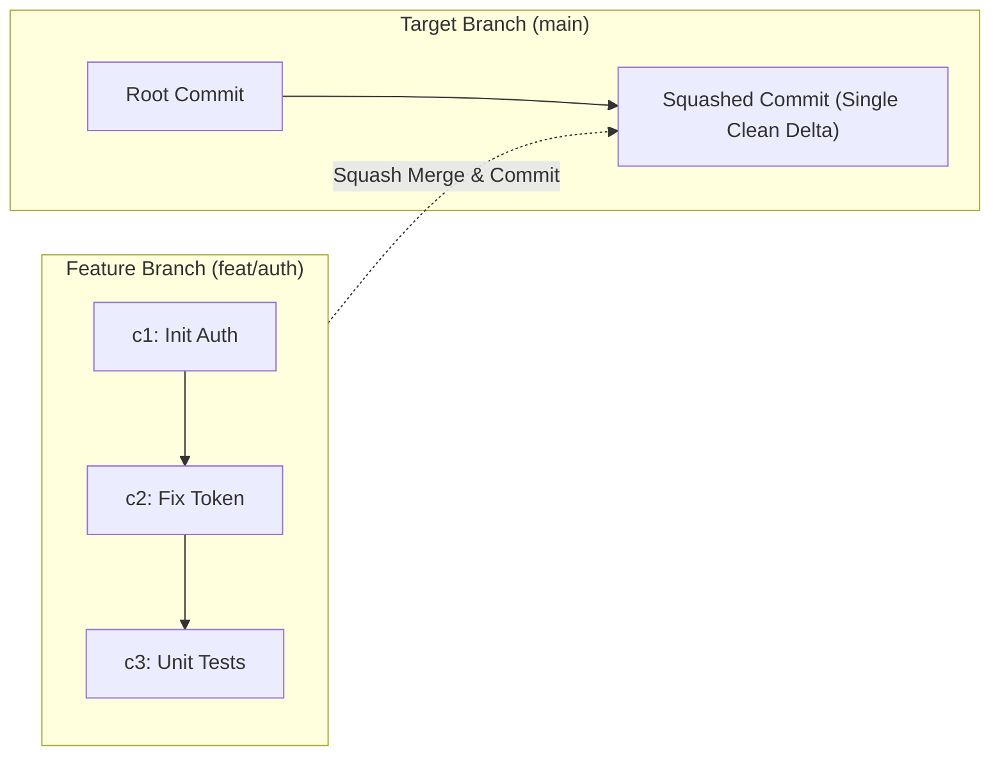
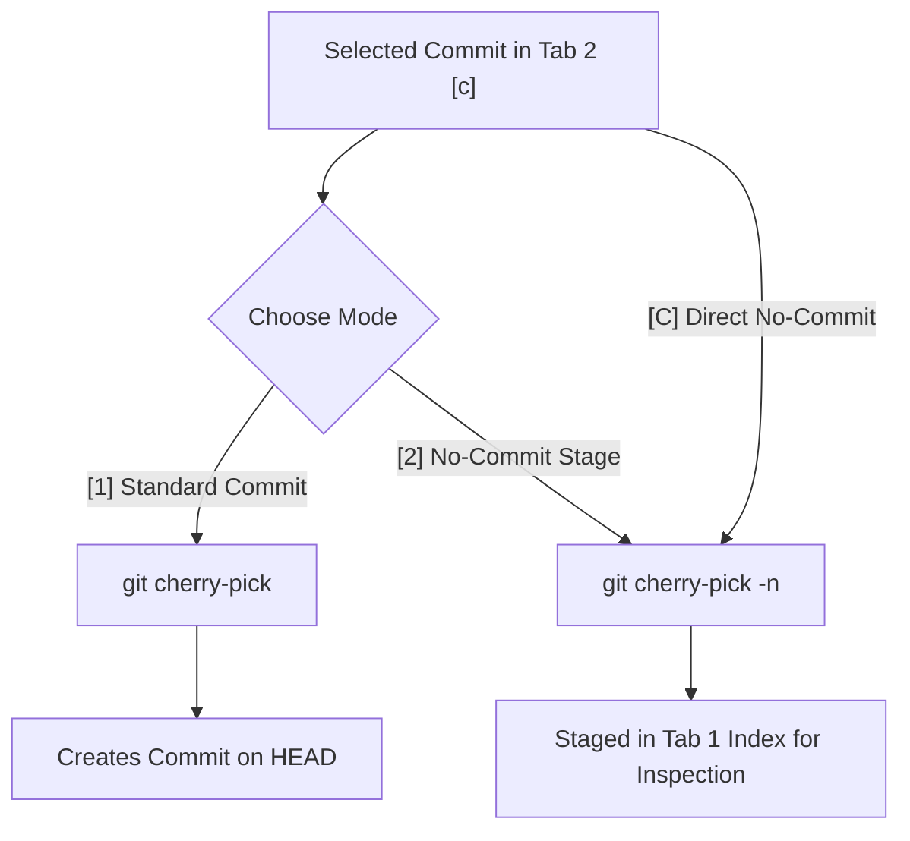

# AGYGIT & AGYPROJ Feature Investigation & Task Audit Report

> **Investigation Date:** October 1, 2026  
> **Target Applications:** `apps/agygit` (Advanced Git Cockpit) & `apps/agyproj` (Workspace Hub)  
> **Report Document:** [AGYGIT_FEATURES_INVESTIGATION.md](./AGYGIT_FEATURES_INVESTIGATION.md)  
> **Windows File Path:** `C:\Users\TruongNhon\Documents\Powershell\AGYGIT_FEATURES_INVESTIGATION.md`  

---

## 1. Executive Summary

This document presents a comprehensive technical investigation, architectural analysis, and task breakdown for the latest capabilities implemented across **AGYGIT** and **AGYPROJ**:

1. **Squash Merge**: Streamlining multi-commit feature branches into a single clean commit with optional automated commit messaging and TUI prompt integration.
2. **Reset Soft Commit (Undo & Arbitrary Ref Soft Reset)**: Non-destructive commit rollback preserving all changes staged in the index, supporting relative counts (`HEAD~N`), explicit hashes, and interactive TUI table rollback.
3. **Cherry-Pick**: Granular commit replay with dual operational modes (immediate commit vs. `--no-commit` staged preview) and abort management.
4. **AGYPROJ Workspace Hub Refinements**: Replacing external Cursor references with the Built-in Terminal IDE (`terminal`), decluttering Tab 0 by eliminating redundant `[A] Agy` hotkeys, and delivering a dedicated search filter mode.

---

## 2. Feature Deep-Dive & Architecture

### Feature 1: Squash Merge (`git merge --squash`)

#### 2.1 Mechanics & Technical Behavior
Unlike a standard recursive merge that creates a merge commit with multiple parents, `git merge --squash <branch>` computes the cumulative delta between the current `HEAD` and the target branch and applies all changes directly into the **staging index** as uncommitted changes without advancing the branch pointer or generating a commit.



#### 2.2 Implemented Capabilities in AGYGIT
- **Service Layer (`gitops.SquashMerge`)**:
  - Executes `git merge --squash <branchName>`.
  - If a commit message is provided, automatically executes `git commit -m "<msg>"` in a single atomic flow.
  - If no message is provided, leaves changes safely staged in the index for developer inspection.
- **CLI Command**:
  ```bash
  agygit squash-merge <branch-name> [commit-message]
  ```
  *Example:* `agygit squash-merge feat/dwm-purge "feat(system): automate DWM purge"`
- **TUI Cockpit Integration**:
  - In **Tab 3 (`🔀 Branch & Rebase`)**, pressing `[s]` or `[S]` on any branch opens an in-cockpit modal:
    ```text
    🔀 [agygit] Squash Merge Branch into 'main'
    ───────────────────────────────────────────────────────────────────
     Incoming Branch: feat/login
     Target Branch:   main (HEAD)
    ───────────────────────────────────────────────────────────────────
     • Flattens all commits from the branch into a single set of changes.
     • Does NOT create an automatic merge commit.
    ───────────────────────────────────────────────────────────────────
     [1] Squash & Stage Only      (Review all staged changes in Tab 1)
     [2] Squash & Commit Directly (Provide a commit message now)
     [Esc] Cancel
    ───────────────────────────────────────────────────────────────────
     Select option [1/2/Esc]: 
    ```
  - **Option 1 (Stage Only)**: Executes `git merge --squash` and immediately switches active view to Tab 0 (`📊 Status & Commit`), allowing the developer to review, stage/unstage, and inspect the unified diffs.
  - **Option 2 (Commit Directly)**: Prompts for a commit message with an intelligent suggestion (`feat: squash merge branch '<branch>'`), commits atomically, and transitions to Tab 0.
  - **Conflict Handling**: If merge conflicts occur, the console app transitions immediately to Tab 0, triggers conflict flags (`⚠️ CONFLICT`), displays an alert banner, and offers `[m]` to resolve (ours/theirs) or `[x]` to abort.

---

### Feature 2: Reset Soft Commit (`git reset --soft`)

#### 2.2 Mechanics & Technical Behavior
`git reset --soft <target>` updates the current `HEAD` reference to point to `<target>` while leaving the working directory and the index (staging area) completely untouched. All differences between `<target>` and the former `HEAD` remain staged and ready for re-committing or amending.

| Git Reset Mode | HEAD Ref Updated | Index (Staging) | Working Tree | Use Case in AGYGIT |
| :--- | :---: | :---: | :---: | :--- |
| **`--soft`** | **Yes** | **Preserved (Staged)** | **Preserved** | **Undo commits safely to reword/split/repackage** |
| `--mixed` | Yes | Reset | Preserved | Unstage everything |
| `--hard` | Yes | Reset | Reset (Discarded) | Destructive abort |

#### 2.2 Implemented Capabilities in AGYGIT
- **Service Layer (`gitops.GitResetSoft`)**:
  - Accepts relative targets (`HEAD~1`), plain numeric counts (`2` translates to `HEAD~2`), or specific commit hashes (`0fd601a`).
  - Implements `GitUndo` as a convenient default to `HEAD~1`.
- **CLI Commands**:
  ```bash
  agygit undo                     # Soft reset HEAD~1
  agygit reset-soft [target|N]    # Soft reset to specific ref, hash, or N commits back
  ```
  *Examples:*
  - `agygit reset-soft 2` (Undoes 2 commits, keeping changes staged)
  - `agygit reset-soft 0fd601a`
- **TUI Cockpit Integration**:
  - **Tab 1 (`📊 Status & Commit`)**: Pressing `[U]` opens an in-cockpit selection modal:
    ```text
    ⏮️  Undo Commit (Non-destructive Soft Reset)
    ───────────────────────────────────────────────────────────────────
     Current HEAD: feat(system): automate DWM purge...
     [1] Undo Last Commit (HEAD~1)  - Changes stay staged in index
     [2] Undo N Commits Back        - Choose number of commits
     [Esc] Cancel
    ───────────────────────────────────────────────────────────────────
     Select option [1/2/Esc]: 
    ```
    Changes remain safely preserved in the staging area for immediate re-commit or modification.
  - **Tab 2 (`📜 Graph & Log`)**: Navigating to any historical commit in the table and pressing `[u]` or `[U]` opens an interactive rollback modal:
    ```text
    ⏮️  Soft Reset to Commit: [0fd601a]
    ───────────────────────────────────────────────────────────────────
     Subject: feat(system): automate DWM purge...
     Author:  TruongNhon (2 hours ago)
    ───────────────────────────────────────────────────────────────────
     • All commits AFTER this will be rolled back from HEAD.
     • ALL changes from rolled-back commits will remain STAGED in your index.
    ───────────────────────────────────────────────────────────────────
     [1] Confirm Soft Reset to this commit
     [Esc] Cancel
    ───────────────────────────────────────────────────────────────────
     Select option [1/Esc]: 
    ```
    Upon confirmation, HEAD is updated to the selected commit, and the console cockpit automatically transitions to **Tab 0 (`📊 Status & Commit`)**, displaying all the rolled-back files staged in the index ready for review!

---

### Feature 3: Cherry-Pick (`git cherry-pick`)

#### 3.1 Mechanics & Technical Behavior
`git cherry-pick <hash>` copies the delta introduced by a specific historical commit and applies it onto the current `HEAD`.
- Standard mode creates a new commit preserving the original commit's subject and author.
- No-commit mode (`-n` / `--no-commit`) applies the patch directly to the working tree and index without creating a commit, enabling review and modification before finalizing.



#### 3.2 Implemented Capabilities in AGYGIT
- **Service Layer (`gitops.CherryPickEx` & `gitops.CherryPickAbort`)**:
  - `CherryPickEx(repoPath, commitHash, noCommit bool)`: supports `-n` staging.
  - `CherryPickAbort(repoPath)`: cleanly aborts in-progress cherry-picks upon conflicts.
- **CLI Commands**:
  ```bash
  agygit cherry-pick [-n|--no-commit] <commit-hash>
  agygit cherry-pick --abort
  ```
- **TUI Cockpit Integration**:
  - In **Tab 2 (`📜 Graph & Log`)**:
    - Pressing `[c]` opens an interactive modal:
      ```text
      🍒 Cherry-Pick Commit into 'main'
      ───────────────────────────────────────────────────────────────────
       Commit:  c35c920 · feat: token refresh fix
       Author:  TruongNhon (1 hour ago)
      ───────────────────────────────────────────────────────────────────
       [1] Cherry-Pick & Commit Immediately (git cherry-pick)
       [2] Cherry-Pick --no-commit          (Stage changes for inspection)
       [Esc] Cancel
      ───────────────────────────────────────────────────────────────────
       Select option [1/2/Esc]: 
      ```
    - Pressing `[C]` directly executes safe `--no-commit` cherry-pick and automatically transitions to Tab 0 (`📊 Status & Commit`).
    - **Conflict Handling**: If a conflict occurs during cherry-pick, the console app automatically routes to Tab 0, displays the `⚠️ CHERRY-PICK IN PROGRESS` red banner, marks conflicting files with `⚠️ CONFLICT`, and enables `[m]` to resolve conflict or `[x]` to abort.

---

### Feature 4: In-Progress Operation Detection & Abort Flow

AGYGIT now tracks Git state machine markers (`.git/MERGE_HEAD`, `.git/CHERRY_PICK_HEAD`, `.git/rebase-merge`, `.git/rebase-apply`, `.git/SQUASH_MSG`):
- **Live Alert Banner**: When any operation is in-progress, Tab 0 renders an alert banner:
  ```text
  ⚠️ SQUASH IN PROGRESS · [m] Resolve conflict · [x] Abort squash · [c] Commit/Continue
  ```
- **Smart Abort Hotkey (`[x]`)**:
  - In Tab 0, if an operation is active, pressing `[x]` asks: `[agygit] Abort active <operation>? (y/N)` and cleanly cleans up using `git merge --abort`, `git rebase --abort`, `git cherry-pick --abort`, and `git reset --merge`.
  - In Tab 3, `[x]` provides a global abort for any active branch operations.

---

## 3. AGYPROJ Workspace Hub Refinements

### 3.1 Complete Removal of Cursor AI Editor
In `apps/agyproj`:
- Removed legacy `Cursor AI Editor` completely from the environment configurations.
- Consolidated default IDE options into 3 streamlined, fully functional tools:
  1. **Visual Studio Code** (`code`): Full graphical IDE (`code <dir>`).
  2. **Neovim / Vim (Terminal Editor)** (`nvim`): Robust terminal editor with automatic scanning across `nvim` -> `vim` -> `nano`.
  3. **Antigravity CLI Agent** (`agy`): Interactive AI coding agent session in the workspace.
- Added automatic config sanitization in `registry.go` migrating any legacy `"cursor"` entries to `"code"`.
- Recompiled and deployed both `agyproj` and `agygit` binaries directly to `~/.local/bin/`.

### 3.2 Tab 0 Hotkey Decluttering (Removed `[A]`)
- In Tab 1 (`📁 Workspaces`):
  - Removed `[A] Agy` from the navigation footer.
  - Disabled the `a`/`A` hotkey that previously launched the agent session unexpectedly.
  - Tab 1 (`🔍 Discover & Register`) retains `[A] Register All` for scanning and registering bulk repositories.

### 3.3 Interactive Search Filter UX
- During active search mode (`inSearchMode`), the footer dynamically transforms to:
  ```text
  [Enter] Apply Search · [Esc] Cancel · [↑/↓] Nav · Type to search
  ```
- Status indicator clearly displays active search query and matching counter (`X/Y matches`).

---

## 4. Task Verification & Test Matrix

| Task ID | Component | Description | Test Verification | Status |
| :--- | :--- | :--- | :--- | :---: |
| **TSK-01** | `apps/agyproj` | Remove Cursor completely; streamline IDE list to VS Code, Neovim/Vim, Antigravity | `TestApp_Render`, manual inspection | 🟢 Pass |
| **TSK-02** | `apps/agyproj` | Remove `[A]` hotkey and footer from Workspaces Tab 0 | `TestApp_Render`, `app.go` switch | 🟢 Pass |
| **TSK-03** | `apps/agyproj` | Dynamic search mode footer & filter prompt | `TestApp_SearchFilter` | 🟢 Pass |
| **TSK-04** | `apps/agygit` | Implement `SquashMerge` with optional commit message & CLI | `TestGitOps_SquashMerge_WithMessage` | 🟢 Pass |
| **TSK-05** | `apps/agygit` | Interactive TUI Squash Merge with commit prompt | `app.go` Tab 2 handler | 🟢 Pass |
| **TSK-06** | `apps/agygit` | Implement `GitResetSoft` supporting `HEAD~N`, counts, & hashes | `TestGitOps_GitResetSoft_Target` | 🟢 Pass |
| **TSK-07** | `apps/agygit` | Tab 1 Soft Reset `[u]` to selected commit | `app.go` Tab 1 handler | 🟢 Pass |
| **TSK-08** | `apps/agygit` | Implement `CherryPickEx` with `--no-commit` (`-n`) and `--abort` | `TestGitOps_CherryPickEx_NoCommit` | 🟢 Pass |
| **TSK-09** | `apps/agygit` | TUI Dual Cherry-Pick `[c]` (commit) & `[C]` (staged preview) | `app.go` Tab 1 handler & footer | 🟢 Pass |
| **TSK-10** | `apps/agygit` | Active operation banner (`⚠️ %s IN PROGRESS`) & `[x]` abort flow | Tab 0 render & abort handler | 🟢 Pass |
| **TSK-11** | `apps/agygit` | Interactive 2-option Squash Merge modal with auto-switch to Tab 0 | Tab 2 `[s]` handler & tests | 🟢 Pass |
| **TSK-12** | Both | Clean Go build and 100% test passing across all packages | `go test -v ./...` in both projects | 🟢 Pass |

---

## 5. Quick Reference & Dual Links

- **Documentation Deliverable:** [AGYGIT_FEATURES_INVESTIGATION.md](./AGYGIT_FEATURES_INVESTIGATION.md)
- **Windows WSL UNC Path:** `\\wsl.localhost\Ubuntu\mnt\c\Users\TruongNhon\Documents\Powershell\AGYGIT_FEATURES_INVESTIGATION.md`
- **Native Windows Path:** `C:\Users\TruongNhon\Documents\Powershell\AGYGIT_FEATURES_INVESTIGATION.md`
- **AGYGIT Source Code:**
  - GitOps Engine: [gitops.go](./apps/agygit/internal/service/gitops/gitops.go)
  - Git Cockpit View: [app.go](./apps/agygit/internal/view/app.go)
  - Git CLI Entrypoint: [main.go](./apps/agygit/main.go)
- **AGYPROJ Source Code:**
  - Workspace View: [app.go](./apps/agyproj/internal/view/app.go)
  - Launcher Engine: [launcher.go](./apps/agyproj/internal/service/launcher/launcher.go)
  - Registry Config: [project.go](./apps/agyproj/internal/model/project.go)
