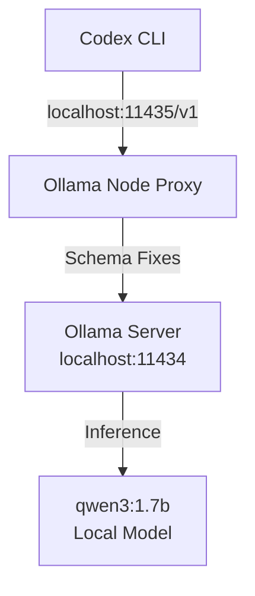

# Setup Guide: OpenAI Codex with Local Ollama

This guide details how to configure the Codex CLI to run fully offline using a local Ollama model provider via our customized loopback proxy.

---

## 📋 System Architecture



---

## ⚙️ Step 1: Configure `config.toml`

Locate your global Codex configuration file at `C:\Users\TruongNhon\.codex\config.toml` (or create it if missing) and configure the local model provider and MCP limits to conserve context tokens:

```toml
# Set the default model
model = "qwen3:1.7b"
model_reasoning_effort = "medium"
approvals_reviewer = "user"

# Define the custom local provider pointing to the proxy port (11435)
[model_providers.ollama_custom]
name = "Ollama Custom"
base_url = "http://127.0.0.1:11435/v1"

# Disable token-heavy external MCP servers to preserve context space
[mcp_servers.gitnexus]
command = 'C:\Users\TruongNhon\AppData\Roaming\npm\gitnexus.cmd'
args = ["mcp"]
enabled = false
```

---

## 🛸 Step 2: Initialize & Run Server

Start the local server and proxy by running the wrapper functions:

```powershell
# Automatically starts the Ollama server in a visible window and starts the loopback proxy on port 11435
codex --help
```

---

## 🧪 Step 3: Run Verification Prompts

Verify connection and prompt generation:

```powershell
# Run a one-shot query
"" | codex exec "say hello in one word" --ephemeral
```

---

## 🛠️ Troubleshooting

### 1. Connection Refused
Ensure the proxy is active on port `11435` and the local Ollama server is active on `11434`:
```powershell
Get-NetTCPConnection -LocalPort 11435, 11434 -ErrorAction SilentlyContinue
```

### 2. DNS Resolution Timeouts
Confirm Node is configured to resolve IPv4 addresses first to bypass IPv6 loopback issues:
```powershell
$env:NODE_OPTIONS = "--dns-result-order=ipv4first"
```
