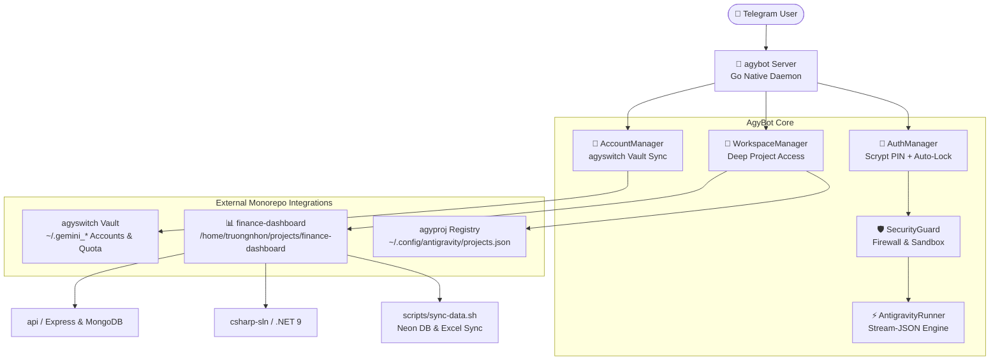

# 📊 Finance Dashboard: Scripts Deep Audit & AgyBot Integration

## 📌 Document Metadata
- **Reference Project:** `\\wsl.localhost\Ubuntu\home\truongnhon\projects\finance-dashboard`
- **Scripts Directory:** `\\wsl.localhost\Ubuntu\home\truongnhon\projects\finance-dashboard\scripts`
- **Integrated Application:** [apps/agybot](./apps/agybot)
- **Target Monorepo:** [powershell-profile](./)
- **Dual Link Reference:**
  - **VS Code Clickable (Recommended):** [FINANCE_DASHBOARD_SCRIPTS_AUDIT_AND_INTEGRATION.md](./FINANCE_DASHBOARD_SCRIPTS_AUDIT_AND_INTEGRATION.md)
  - **Windows UNC Path:** `\\wsl.localhost\Ubuntu\home\truongnhon\projects\powershell-profile\FINANCE_DASHBOARD_SCRIPTS_AUDIT_AND_INTEGRATION.md`

---

## 1. Executive Summary

The `finance-dashboard` repository is the primary financial analytics, categorization, and transaction management solution in the user's workspace. It consists of a dual backend (.NET 9 C# Web API and Express Node API), a React/Vite web interface, a React Native mobile application, and a cloud-backed PostgreSQL database on **Neon Cloud** alongside a local development database.

The `scripts/` directory houses the operational backbone for data integrity, database seeding, automated migration testing, and cloud synchronization.

---

## 2. Deep Audit of `finance-dashboard/scripts/`

### 2.1 `sync-data.sh` (Database & Master Excel Synchronization)
- **Location:** `finance-dashboard/scripts/sync-data.sh` (393 lines, 14.5 KB)
- **Core Operations:**
  1. `status`: Compares row counts across all 16 business tables between Local PostgreSQL (`localhost:5432/financedb`) and Neon Cloud PostgreSQL (`ep-lively-hill...neon.tech:5432/neondb`).
  2. `prod-to-dev`: Safely pulls production data to development using `pg_dump` with `--clean --if-exists --no-owner --no-privileges` and imports via `psql`.
  3. `dev-to-prod`: Guarded push from local development to production with explicit interactive confirmation.
  4. `backup`: Generates timestamped compressed SQL snapshots in `backups/db/` and Excel backups in `backups/xlsx/`.
  5. `sync-xlsx`: Synchronizes master `data.xlsx` files between Express API (`api/data/`) and .NET 9 API (`csharp-sln/data/`).
- **Synchronized Table Sequence (16 Tables):**
  ```text
  1. users                    9. recurring_transactions
  2. workspaces              10. savings_accounts
  3. workspace_members       11. savings_history_items
  4. categorization_rules    12. subscriptions
  5. transactions            13. ai_sessions
  6. budgets                 14. ai_messages
  7. debts                   15. audit_logs
  8. goals                   16. __EFMigrationsHistory
  ```
- **Network Resilience Engineering:**
  - Implements `get_prod_psql_conn()` with automated IPv4 resolution (`getent ahostsv4`) and `nc -zv` TCP probing to bypass WSL2 IPv6 connection timeouts against Neon pooler endpoints.

### 2.2 Operational Batch Launchers Matrix

| Script File | Purpose & Architecture | Execution Context |
| :--- | :--- | :--- |
| **`enable_long_paths.bat`** | Configures Windows Registry `LongPathsEnabled=1` to prevent `node_modules` path limit errors. | Windows Admin Command Prompt |
| **`run_ef_init_db.bat`** | Initializes Entity Framework Core database schema and migrations. | Windows / .NET 9 SDK |
| **`run_ef_add_migration.bat`**| Generates a new EF Core migration for schema changes. | Windows / .NET 9 SDK |
| **`run_ef_database_update.bat`**| Applies pending EF Core migrations to the target database. | Windows / .NET 9 SDK |
| **`run_full_test_verification.bat`**| Executes TypeScript compile check and unit test suites across `api`, `ui`, and `mobile`. | Windows / Node.js & pnpm |
| **`run_seed_csharp_production.bat`**| Cleans and seeds Neon Cloud production database via C# data seeder. | Windows / .NET 9 C# API |
| **`run_seed_local.bat`** | Runs local seeder against `api/.env` (MongoDB / PostgreSQL). | Windows / pnpm |
| **`run_seed_production.bat`** | Runs production cloud seeder against `api/.env.production`. | Windows / pnpm |

---

## 3. Deep Project Access Architecture in `agybot`

The new Go-based `agybot` integrates with `finance-dashboard` at multiple layers:



### 3.1 Project Recognition & Locking
- `agybot` reads `~/.config/antigravity/projects.json` where `finance-dashboard` is pinned as the primary active project (`active_project_id: "finance-dashboard"`).
- Typing `/finance` in Telegram instantly locks the active AI workspace onto `/home/truongnhon/projects/finance-dashboard`.

### 3.2 Codebase Exploration via Telegram
Users can navigate `finance-dashboard` remotely from their phone:
- `/ls scripts` -> lists all launcher and sync scripts.
- `/cat scripts/sync-data.sh` -> inspects table sequence or connection logic.
- `/cat .env.production` -> inspects production configuration (secured by Telegram Whitelist and PIN).

### 3.3 Remote AI Task Dispatching with Antigravity
When the user sends a prompt:
> *"Audit the categorization engine in csharp-sln and verify transaction seeding"*
1. `agybot` verifies the user's PIN session.
2. The Security Guard validates that the prompt contains no destructive OS commands and injects safety constraints confining changes to `finance-dashboard`.
3. `AntigravityRunner` spawns `agy` in `/home/truongnhon/projects/finance-dashboard` using the active Google Antigravity account (`fptvttnhon2020`).
4. Live tool notifications (`⚡ Running command...`, `🔍 Inspecting codebase...`, `✏️ Editing file...`) stream to Telegram in real-time.
