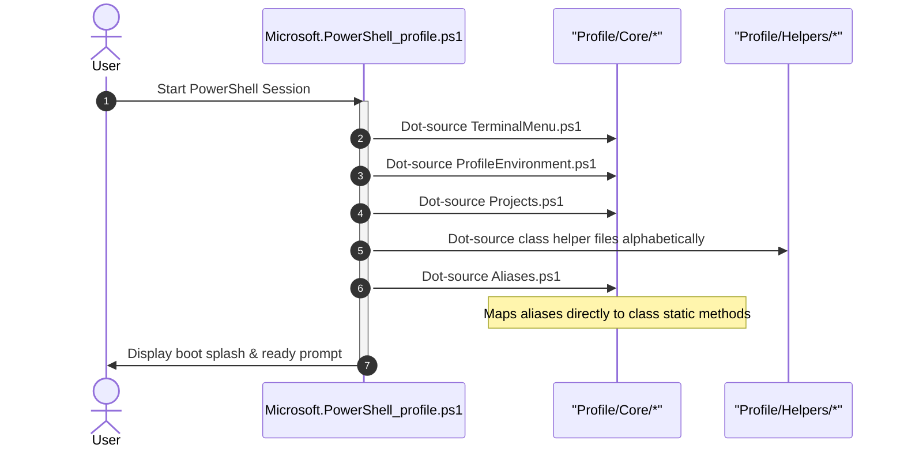
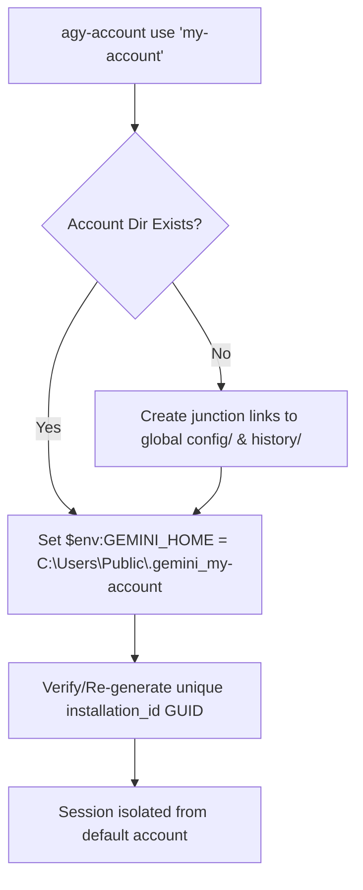

# Enhanced PowerShell Profile 🚀

A modular, strongly-typed, class-based PowerShell profile environment optimized for .NET developers and AI engineers.

---

## 📂 Repository Architecture & Layout

Core environment scripts and specific helper classes are separated from the test project into logical subfolders under `Profile/` and `Tests/`:

```
Powershell/
├── .github/
│   └── workflows/
│       └── ci.yml                     # GitHub Actions CI Workflow
├── Profile/                           # Profile configuration & classes
│   ├── Core/                          # Core profile and TUI elements
│   │   ├── TerminalMenu.ps1           # class TerminalMenu (TUI menu helper)
│   │   ├── ProfileEnvironment.ps1     # class ProfileEnvironment (PSReadLine & theme options)
│   │   ├── Aliases.ps1                # Centralized aliases & routing wrappers
│   │   ├── Projects.ps1               # Projects collection configuration
│   │   └── ProfileHelp.ps1            # class ProfileHelp (interactive help menu)
│   └── Helpers/                       # Context-specific class modules
│       ├── ProfileNavigator.ps1       # class ProfileNavigator (workspace hopper)
│       ├── SystemHelper.ps1           # class SystemHelper (processes & disks helper)
│       ├── SshHelper.ps1              # class SshHelper (SSH connections & secure keys)
│       ├── DotNetHelper.ps1           # class DotNetHelper (.NET SDK & EF Migrations)
│       ├── GitHelper.ps1              # class GitHelper (Git wrapper)
│       ├── DockerHelper.ps1           # class DockerHelper (Docker Compose & cleanup)
│       ├── AwsHelper.ps1              # class AwsHelper (LocalStack client queries)
│       ├── AiHelper.ps1               # class AiHelper (Ollama CLI integrations)
│       ├── AgyAccountManager.ps1      # class AgyAccountManager (Multi-Account isolation)
│       ├── AgySecretVault.ps1         # class AgySecretVault (DPAPI Encrypted Secrets Vault)
│       ├── DatabaseHelper.ps1         # class DatabaseHelper (SQLite Schema Viewer TUI)
│       ├── ProjectScaffolder.ps1      # class ProjectScaffolder (Template Project Builder)
│       └── LogHelper.ps1              # class LogHelper (Multiplexed Colorized Log Streamer)
├── Tests/                             # Consolidated Test Project
│   ├── Unit/                          # Pester unit tests
│   │   ├── AI-Tools.Tests.ps1         # AI wrappers mock unit tests
│   │   └── Profile-All.Tests.ps1      # Core profile features unit tests
│   ├── E2E/                           # End-to-end integration tests
│   │   └── Test-OllamaFunctions.ps1   # Real Ollama proxy integration validator
│   ├── Mocks/                         # Mock proxy server logic
│   │   └── ollama-proxy.js            # Port 11435 model-inject compat proxy
│   └── run_tests.ps1                  # Local AST syntax and Pester test runner
├── .gitignore
└── README.md
```

---

## ⚙️ Session Boot Sequence



---

## 🧠 Business Logic & Script Usage Notes

### 1. Multi-Account Manager (`agy` / `AgyAccountManager`)
Isolates accounts by manipulating `$env:GEMINI_HOME` under `C:\Users\Public\.gemini_<name>`.
* **TUI Dashboard Menu**: Type `agy-m` to open the persistent interactive management console to select, sign in/out, add, or delete accounts.
* **Persistent Switch**: `agy-account use '<name>'` (survives shell reboots by writing to `active_account.txt`).
* **Temporary Switch**: `agy-account use '<name>' -Temporary` (isolated for the current console session only).
* **Keyring Token Syncing**: Automatically encrypts and backs up active tokens to `keyring_token.txt` in your isolated directory, swapping them in/out of the Windows Credential Manager when transitioning accounts.
* **Self-Healing Sync**: Automatically scans and repairs junction links for `config` (custom skills) and `antigravity` (conversation history) back to the global primary folder.
* **Dynamic Wrappers**: Custom wrapper commands (`agy-<name>`) and index-based alias shortcuts (`agy1`, `agy2`, etc.) allow one-off commands to run under a specific account without switching your shell context.
* **Isolation Flow**:


### 2. Workspace Navigator (`project nav` / `ProfileNavigator`)
Runs quick transitions to registered workspace directories.
* **Jump directly**: `proj <query>` (performs case-insensitive regex search; jumps immediately if query is unique).
* **Conflict resolution**: Shows interactive TUI selection menu if multiple match your query.
* **Star Indicators**: Star symbols `★` mark prioritized/active workspaces.
* **Terminal IDE Sidebar:** Selecting the `i` (Terminal IDE) option inside the project picker boots the workspace directly into a local terminal IDE. If missing, it installs the `micro` editor via `winget`, configures the `filemanager` tree sidebar plugin, and maps `Ctrl+B` to toggle the explorer tree sidebar in-place.

### 3. Master Learning Suite & Study Center (`learn` / `AgyTuiApp`)
A built-in interactive learning suite powered by Spectre.Console, featuring spaced repetition (SuperMemo SM-2 algorithm), algorithm visualizers, and domain-organized resource vaults.

* **Master Hub (`/learn`)**: Type `/learn` to launch the domain-organized learning console.
* **Domain Folder Layout (`learn/`)**:
  ```
  Powershell/learn/
  ├── 🎌 japanese/         # /kana, /kanji, /jlpt, /grammar (1,653 words & N5-N3 points)
  ├── 📖 english/          # /vocab, /word-of-day, /grammar (tenses & conditionals)
  ├── 💻 csharp/           # /quiz (C# & .NET 9), /snippets
  ├── 🧩 dsa/              # /algo (Visualizer), /complexity (Big-O), /problems
  ├── 💼 career/           # /interview (34 Qs), /star (STAR builder), /mock
  ├── 🎴 certifications/   # /flashcard (94 decks: AWS SAA-C03, AZ-900, AZ-204, AI-102...)
  ├── 📄 cheatsheets/      # /sheets (978 developer cheat sheets)
  └── 📊 stats/            # /stats (Spaced repetition study logs)
  ```
* **Interactive Algorithm Visualizer (`/algo`)**: Visualizes sorting algorithms (Bubble, Selection, QuickSort, MergeSort), Graph Traversals (BFS), and Dynamic Programming (Fibonacci Table) step-by-step in terminal ASCII graphics.
* **Obsidian Vault Ingestion Pipeline (`/refresh`)**: Scans local vault (`learn/` or configured vault directory) containing 2,009 files, 3,600 cards, and 94 flashcard decks.

### 4. AI Integrations & Local AI Hub (`ai helper` / `AiHelper`)
Manages background server dependencies, model selections, multi-account isolation, and auto-commit toggles.
* **Local AI Hub (`ai`):** Running `ai` without arguments opens the consolidated AI Agent Dashboard. It shows live Ollama server status (Running/Offline), lists downloaded local models, sets your default model, launches AI agent CLIs, and auto-installs missing dependencies.
* **Multi-Account Credential Isolation (`/acc` / `agy-m`):** Isolates account tokens via per-process `$env:GEMINI_HOME` environments without disrupting background running agents.
* **Multi-Agent Auto-Commit Toggle (`/no-auto-commit` / `/autocommit`):** Toggles automatic Git commits for background AGY multi-agent invocations (`AGY_AUTO_COMMIT=false`).
* **Autostart Server**: Running `claude`, `codex`, `openclaw`, or `hermes` checks port `11434` and starts the Ollama server if offline.
* **Model Cache**: Caches your selected default model in `ollama_default_model.txt` to speed up CLI startups.
* **Compatibility Proxy**: Launches Node-based `ollama-proxy.js` on port `11435` to rewrite OpenAPI schemas for legacy clients (like Codex CLI).

### 5. Interactive Command Shell (`cc` / `Get-CustomCommands`)
Launches a dedicated full-screen interactive command sub-shell.
* **Direct Alias Runs:** Type command aliases (e.g. `gs`, `sysmon`, `sec list`) directly into the `cc> ` prompt to execute them.
* **Slash Command Selector:** Type `/` to open the searchable Command Palette list view to search, filter, and run helper scripts interactively.
* **Shell Utilities:** Supports `help` / `?` to list commands, `clear` / `cls` to clean the screen, and `exit` / `q` to quit back to PowerShell.
* **Clean Screen transitions:** Exits and transitions between TUI panels cleanly calculate boundaries and wipe leftover screen lines to prevent artifacts or double border lines.
* **Non-Blocking loading Spinners:** Slow operations (like checking Ollama port status or querying docker container lists) render interactive terminal loading spinners (`⠋⠙⠹⠸⠼⠴⠦⠧⠇⠏`) instead of blocking the console thread.

---

## 🛠️ Quick Use Guide

### 1. Master Learning Suite Commands

| Command / Alias | Domain Suite | Description & Resource Location |
| :--- | :--- | :--- |
| `/learn` | Master Hub | Opens the Master Learning Suite interactive menu connecting all 5 domains |
| `/obsidian` | 📚 Obsidian Vault | Interactive Obsidian Note Search, Tag Browser, Daily Note, and Graph Renderer |
| `/refresh` / `/sync` | 📚 Obsidian Vault | Rescans Obsidian Vault notes and syncs datasets to `learn/` |
| `/vault-open` | 📚 Obsidian Vault | Opens Obsidian Vault directory in Windows File Explorer |
| `/kana` | 🎌 Japanese | Hiragana & Katakana Spaced Repetition Quiz (`learn/japanese/kana.json`) |
| `/kanji` | 🎌 Japanese | Kanji Radical & Stroke Count Search (`learn/japanese/kanji.json`) |
| `/jlpt` | 🎌 Japanese | JLPT N5 & N4 Vocabulary Drills (`learn/japanese/N5.json`, `N4.json` — 1,653 words) |
| `/grammar` | 🎌 JP & 📖 EN | Japanese N5–N3 & English Grammar Pattern Drills (`learn/japanese/grammar_*.json`) |
| `/word-of-day` | 📖 English | Daily Featured Developer & General English Word (`learn/english/word_bank.json`) |
| `/vocab` | 📖 English | Intermediate & Advanced Vocabulary Drills (`learn/english/vocab/`) |
| `/flashcard` | 🎴 Certifications | Flashcard Engine with SM-2 Spaced Repetition (`learn/certifications/decks/` — 94 decks) |
| `/quiz` | 💻 C# & Dev | Interactive C# & .NET 9 Knowledge Quiz (`learn/csharp/csharp_quiz.json`) |
| `/snippets` | 💻 C# & Dev | Code Snippet Library with Clipboard Copy (`learn/csharp/snippets/`) |
| `/sheets` | 💻 C# & Dev | 978 Developer Cheat Sheets — Docker, Git, SQL, PS (`learn/cheatsheets/`) |
| `/algo` | 🧩 DSA | Interactive Algorithm Visualizer (Bubble, Quick, Merge, BFS, DP Fibonacci) |
| `/complexity` | 🧩 DSA | Big-O Time & Space Complexity Reference Tables (`learn/dsa/complexity.json`) |
| `/problems` | 🧩 DSA | LeetCode / Coding Problem Tracker (`learn/dsa/problems.json`) |
| `/interview` | 💼 Career | 34 Technical & Behavioral Interview Questions (`learn/career/interview_questions.json`) |
| `/star` | 💼 Career | STAR Method Answer Builder & Storage (`learn/career/star_answers.json`) |
| `/mock` | 💼 Career | Interactive Timed Mock Interview Session Console |

### 2. AI & Multi-Account Shortcuts

| Alias / Command | Routing Target | Description |
| :--- | :--- | :--- |
| `ai` | `Invoke-MultiAgent` | Launch the consolidated Local AI Hub Dashboard (status spinner, model selector, agent CLIs) |
| `claude` | `Invoke-Claude-By-Ollama` | Launch Claude Code via Ollama local API wrapper |
| `codex` | `Invoke-Codex-By-Ollama` | Launch Codex CLI routed through Ollama schema proxy (port 11435) |
| `openclaw` | `Invoke-OpenClaw-By-Ollama` | Launch OpenClaw CLI local agent |
| `clawdbot` | `Invoke-Clawdbot-By-Ollama` | Launch Clawdbot AI helper |
| `hermes` | `Invoke-Hermes-By-Ollama` | Launch Hermes local reasoning LLM console |
| `hermesd` | `Invoke-HermesDesktop-By-Ollama` | Launch Hermes reasoning LLM on Desktop screen |
| `model` | `Set-OllamaModel` | View or change cached default model for local AI tools |
| `ollama-logs` | `Invoke-OllamaLogs` | View the last 50 lines of the local Ollama server running log file |
| `agy-m` | `Invoke-AgyMenu` | Launch the persistent interactive TUI account management dashboard |
| `agy-account` / `agy-acc` | `Invoke-AgyAccount` | Manage isolated Antigravity accounts, credentials, and directories |
| `agy` | `agy` | Invoke the native `agy` CLI under the active isolated account context |
| `agy1` / `agy2` ... | `agy-<name>` | Dyn-generated aliases to run single commands under a specific custom account |
| `multigravity` | `multigravity` | Run the `multigravity` multi-profile orchestration CLI |
| `ask-ai` | `Invoke-AskAi` | Ask local Ollama AI questions or explain code contexts |
| `??` | `Invoke-AskAi` | Shortcut for `ask-ai` to explain the last console error (`$Error[0]`) |
| `sec` | `Invoke-SecretVault` | Secure local secret manager using Windows DPAPI (set, get, list, remove) |

### 2. Project Navigation & System Shortcuts

| Alias / Command | Routing Target | Description |
| :--- | :--- | :--- |
| `..` | `Set-LocationParent` | Navigate one directory level up |
| `...` | `Set-LocationGrandParent` | Navigate two directory levels up |
| `proj` / `prj` | `Enter-Project` | Hop to project workspace (launches search TUI on conflicts) |
| `go` | `Reload-Profile` | Force reload the current PowerShell profile session |
| `usage` | `Get-DiskSpace` | Display partition utilization statistics |
| `kill` | `Stop-ProcessFriendly` | Gracefully stop named process or select via TUI grid |
| `ssh-info` | `Get-SshConnectionInfo` | Active SSH connections list and Tailscale quick link guide |
| `ssh-addkey` | `Add-SshAuthorizedKey` | Authorize passwordless public key for SSH authentication |
| `f` | `Invoke-OpenExplorer` | Open the current working directory in Windows File Explorer |
| `mkcd` | `New-DirAndEnter` | Create a new directory and navigate into it immediately |
| `myip` | `Get-PublicIP` | Resolve and print the current public IPv4 address |
| `tree` | `Get-FileTree` | Display printout of folder tree structure |
| `cc` / `commands` | `Get-CustomCommands` | Launch the full-screen Interactive Command Shell Loop (type aliases directly or '/' to search) |
| `cg` | `cg` | Display the Git helper commands manual |
| `cnet` | `cnet` | Display the .NET SDK helper commands manual |
| `csys` | `csys` | Display the System utility commands manual |
| `cdk` | `cdk` | Display the Docker containers helper commands manual |
| `cai` | `cai` | Display the AI agents integration commands manual |
| `caws` | `caws` | Display the LocalStack AWS helper commands manual |
| `cnav` | `cnav` | Display the Project Navigation helper commands manual |
| `cssh` | `cssh` | Display the SSH helper commands manual |
| `theme` | `Select-ShellTheme` | Interactive TUI menu to select and apply Oh My Posh shell prompt styles |
| `new-project` | `Invoke-ProjectScaffolder` | Bootstrap a new project from layout templates (React, .NET, Node, etc.) |
| `killport` | `Invoke-KillPort` | Identify and terminate process listening on a specific port |
| `sysmon` | `Invoke-SystemMonitor` | Live CPU/RAM gauges (Human) or tab-separated utilization (AI Mode) |

### 3. Git Shortcuts

| Alias / Command | Routing Target | Description |
| :--- | :--- | :--- |
| `gs` | `Get-GitStatus` | Fast `git status` output with colorized formatting |
| `gd` | `Show-GitDiff` | Open the diff of unstaged local file changes |
| `glo` / `glg` | `Get-GitLogGraph` | Print colorized branching layout using git log graph |
| `glog` | `Get-GitLogPretty` | Print clean list of commits with author and date |
| `gb` | `Get-GitBranches` | Display local and remote branches |
| `co` | `Invoke-GitBranchCheckout` | Interactive Git branch checkout TUI (or flat branch list in AI Mode) |
| `cob` | `New-GitBranch` | Create and checkout a new branch |
| `gbd` | `Remove-GitBranch` | Delete a local branch |
| `ga` | `Invoke-GitAddAll` | Stage all unstaged and untracked changes |
| `gunstage` | `Invoke-GitUnstage` | Unstage currently staged changes |
| `gcmt` | `Invoke-GitCommitWizard` | Conventional Commit wizard with stage validation and AI description pre-fills |
| `gca` | `Invoke-GitAmend` | Amend modifications into the last commit |
| `gundo` | `Invoke-GitUndo` | Soft reset the previous commit (keeping local changes staged) |
| `gr` | `Invoke-GitResetSoft` | Perform a soft reset on the HEAD branch |
| `grh` | `Invoke-GitResetHard` | Discard all staged/unstaged changes and reset to origin |
| `gf` | `Invoke-GitFetch` | Fetch metadata updates from the remote repository |
| `gpu` | `Invoke-GitPull` | Pull remote updates |
| `gus` | `Invoke-GitPush` | Push current staged commits to origin |
| `guf` | `Invoke-GitPushForce` | Force push to remote branch |
| `gms` | `Invoke-GitMergeSquash` | Squash and merge target branch into HEAD |
| `gsnap` | `Invoke-GitStashSnapshot` | Create a checkpoint stash snapshot without losing local changes |

### 4. .NET SDK Development Shortcuts

| Alias / Command | Routing Target | Description |
| :--- | :--- | :--- |
| `dr` | `Invoke-DotNetRun` | Execute `dotnet run` on the active project |
| `dw` | `Invoke-DotNetWatch` | Launch hot-reload development server via `dotnet watch` |
| `db` | `Invoke-DotNetBuild` | Run `dotnet build` compiling all assets |
| `df` | `Invoke-DotNetFormat` | Format codebase style and syntax rules |
| `dt` | `Invoke-DotNetTest` | Execute all test cases |
| `wt` | `Invoke-DotNetWatchTest` | Execute hot-reload test watcher |
| `dcl` | `Invoke-DotNetClean` | Run standard `dotnet clean` |
| `dres` | `Invoke-DotNetRestore` | Restore project dependencies and NuGet packages |
| `dclean` | `Remove-BinObj` | Delete all compiler folders (`bin/`, `obj/`) recursively |
| `da` | `Add-Migration` | Add an Entity Framework Core migration |
| `du` | `Update-Database` | Apply migrations to database target |
| `dd` | `Remove-Database` | Drop database target |
| `dremove` | `Remove-Migration` | Rollback last database migration |
| `sln` | `New-Solution` | Create a new solution file `.sln` |
| `sln-add` | `Add-AllProjectsToSolution` | Scans recursively and appends all `.csproj` files to the solution |
| `console` | `New-ConsoleProject` | Create a new .NET Console application |
| `webapi` | `New-WebApiProject` | Create a new .NET Web API application |

### 5. Docker Containers Shortcuts

| Alias / Command | Routing Target | Description |
| :--- | :--- | :--- |
| `dkcl` | `Invoke-DockerDashboard` | Interactive container status manager & logs tailer with Compose grouping |
| `dps` | `Get-DockerContainers` | Get active/inactive flat containers status table |
| `dkrmac` | `Remove-AllDockerContainers` | Force delete all containers |
| `dkstac` | `Stop-AllDockerContainers` | Force stop all running containers |
| `dkcpu` | `Invoke-ComposeUp` | Run `docker compose up` |
| `dkcpub` | `Invoke-ComposeUpBuild` | Rebuild and run compose container stack |
| `dkcpd` | `Invoke-ComposeDown` | Shut down compose containers stack |
| `fix-volume` | `Remove-UnusedDockerVolumes` | Prune all dangling Docker volumes |
| `fix-image` | `Remove-UnusedDockerImages` | Prune unused Docker images |

### 6. AWS LocalStack Shortcuts

| Alias / Command | Routing Target | Description |
| :--- | :--- | :--- |
| `Get-S3Buckets` | `Get-S3Buckets` | List all local S3 buckets in LocalStack |
| `New-S3Bucket` | `New-S3Bucket` | Create a new local S3 bucket |
| `Get-LambdaFunctions` | `Get-LambdaFunctions` | List local Lambda functions |
| `Get-LocalSQSQueues` | `Get-LocalSQSQueues` | List local SQS queues |
| `New-LocalSQSQueue` | `New-LocalSQSQueue` | Create a new local SQS queue |
| `Clear-LocalSQSQueue` | `Clear-LocalSQSQueue` | Delete all messages from a local SQS queue |
| `Send-LocalSQSMessage` | `Send-LocalSQSMessage` | Publish a message to a local SQS queue |
| `Get-LocalSQSMessage` | `Get-LocalSQSMessage` | Read messages from a local SQS queue |
| `Get-LocalSQSAttributes` | `Get-LocalSQSAttributes` | Retrieve queue metadata and attributes |

### 7. SSH & Remote Shortcuts

| Alias / Command | Routing Target | Description |
| :--- | :--- | :--- |
| `ssh-info` | `Get-SshConnectionInfo` | Print network status and Tailscale SSH control guides |
| `ssh-addkey` | `Add-SshAuthorizedKey` | Authorize public key for secure passwordless logins |

### 8. Database & Log Streamer Shortcuts

| Alias / Command | Routing Target | Description |
| :--- | :--- | :--- |
| `db-tui` | `Invoke-DbTui` | SQLite metadata viewer and table schema/rows inspector TUI |
| `logstream` | `Invoke-LogStream` | Tail local log files with colored regex keyword highlights (error, warn, success) |

### 9. Isolated Account Manager Action Reference

The `agy-account` (aliased to `agy-acc`) wrapper supports interactive TUI selection as well as direct command-line arguments:

| Command Action | Syntax Example | Description |
| :--- | :--- | :--- |
| **Interactive TUI** | `agy-account` or `agy-account interactive` | Opens interactive TUI menu to select, add, or delete accounts |
| **List Accounts** | `agy-account list` (or `lst`, `show`) | Prints all configured account names and points out the active one |
| **Use Account (Persistent)** | `agy-account use 'account-name'` | Switches the active account persistently across reboots |
| **Use Account (Session Only)** | `agy-account use 'account-name' -Temporary` | Swaps the active account context for the current console session only |
| **Add/Register Account** | `agy-account add 'new-account'` | Creates folder paths and initializes GUID identifiers for a new account |
| **Delete Account** | `agy-account remove 'target-account'` | De-registers and deletes configs for the specified account |
| **Run Command Under Account** | `agy-account run 'account-name' <command>` | Executes a command on the fly under the targeted account context |
| **Authenticate / Sign-In** | `agy-account login 'account-name'` | Initiates sign-in and resets saved access tokens for the account |
| **Log Out / Sign-Out** | `agy-account logout 'account-name'` | Discards saved API keys/credentials for the specified account |

---

## 🛠️ System Dependencies & Environment Setup

| Dependency | Required Version | Purpose & Installation |
| :--- | :--- | :--- |
| **.NET SDK** | `.NET 10.0` or newer | Compiles and executes `AgyTuiApp.csproj` and unit test runner |
| **PowerShell** | `v7.4` or newer | Shell runtime executing profile functions and aliases |
| **Git** | `v2.40+` | Code versioning, conventional commits, diff viewer, git status |
| **Ollama CLI** | `v0.1.30+` | Local LLM server daemon (listening on port 11434) |
| **Docker Desktop** | `v4.20+` | Container runtime engine, Compose dashboards (`dkcl`) |
| **Oh My Posh** | Latest (`winget`) | Terminal prompt theme engine (`theme`) |
| **Micro Editor** | Latest (`winget`) | In-terminal lightweight IDE editor (`ide`) |
| **SQLite3 CLI** | Latest (`winget`) | Interactive database viewer (`db-tui`) |

---

## 🔒 Advanced Integration Guides

### 1. Tailscale SSH & Remote Connectivity
- **View Network & SSH Info**: Run `ssh-info` to display your local IPv4, Tailscale IP address, and active inbound SSH sessions.
- **Authorize Public Keys**: Run `ssh-addkey` to append a public key to `~/.ssh/authorized_keys` for passwordless remote logins.
- **Remote Access**: Connect securely via `ssh user@<tailscale-ip>` from anywhere within your mesh network.

### 2. Codex-Ollama OpenAI API Proxy Architecture
- **Schema Translation**: Legacy clients like Codex CLI expect OpenAI-compatible REST schemas. The profile launches `ollama-proxy.js` on port `11435`.
- **Auto Proxy Launch**: Running `codex` or `codex-ollama` automatically launches the proxy server to translate requests to local Ollama endpoints.

### 3. Antigravity CLI (`agy`) Clean Setup & Re-installation
- **Account Directories**: Accounts are stored in `C:\Users\Public\.gemini_<account_name>` or `~/.gemini/accounts/`.
- **Junction Link Healing**: Account switching automatically repairs junction links for `config` (custom skills) and `antigravity` (conversation history) back to the global primary directory.
- **Token Syncing**: DPAPI-encrypted token backups (`keyring_token.txt`) seamlessly swap active Windows Credential Manager entries when switching contexts.

---

## 🧪 Verification & Testing

Execute syntax parsers and run the Pester / .NET unit test suites locally:

```powershell
# Run PowerShell AST syntax check & Pester unit tests
powershell -ExecutionPolicy Bypass -File ./Tests/run_tests.ps1

# Run .NET C# unit test suite
dotnet test AgyTuiApp.Tests/AgyTuiApp.Tests.csproj
```
