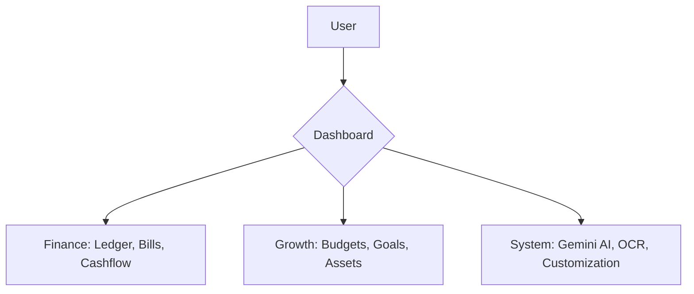
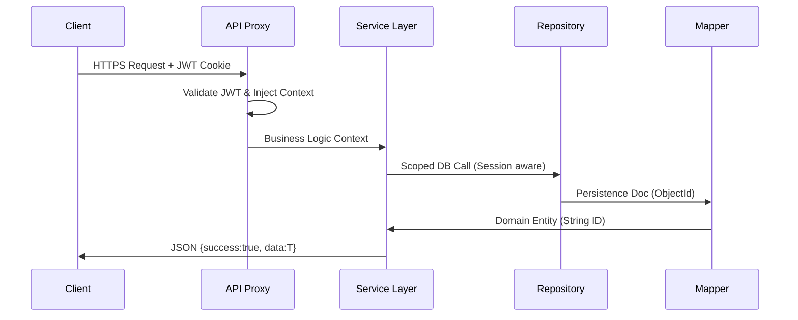
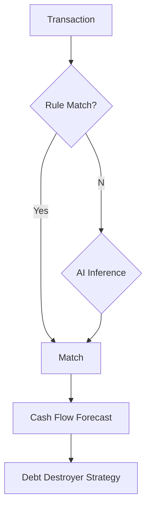
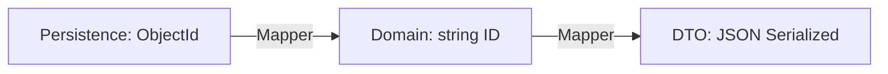
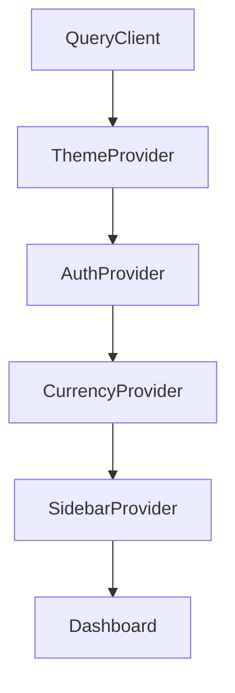

# Finance Dashboard — Complete Documentation

> **Central Source of Truth** · **v2.7.0** · **2026-01-15** · **Style: Condensed**

---

## 🧭 Navigation

| #   | Section                                                 | Focus                              |
| --- | ------------------------------------------------------- | ---------------------------------- |
| 1   | [Product](#1-product-overview--user-guide)              | Vision, Features, User Guide       |
| 2   | [Architecture](#2-system-architecture--technical-guide) | FSD, Stack, Security, Performance  |
| 3   | [AI](#3-ai-system--agentic-intelligence)                | Categorization, Forecasting, Tools |
| 4   | [Seeding](#4-database-seeding-system)                   | 11 Models, Demo Gen, JSON Format   |
| 5   | [Logic](#5-logic-flows--business-rules)                 | Currency, i18n, Mappers            |
| 6   | [Dev Ops](#6-development-commands--quality-assurance)   | Commands, QA, Agent SOP            |
| 7   | [Checklist](#7-feature-checklist--audit)                | Full Feature Audit Matrix          |
| 8   | [Design](#8-uxui-design-guidelines)                     | Glassmorphism, RGL, Motion         |
| 9   | [Log](#9-knowledge-log--refactoring-journal)            | Technical Decisions, Fixes         |
| 10  | [Reference](#10-quick-reference)                        | Env, Paths, Commands               |
| 11  | [Charts](#11-charts--data-visualization)                | Recharts, Colors, Transforms       |
| 12  | [Context](#12-context-providers--global-state)          | Providers, Hydration               |
| 13  | [Schemas](#13-json-schemas--api-contracts)              | Models, API Contracts              |
| 14  | [Widgets](#14-dashboard-widgets-reference)              | Registry, Layouts                  |
| 15  | [Testing](#15-testing-patterns)                         | Unit, E2E, Factories               |

---

## 1. Product Overview & User Guide

### 📋 Section Summary

| Aspect       | Specification                                               |
| ------------ | ----------------------------------------------------------- |
| **Mission**  | Passive tracking → Active wealth building                   |
| **Strategy** | Finance (Daily Ops), Growth (Wealth), System (Intelligence) |
| **Identity** | High-performance, Serverless-first, Premium Glassmorphism   |

### 🗺️ Functional Architecture



## 1.1 Vision & Strategy

The **Finance Dashboard** is a premium personal finance application designed to move users from passive tracking to active wealth building. It is built on three core pillars:

- **🟢 Pillar 1: Finance (Daily Ops)**: Unified ledger, high-performance transaction grid, and real-time cash flow monitoring.
- **🔵 Pillar 2: Growth (Wealth Building)**: Goal-oriented tracking for budgets, savings (sinking funds), and investments.
- **🟣 Pillar 3: System (Intelligence)**: AI-driven insights, smart categorization rules, and custom dashboard layouts.

---

## 1.2 Core Features Catalog

### 🏗️ Finance Operations

- **High-Performance Ledger**: Manage thousands of transactions with instant sorting and filtering.
- **Unified Net Worth**: Real-time view of assets vs. liabilities with historical trend sparklines.
- **Bills & Recurring**: Automated tracking of fixed costs (Rent, Netflix, Utilities) with a visual monthly calendar.
- **AI Anomaly Detection**: Proactive spender scanner that flags unusual spikes using Z-score analysis.
- **Forecasting Engine**: Predictive balance simulation considering bills, habits, and drift.
- **Subscription Sentinel**: Automated monthly burn tracker with service recognition logic.
- **Smart Categorization**: Automated tagging using Regex rules or AI-based merchant recognition.

### 📈 Growth & Wealth

- **Visual Budgeting**: Progress bars with "Pacing" logic (Spent vs Days Remaining).
- **Sinking Funds (Goals)**: Circular progress rings for savings milestones like "Travel" or "Emergency Fund".
- **Investment Portfolio**: Track ROI and allocation across Cash, Stocks, Crypto, and Real Estate.
- **Financial Runway**: Predictive calculator: "How many months can I survive without income?"

---

## 1.3 User Guide: Mastering the Dashboard

### ✍️ Managing Transactions

1. **Manual Entry**: Use the "Add Transaction" button manually or via the Quick Action widget on the dashboard.
2. **Bulk Import**: Go to Transactions -> Import Excel. Supports mapping Vietnamese bank exports to internal schemas.
3. **Bulk Edit**: Select multiple rows in the grid to batch-assign categories or status tags.

### 💰 Budgeting & Goals

1. **Set Limits**: Create monthly budgets per category. The system uses a Traffic Light system (Green/Yellow/Red) for status.
2. **Track Goals**: Add manual contributions or link specific transactions to a Goal.
3. **Forecast**: Use the Simulation mode to see how a large purchase today affects your future cash flow.

### 🤖 Using the AI Assistant

- **Ask Directly**: "How much did I spend on food in December?"
- **Context Aware**: The AI analyzes your current filtered data to provide personalized savings tips.
- **Model Choice**: Toggle between **Gemini Flash** (Instant answers) and **Gemini Pro** (Deep reasoning).

---

## 1.4 Customization & System

- **Multi-Currency**: Instantly switch the entire UI between USD, VND, EUR, etc., with real-time conversion.
- **Theme Support**: Premium Dark and Light modes with system sync.
- **Data Export**: Full "Right to Portability" support—export your data as Excel, CSV, or JSON anytime.

---

## 1.5 Feature Deep Dive: Subscription Sentinel

### Sentinel Overview

The **Subscription Sentinel** automatically detects and tracks recurring expenses (Netflix, Spotify, AWS, etc.) to prevent "death by a thousand cuts."

### Key Capabilities (Subscription)

- **AI Detection**: Scans transaction history for recurring patterns (≥3 similar transactions)
- **Confidence Scoring**: Uses standard deviation analysis to identify true subscriptions
- **Dashboard View**: Centralized `/subscriptions` page showing:
  - Total monthly cost
  - Active subscription count
  - Pending AI-detected candidates

### How It Works (Subscription)

1. **Navigate** to Finance > Subscriptions
2. **Review** amber-highlighted AI candidates
3. **Click "Confirm"** to start tracking
4. **Monitor** renewal dates and monthly totals

### Technical Details

- **Detection Algorithm**: Groups by merchant, filters by amount consistency (stdDev < 25% to account for price changes)
- **Data Model**: Uses `RecurringTransaction` collection with `reminders` and `currency` support
- **API**:
  - `GET/POST /api/v1/subscriptions`: Manage recurring rules
  - `GET /api/v1/recurring/calendar`: Project future renewals
  - `POST /api/v1/system/jobs/reminders`: Trigger automated notification check
- **Performance**: O(n) complexity, projection limited to 500 iterations per item

### Sentinel V2 Capabilities (Recently Added)

- **Price Change Alerts**: Automated detection of "▲ PRICE" or "▼ PRICE" based on month-over-month variance.
- **Renewal Calendar**: Visual projection of upcoming "burn" events across a customizable date range.
- **Cancellation Reminders**: Proactive system notifications triggered X days before renewal.
- **Multi-Currency Tracking**: Support for tracking subscriptions in their native currency (USD, VND, etc.) regardless of base dashboard currency.

---

### 11.2 Seeding Strategies

The system supports multiple seeding strategies via a unified interface:

1. **JSON Seeding (Standard)**:
   - Source: `src/server/db/seed-data-vn.json`
   - Command: `bun seed` or API `seedFromJSON`
   - Content: Users, Rules, Categories, Budgets, Goals.
2. **Excel Seeding (Personal)**:
   - Source: Uploaded `.xlsx` file
   - Command: API `seedPersonal`
   - Content: Real user transactions keying off bank format.
3. **EMN Seeding (Utility)**:
   - Source: `seed/emn-data.json` (Generated via crawling)
   - Command: `bun scripts/seed-emn.ts` or API `seedEmnData`
   - Content: 3 years of Electricity payments & usage history.
4. **Demo Data**:
   - Source: Algorithmic generation
   - Command: API `seedDemo`
   - Content: 6 months of realistic usage patterns.

## 1.6 Feature Deep Dive: AI Anomaly Scanner

### Overview (Anomaly)

The Anomaly Scanner (v1.0) is a background service that proactively identifies unusual spending patterns.

### Key Capabilities (Anomaly)

- **Multi-Level Scan**: Analyzes transactions against both global spending averages and category-specific history.
- **Severity Ranking**: High/Medium/Low alerts based on how many standard deviations the transaction is from the mean.
- **Real-time Detection**: Scans daily as new data is imported or created.

### How It Works (Anomaly)

1. **Service** calculates `mean` and `stdDev` for the last 90 days.
2. **Scorer** assigns a Z-score to each new transaction: `(Amount - Mean) / StdDev`.
3. **Alerts** are generated if `Z > 2.5`.

---

## 1.7 Feature Deep Dive: Predictive Cash Flow

### Cash Flow Overview

Moves beyond current balance to show users their projected liquidity for the next 30 days.

### Key Capabilities (Cash Flow)

- **Drift Analysis**: Calculates daily "spend velocity" based on non-bill history.
- **Overdraft Alerts**: Predictive warning if upcoming bills will push balance below zero.
- **Liquid Planning**: Accounts for both fixed costs (Bills) and variable habits (Drift).

### Implementation

- Matches unpaid bills to specific future dates.
- Simulates day-by-day balance decrement.
- Highlights "Critical Dates" for financial caution.

---

## 1.8 Feature Deep Dive: EMN Utility Integration

### EMN Overview

The **EMN Utility Integration** allows users to link their official Vietnam Electricity (EVN) accounts to the dashboard for automated tracking of consumption, billing, and outages.

### Key Capabilities

- **Consumption Graphing**: Visualizes daily/monthly electricity usage directly from EVN meters.
- **Bill History**: Centralized view of all past bills, including PDF-like details.
- **Outage Sentinel**: Real-time monitoring of planned power outages for the user's specific grid node (`maTram`).
- **Bill Estimator**: Sophisticated simulation tool using official EVN progressive tax brackets based on voltage level and household count.

### Authentication Model

1. **Automated Login**: Securely stores encrypted credentials to auto-refresh session cookies.
2. **Manual injection**: Allows power users to paste `.AspNetCore.Cookies` strings directly, bypassing anti-bot measures.

### Technical Implementation

- **Service**: `EmnService.ts` handles the multi-step form-based authentication flow.
- **Database**: `EmnSession` tracks user-specific cookie jars.
- **API Strategy**: REST wrappers around EMN internal endpoints (`usage`, `payments`, `outages`).

---

## 2. System Architecture & Technical Guide

### 📋 Section Summary

| Aspect        | Detail                                              |
| ------------- | --------------------------------------------------- |
| **Framework** | Next.js 15 (React 19, Server Components)            |
| **Pattern**   | Feature-Sliced Design (FSD)                         |
| **Structure** | Repositories (DB) → Services (Logic) → Routes (API) |

### 🚀 Request Lifecycle Flow



## 2.1 High-Level Overview

The Finance Dashboard is a premium, serverless-first application built with the **Next.js 15 App Router**. It follows a **Feature-Sliced Design (FSD)** pattern to ensure scalability, maintainability, and clear separation of concerns.

### 🏗️ Tech Stack

| Layer          | Technology                                               |
| -------------- | -------------------------------------------------------- |
| **Framework**  | Next.js 15 (React 19)                                    |
| **Language**   | TypeScript (Strict Mode)                                 |
| **Database**   | MongoDB Atlas (via Mongoose)                             |
| **State Mgmt** | TanStack Query (Server State) + React Context (UI State) |
| **Styling**    | Tailwind CSS v4 + shadcn/ui                              |
| **Motion**     | Framer Motion (Premium micro-animations)                 |
| **Auth**       | Custom JWT via HttpOnly Cookies                          |
| **Validation** | Zod (Shared schemas between Client/Server)               |
| **Logging**    | Custom Winston logger + Sentry (Planned)                 |

---

## 2.2 Structural Design (FSD)

The project structure is organized by domain and responsibility:

```text
src/
├── app/             # Application entry points & API routes
│   ├── (auth)/      # Authentication-related views
│   ├── (finance)/   # Transaction, Analytics, Bills views
│   ├── (growth)/    # Goals, Budgets, Investments views
│   ├── (system)/    # User profile, help, settings views
│   └── api/v1/      # RESTful route handlers
│       ├── (admin)/     # Admin-only routes
│       ├── (finance)/   # Core financial operations
│       ├── (growth)/    # Wealth & future planning
│       └── (system)/    # Core system & user routes
├── server/          # Backend core logic
│   ├── services/    # Business logic (Singletons)
│   ├── repositories/# Database access layer
│   ├── mappers/     # Document <-> Domain transformation
│   └── db/          # Models & Schemas
├── features/        # Feature-specific UI components & hooks
├── lib/             # Shared utilities & core wrappers
├── shared/          # Global types, schemas, and constants
└── components/      # Generic UI library (based on shadcn)
```

---

## 2.3 Data Flow & Security

### 🛡️ Authentication Flow

1. **Sign In**: User submits credentials -> Server validates -> Sets **HttpOnly, Secure** JWT cookie.
2. **Persistence**: Proxy verifies JWT on every protected request.
3. **Multi-Tenancy**: Every database query is strictly filtered by `userId` (extracted from the JWT context).

### 🚀 Request Lifecycle

- **Proxy**: Intercepts request -> Validates JWT -> Injects context.
- **Standardized API**: All routes use `jsonSuccess` and `jsonError` helpers for consistent structure:
  `{ success: true, data: T, error?: string }`
- **Pattern**: Route Handler -> Service -> Repository -> Database.
- **API Standardization (v1.1)**: Unified parameter handling across all endpoints:
  - **Naming**: Strict standard for camelCase in frontend and API.
  - **Date Params**: Standardized to `startDate` and `endDate`.
  - **Utility**: `parseQueryParams` in `lib/parseParams.ts` ensures backward compatibility by handling both `snake_case` (legacy) and `camelCase` (modern) inputs.

---

## 2.4 Performance Optimization (V1.1)

Recent architectural updates focus on "Instant Response" metrics:

### 💾 State Management & Caching

- **Server State**: `@tanstack/react-query` is used for all domain data (Transactions, Users, Notifications).
- **Consolidated Fetching**: `useCurrentUser` and `useCurrency` hooks are unified to share the same `['user', 'me']` cache key. This ensures that only one request is made for user profile data, regardless of how many components consume it.
- **Hydration (Instant UI)**:
  - On every successful profile fetch, data is persisted to `localStorage`.
  - On page refresh (F5), the app uses this local cache as `initialData` to populate the UI (name, avatar, currency) instantly before the network re-validation completes.
- **Configurable Polling**: Centralized `POLLING_INTERVALS` in `src/lib/constants.ts` allow for global frequency control of background tasks (e.g., Notifications poll every 10 minutes instead of every minute).

### 🌐 Frontend Layer

- **Parallel Fetching**: Dashboard widgets fetch data concurrently via `Promise.all` at the service level.
- **Smart Skeletons**: Reduced Layout Shift (CLS) using specific skeletons matched to widget types.
- **Staggered Animations**: Staggered entry animations using `StaggerContainer` to improve perceived speed.

### 🎨 Design Architecture (V1.2)

- **Atomic Governance**: The UI is built on a "headless" foundation using Radix UI primitives, styled with a centralized **Design System** via `class-variance-authority` (CVA).
- **Semantic Mapping**: All color logic is decoupled from Tailwind utility classes and mapped to semantic variants (`brand`, `indigo`, `error`, etc.). This allows for theme-wide updates by changing only the CVA definition in `@/components/ui`.
- **Dynamic Visuals**: Surfaces use a layered approach:
  - **Base**: `rounded-2xl` structural elements.
  - **Elevated**: `backdrop-blur-xl` + `white/95` floating windows.
  - **Accent**: `brand-50` hover states for interactive navigation.

### 🌓 Layout Responsiveness (V1.3)

- **Pro-Overlay Sidebar**: To prevent "jitter" during navigation, the sidebar uses a dual-mode expansion:
  - **Hover**: Sidebar expands as a high-elevation overlay (`shadow-2xl`) without shifting main content.
  - **Click (Permanent)**: Sidebar pushes the main content to the right, ensuring a dedicated workspace.
- **Element-Level Recalculation**: The `DraggableDashboard` utilizes a `ResizeObserver` to track the exact width of its parent container. This ensures that dashboard widgets perfectly snap to 100% of available width instantly when the sidebar is toggled or folded, bypassing flaky timeout-based resizing.

---

## 2.5 Operations & Maintenance

### 💾 Database Backup & Recovery

- **Atlas Automation**: Daily snapshots and continuous cloud backups are enabled via MongoDB Atlas.

- **Manual Export**: Use `mongodump` for local snapshots:

  ```bash
  mongodump --uri="YOUR_MONGODB_URI" --out="./backups/$(date +%F)"
  ```

- **Application Portability**: Full JSON/Excel exports are available via the System settings UI.

### 🛠️ Coding Standards

- **Boy Scout Rule**: Always fix formatting and remove unused imports when modifying a file.
- **Solid BUT Simple**: Prioritize readability over complex abstractions.
- **No Direct DB in Routes**: API routes must call a Service, never a Mongoose Model directly.
- **Strict Typing (Client vs Server)**:
  - **Shared Types**: Global interfaces in `src/shared/types` MUST use `string` for `_id` and `userId` to ensure compatibility with JSON serialization and frontend components (e.g., as keys).
  - **Database Models**: Interfaces in `src/server/db/models` MUST use `mongoose.Types.ObjectId` for these fields to maintain database-level integrity and avoid manual casting in repositories.
  - **Transformation**: Services are responsible for converting `ObjectId` to `string` (and vice-versa) during data transit.

### 🔄 Data Mapping & Transformation (Golden Standard)

To cleanly separate the persistence layer (MongoDB/Mongoose) from the domain layer (Frontend/Shared), we enforce a strict **Mapper Pattern**:

1. **Repository Layer**: Interacts with the database but returns **Domain Objects** (mapped via Mappers). It should never leak `ITaskDocument` or `ITransactionDocument` to the services.
2. **Mappers**: Centralized logic for complex transformations in `src/server/mappers/`.
   - **Naming**: `{Entity}Mapper.ts`
   - **Methods**:
     - `toDomain(doc)`: Database -> Shared Type (maps `ObjectId` to `string`, handles dates).
     - `toPersistence(domain)`: Shared Type -> Database Input (maps `string` to `ObjectId`, ensures strict types).
     - `toDTO(domain)`: Shared Type -> Client DTO (ensures serialization safety).
3. **Strict Typing**: `BaseMapper` defines the contract for these transformations, eliminating `any` and `unknown` in the data flow.
4. **Current Mappers**: The standard is fully implemented for: `User`, `Transaction`, `Goal`, `Budget`, `Asset`, `Debt`, `Bill`, `Recurring`, `Tag`, `SmartCategory`, `CategorizationRule`, `Task`.

---

## 2.6 Error Handling & Logging Standards (Strict)

### 🚨 Exception Policy

- **Crash-Proof Routes**: Every API Route **MUST** be wrapped in a `try/catch` block.
- **Structured Logging**:
  - **BEFORE** returning a 500 error, you **MUST** log the error.
  - Use `logger.error(message, error)` from `@/lib/logger`.
  - Include context: `userId`, `url`, and specific error details.
- **No Silent Failures**: Never swallow errors without logging them.

### 📝 Implementation Pattern

**Route Handlers (`src/app/api/.../route.ts`):**

```typescript
export async function POST(req: NextRequest) {
  try {
    const { userId } = await getAuthenticatedContext(req);
    // ... logic ...
    return jsonSuccess(data);
  } catch (error) {
    // 1. Log with context
    logger.error("Failed to process transaction", {
      error,
      userId,
      url: req.url,
    });

    // 2. Handle known errors gracefully
    if (error instanceof ValidationError) {
      return jsonError(error.message, 400);
    }

    // 3. Return generic safety message for unknowns
    return jsonError("Internal Server Error", 500);
  }
}
```

**Services (`src/server/services/...`):**

- Throw specific errors (`Error("Invalid input")`).
- Do NOT catch errors unless you can recover from them. Let them bubble up to the Route Handler.

---

## 2.7 Engineering & Design Standards

We follow strict conventions to ensure high velocity and code quality.

### 🏛️ Backend Architecture (3-Tier)

- **Repositories**: Direct database access (Mongoose calls). Implemented as **Instance Singletons** (e.g., `export const userRepository = new UserRepository()`) to ensure consistent state and easy testing/mocking.
  - **CRITICAL**: Every repository method **MUST** start with `await connect()` to ensure the database connection is established in serverless environments.
- **Services**: Business logic, data transformation, and cross-domain orchestration. Also implemented as Singletons.
- **Route Handlers**: Request validation, calling services, and returning standard JSON.

**🚫 Forbidden Patterns**: No direct Model imports in routes. No business logic in routes. All database calls MUST go through the Repository layer. No repository methods should assume the connection is already open.

### 🏷️ Naming Conventions

| Type                         | Convention         | Example              |
| ---------------------------- | ------------------ | -------------------- |
| **Interfaces**               | `I` + `PascalCase` | `ITransaction`       |
| **Types/Classes/Components** | `PascalCase`       | `TransactionService` |
| **Functions/Variables**      | `camelCase`        | `getTransactions`    |
| **API Routes**               | `kebab-case`       | `/api/v1/tax-report` |

### 🎨 Design Tokens & UI

- **Atomic UI**: Built with `class-variance-authority` (CVA).
- **Radius**: Containers use `rounded-2xl` (16px), modals use `rounded-[32px]`.
- **Depth**: Premium visuals using `shadow-2xl` and `backdrop-blur-xl`.
- **Semantic Variants**: Components support `primary`, `secondary`, `indigo`, `success`, `error`, `warning`, `info`.

### ✨ Animation & Motion Standards

Consistent motion is critical for a premium feel. Use `framer-motion` with these standard variants:

1. **Page Transitions (FadeIn)**: All main pages should wrap content in a `motion.div`.

   ```typescript
   export const FadeIn = {
     initial: { opacity: 0, y: 20 },
     animate: { opacity: 1, y: 0 },
     exit: { opacity: 0, y: -20 },
     transition: { duration: 0.3 },
   };
   ```

2. **Staggered Lists**: Use for grids, tables, and lists of cards.

   ```typescript
   export const StaggerContainer = {
     hidden: { opacity: 0 },
     show: {
       opacity: 1,
       transition: { staggerChildren: 0.1 },
     },
   };

   export const StaggerItem = {
     hidden: { opacity: 0, y: 20 },
     show: { opacity: 1, y: 0 },
   };
   ```

3. **Interactive Elements**: Hover and Tap feedback.

   - Buttons/Cards: `whileHover={{ scale: 1.02 }}`
   - Actions: `whileTap={{ scale: 0.95 }}`

4. **Charts/Graphs**: Use `recharts` built-in animations with `duration={1000}` and `easing="ease-out"`.

### 🌙 Dark Mode Standards (V1.4)

All UI components MUST support dark mode with consistent styling:

| Element              | Light              | Dark                     |
| -------------------- | ------------------ | ------------------------ |
| **Backgrounds**      | `bg-white`         | `dark:bg-gray-900`       |
| **Page Backgrounds** | `bg-gray-50`       | `dark:bg-gray-950`       |
| **Text (Headings)**  | `text-gray-900`    | `dark:text-white`        |
| **Text (Body)**      | `text-gray-600`    | `dark:text-gray-400`     |
| **Borders**          | `border-gray-200`  | `dark:border-gray-800`   |
| **Hover States**     | `hover:bg-gray-50` | `dark:hover:bg-gray-800` |
| **Focus Rings**      | `ring-brand-500`   | (same)                   |

### 🚨 Error Page Styling (V1.4)

Error pages (`error.tsx`, `global-error.tsx`, `not-found.tsx`) follow premium styling:

- **Background**: Gradient with `from-red-50 via-white to-orange-50` (light) / `from-gray-950 via-gray-900 to-red-950/20` (dark)
- **Decorative Blurs**: Large rounded blur elements for depth
- **Icon Container**: Circular background with semantic color (`bg-red-100 dark:bg-red-900/30`)
- **Animation**: `framer-motion` fade-in with scale for icon
- **Button**: Brand-colored with `rounded-full` styling

### 📱 Responsive Layout Standards (V1.4)

- **Dashboard Toolbar**: Uses `flex-1 justify-between` in normal mode, `mr-80 justify-end` when sidebar is open
- **Sidebar Margin**: `md:mr-80` for responsive margin that only applies on medium+ screens
- **PageLayout Action**: Wrapped in `flex-1` container for full-width expansion
- **Grid Breakpoints**: `lg:1200, md:996, sm:768, xs:480, xxs:0`

---

## 2.8 System Scalability & Future Enhancements

### 📉 API Aggregation Strategy (Planned)

To reduce "Waterfall" fetching and improve LCP:

1. **Bootstrap Handshake**: Merge `user/me`, `config`, and `notifications` into a single `GET /api/v1/system/bootstrap` call during app initialization.
2. **Composite Dashboard**: Implement a `GET /api/v1/dashboard/summary` endpoint that performs parallel server-side joins, returning `overview`, `upcomingBills`, and `topGoals` in one payload (~4x round-trip reduction).
3. **Analytics Super-Queries**: Consolidate `transactions`, `forecast`, and `recap` for the Analytics view into `GET /api/v1/analytics/composite`.

### 🌍 Application Localization (V2.3)

Implemented via **next-intl** for server-side and client-side translation:

- **Routing**: `/en/...`, `/vi/...` prefixes via middleware matcher.
- **Messages**: JSON dictionaries in `messages/en.json` and `messages/vi.json`.
- **Formatting**: Uses `Intl.NumberFormat` and `Intl.DateTimeFormat` dynamically based on the active locale.

### 🧠 Generative UI Architecture (V2.4)

AI-generated visualizations bypass standard widgets:

1. **User Intent**: "Show me a pie chart of food spending."
2. **Tool Execution**: `generate_visualization` tool aggregates data server-side.
3. **Payload**: Returns structured JSON (`{ type: 'pie', data: [...] }`).
4. **Client Rendering**: `AIVisualization` component dynamically maps this payload to `recharts` components.

---

## 3. AI System & Agentic Intelligence

### 📋 Section Summary

| Aspect       | Detail                                    |
| ------------ | ----------------------------------------- |
| **Models**   | Gemini 1.5 Pro & 1.5 Flash                |
| **Process**  | Grounding session context to current user |
| **UX**       | Generative UI (Live charts in chat)       |
| **Features** | Anomalies, Forecasts, Subscriptions       |

### 🤖 Categorization & Forecasting Logic



This section defines the architecture, flows, and logic behind the AI capabilities of the Finance Dashboard.

---

## 3.1 System Overview

The AI system is divided into three main layers:

1. **Categorization Engine**: Automated classification of transactions.
2. **Forecasting Service**: Predictive modeling for cash flow and debt payoff.
3. **Agentic Assistant (Gemini)**: Interactive assistant with tool-calling capabilities.

---

## 3.2 Categorization Engine

- **Model**: Local Rule-based + Gemini 1.5 Flash refinement.
- **Logic**:
  - **Tier 1 (Exact Match)**: Merchant Name -> Category via user-defined rules.
  - **Tier 2 (Fuzzy Search)**: Similarity scores against known keywords.
  - **Tier 3 (AI Inference)**: LLM-based categorization for complex descriptions.
  - **Feedback Loop**: Manual user corrections are indexed to update the per-user categorization weights.
- **API**: `/api/v1/categorization`.

---

## 3.3 Forecasting & Insights

### Cash Flow Forecast

- **Inputs**: Recurring bills, average historical spending, goal deadlines.
- **Calculation**: `Current Balance + (Projected Income - Fixed Bills - Variational Spending)`.

### Debt Destroyer

- **Strategies**: Snowball (lowest balance first) vs. Avalanche (highest interest first).
- **Projections**: Interest saved calculations based on monthly overpayments.

---

## 3.4 Agentic Assistant (Generative UI)

The AI assistant doesn't just talk; it **acts** and **visualizes**.

### Tool Capabilities

| Tool                     | Description                                                                      |
| ------------------------ | -------------------------------------------------------------------------------- |
| `generate_visualization` | Can generate Bar, Line, Pie, and Metric charts dynamically using Recharts.       |
| `search_transactions`    | Natural language search (e.g., "How much did I spend on Starbucks last month?"). |
| `get_summary`            | Income/Expense/Savings totals.                                                   |
| `get_budget_status`      | Checks category limits.                                                          |
| `calculate_runway`       | Predicts survival time without income.                                           |
| `system_navigation`      | Directs the user to specific dashboard pages.                                    |

### Flow Logic

1. **User Query**: "Show me a pie chart of my expenses this month."
2. **LLM Inference**: Detects intent to visualize.
3. **Data Fetching**: Queries the `TransactionService`.
4. **Tool Execution**: Generates a JSON schema for the chart.
5. **Generative UI**: Frontend renders the `AIVisualization` component inside the chat bubble.

### Multi-Model Strategy

- **Gemini 1.5 Flash**: Default model for quick queries, categorization, and simple summaries.
- **Gemini 1.5 Pro**: Used for complex financial reasoning, scenario simulation, and deep trend analysis.

### Proactive Context Injection (V2.5)

The Gemini logic is fueled by the `FinancialContextService`, which provides the model with:

- **Anomalies**: Recent detections allow the model to warn about unusual spending.
- **Forecasts**: 30-day simulations enable "Can I afford...?" queries.
- **Real-time Status**: Current budget vs. actuals for every relevant category.

### Assistant UX & Performance

- **Draggable Interface**: Implemented as a floating `motion.div` (Framer Motion), allowing users to reposition the chat box anywhere on the screen.
- **Lazy Initialization**: Chat sessions are only fetched from the API when explicitly clicked, reducing initial page load.
- **Smooth State Transitions**: Uses `AnimatePresence` for fluid animations.

---

## 3.5 Security & Privacy

- **Scoping**: All AI tool executions are strictly isolated by `userId`.
- **Data Usage**: Financial data is never used to re-train base models; it is used only as "Grounding" for the current session.

---

## 3.6 Configuration

- **API Keys**: Managed via `.env` (GEMINI_API_KEY).
- **Rate Limiting**: Tiered based on user role (Admin vs. Standard).

---

## 4. Database Seeding System

### 📋 Section Summary

| Aspect      | Detail                            |
| ----------- | --------------------------------- |
| **Action**  | POST `/api/v1/admin/seed`         |
| **Methods** | JSON Seed, Demo Gen, Excel Import |
| **Models**  | 11 Core Domain Entities           |
| **Status**  | ✅ COMPLETE                       |

---

## 4.1 Seeding Overview

Comprehensive database seeding system that supports:

- **JSON-based seeding** (recommended)
- **Excel-based seeding** (legacy)
- **Multi-locale support** (EN/VN)
- **Demo data generation** (localized currency/data)
- **Widget seeding** (dashboard initialization)
- **Multi-model support**

---

## 4.2 Supported Models (11 Total)

1. ✅ **Users** - User accounts
2. ✅ **Transactions** - Financial transactions
3. ✅ **Smart Categories** - AI categorization keywords
4. ✅ **Categorization Rules** - Auto-categorization rules
5. ✅ **Budgets** - Budget limits
6. ✅ **Goals** - Financial goals
7. ✅ **Tags** - Transaction tags
8. ✅ **Recurring Transactions** - Recurring income/expenses
9. ✅ **Bills** - Upcoming bills
10. ✅ **Assets** - Asset tracking
11. ✅ **Debts** - Debt tracking

---

## 4.3 Files & Locations

| File                                         | Purpose          |
| -------------------------------------------- | ---------------- |
| `src/server/db/seed-data.json`               | Sample seed data |
| `src/server/services/data/seed.service.ts`   | Seeding logic    |
| `src/app/api/v1/(admin)/admin/seed/route.ts` | Admin API        |

---

## 4.4 Usage

### Method 1: Seed from JSON (Recommended)

```bash
POST /api/v1/admin/seed
{
  "action": "seedFromJSON",
  "jsonPath": "src/server/db/seed-data.json",
  "targetUserId": "optional-user-id"
}
```

```typescript
// Programmatically
import { seedService } from "@/server/services/data/seed.service";

const result = await seedService.seedFromJSON();
// Returns: { results: { users: 2, categories: 21, ... }, userId: "..." }
```

### Method 2: Seed Demo Data

```bash
POST /api/v1/admin/seed
{
  "action": "seedDemo",
  "targetUserId": "user-id",
  "locale": "vn" // or "en"
}
```

```typescript
// Generates 6 months of realistic transaction data with localized content
const result = await seedService.seedDemoData(userId, "vn");
```

### Method 3: Seed Widgets

```bash
POST /api/v1/admin/seed
{
  "action": "seedWidgets",
  "clear": true
}
```

### Method 4: Clear Data

```bash
# Clear specific user data
POST /api/v1/admin/seed
{
  "action": "clearData",
  "targetUserId": "user-id"
}

# Clear ALL data (CAUTION!)
POST /api/v1/admin/seed
{
  "action": "clearData"
}
```

---

## 4.5 JSON Seed Data Format

### Complete Example

```json
{
  "users": [
    {
      "email": "user@example.com",
      "username": "username",
      "password": "Password@123",
      "displayName": "Display Name",
      "role": "user",
      "currency": "USD"
    }
  ],
  "categories": [{ "keyword": "salary", "category": "Salary", "weight": 10 }],
  "rules": [
    {
      "name": "Rule Name",
      "priority": 100,
      "enabled": true,
      "matchType": "any",
      "category": "Category",
      "conditions": [
        { "field": "description", "operator": "contains", "value": "keyword" }
      ]
    }
  ],
  "budgets": [
    {
      "category": "Groceries",
      "limit": 400,
      "period": "monthly",
      "alertThreshold": 80
    }
  ],
  "goals": [
    {
      "name": "Emergency Fund",
      "type": "emergency",
      "targetAmount": 10000,
      "currentAmount": 0,
      "deadline": "2026-12-31",
      "priority": "high"
    }
  ],
  "tags": [{ "name": "Work", "color": "#3B82F6" }],
  "recurringTransactions": [
    {
      "description": "Monthly Salary",
      "amount": 5000,
      "type": "credit",
      "category": "Salary",
      "frequency": "monthly",
      "startDate": "2026-01-01"
    }
  ],
  "bills": [
    {
      "name": "Rent",
      "amount": 1200,
      "dueDate": "2026-02-01",
      "frequency": "Monthly",
      "category": "Housing"
    }
  ],
  "assets": [
    { "name": "Savings Account", "type": "cash", "currentValue": 10000 }
  ],
  "debts": [
    {
      "name": "Credit Card",
      "type": "Credit Card",
      "balance": 2000,
      "interestRate": 18.5,
      "minimumPayment": 50
    }
  ]
}
```

---

## 4.6 Model Field Mappings

### Users

- `email` (required), `username` (required), `password` (required, will be hashed)
- `displayName`, `role` (user | admin), `currency` (default: USD), `avatarUrl`, `bio`

### Smart Categories

- `keyword` (required), `category` (required), `weight` (default: 1)

### Categorization Rules

- `name` (required), `priority` (default: 0), `enabled` (default: true)
- `matchType` (all | any), `category` (required), `conditions` (array)

### Budgets

- `category` (required), `limit` (required), `period` (monthly | weekly | yearly)
- `alertThreshold` (default: 80), `rollover` (default: false)

### Goals

- `name` (required), `type` (savings | emergency | purchase | debt)
- `targetAmount` (required), `currentAmount` (default: 0), `deadline`, `priority`

### Tags

- `name` (required), `color` (hex, default: #3B82F6)

### Recurring Transactions

- `description` (required), `amount` (required), `type` (credit | debit)
- `category` (required), `frequency` (daily | weekly | monthly | yearly), `startDate`

### Bills

- `name` (required), `amount` (required), `dueDate`, `frequency`, `category`
- `isAutoPay` (default: false), `status` (Pending | Paid | Overdue)

### Assets

- `name` (required), `type` (cash | investment | property | other)
- `currentValue` (required), `purchasePrice`, `purchaseDate`, `notes`

### Debts

- `name` (required), `type` (Credit Card | Loan | Mortgage | Other)
- `balance` (required), `interestRate` (required), `minimumPayment` (required), `dueDate`

---

## 4.7 Demo Data Generation

The `seedDemoData` method generates realistic financial data:

**Generated Data**:

- **6 months** of transaction history
- **Monthly salary** (1st of each month)
- **Rent payment** (5th of each month)
- **Random expenses** across 7 categories:
  - Groceries (8x/month, ~$400 avg)
  - Dining (6x/month, ~$60 avg)
  - Transportation (4x/month, ~$80 avg)
  - Entertainment (4x/month, ~$50 avg)
  - Shopping (3x/month, ~$150 avg)
  - Utilities (1x/month, ~$120 avg)
  - Healthcare (1x/month, ~$100 avg)
- **4 upcoming bills**: Rent ($1200), Internet ($60), Phone ($50), Gym ($40)

**Total Generated**: ~180 transactions, ~$30,000 income, ~$15,000 expenses

---

## 4.8 Smart Seeding Enhancements (V2.1)

1. **Dashboard Auto-Initialization**: When seeding a new user, the system injects empty `dashboardLayout` and `dashboardPresets` into user settings, triggering auto-config on first login.

2. **Daily Pulse Guarantee**: The `seedDemoData` service ensures at least one expense transaction for the **current day**, guaranteeing the "Daily Pulse" widget shows meaningful data immediately.

---

## 4.9 Security & Access

- Seeding other users requires the **Admin** role.
- Users can seed **their own** account for testing purposes.
- Protected by `getAuthenticatedContext` and CSRF protection.
- User-specific data always filtered by `userId`.

---

## 4.10 Seeding Flow Deep Dive (Technical V3.0)

The seeding system has been simplified into a two-path orchestration flow, optimized for Personal use and Demo presentations.

### 🏗️ 2-Part Seeding Strategy

- **Part 1: Personal (VND Context)**
  - **Sources**: `src/server/db/seed-data-vn.json` + `src/server/db/data.xlsx` + `seed/emn-data.json`.
  - **Focus**: Initializes a real user environment with Vietnamese categorization rules, smart categories, electricity (EMN) utility data, and local transaction history from Excel.
  - **Method**: `seedService.seedPersonal(userId)`.

- **Part 2: Demo (Standard Context)**
  - **Sources**: `src/server/db/seed-data.json`.
  - **Focus**: Provides a complete, ready-to-show environment with pre-populated transactions, budgets, goals, and assets.
  - **Method**: `seedService.seedDemo(userId)`.

### 📊 Data Mapping Flow

- **JSON Seeding**: Orchestrated by `jsonSeedService`. It handles bulk upserts for 11 core models (Rules, Budgets, Goals, etc.) with duplicate detection based on unique keys (e.g., Rule name, Category name).
- **Excel Seeding**: Orchestrated by `excelSeedService`. In the current version, it focuses on **User Discovery** and **Transaction Import**, delegating complex logic (Deduplication, AI Categorization) to the `TransactionService`.

### 💡 Clearing Logic

The `clearData(userId)` method provides a surgical wipe of all user-specific collections while preserving system-level data (Admin users). It covers all 11 domain models including Transactions, Rules, Budgets, and Widgets.

---

## 5. Logic Flows & Business Rules

### 📋 Section Summary

| Rule             | Implementation                        |
| ---------------- | ------------------------------------- |
| **Currency**     | Absolute Numbers (Intl logic)         |
| **Localization** | `next-intl` Middleware prefixes       |
| **Data**         | Mapper pattern forced in Repositories |

### 🔄 Data Integrity



This section defines critical backend patterns for Currency, Language, and Data processing.

---

## 5.1 Currency Handling

### Storage Format

- **Rule**: All monetary values in MongoDB are stored as **Absolute Numbers** (no fixed decimal strings).
- **Service Layer**: Calculations (Total, Forecast) are performed on raw numbers.
- **UI Layer**: Formatting is handled by `src/lib/formatData.ts` using `Intl.NumberFormat`.

### Multi-Currency Flow

- **Default**: USD.
- **Conversion**:
  - `GlobalSettings` stores the current exchange rate.
  - `CurrencyService` provides `convert(amount, from, to)`.
  - UI displays the converted value with a "Converted" badge if it differs from the base currency.

---

## 5.2 Language & Localization (i18n)

- **Engine**: `next-intl`.
- **Locale Storage**: Prefixed in URL (`/(locale)/dashboard`) and saved in `IUser.settings`.
- **Flow**:
  1. User changes language via UI.
  2. Frontend sends request to update User Settings.
  3. Middleware redirects to the new locale path.
  4. Server components use `getTranslations` to render localized JSON messages.

---

## 5.3 Data Lifecycle & Mappers

### The "Mapping Central" Pattern

To avoid `any` and `unknown`, we enforce a strict 3-tier mapping flow:

1. **Persistence Layer**: Mongoose Document.
2. **Mapper Layer**: `src/server/mappers/EntityMapper.ts`.
   - `toDomain(doc)`: Transforms Mongo results into strict `IEntity` domain interfaces.
   - `toDTO(domain)`: Sanitizes data for API responses (removing hashes, internal IDs).
3. **Domain Layer**: Clean Interfaces in `src/shared/types`.

### Logic Guardrails

- **Null Safety**: All transaction loops must have a fallback for `debit`/`credit`.
- **Date Standardization**: Use `ISO 8601` for API transfers; `date-fns` for UI manipulation.

---

## 5.4 Critical Paths

- **Seeding Flow**: `AdminOnly` -> `SeedService` -> `handleSeedOperation` (Atomic).
- **Auth Flow**: `Proxy (CSRF check)` -> `JWT Verification` -> `Session Enrichment`.

---

## 6. Development Commands & Quality Assurance

### 📋 Section Summary

| Phase      | Task       | Command              |
| ---------- | ---------- | -------------------- |
| **Start**  | Dev Server | `bun run dev`        |
| **Check**  | Types      | `bun x tsc --noEmit` |
| **Polish** | Lint       | `bun run lint --fix` |
| **Safe**   | Test       | `bun run test`       |

---

## 6.1 Verification Commands

| Action         | Command                    | Description                                                  |
| -------------- | -------------------------- | ------------------------------------------------------------ |
| **Full Build** | `bun run build`            | Full Next.js production build. Checks TS and runtime errors. |
| **Type Check** | `bun x tsc --noEmit`       | Fast TypeScript validation without generating files.         |
| **Linting**    | `bun run lint`             | ESLint to enforce coding standards.                          |
| **Formatting** | `bun x prettier --write .` | Enforces consistent code style.                              |
| **Quick Fix**  | `bun run lint --fix`       | Auto-fix common linting issues.                              |
| **Unit Tests** | `bun run test`             | Jest unit tests for services.                                |
| **E2E Tests**  | `bun x playwright test`    | Playwright end-to-end tests.                                 |

---

## 6.2 Automation Workflow for Agents

The agent MUST follow this sequence whenever code is modified:

1. **Modify**: Apply requested code changes.
2. **Verify**: Run `bun x tsc --noEmit` to ensure no type regressions.
3. **Lint**: Run `bun run lint` to confirm compliance.
4. **Recover**: If any errors occur, attempt auto-fixing BEFORE reporting to the user.
5. **Clean**: Remove any temporary files before finishing.

---

## 7. Feature Checklist & Audit

> **Purpose**: Master checklist mapping Frontend slices to Backend services and API endpoints.

---

## 7.1 Authentication & System Context

| Feature     | Sub-Feature        | Frontend Component             | Backend Service              | API Endpoint                        | Status |
| ----------- | ------------------ | ------------------------------ | ---------------------------- | ----------------------------------- | ------ |
| **Auth**    | Sign In            | `SignInForm`, `LoginForm`      | `AuthService.signIn`         | `POST /api/v1/auth/signin`          | ✅     |
|             | Sign Up            | `SignUpForm`                   | `AuthService.signUp`         | `POST /api/v1/auth/signup`          | ✅     |
|             | Sign Out           | `UserDropdown`                 | `AuthService.signOut`        | `POST /api/v1/auth/signout`         | ✅     |
|             | Forgot Password    | `ForgotPasswordForm`           | `AuthService.forgotPassword` | `POST /api/v1/auth/forgot-password` | ✅     |
|             | Reset Password     | `ResetPasswordForm`            | `AuthService.resetPassword`  | `POST /api/v1/auth/reset-password`  | ✅     |
|             | Email Verification | `VerifyEmailPage`              | `AuthService.verifyEmail`    | `POST /api/v1/auth/verify-email`    | ✅     |
| **Context** | Token Extraction   | `middleware.ts`, `api-context` | `getAuthIdentity`            | _(Middleware)_                      | ✅     |
|             | Role-Based Access  | `AdminGuard`                   | `getAuthenticatedContext`    | _(Middleware)_                      | ✅     |
|             | API Tokens         | `ApiTokenSettings`             | `ApiTokenService`            | `GET/POST /api/v1/system/tokens`    | ✅     |

---

## 7.2 Admin & Configuration

| Feature   | Sub-Feature       | Frontend Component         | Backend Service        | API Endpoint                            | Status |
| --------- | ----------------- | -------------------------- | ---------------------- | --------------------------------------- | ------ |
| **Admin** | User Management   | `UserList`, `UserTable`    | `AdminUserService`     | `GET /api/v1/admin/users`               | ✅     |
|           | Database Seeding  | `SeedPage`, `SeedControls` | `SeedService`          | `POST /api/v1/admin/seed`               | ✅     |
|           | System Logs/Audit | `AuditLogViewer`           | `AuditService`         | `GET /api/v1/admin/audit`               | ✅     |
|           | Global Settings   | `GlobalSettingsForm`       | `GlobalSettingService` | `GET/PUT /api/v1/admin/global-settings` | ✅     |

---

## 7.3 Core Finance (Transactions)

| Feature            | Sub-Feature      | Frontend Component          | Backend Service                      | API Endpoint                            | Status |
| ------------------ | ---------------- | --------------------------- | ------------------------------------ | --------------------------------------- | ------ |
| **Transactions**   | List & Filter    | `TransactionTable`          | `TransactionService.getTransactions` | `GET /api/v1/transactions`              | ✅     |
|                    | Create (Single)  | `AddTransactionModal`       | `TransactionService.create`          | `POST /api/v1/transactions`             | ✅     |
|                    | Bulk Import      | `CsvUpload`, `ImportWizard` | `ImportService`                      | `POST /api/v1/transactions/bulk`        | ✅     |
|                    | Export           | `ExportControls`            | `ExportService`                      | `GET /api/v1/export`                    | ✅     |
| **Categorization** | Rule Management  | `RuleList`, `RuleEditor`    | `CategorizationRuleService`          | `GET/POST /api/v1/categorization/rules` | ✅     |
|                    | Auto-Categorize  | `UncategorizedList`         | `CategorizationService.applyRules`   | `POST /api/v1/categorization/apply`     | ✅     |
|                    | Learned Patterns | _(Background)_              | `PatternRecognitionService`          | _(Internal)_                            | ✅     |

---

## 7.4 Planning & Budgeting

| Feature           | Sub-Feature       | Frontend Component         | Backend Service               | API Endpoint                | Status |
| ----------------- | ----------------- | -------------------------- | ----------------------------- | --------------------------- | ------ |
| **Budgets**       | Budget Management | `BudgetList`, `BudgetCard` | `BudgetService`               | `GET/POST /api/v1/budgets`  | ✅     |
|                   | Status Tracking   | `BudgetProgressBar`        | `BudgetService.getStatus`     | _(Computed in GET)_         | ✅     |
| **Bill Tracking** | Local Bills       | `BillCalendar`, `BillList` | `BillService`                 | `GET /api/v1/bills`         | ✅     |
|                   | Subscriptions     | `SubscriptionManager`      | `SubscriptionService`         | `GET /api/v1/subscriptions` | ✅     |
|                   | Calendar Feed     | `CalendarSettings`         | `CalendarService`             | `GET /api/v1/calendar/feed` | ✅     |
| **Recurring**     | Recurring Mgmt    | `RecurringList`            | `RecurringTransactionService` | `GET /api/v1/recurring`     | ✅     |

---

## 7.5 Growth & Wealth

| Feature         | Sub-Feature     | Frontend Component           | Backend Service        | API Endpoint                       | Status |
| --------------- | --------------- | ---------------------------- | ---------------------- | ---------------------------------- | ------ |
| **Goals**       | Goal Tracking   | `GoalList`, `GoalCard`       | `GoalService`          | `GET/POST /api/v1/goals`           | ✅     |
|                 | Goal Simulation | `GoalSimulator`              | `SimulationService`    | `POST /api/v1/simulation/goals`    | ✅     |
| **Assets**      | Asset Portfolio | `AssetList`, `NetWorthChart` | `AssetService`         | `GET /api/v1/assets`               | ✅     |
| **Debt**        | Debt Dashboard  | `DebtSnowball`, `DebtList`   | `DebtService`          | `GET /api/v1/debts`                | ✅     |
|                 | Payoff Strategy | `DebtStrategySelector`       | `DebtOptimizerService` | `GET /api/v1/growth/debt/optimize` | ✅     |
| **Investments** | Portfolio Perf. | `InvestmentDashboard`        | `InvestmentService`    | `GET /api/v1/investments`          | ✅     |

---

## 7.6 Analytics & Reporting

| Feature      | Sub-Feature      | Frontend Component       | Backend Service    | API Endpoint                            | Status |
| ------------ | ---------------- | ------------------------ | ------------------ | --------------------------------------- | ------ |
| **Reports**  | Monthly Report   | `MonthlyOverview`        | `ReportService`    | `GET /api/v1/reports/monthly`           | ✅     |
|              | Financial Recap  | `FinancialRecap`         | `RecapService`     | `GET /api/v1/reports/recap`             | ✅     |
|              | Category Trends  | `TrendChart`, `Sunburst` | `AnalyticsService` | `GET /api/v1/analytics/category-trends` | ✅     |
|              | Merchants        | `MerchantTable`          | `MerchantService`  | `GET /api/v1/analytics/merchants`       | ✅     |
| **Tax**      | Tax Estimation   | `TaxDashboard`           | `TaxService`       | `GET /api/v1/tax/estimate`              | ✅     |
|              | Category Mapping | `TaxMappingEditor`       | `TaxService`       | `PUT /api/v1/tax/mapping`               | ✅     |
| **Forecast** | Cash Flow        | `CashFlowForecast`       | `ForecastService`  | `GET /api/v1/forecast/cashflow`         | ✅     |
|              | Runway           | `RunwayWidget`           | `ForecastService`  | `GET /api/v1/forecast/runway`           | ✅     |

---

## 7.7 AI & Automation

| Feature          | Sub-Feature      | Frontend Component        | Backend Service     | API Endpoint              | Status |
| ---------------- | ---------------- | ------------------------- | ------------------- | ------------------------- | ------ |
| **AI Assistant** | Chat Interface   | `AIChatBot`, `ChatWindow` | `GeminiChatService` | `POST /api/v1/ai/chat`    | ✅     |
|                  | Function Calling | _(Hidden)_                | `GeminiToolService` | _(Internal)_              | ✅     |
|                  | Receipt OCR      | `ReceiptUploader`         | `OCRService`        | `POST /api/v1/ai/ocr`     | ✅     |
|                  | Insights         | `SmartInsightsWidget`     | `InsightService`    | `GET /api/v1/ai/insights` | ✅     |

---

## 7.8 Gamification & Engagement

| Feature          | Sub-Feature  | Frontend Component    | Backend Service       | API Endpoint                           | Status |
| ---------------- | ------------ | --------------------- | --------------------- | -------------------------------------- | ------ |
| **Gamification** | XP & Levels  | `LevelBadge`, `XPBar` | `GamificationService` | `GET /api/v1/gamification`             | ✅     |
|                  | Achievements | `AchievementsWidget`  | `AchievementService`  | `GET /api/v1/user/achievements`        | ✅     |
|                  | Leaderboard  | `LeaderboardWidget`   | `LeaderboardService`  | `GET /api/v1/gamification/leaderboard` | ✅     |
|                  | Referral     | `ReferralCard`        | `ReferralService`     | `GET /api/v1/gamification/referral`    | ✅     |

---

## 7.9 Quality Assurance

| Feature          | Sub-Feature    | Tool Used     | Scope / File Location           | Status |
| ---------------- | -------------- | ------------- | ------------------------------- | ------ |
| **E2E Testing**  | Critical Flows | Playwright    | `tests/e2e/dashboard.spec.ts`   | ✅     |
|                  | Mobile Layout  | Playwright    | `tests/e2e/dashboard.spec.ts`   | ✅     |
| **Unit Testing** | Service Logic  | Jest/Vitest   | `src/server/services/*.test.ts` | ✅     |
|                  | Utils/Helpers  | Jest/Vitest   | `src/lib/*.test.ts`             | ❌     |
| **Integration**  | API Routes     | Supertest     | `tests/api/*.test.ts`           | ❌     |
| **CI/CD**        | GitHub Actions | YAML Workflow | `.github/workflows/test.yml`    | ❌     |

---

### Legend

- **Status**: ✅ (Implemented), 🚧 (In Progress), ❌ (Pending/Todo)

---

## 8. UX/UI Design Guidelines

### 📋 Design Tokens

| Token       | Specification                            |
| ----------- | ---------------------------------------- |
| **Theming** | Glassmorphism (`bg-white/70`, `blur-xl`) |
| **Grid**    | 12-Column Responsive RGL                 |
| **Radius**  | 16px (`2xl`) for Containers              |
| **Primary** | Indigo `#6366F1`                         |
| **Income**  | Emerald `#10B981`                        |
| **Expense** | Rose `#F43F5E`                           |

---

## 8.1 Visual Identity

### Glassmorphism (Core Pattern)

All main container cards must use the Glassmorphism effect:

| Property       | Light Mode                     | Dark Mode                   |
| -------------- | ------------------------------ | --------------------------- |
| **Background** | `bg-white/70`                  | `bg-gray-900/70`            |
| **Blur**       | `backdrop-blur-xl`             | `backdrop-blur-xl`          |
| **Border**     | `border border-white/20`       | `border border-gray-800/30` |
| **Shadow**     | `shadow-xl shadow-brand-500/5` | (same)                      |

### Color Palette

| Semantic           | Color                           | Hex                   |
| ------------------ | ------------------------------- | --------------------- |
| **Primary**        | Indigo-500                      | `#6366F1`             |
| **Success/Income** | Emerald-500                     | `#10B981`             |
| **Danger/Expense** | Rose-500                        | `#F43F5E`             |
| **Warning/Bills**  | Amber-500                       | `#F59E0B`             |
| **Gradients**      | `from-indigo-500 to-purple-600` | (Primary CTA buttons) |

---

## 8.2 Layout & Grids

### Dashboard Grid (12-Column)

| Widget Size         | Columns (`w`)    |
| ------------------- | ---------------- |
| **Standard Widget** | `w: 3` or `w: 4` |
| **Wide Analytics**  | `w: 6`           |
| **Full View**       | `w: 12`          |
| **Row Height**      | 100px increments |

### Responsiveness

| Breakpoint                  | Columns                |
| --------------------------- | ---------------------- |
| **Desktop (1200px+)**       | 12 columns             |
| **Tablet (768px - 1199px)** | 6 columns              |
| **Mobile (< 768px)**        | 2 columns (or stacked) |

---

## 8.3 Motion & Micro-interactions

- **Presence**: Use Framer Motion's `layout` prop for layout transitions.
- **Entry Animation**:

  ```typescript
  initial={{ opacity: 0, y: 10 }}
  animate={{ opacity: 1, y: 0 }}
  transition={{ duration: 0.3 }}
  ```

- **Haptic Hover**: Scale components to `1.02` on hover.
- **Loading States**: Shimmer effect (Skeletons) instead of spinning wheels.

---

## 8.4 Typography

| Type            | Style                                                       |
| --------------- | ----------------------------------------------------------- |
| **Headings**    | `font-executive` (Bold, tracking-tight)                     |
| **Data Labels** | `font-mono` for currency and numbers (tabular alignment)    |
| **Micro-Copy**  | `text-[10px] font-black uppercase tracking-widest` for tags |

---

## 8.5 UI States

1. **Empty State**: Always provide an illustration or a clear "Add Widget" CTA.
2. **Error State**: Non-intrusive red banners with a "Retry" button.
3. **Optimistic State**: UI should update instantly (e.g., resizing columns) while the backend syncs in the background.

---

## 9. Knowledge Log & Refactoring Journal

This section captures technical decisions, complex bug fixes, and architectural evolutions.

---

## 🟢 2025-12-31: UI Architectural Refactor (Phase 22)

### Atomic Design with CVA

**Context**: Transitioned from ad-hoc Tailwind classes to a centralized design system using `class-variance-authority` (CVA).

**Key Learning (Type Conflicts)**: When extending standard HTML attributes with CVA's `VariantProps`, naming collisions often occur (e.g., both have a `size` prop).

- **Solution**: Use `Omit<React.InputHTMLAttributes<HTMLInputElement>, 'size'>` to ensure the CVA variant takes precedence.

**Premium Visual Tokens**:

- **Corner Radius**: Shifted from `rounded-md`/`rounded-lg` to `rounded-xl` (12px) for items and `rounded-2xl` (16px) for containers.
- **Glassmorphism**: Standardized `bg-white/95 backdrop-blur-xl` for floating surfaces.
- **Semantics**: Decoupled color names from Tailwind (`text-red-500`) to semantic variants (`variant="error"`).

### Hydration & Animation Fixes

**Hydration Mismatch**:

- **Problem**: Next.js hydration fails when client-side `localStorage` causes different render than server.
- **Solution**: Implement a `mounted` state using `useEffect`. Render skeleton first, then switch to data-driven UI.

**Framer Motion Color Animation**:

- **Problem**: `transparent` is not a valid animatable color.
- **Solution**: Use explicit RGBA values for both start and end states.

---

## 🟢 2026-01-02: Stable CSS & Build Integrity (Phase 23)

### Decoupling Fragile CSS Configurations

**Context**: Modifications to `globals.css` frequently caused build hangs due to `@apply` directives.

**Solution: Modular Styling Layer**:

1. **Black-box `globals.css`**: Keep the primary Tailwind entry point static and minimal.
2. **Independent CSS Modules**: Created `typography.css` and `theme.css`.
3. **Standard CSS Over `@apply`**: Avoid `@apply` in independent CSS files.
4. **Layout Integration**: Import these files in `layout.tsx`.

---

## 🟢 2026-01-08: Layout Intelligence & Interaction (Phase 26)

### Element-Level Responsiveness

**Context**: `react-grid-layout` failed to recalculate when sidebar folded/unfolded.

**The `ResizeObserver` Solution**:

- **Why**: Traditional `window.resize` doesn't work for internal container shifts.
- **How**: Attached a `ResizeObserver` to detect container width changes and simulate window resize.

### Pro-Overlay Sidebar Mechanic

**Design Decision**:

- **Problem**: Layout jitter on sidebar hover.
- **Fix**: Decoupled "Hover" (overlay) from "Expand" (push).
- **Visual Depth**: Added `shadow-2xl` and `border-brand-500/20` during hover.

---

## 🟢 2026-01-11: ID Type Standardization & Strict Lint (Phase 26.5)

### Shared Type Sovereignty

**Context**: Build errors caused by `ObjectId` vs `string` mismatches.

**Key Learning (The ID Bridge)**:

- **Shared Interfaces**: Define `_id` as `string`. Used by API Handlers and UI.
- **Model Interfaces**: Define `_id` as `Types.ObjectId`. Used by Repositories.
- **Service Mapping**: Data is explicitly mapped (e.g., `_id: goal._id.toString()`).

### Strict Lint Enforcement

- **Eliminated `any`**: Replaced with specific record types or correct interfaces.
- **Removed Unused Vars**: Cleaned up legacy destructuring.
- **Model Isolation**: No Mongoose Models imported directly into UI components.

---

## 🟢 2026-01-14: Full Domain Standardization (Phase 30)

### Mapping Central completion

**Context**: Extended the strict Mapper pattern to the remaining domain entities: Categorization Rules, Smart Categories, Tags, and Recurring Transactions.

**Key Learning (Seeding logic)**:

- **Decoupled IDs**: Seeding services (`json-seed`, `excel-seed`) now pass string `userId`s to repositories.
- **Auto-Conversion**: The Repository layer (via Mappers) handles the conversion to `ObjectId` for persistence, ensuring services remain "Persistence Agnostic".

### Developer Experience (DX)

- **Standardized Snippets**: Injected `mapper`, `repo`, and `api-route` snippets into `.vscode/typescript.code-snippets` to ensure all future features follow the 3-Tier "Golden Standard" automatically.
- **Regression Fixes**: Resolved strict typing issues in `ReminderService` and `ForecastService` following the migration to shared domain types.

---

## 10. Quick Reference

### 📋 Environment Variables

| Variable              | Required | Description               |
| --------------------- | -------- | ------------------------- |
| `MONGODB_URI`         | Yes      | MongoDB connection string |
| `JWT_SECRET`          | Yes      | Secret for JWT signing    |
| `GEMINI_API_KEY`      | Yes      | Gemini API key            |
| `NEXT_PUBLIC_APP_URL` | No       | Public URL for app        |

## 10.2 File Locations

| Purpose      | Path                       |
| ------------ | -------------------------- |
| API Routes   | `src/app/api/v1/`          |
| Services     | `src/server/services/`     |
| Repositories | `src/server/repositories/` |
| Mappers      | `src/server/mappers/`      |
| Models       | `src/server/db/models/`    |
| Shared Types | `src/shared/types/`        |
| Feature UI   | `src/features/`            |
| Components   | `src/components/`          |

## 10.3 Key Commands

```bash
# Development
bun run dev

# Verification
bun x tsc --noEmit
bun run lint

# Build
bun run build

# Testing
bun run test
bun x playwright test
```

---

## 11. Charts & Data Visualization

### 📋 Recharts Specs

| Aspect        | Value                |
| ------------- | -------------------- |
| **Income**    | `#10B981` (Emerald)  |
| **Expense**   | `#F43F5E` (Rose)     |
| **Brand**     | `#6366F1` (Indigo)   |
| **Animation** | `1000ms`, `ease-out` |

---

## 11.1 Chart Library

All charts are built with **Recharts** and wrapped in custom components for consistent styling.

| Chart Type    | Component       | Use Case                                |
| ------------- | --------------- | --------------------------------------- |
| **Area**      | `AreaChart`     | Cash flow trends, cumulative savings    |
| **Bar**       | `BarChart`      | Monthly comparisons, category breakdown |
| **Line**      | `LineChart`     | Net worth history, expense trends       |
| **Pie/Donut** | `PieChart`      | Category distribution, allocation       |
| **Composed**  | `ComposedChart` | Income vs Expense comparison            |

---

## 11.2 Chart Color Palette

| Semantic      | Variable            | Hex       | Usage                   |
| ------------- | ------------------- | --------- | ----------------------- |
| **Income**    | `--chart-income`    | `#10B981` | All credit transactions |
| **Expense**   | `--chart-expense`   | `#F43F5E` | All debit transactions  |
| **Primary**   | `--chart-primary`   | `#6366F1` | Main data series        |
| **Secondary** | `--chart-secondary` | `#8B5CF6` | Comparison series       |
| **Tertiary**  | `--chart-tertiary`  | `#EC4899` | Accent data             |
| **Muted**     | `--chart-muted`     | `#94A3B8` | Background elements     |

---

## 11.3 Standard Chart Configuration

```typescript
const chartConfig = {
  responsive: true,
  margin: { top: 10, right: 10, left: 0, bottom: 0 },
  animationDuration: 1000,
  animationEasing: "ease-out" as const,
};

const tooltipStyle = {
  contentStyle: {
    backgroundColor: "rgba(255, 255, 255, 0.95)",
    backdropFilter: "blur(8px)",
    border: "1px solid rgba(0, 0, 0, 0.1)",
    borderRadius: "12px",
    boxShadow: "0 4px 20px rgba(0, 0, 0, 0.1)",
  },
};
```

---

## 11.4 Data Transformation Patterns

### Transaction → Chart Data

```typescript
interface ChartDataPoint {
  name: string; // X-axis label (date, category)
  value: number; // Primary metric
  income?: number; // Optional income value
  expense?: number; // Optional expense value
}

// Transform transactions to monthly totals
const toMonthlyChart = (transactions: ITransaction[]): ChartDataPoint[] => {
  return Object.entries(
    transactions.reduce((acc, tx) => {
      const month = format(new Date(tx.date), "MMM yyyy");
      acc[month] = acc[month] || { income: 0, expense: 0 };
      if (tx.type === "credit") acc[month].income += tx.amount;
      else acc[month].expense += tx.amount;
      return acc;
    }, {} as Record<string, { income: number; expense: number }>)
  ).map(([name, data]) => ({
    name,
    ...data,
    value: data.income - data.expense,
  }));
};
```

### Category Distribution

```typescript
interface PieDataPoint {
  name: string;
  value: number;
  color: string;
  percentage: number;
}

const toCategoryPie = (transactions: ITransaction[]): PieDataPoint[] => {
  const total = transactions.reduce((sum, tx) => sum + tx.amount, 0);
  const grouped = groupBy(transactions, "category");

  return Object.entries(grouped).map(([name, txs]) => {
    const value = txs.reduce((sum, tx) => sum + tx.amount, 0);
    return {
      name,
      value,
      percentage: (value / total) * 100,
      color: CATEGORY_COLORS[name] || "#94A3B8",
    };
  });
};
```

---

## 11.5 Chart Animation Standards

| Animation    | Property            | Value      |
| ------------ | ------------------- | ---------- |
| **Entry**    | `animationBegin`    | `0`        |
| **Duration** | `animationDuration` | `1000`     |
| **Easing**   | `animationEasing`   | `ease-out` |
| **Stagger**  | Per-bar delay       | `50ms`     |

---

## 12. Context Providers & Global State

### 📦 Lifecycle Hierarchy



This section documents React Context providers and their data structures.

---

## 12.1 Provider Hierarchy

```tsx
<QueryClientProvider>
  <ThemeProvider>
    <AuthProvider>
      <CurrencyProvider>
        <SidebarProvider>
          <NotificationProvider>{children}</NotificationProvider>
        </SidebarProvider>
      </CurrencyProvider>
    </AuthProvider>
  </ThemeProvider>
</QueryClientProvider>
```

---

## 12.2 Auth Context

```typescript
interface AuthContextValue {
  user: IUser | null;
  isLoading: boolean;
  isAuthenticated: boolean;
  signIn: (credentials: SignInInput) => Promise<void>;
  signOut: () => Promise<void>;
  refreshUser: () => Promise<void>;
}

// Usage
const { user, isAuthenticated, signOut } = useAuth();
```

---

## 12.3 Currency Context

```typescript
interface CurrencyContextValue {
  currency: CurrencyCode; // "USD" | "VND" | "EUR"
  symbol: string; // "$" | "₫" | "€"
  locale: string; // "en-US" | "vi-VN"
  format: (amount: number) => string;
  convert: (amount: number, from: CurrencyCode, to: CurrencyCode) => number;
}

// Usage
const { format, currency } = useCurrency();
const display = format(1234.56); // "$1,234.56"
```

---

## 12.4 Sidebar Context

```typescript
interface SidebarContextValue {
  isOpen: boolean;
  isHovered: boolean;
  isPinned: boolean;
  toggle: () => void;
  pin: () => void;
  unpin: () => void;
}

// Usage
const { isOpen, toggle, isPinned } = useSidebar();
```

---

## 12.5 Notification Context

```typescript
interface NotificationContextValue {
  notifications: INotification[];
  unreadCount: number;
  markAsRead: (id: string) => Promise<void>;
  markAllAsRead: () => Promise<void>;
  dismiss: (id: string) => void;
}

// Usage
const { notifications, unreadCount, markAsRead } = useNotifications();
```

---

## 13. JSON Schemas & API Contracts

### 📋 Section Summary

| Model           | Required Fields                 | Key Enums                        |
| --------------- | ------------------------------- | -------------------------------- |
| **User**        | email, username                 | role: user/admin                 |
| **Transaction** | userId, amount, type, date      | type: credit/debit               |
| **Budget**      | userId, category, limit, period | period: weekly/monthly/yearly    |
| **Goal**        | userId, name, targetAmount      | type: savings/emergency/purchase |
| **EmnSession**  | userId, cookies, username       | EMN.vn authenticated session     |
| **Bill**        | userId, name, amount, dueDate   | status: pending/paid/overdue     |

---

## 13.1 Compact Model Schemas

```json
{"user":{"_id":"str","email":"str","username":"str","role":"user|admin","currency":"USD|VND|EUR","settings":{"theme":"light|dark|system","language":"en|vi","dashboardLayout":"array","notifications":"bool"}}}
{"transaction":{"_id":"str","userId":"str","amount":"num≥0","type":"credit|debit","category":"str","merchant":"str","date":"iso","tags":"str[]","status":"pending|completed|cancelled"}}
{"budget":{"_id":"str","userId":"str","category":"str","limit":"num≥0","spent":"num=0","period":"weekly|monthly|yearly","alertThreshold":"num=80","rollover":"bool=false"}}
{"goal":{"_id":"str","userId":"str","name":"str","type":"savings|emergency|purchase|debt|investment","targetAmount":"num≥0","currentAmount":"num=0","deadline":"date","priority":"low|medium|high","isCompleted":"bool=false"}}
{"bill":{"_id":"str","userId":"str","name":"str","amount":"num≥0","dueDate":"date","frequency":"once|weekly|monthly|yearly","isAutoPay":"bool=false","status":"pending|paid|overdue","reminderDays":"[7,3,1]"}}
{"recurring":{"_id":"str","userId":"str","name":"str","amount":"num","currency":"VND|USD","frequency":"daily|weekly|monthly|yearly","nextRunDate":"date","reminders":{"priceChange":"bool","cancellation":"bool","cancellationDays":"num"}}}
```

---

## 13.2 API Response Contracts

```json
{"success":{"success":true,"data":"T","meta":{"timestamp":"iso","requestId":"str"}}}
{"paginated":{"success":true,"data":"T[]","pagination":{"page":"num","limit":"num","total":"num","totalPages":"num","hasNext":"bool","hasPrev":"bool"}}}
{"error":{"success":false,"error":{"code":"str","message":"str","details":[{"field":"str","message":"str"}]}}}
```

---

## 14. Dashboard Widgets Reference

### 📡 Widget Registry

| ID                 | Data Source           | Size       |
| ------------------ | --------------------- | ---------- |
| `balance-overview` | `/dashboard/overview` | 4×2        |
| `daily-pulse`      | `/analytics/daily`    | 3×2        |
| `ai-insights`      | `/ai/insights`        | 4×2        |
| Total              | 12 Widgets            | Responsive |

---

## 14.1 Available Widgets

| Widget ID             | Name                  | Size (w×h) | Data Source                     |
| --------------------- | --------------------- | ---------- | ------------------------------- |
| `balance-overview`    | Balance Overview      | 4×2        | `/api/v1/dashboard/overview`    |
| `daily-pulse`         | Daily Pulse           | 3×2        | `/api/v1/analytics/daily`       |
| `expense-breakdown`   | Expense Breakdown     | 4×3        | `/api/v1/analytics/categories`  |
| `income-vs-expense`   | Income vs Expense     | 6×3        | `/api/v1/analytics/comparison`  |
| `upcoming-bills`      | Upcoming Bills        | 4×3        | `/api/v1/bills?upcoming=true`   |
| `goal-progress`       | Goal Progress         | 4×2        | `/api/v1/goals`                 |
| `net-worth`           | Net Worth Trend       | 6×3        | `/api/v1/analytics/networth`    |
| `recent-transactions` | Recent Transactions   | 6×4        | `/api/v1/transactions?limit=10` |
| `budget-status`       | Budget Status         | 4×3        | `/api/v1/budgets/status`        |
| `quick-actions`       | Quick Actions         | 3×2        | (Static)                        |
| `cash-flow`           | Cash Flow Forecast    | 6×3        | `/api/v1/forecast/cashflow`     |
| `anomaly-center`      | AI Anomaly Scanner    | 12×5       | `/api/v1/ai/anomalies`          |
| `sub-sentinel`        | Subscription Sentinel | 6×6        | `/api/v1/ai/subscriptions`      |
| `ai-insights`         | AI Insights           | 4×2        | `/api/v1/ai/insights`           |

---

## 14.2 Widget Configuration Schema

```typescript
interface WidgetConfig {
  id: string;
  type: WidgetType;
  title: string;
  position: { x: number; y: number; w: number; h: number };
  settings: {
    refreshInterval?: number; // seconds
    dateRange?: "7d" | "30d" | "90d" | "1y";
    chartType?: "bar" | "line" | "pie";
    showLegend?: boolean;
    animate?: boolean;
  };
  permissions: {
    canResize: boolean;
    canMove: boolean;
    canRemove: boolean;
    canConfigure: boolean;
  };
}
```

---

## 14.3 Default Dashboard Layout

```json
{
  "layouts": {
    "lg": [
      { "i": "balance-overview", "x": 0, "y": 0, "w": 4, "h": 2 },
      { "i": "daily-pulse", "x": 4, "y": 0, "w": 3, "h": 2 },
      { "i": "quick-actions", "x": 7, "y": 0, "w": 3, "h": 2 },
      { "i": "ai-insights", "x": 10, "y": 0, "w": 2, "h": 2 },
      { "i": "income-vs-expense", "x": 0, "y": 2, "w": 6, "h": 3 },
      { "i": "expense-breakdown", "x": 6, "y": 2, "w": 6, "h": 3 },
      { "i": "recent-transactions", "x": 0, "y": 5, "w": 8, "h": 4 },
      { "i": "upcoming-bills", "x": 8, "y": 5, "w": 4, "h": 4 }
    ],
    "md": [
      { "i": "balance-overview", "x": 0, "y": 0, "w": 3, "h": 2 },
      { "i": "daily-pulse", "x": 3, "y": 0, "w": 3, "h": 2 }
    ],
    "sm": [{ "i": "balance-overview", "x": 0, "y": 0, "w": 2, "h": 2 }]
  }
}
```

---

## 15. Testing Patterns

### 📋 Test Standards

| Type     | Tool        | Pattern                        |
| -------- | ----------- | ------------------------------ |
| **Unit** | Jest/Vitest | Mock injection via `jest.fn()` |
| **E2E**  | Playwright  | Critical flows (Sign-in/Dash)  |
| **Data** | Faker.js    | Generated model seeds          |

---

## 15.1 Unit Test Structure

```typescript
// src/server/services/__tests__/transaction.service.test.ts
import { transactionService } from "../transaction.service";

describe("TransactionService", () => {
  beforeEach(() => {
    jest.clearAllMocks();
  });

  describe("getTransactions", () => {
    it("should return paginated transactions for user", async () => {
      const result = await transactionService.getTransactions(userId, {
        page: 1,
        limit: 20,
      });

      expect(result.data).toHaveLength(20);
      expect(result.pagination.total).toBeGreaterThan(0);
    });

    it("should filter by date range", async () => {
      const result = await transactionService.getTransactions(userId, {
        startDate: "2026-01-01",
        endDate: "2026-01-31",
      });

      result.data.forEach((tx) => {
        expect(new Date(tx.date)).toBeWithinRange(startDate, endDate);
      });
    });
  });
});
```

---

## 15.2 E2E Test Pattern

```typescript
// tests/e2e/dashboard.spec.ts
import { test, expect } from "@playwright/test";

test.describe("Dashboard", () => {
  test.beforeEach(async ({ page }) => {
    await page.goto("/auth/signin");
    await page.fill('[data-testid="email"]', "test@example.com");
    await page.fill('[data-testid="password"]', "password");
    await page.click('[data-testid="signin-button"]');
    await page.waitForURL("/dashboard");
  });

  test("should display balance overview widget", async ({ page }) => {
    const widget = page.locator('[data-testid="balance-overview"]');
    await expect(widget).toBeVisible();
    await expect(widget.locator(".balance-amount")).toContainText("$");
  });

  test("should allow widget drag and drop", async ({ page }) => {
    const widget = page.locator('[data-testid="daily-pulse"]');
    const target = page.locator('[data-testid="widget-grid"]');

    await widget.dragTo(target, { targetPosition: { x: 100, y: 100 } });
    await expect(widget).toHaveCSS("transform", /translate/);
  });
});
```

---

## 15.3 Mock Data Factories

```typescript
// tests/factories/transaction.factory.ts
import { faker } from "@faker-js/faker";
import type { ITransaction } from "@/shared/types";

export const createTransaction = (
  overrides?: Partial<ITransaction>
): ITransaction => ({
  _id: faker.database.mongodbObjectId(),
  userId: faker.database.mongodbObjectId(),
  amount: faker.number.float({ min: 10, max: 1000, precision: 0.01 }),
  type: faker.helpers.arrayElement(["credit", "debit"]),
  category: faker.helpers.arrayElement(["Food", "Transport", "Entertainment"]),
  description: faker.commerce.productName(),
  merchant: faker.company.name(),
  date: faker.date.recent().toISOString(),
  tags: [],
  status: "completed",
  createdAt: faker.date.recent().toISOString(),
  updatedAt: faker.date.recent().toISOString(),
  ...overrides,
});

export const createTransactions = (count: number): ITransaction[] =>
  Array.from({ length: count }, () => createTransaction());
```

---

**End of Documentation**
