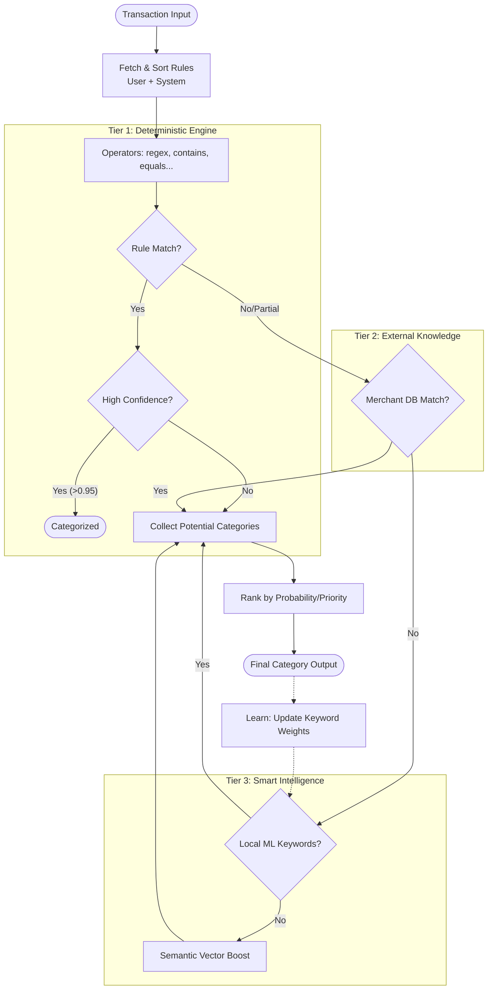

# Categorization Engine: Architectural Review

> **Version**: 1.0.0  
> **Status**: Production  
> **Scope**: Multi-tier Transaction Classification Pipeline

---

## 🏗️ System Architecture

The categorization engine is a high-performance pipeline designed to ensure no transaction remains "Uncategorized" while maintaining strict priority for user-defined logic. It uses a "Waterfall" approach of increasing complexity.

### 🚀 The 4-Tier Classification Pipeline

| Tier  | Name              | Technology                      | Priority | Rationale                                           |
| :---- | :---------------- | :------------------------------ | :------- | :-------------------------------------------------- |
| **1** | **Deterministic** | DB-Driven Rules (JSON Snapshot) | **P0**   | Global logic from `system-rules.json` seeded to DB. |
| **2** | **Merchant DB**   | Static Pattern Database         | **P1**   | Global brand recognition (Apple, Starbucks, etc.)   |
| **3** | **Smart ML**      | Local Keyword Weighting         | **P2**   | Probabilistic matching based on user's own history. |
| **4** | **Semantic**      | Vector Embeddings               | **P3**   | Concept-based matching (Phase 42).                  |

---

## 📊 Process Flow

---

## 🧠 Core Components

### 1. Deterministic Engine (`CategorizationEngine.ts`)

Uses explicit logic to match transaction fields (Description, Counter-Account, Reference).

- **Operators**: `contains`, `equals`, `startsWith`, `endsWith`, `regex`.
- **Match Types**: Supports `all` (AND) or `any` (OR) conditions.
- **Performance**: Implements a `CACHE_TTL` for system rules to minimize DB hits.

### 2. Smart Categorization (`SmartCategorization.service.ts`)

A lightweight, locally-trained ML model per user.

- **Tokenization**: Descriptions are split into significant keywords (length > 2, minus stop words).
- **Weighting**: Every confirmed transaction increments a `weight` for keyword -> category pairs.
- **Prediction**: Aggregates weights of all tokens in a new description to find the most probable category.

### 3. Verification & Safety (`categorization.service.ts`)

- **Auto-Review**: If confidence is `< 0.9`, the system sets `needs_review: true`.
- **Bulk Processing**: Optimized to process entire ledger history in batches.

---

## 🛠️ Performance Metrics

- **Rule Match Latency**: < 10ms.
- **Bulk Categorization**: ~50 transactions/sec (limited by DB write throughput).
- **Confidence Thresholds**:
  - **Rule Match**: 90-95%
  - **Merchant Match**: 80-90%
  - **ML Prediction**: 70% (fixed base)
