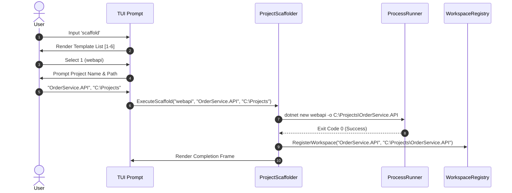
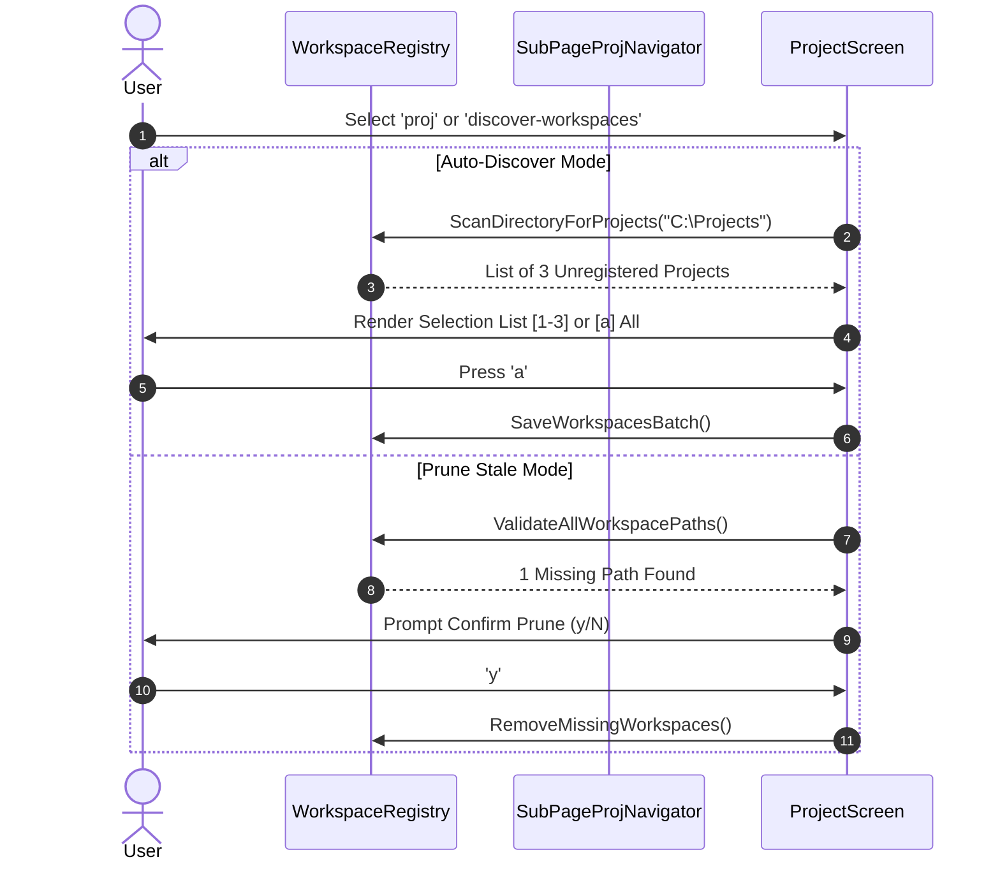
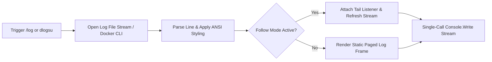
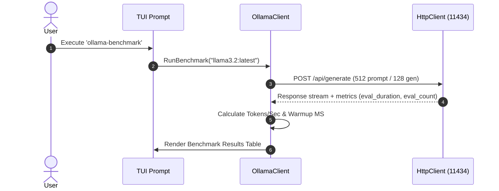
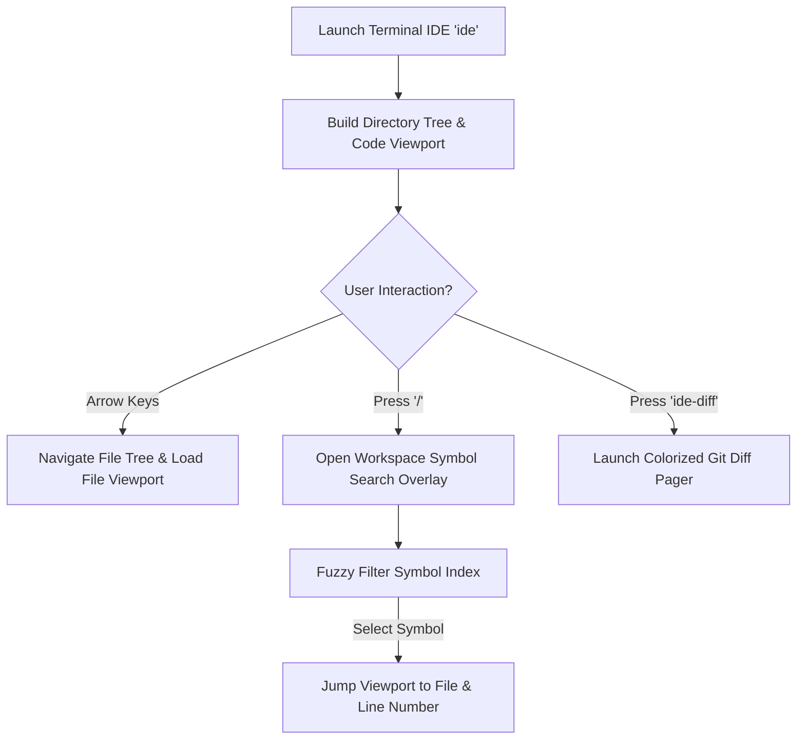
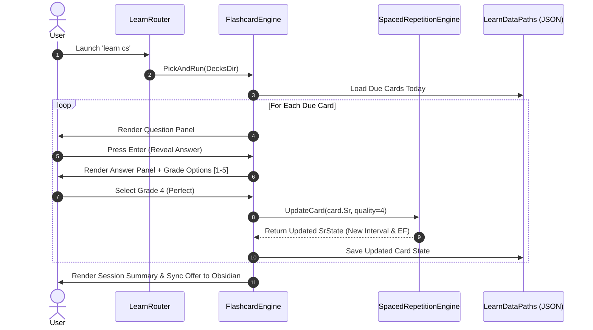
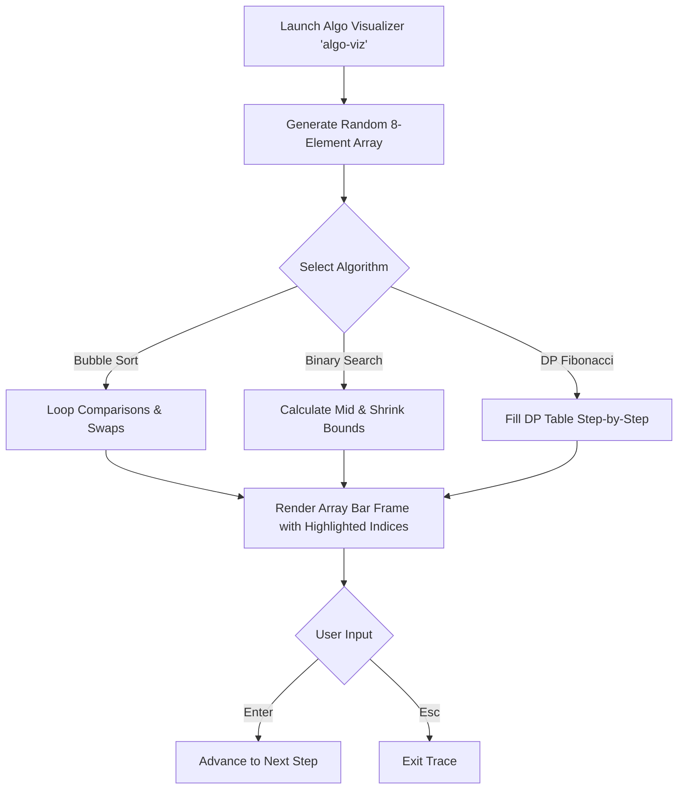
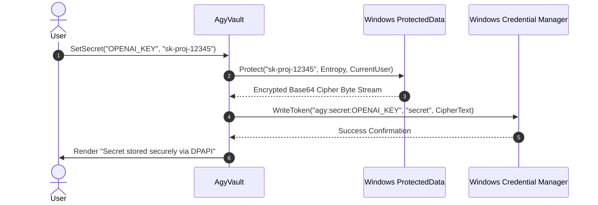

# Console App & CLI Feature Flow & Task Breakdown Guide

This document provides a detailed task breakdown, step-by-step user interaction flow, system sequence diagrams, and implementation logic for **all 12 feature subsystems** defined in **[console_app_cli_checklist.md](file:///C:/Users/TruongNhon/Documents/Powershell/console_app_cli_checklist.md)** and implemented in the **[AgyTui](file:///C:/Users/TruongNhon/Documents/Powershell/csapp/AgyTui/AgyTui.csproj)** codebase architecture.

---

## 🧭 Executive Architecture & Command Dispatch Flow

All CLI commands and interactive TUI screens follow a unified execution pipeline:

```mermaid
flowchart TD
    A[User CLI Command / TUI Prompt Input] --> B[Program.cs Main]
    B --> C[CommandRegistry / CommandRouter]
    C --> D{Command Type?}
    D -->|Screen View| E[IScreenView / ScreenChrome]
    D -->|Suite Router| F[LearnRouter / GitNexus / IdeService]
    D -->|CLI Action| G[Infrastructure Client / CLI Wrapper]
    E --> H[Zero-Lag StringBuilder Stream Buffer]
    F --> H
    G --> H
    H --> I[Atomic Write to Stdout \x1b[H]
```

---

## 1. 🔨 Project Scaffolder Subsystem (`scaffold`)

### 1.1 Overview & CLI Keywords
- **Trigger Commands**: `scaffold`, `create-project`, `new-app`
- **C# Logic Files**: `ProjectScaffolder.cs`, `CommandRegistry.cs`
- **Target Output**: Generates production .NET Web API, Console Apps, React Vite, Blazor WASM, Class Libraries, or Background Worker Services.

### 1.2 Step-by-Step Task Breakdown
1. **Template Selection**: User selects boilerplate template from single-column selection prompt (`[1-6]`).
2. **Parameter Collection**: Prompts user for Project Name and Target Directory Path.
3. **Template Scaffolding**: Executes `dotnet new` or `npx create-vite-app@latest` non-interactively.
4. **Git Initialization**: Runs `git init` and generates `.gitignore`.
5. **Workspace Auto-Registration**: Adds newly created project path into `priority_workspaces.json`.
6. **Completion View**: Flushes summary confirmation to console with prompt to open in Terminal IDE.

### 1.3 Execution Flow Diagram


---

## 2. 💼 Workspace Management & Pruning Subsystem (`discover-workspaces` / `prune-workspaces` / `proj` / `cnav`)

### 2.1 Overview & CLI Keywords
- **Trigger Commands**: `discover-workspaces`, `prune-workspaces`, `proj`, `cnav`, `agysw-proj`
- **C# Logic Files**: `WorkspaceRegistry.cs`, `SubPageProjNavigator.cs`, `ProjectScreen.cs`
- **Target Output**: Auto-discovers unregistered projects, prunes dead directory links, and navigates flat/tree workspace structures.

### 2.2 Step-by-Step Task Breakdown
1. **Auto-Discovery**: Scans parent directory for `.csproj`, `package.json`, or `.git` folders.
2. **Registration Prompt**: Offers single or batch `[a]` registration into `priority_workspaces.json`.
3. **Prune Check**: Verifies registered workspace paths against disk filesystem.
4. **Stale Path Purge**: Highlights missing paths and prompts confirmation (`y/N`) before deletion.
5. **Flat Tree Navigator**: Displays active workspace with `[Active]` badge and handles workspace switching.

### 2.3 Execution Flow Diagram


---

## 3. 📑 System Diagnostics & Log Viewers (`/log` / `dlogsu` / `ollama-logs`)

### 3.1 Overview & CLI Keywords
- **Trigger Commands**: `/log`, `log`, `dlogsu`, `ollama-logs`
- **C# Logic Files**: `LogHelper.cs`, `DockerClient.cs`, `ScreenChrome.cs`
- **Target Output**: Provides live-tailing, color-coded ANSI log levels, and Docker container log monitoring.

### 3.2 Step-by-Step Task Breakdown
1. **Log File Loading**: Reads `logs/app.log` or captures Docker container stdout stream.
2. **ANSI Color Parsing**: Highlights `INFO` (cyan), `DEBUG` (grey), `WARN` (yellow), and `ERROR` (red).
3. **Follow Live Mode (`[f]`)**: Attaches file system watcher or Docker log stream tail.
4. **Scroll & Clear**: Supports `↑/↓` log scrolling and `[c]` log file truncation.

### 3.3 Execution Flow Diagram


---

## 4. 🗄️ EF Core Migration & SQLite State Subsystem (`add-migration` / `update-db` / `da` / `du`)

### 4.1 Overview & CLI Keywords
- **Trigger Commands**: `add-migration`, `update-db`, `da`, `du`, `db-status`
- **C# Logic Files**: `SqliteMigrationEngine.cs`, `SqliteDatabase.cs`
- **Target Output**: Automates Entity Framework Core migration generation and applies database schema updates to SQLite.

### 4.2 Step-by-Step Task Breakdown
1. **Migration Input**: Prompts user for Migration Name (`e.g., AddUserPreferencesTable`).
2. **EF CLI Execution**: Executes `dotnet ef migrations add <Name>` inside project directory.
3. **Database Schema Update**: Runs `dotnet ef database update` or executes raw SQLite DDL scripts.
4. **Status Feedback**: Displays generated migration file paths and SQLite database schema version.

---

## 5. 🤖 Ollama Local LLM Feature Suite (`ollama-status` / `ollama-models` / `ollama-benchmark`)

### 5.1 Overview & CLI Keywords
- **Trigger Commands**: `ollama-status`, `ollama-models`, `ollama-benchmark`, `ollama-pull`
- **C# Logic Files**: `OllamaClient.cs`, `CommandRegistry.cs`
- **Target Output**: Monitors local Ollama daemon (`http://localhost:11434`), manages models, and runs inference speed benchmarks.

### 5.2 Step-by-Step Task Breakdown
1. **Daemon Ping**: Verifies HTTP connectivity to `http://localhost:11434/api/tags`.
2. **Model Inventory**: Lists downloaded LLM models (e.g., `llama3.2`, `hermes3`, `codex-local`) with file sizes and quantization flags.
3. **Model Management**: Supports pulling new model tags (`[p]`) or deleting unneeded models (`[r]`).
4. **Benchmark Evaluator**: Measures prompt evaluation speed (tokens/sec) and warmup latency (ms).

### 5.3 Execution Flow Diagram


---

## 6. 💻 Terminal IDE Feature Suite (`ide` / `symbol` / `ide-search` / `ide-diff`)

### 6.1 Overview & CLI Keywords
- **Trigger Commands**: `ide`, `symbol`, `ide-search`, `ide-diff`
- **C# Logic Files**: `TerminalIde.cs`, `SymbolSearch.cs`, `IdeFileSearchService.cs`, `GitDiffViewer.cs`
- **Target Output**: Dual-pane file tree explorer, line-numbered code viewer, workspace symbol indexer, and colorized git diff viewer.

### 6.2 Step-by-Step Task Breakdown
1. **Dual-Pane Rendering**: Renders Left Directory Tree and Right Line-Numbered Code Viewport.
2. **File Navigation**: `↑/↓` moves selection; `Enter` opens file in viewport; `←/→` expands/collapses folders.
3. **Symbol Indexer (`/symbol`)**: Scans workspace for classes, methods, and properties; filters in real-time.
4. **Pattern Search (`ide-search`)**: Greps files for text patterns and jumps directly to target file and line number.
5. **Git Diff Viewer (`ide-diff`)**: Displays modified file diffs with green `+` additions and red `-` deletions.

### 6.3 Execution Flow Diagram


---

## 7. 🎨 Workspace & System Customization Subsystem (`agysw` / `theme` / `topic`)

### 7.1 Overview & CLI Keywords
- **Trigger Commands**: `agysw`, `theme`, `topic`
- **C# Logic Files**: `AccountScreen.cs`, `ThemeScreen.cs`, `TopicScreen.cs`, `SubPageAccountNavigator.cs`
- **Target Output**: Switches AGY accounts with DPAPI token guard, applies Oh-My-Posh visual themes, and updates focus domain context.

### 7.2 Step-by-Step Task Breakdown
1. **Account Switcher (`agysw`)**: Lists registered accounts; verifies token login status; triggers login prompt if token expired.
2. **Theme Selector (`theme`)**: Selects visual theme (`Catppuccin`, `Tokyo Night`, `One Dark Pro`) and applies environment variables.
3. **Topic Selector (`topic`)**: Updates default AI learning topic context (`jp`, `en`, `cs`, `dsa`, `interview`).

---

## 8. 🎓 Antigravity Master Learning Suite (`learn` / `flashcards` / `study-stats` / `vocab`)

### 8.1 Overview & CLI Keywords
- **Trigger Commands**: `learn`, `flashcards`, `study-stats`, `vocab`, `word-of-day`
- **C# Logic Files**: `LearnRouter.cs`, `FlashcardEngine.cs`, `StudyConsoleView.cs`, `SpacedRepetitionEngine.cs`
- **Target Output**: SM-2 spaced repetition flashcard engine, multi-domain study hub, and daily Pomodoro focus tracker.

### 8.2 Step-by-Step Task Breakdown
1. **Master Learning Hub (`learn auto`)**: Displays 6 learning domains (Japanese, English, C#/.NET, DSA, Career, Stats).
2. **Card Question Flip**: Displays card front; user presses `Enter` to reveal answer.
3. **SM-2 Grade Selection**: User grades recall quality from `[1]` (Blackout) to `[5]` (Easy).
4. **Spaced Repetition Calculation**: Computes new interval, repetitions, and E-Factor; updates JSON card store.
5. **Session Summary**: Records study session duration, accuracy %, and weak items into daily progress log.

### 8.3 Execution Flow Diagram


---

## 9. 🐙 Git Nexus Multi-Repo Suite (`gbr` / `gstats` / `repograph` / `gcmt`)

### 9.1 Overview & CLI Keywords
- **Trigger Commands**: `gbr`, `gstats`, `repograph`, `gcmt`, `gconflict`
- **C# Logic Files**: `GitNexus.cs`, `GitNexusStats.cs`, `RepoGraph.cs`
- **Target Output**: Live multi-repo status dashboard, commit frequency bar chart, and project dependency analyzer.

### 9.2 Step-by-Step Task Breakdown
1. **Multi-Repo Status (`gbr`)**: Fetches branch name, uncommitted dirty file count, and upstream ahead/behind commits across all registered workspaces.
2. **Live Auto-Refresh**: Refreshes status table every 30 seconds using `AnsiConsole.Live`.
3. **Commit Statistics (`gstats`)**: Renders Spectre `BarChart` showing commit counts per repository for the past 7 days.
4. **Repo Dependency Graph (`repograph`)**: Parses `.csproj` project references and `package.json` dependencies into a visual tree.

---

## 10. 🎯 Interactive Quizzes & Dev Tools Subsystem (`quiz-cs` / `kana-quiz` / `snippets`)

### 10.1 Overview & CLI Keywords
- **Trigger Commands**: `quiz-cs`, `kana-quiz`, `snippets`, `cheatsheet`
- **C# Logic Files**: `CsharpQuiz.cs`, `KanaQuiz.cs`, `SnippetLibrary.cs`, `CheatSheetBrowser.cs`
- **Target Output**: Multiple-choice C# assessment quiz, Japanese Kana pronunciation practice, and code snippet clipboard library.

### 10.2 Step-by-Step Task Breakdown
1. **C# Quiz Engine (`quiz-cs`)**: Selects 10 random questions; renders question and options `[1-4]`; provides immediate explanation panel.
2. **Kana Quiz Engine (`kana-quiz`)**: Prompts Hiragana/Katakana character; compares input Romaji; updates score streak.
3. **Snippet Library (`snippets`)**: Displays categorized code snippets with single-keypress Windows clipboard copy (`clip`).

---

## 11. ⚡ Career & Algorithm Visualizer Suite (`interview` / `star-builder` / `algo-viz`)

### 11.1 Overview & CLI Keywords
- **Trigger Commands**: `interview`, `star-builder`, `algo-viz`
- **C# Logic Files**: `InterviewBank.cs`, `AlgoVisualizer.cs`
- **Target Output**: STAR method answer builder, behavioral interview question bank, and interactive array sorting algorithm visualizer.

### 11.2 Step-by-Step Task Breakdown
1. **Interview Question Bank (`interview`)**: Displays question details, format guidance, hints, and target companies.
2. **STAR Method Builder (`star-builder`)**: Multi-step form prompting Situation, Task, Action, Result, and Outcome Metric; saves to SQLite/JSON store.
3. **Algo Step Visualizer (`algo-viz`)**: Renders array states step-by-step for Bubble Sort, Binary Search, Merge Sort, Quick Sort, BFS Graph, and DP Fibonacci.

### 11.3 Execution Flow Diagram


---

## 12. 🏗️ Infrastructure & Integration Subsystem (`aws-status` / `obsidian` / `agy-vault` / `agy-deck` / `ai-providers` / `ai-scan`)

### 12.1 Overview & CLI Keywords
- **Trigger Commands**: `aws-status`, `obsidian`, `agy-vault`, `agy-deck`, `ai-providers`, `ai-scan`
- **C# Logic Files**: `AwsClient.cs`, `ObsidianClient.cs`, `AgyVault.cs`, `AntigravityDeckClient.cs`, `ClaudeProvider.cs`, `AiProjectScanner.cs`
- **Target Output**: AWS/LocalStack resource inspector, Obsidian vault daily note sync, DPAPI secret store, Antigravity Deck micro-server controller, and AI codebase scanner.

### 12.2 Step-by-Step Task Breakdown
1. **AWS Cloud Inspector (`aws-status`)**: Captures AWS CLI / LocalStack output for S3 buckets, SQS queues, Lambda functions, and SSM parameter store.
2. **Obsidian Vault Sync (`obsidian`)**: Searches vault notes; indexes tags; appends daily study summary to `YYYY-MM-DD.md`.
3. **DPAPI Secret Vault (`agy-vault`)**: Encrypts sensitive API tokens using Windows `ProtectedData.Protect` (CurrentUser scope) + Windows Credential Manager keyring.
4. **Antigravity Deck (`agy-deck`)**: Controls local Node.js micro-server (ports `3000`, `3500`, `18789`), scaffolds `package.json` / `server.js`, and manages Cloudflare Tunnels.
5. **AI Multi-Provider Status (`ai-providers`)**: Pings Claude 3.5 Sonnet, Hermes 3, and OpenClaw engine endpoints; measures latency.
6. **AI Codebase AST Scanner (`ai-scan`)**: Analyzes workspace modified files and generates automated git commit messages.

### 12.3 Execution Flow Diagram


---

## 7 Summary & Reference Cross-Index

| Subsystem | Primary Command | View Pattern Engine | Core C# Source File |
| :--- | :--- | :--- | :--- |
| **1. Project Scaffolder** | `scaffold` | `ZeroLagSingleColumnList` + Prompt | `ProjectScaffolder.cs` |
| **2. Workspace Manager** | `discover-workspaces` | `ZeroLagSingleColumnList` (Batch) | `WorkspaceRegistry.cs` |
| **3. Diagnostics & Logs** | `/log` / `dlogsu` | `PagedLogViewer` (Follow mode) | `LogHelper.cs` |
| **4. EF Core & Database** | `add-migration` | `InputAndExecuteView` | `SqliteMigrationEngine.cs` |
| **5. Ollama LLM Suite** | `ollama-status` | `ServiceStatusDashboard` | `OllamaClient.cs` |
| **6. Terminal IDE** | `ide` | `DualPaneSplitExplorer` | `TerminalIde.cs` |
| **7. System Customization**| `agysw` / `theme` | `AccountListWithAuthBadge` | `AccountScreen.cs` |
| **8. Master Learning Hub**| `learn` / `flashcards` | `DomainSelectionHub` / SM-2 Card | `LearnRouter.cs` / `FlashcardEngine.cs` |
| **9. Git Nexus Multi-Repo**| `gbr` / `gstats` | `LiveTableDashboard` (30s) | `GitNexus.cs` |
| **10. Quizzes & Tools** | `quiz-cs` / `snippets`| `MultipleChoiceQuizCard` | `CsharpQuiz.cs` |
| **11. Career & Algo Viz** | `interview` / `algo-viz`| `StepByStepArrayFrameViewer` | `InterviewBank.cs` / `AlgoVisualizer.cs` |
| **12. Infrastructure** | `aws-status` / `obsidian`| `CloudResourceTabbedInspector` | `AwsClient.cs` / `ObsidianClient.cs` |
