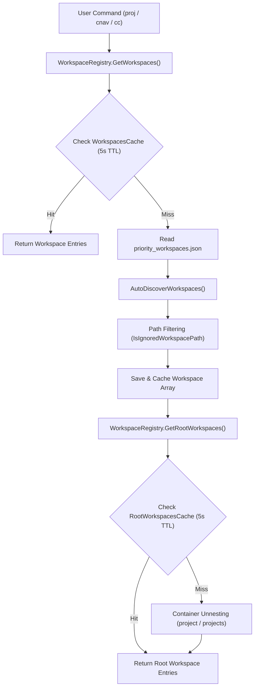

# Workspace Discovery & Scanning Architecture Flow (`WorkspaceRegistry.cs`)

This document outlines the end-to-end scanning, filtering, container unnesting, and caching flow implemented in `AgyTui.Infrastructure.Registries.WorkspaceRegistry`.

---

## High-Level Architecture Overview

---

## Detailed Step-by-Step Discovery Pipeline

### 1. Priority Workspace Config Reading
- Checks for `priority_workspaces.json` in the root repository path or active home directory.
- Deserializes pre-saved workspace entries (`Name`, `WorkspacePath`, `Alias`, `Tags`, `Links`).

### 2. Strict Path Filtering (`IsIgnoredWorkspacePath`)
- Prevents system, default, and unneeded user directories from cluttering the menu:
  - **System Profiles**: `C:\Users\Default`, `C:\Users\Default User`, `C:\Users\Public`, `C:\Users\All Users`.
  - **SSH Desktop/Docs**: `C:\Users\sshuser\Documents`, `C:\Users\sshuser\Desktop`.
  - **Generic User Roots**: `C:\Users\<username>` bare root folders are ignored so sub-projects stand out.

### 3. Automatic Discovery (`AutoDiscoverWorkspaces`)
- **Active Context**: Registers `Directory.GetCurrentDirectory()`.
- **PowerShell Profile**: Registers `C:\Users\TruongNhon\Documents\Powershell`.
- **User Project Repositories**: Scans `C:\Users\*\project` and `C:\Users\*\learning`.
- **Configured Search Bases**: Iterates `Config.Current.Project.BaseDir` and `Project.SearchPaths`.

### 4. Container Unnesting (`GetRootWorkspaces`)
- Generic container directories (`project`, `projects`) are automatically unnested.
- Sub-directories inside `project` (such as `BinhDinhFood`, `build_cv`, `finance-dashboard`, `InventoryManagementSystem`, `9router`, etc.) are promoted **directly as main top-level root projects** at depth 0.

### 5. Double-Layered TTL Caching (`TtlCache`)
- `WorkspacesCache`: Caches full workspace array (5s TTL).
- `RootWorkspacesCache`: Caches unnested top-level root projects (5s TTL).
- `ChildWorkspacesCache`: Caches sub-module arrays per parent directory (5s TTL).
- **Result**: Zero redundant filesystem I/O per frame, enabling smooth flicker-free TUI rendering.

---

## Action Options Collapse Strategy
- **Sub-modules (`[Tab] / [Space]`)**: Expands sub-projects/files directly under a project.
- **Actions (`[A]`)**: Toggles the 10 workspace action options (`Change Directory`, `Terminal IDE`, `Explorer`, `Git Diff`, etc.) on demand, keeping the main tree compact by default.
