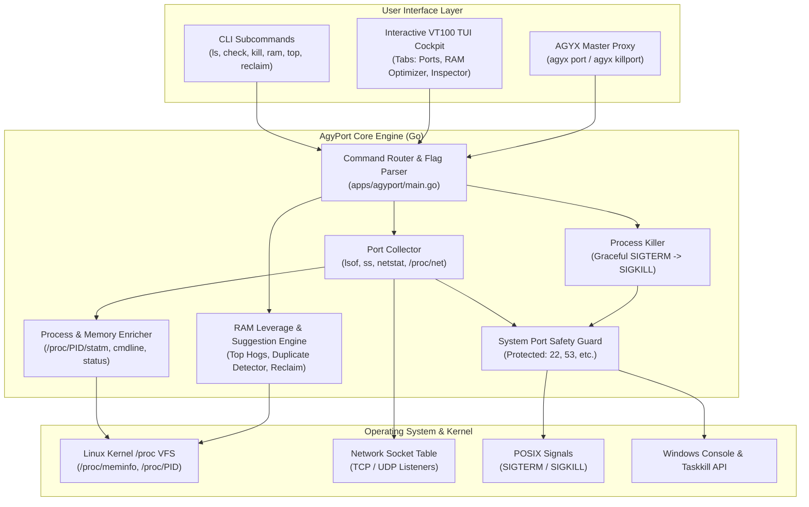

# ⚡ AGYPORT — System Architecture & User Guide
**Active Network Port Manager, Process Killer & Smart RAM Leverage Optimizer**

---

## 🧭 Document References
- **VS Code Clickable (Recommended):** [agyport_system_architecture.md](./docs/01_architecture/agyport_system_architecture.md)
- **Windows UNC Path:** `\\wsl.localhost\Ubuntu\home\truongnhon\projects\powershell-profile\docs\01_architecture\agyport_system_architecture.md`
- **Application Source:** [apps/agyport/](./apps/agyport/)

---

## 1. Executive Summary

`agyport` is a high-performance native Go micro-application built for the **Antigravity Developer Suite**. It provides real-time monitoring of active TCP/UDP ports, intelligent process framework detection, safe single/bulk port termination, and an automated **RAM Leverage Engine** that detects memory hogs, orphaned developer servers, duplicate application instances, and WSL2 kernel cache bloat.

### 🎯 Key Capabilities
1. **Live Network Port Inspection**:
   - Discovers all TCP/UDP listening sockets across IPv4 and IPv6.
   - Extracts PID, Process Name, User, and full Command Line.
   - Computes Resident Set Size (RSS) memory consumption in MB/GB and percentage of total system RAM.
   - Automatically detects frameworks and server types (Next.js, Vite, React, Vue, FastAPI, Django, Flask, ASP.NET Core, Redis, PostgreSQL, MySQL, MongoDB, Ollama AI, Docker).
2. **Precision Process Termination**:
   - Terminate a specific port: `agyport kill 3000` (supports multiple: `agyport kill 3000,8080`).
   - Terminate by PID directly: `agyport kill-pid <pid>`.
   - Bulk dev server termination: `agyport kill-all` (kills all developer servers without affecting system daemons).
   - Graceful termination first (`SIGTERM` / `taskkill`), followed by automatic fallback to `SIGKILL` or `--force`.
   - **System Protection Safeguards**: Built-in protection refuses to terminate privileged system ports (SSH 22, DNS 53, DHCP 67/68, NTP 123) without explicit confirmation.
3. **RAM Leverage & Memory Optimizer**:
   - Real-time WSL2 and Host RAM & Swap meters with colored ASCII gauge visualization.
   - Ranked list of top memory-consuming processes.
   - **Smart Suggestion Engine**: Detects dangling dev servers, redundant web server instances, and memory leaks.
   - **One-Click Reclaim**: `agyport reclaim` terminates dead/orphaned dev servers to instantly free gigabytes of host RAM.

---

## 2. System Architecture



---

## 3. CLI Command Reference

| Command | Arguments | Description | Example |
| :--- | :--- | :--- | :--- |
| `agyport` | *(none)* | Launch interactive full-screen VT100 Cockpit TUI | `agyport` |
| `agyport ui` | `[--port 5999] [--no-open]` | Launch modern browser Web UI Dashboard & auto-open | `agyport ui` |
| `agyport ls` | `[--json]` | List active listening ports with PID, framework & RAM | `agyport ls` |
| `agyport check` | `<port> [--json]` | Inspect port occupancy, process details & command line | `agyport check 3000` |
| `agyport <port>` | *(none)* | Direct shortcut to inspect a port | `agyport 8080` |
| `agyport kill` | `<port> [--force, -f]` | Terminate process listening on port (comma-separated supported) | `agyport kill 3000,3001` |
| `agyport kill-all`| `[--force, -f]` | Terminate all active developer server ports safely | `agyport kill-all` |
| `agyport kill-pid`| `<pid> [--force, -f]` | Terminate process by PID directly | `agyport kill-pid 41205` |
| `agyport ram` | `[--json]` | Display real-time host RAM, Swap & cache breakdown | `agyport ram` |
| `agyport top` | `[limit] [--json]` | Display top RAM-consuming processes | `agyport top 10` |
| `agyport suggestions`| `[--json]` | Analyze system memory & display actionable suggestions | `agyport suggestions` |
| `agyport reclaim` | `[--dry-run]` | Batch-terminate all dangling dev servers to free RAM | `agyport reclaim` |
| `agyport help` | *(none)* | Display CLI usage manual and TUI hotkeys | `agyport help` |

### 3.1 Interactive TUI Cockpit Hotkeys & Navigation

The full-screen TUI cockpit automatically adapts to any terminal width (full columns on >=90 cols, compact layout on standard 80-col terminals) and bounds its line height to prevent screen scrolling:

| Key | Mode | Action |
| :--- | :--- | :--- |
| **`[q]` / `[Q]`** | Normal | **Clean Exit**: Exits TUI immediately and restores raw terminal mode |
| **`[Esc]`** | Solitary | **Clean Exit**: Exits immediately when not filtering; cancels filter when searching |
| **`[Ctrl+C]` / `[Ctrl+D]`** | Any | **Immediate Exit**: Unconditionally halts TUI and restores shell |
| **`[w]` / `[W]`** | Normal | **Launch Web UI**: Starts web server on `http://127.0.0.1:5999` & opens browser |
| **`[Tab]` / `[1-3]` / `[←/→]`** | Normal | **Switch Tabs**: Ports Cockpit `[1]`, RAM Leverage `[2]`, Process Inspector `[3]` |
| **`[↑]` / `[↓]`** | Normal | **Navigate Rows**: Select active port or process item |
| **`[k]`** | Normal | **Graceful Kill**: Sends `SIGTERM` to the process listening on the selected port |
| **`[K]` / `[f]`** | Normal | **Force Kill**: Sends `SIGKILL` to force-terminate the selected port process |
| **`[a]` / `[A]`** | Normal | **Kill All Dev Ports**: Prompts confirmation to terminate all dev servers |
| **`[c]` / `[C]`** | Normal | **Reclaim Dev RAM**: One-click kill of dangling dev servers to free memory |
| **`[/]`** | Normal | **Search / Filter**: Filter ports or processes by port number, name, or framework |
| **`[i]` / `[Enter]`** | Normal | **Inspect Details**: Opens detailed full-screen process inspector dialog |
| **`[r]` / `[R]`** | Normal | **Refresh**: Synchronously re-scans network sockets and system memory |

---

## 4. Modern Browser Web UI Dashboard (`agyport ui`)

For users who prefer a rich graphical user interface over the command line:

```bash
# Launch Web UI and automatically open in default Windows browser
agyport ui

# Or specify a custom port
agyport ui --port 7000

# Or through agyx
agyx port ui
```

### Dashboard Features:
1. **Live Visual Memory Gauges:** Real-time RAM and Swap usage meters with color-coded progress bars (Normal, Warning, Danger).
2. **Interactive Search & Filter:** Instant fuzzy search across port numbers, process names, frameworks, and owners.
3. **One-Click Port Termination:** Individual red `Kill :<port>` buttons on every active port row with instant confirmation and table refresh.
4. **Smart RAM Suggestion Cards:** Displays detected duplicate servers (e.g. Next.js on 3000 & 3001) and memory hogs with a 1-click **"Reclaim Now"** button.
5. **Batch Actions:** Header buttons for **"🧹 Reclaim Dev RAM"** and **"⚡ Kill All Dev Ports"**.
6. **Live Auto-Polling:** Automated 2.5s polling loop with toggle switch.
7. **Offline & Self-Contained:** Built with clean embedded HTML5/CSS3/JS — zero external CDN dependencies required.

---

## 5. First-Class Integration in `agyx` Master Cockpit

`agyport` is integrated directly as **Tab `[5] 🌐 Ports`** inside `agyx` (the master developer suite cockpit):

```bash
# Launch master cockpit (focus on Ports & RAM)
agyx port

# Or open master cockpit and press 5
agyx
```

### Controls Inside `agyx` Cockpit Tab 5:
- **`[Enter]`**: Launch the dedicated full-screen interactive TUI cockpit.
- **`[W]`**: Launch the modern **Web UI Dashboard** and auto-open your browser.
- **`[C]`**: Trigger instant **1-Click Dev Server RAM Reclaim** directly from `agyx`.
- **`[A]`**: Trigger **Kill All Dev Ports** with confirmation modal.
- **`[Tab]` / `[1-7]`**: Seamlessly navigate between Switch, Proj, Git, Docker, Ports, Ollama, and Tools drawers.

---

## 6. Shell Integration & Aliases

The Antigravity Developer Suite includes pre-configured aliases for both **Linux / Zsh** and **Windows PowerShell**:

### Linux / Zsh (`~/.zshrc` / `posh-profile.zsh`):
```zsh
alias ports="agyport ls"
alias killport="agyport kill"
alias kp="agyport kill"
alias killallports="agyport kill-all"
alias killdev="agyport kill-all"
alias reclaim-ram="agyport reclaim"
alias ram-hogs="agyport top"
alias mem-status="agyport ram"
```

### Windows PowerShell (`Microsoft.PowerShell_profile.ps1`):
Generated dynamically via `agyx init powershell`:
```powershell
Set-Alias -Name 'agyport' -Value 'agyport' -Force
Set-Alias -Name 'agy-port' -Value 'agyport' -Force
function killport { agyport kill @args }
function kp { agyport kill @args }
function ports { agyport ls @args }
```

### Master Proxy Integration (`agyx`):
You can execute all commands through the master proxy:
```bash
agyx port ls
agyx port check 3000
agyx port kill 3000
agyx port reclaim
```

---

## 6. Verification & Test Suite

The application includes comprehensive unit tests with 100% pass rate:

```bash
# Run tests specifically for agyport
cd apps/agyport && go test -v ./...

# Run master suite across all 10 applications
make test
```

### Test Coverage Highlights:
- **`model`**: Byte formatting (`B`, `KB`, `MB`, `GB`).
- **`portops`**: System port detection (`IsSystemPort`), socket parsing (`parseAddrAndPort`), framework inference (Next.js, Vite, FastAPI, PostgreSQL, Redis, Ollama, ASP.NET Core), protected port safeguards (`KillPort(22)` fails safely, PID 1 root protection).
- **`ramops`**: Memory info parsing (`/proc/meminfo`), dev process heuristics, suggestion generator, and dry-run RAM reclamation.
- **`view`**: Progress bar gauge rendering, search query filtering, and JSON serialization.

---
*Generated for Antigravity Developer Suite.*
