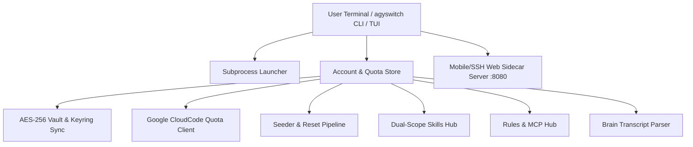

# ⚡ AGYSWITCH Go Engine — Architecture Specification

> **Category**: Architecture  
> **Subsystem**: Account Vault, Quota Engine & Context Isolation  
> **Status**: Production / Active  

---

## Executive Summary
`agyswitch` is a high-performance, single-binary Go engine designed for multi-account management, token security, quota monitoring, and isolated subprocess execution for the Google Antigravity CLI (`agy`). It replaces ad-hoc shell scripts with an atomic, cross-platform architecture that guarantees zero token pollution across accounts.

---

## 1. System Architecture

### Layer Boundaries
- **`internal/model`**: Pure data entities (`AccountContext`, `QuotaSummary`, `SkillPackage`, `RuleItem`, `SessionRecord`).
- **`internal/service/vault`**: AES-256-GCM token encryption, Windows Credential Manager (`cmdkey`) synchronization, and automated OAuth token refresh.
- **`internal/service/store`**: Atomic directory mirroring, account registry (`agyswitch_accounts.json`), and quota calculations.
- **`internal/service/quota`**: Direct HTTPS probing of Google CloudCode endpoints for Gemini and 3rd-party models.
- **`internal/service/skills`**: Dual-scope skill discovery across global (`~/.gemini/skills`) and workspace (`.agents/skills`) directories.
- **`internal/service/rules`**: Parsing global rules, workspace rules, and `mcp_config.json`.
- **`internal/service/sessions`**: Fast JSONL parsing of agent trajectories in `~/.gemini/antigravity-cli/brain/`.
- **`internal/service/seeder`**: Canonical template provisioning (`~/.gemini_template`) and multi-tier account resets.
- **`internal/service/server`**: Lightweight HTTP sidecar providing an SSH/mobile dashboard.
- **`internal/view`**: Double-buffered, zero-flicker terminal UI built with pure ANSI codes.
- **`launcher`**: Environment scrubber, `GEMINI_HOME` injector, and subprocess lifecycle manager.

---

## 2. Multi-Account Context Isolation

### Directory Structure
To avoid race conditions and credential cross-talk:
- **Active / Primary Context**: `~/.gemini/`
- **Isolated Account Stores**: `~/.gemini_<accountName>/`
- **Master Seed Template**: `~/.gemini_template/`
- **Account Registry**: `~/.gemini/agyswitch_accounts.json`

### Switching Mechanism
1. Contexts are mirrored atomically via `store.MirrorDirectory`.
2. Environment scrubbing in `launcher/launcher.go` strips IDE auth tokens (`GEMINI_CLI_IDE_AUTH_TOKEN`, `ANTIGRAVITY_IDE_SERVER_PORT`).
3. `GEMINI_HOME` is explicitly set to the target directory before launching the `agy` binary.
4. Active account identifier is persisted to `~/.gemini/active_account.txt`.

---

## 3. Security & Token Storage

- **Keyring Storage**: Tokens are stored in AES-256-GCM encrypted format in `.keyring/7407b4dd...key` and mirrored in `keyring_token.txt`.
- **Automated Refresh**: `EnsureValidAccessToken` checks OAuth token expiry and exchanges refresh tokens before invoking `agy`, preventing authentication dropouts during long sessions.
- **Platform Keyring Sync**: On Windows, tokens are synced to Windows Credential Manager via `cmdkey.exe /generic:gemini:antigravity`. On Linux/WSL, context files are strictly isolated with `0700` permissions.

---

## 4. Quota Probing & Smart Selection

- Direct HTTPS queries to Google CloudCode endpoints:
  - `RetrieveUserQuotaSummary`: Extracts weekly quotas for Gemini 2.5 Flash, Pro, and Claude 3.7 / 3.5 Sonnet.
  - `FetchAvailableModels`: Discovers active model entitlements.
- **Auto-Launch Algorithm**: Calculates the highest available quota fraction across registered accounts:
  $$\text{Score}(acc) = \frac{\text{GeminiWeeklyRemaining} + \text{ClaudeWeeklyRemaining}}{2}$$
  The account with the highest score is automatically selected via `agyswitch auto-launch` or hotkey `[A]`.

---

## 5. Dual-Scope Skills & Rules Engine

| Scope | Location | Target |
| :--- | :--- | :--- |
| **Global Skills** | `~/.gemini/skills/*/SKILL.md` | Accessible across all projects and account contexts. |
| **Workspace Skills** | `.agents/skills/*/SKILL.md` | Scoped exclusively to the active repository. |
| **Global Rules** | `~/.gemini/config/rules/` | Persistent instructions applied across all sessions. |
| **Workspace Rules** | `.agents/rules/` | Project-specific coding standards and guidelines. |

Synchronization hotkey `[S]` mirrors global skills across all isolated `~/.gemini_<account>/skills` directories.

---

## 6. Mobile & Remote SSH Control Center

Running `agyswitch serve [port]` starts an internal, zero-dependency HTTP server (default port `8080`):
- Responsive, dark-mode web dashboard optimized for mobile browsers and remote SSH tunnels.
- Real-time display of account statuses, quotas, active contexts, and skills.
- REST endpoints:
  - `GET /api/accounts`: Returns all account statuses and quota fractions.
  - `POST /api/switch`: Changes active context remotely.
  - `POST /api/reset`: Executes tier resets.
