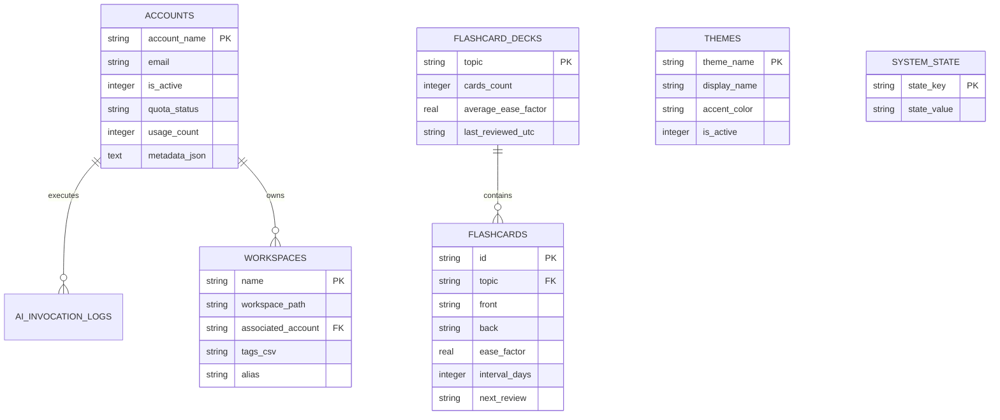

# 💾 SQLite Database Schemas, Repositories & Migrations

> **Category**: Architecture  
> **Subsystem**: Database Persistence  
> **Date**: 2026-07-31  
> **Author**: Antigravity AI Engineering Team  
> **Status**: Completed / Active  

---

## Executive Summary
This document specifies the SQLite database persistence engine in `AgyTui`. It covers relational database table schemas across migration versions V1 to V6, ERD entity relationships, repository pattern implementations, and automatic schema migration execution.

## Table of Contents
- [1. Database Persistence Overview](#1-database-persistence-overview)
- [2. Entity Relationship Diagram (ERD)](#2-entity-relationship-diagram-erd)
- [3. Complete SQL DDL Schemas (Migrations V1-V6)](#3-complete-sql-ddl-schemas-migrations-v1-v6)
- [4. Generic Repository Pattern](#4-generic-repository-pattern)
- [5. Cross References](#5-cross-references)

---

## 1. Database Persistence Overview

`AgyTui` utilizes an embedded SQLite engine (`agytui.db` in Production, `agytui.dev.db` in Development). Database connections are managed by `SqliteDatabase`, and schema migrations are automatically applied on application boot by `SqliteMigrationEngine`.

---

## 2. Entity Relationship Diagram (ERD)

---

## 3. Complete SQL DDL Schemas (Migrations V1-V6)

- **V1 (Initial Schema)**: `app_config`, `accounts`, `system_state`.
- **V2 (Invocation Logs)**: `command_invocation_logs`.
- **V3 (Domain Aggregates)**: `workspaces`, `flashcard_decks`, `flashcards`.
- **V4 (Extended Storage)**: `themes`, `ai_invocation_logs`.
- **V5 (System State & Index)**: `resources`, `skills`.
- **V6 (Quiz Questions)**: `quiz_questions`.

---

## 4. Generic Repository Pattern

All data access is implemented via generic base classes inheriting from `IRepository<TEntity, TId>`:
- `SqliteRepositoryBase<TEntity, TId>`: Generic SQLite base repository.
- `JsonFileRepositoryBase<TEntity, TId>`: Generic JSON file base repository.
- Repositories: `SqliteAgyAccountRepository`, `SqliteWorkspaceRepository`, `SqliteConfigRepository`.

---

## 5. Cross References
- [MasterSeeder Seeding Pipeline](seeding_pipeline.md)
- [DDD Bounded Contexts](ddd_bounded_contexts.md)
