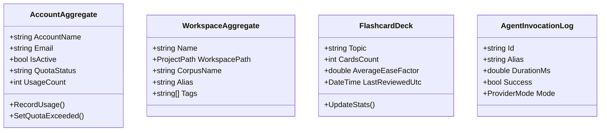

# 🧩 DDD Bounded Contexts & Aggregate Roots

> **Category**: Architecture  
> **Subsystem**: Domain Model Design  
> **Date**: 2026-07-31  
> **Author**: Antigravity AI Engineering Team  
> **Status**: Active / Approved  

---

## Executive Summary
This document provides a comprehensive technical reference for the 4 Domain Bounded Contexts in `AgyTui`: `AccountContext`, `WorkspaceContext`, `AiAgentContext`, and `LearnContext`. It details the aggregate roots, value objects, domain invariants, and record structures.

## Table of Contents
- [1. Domain Architecture Overview](#1-domain-architecture-overview)
- [2. AccountContext](#2-accountcontext)
- [3. WorkspaceContext](#3-workspacecontext)
- [4. AiAgentContext](#4-aiagentcontext)
- [5. LearnContext](#5-learncontext)
- [6. Cross References](#6-cross-references)

---

## 1. Domain Architecture Overview

---

## 2. AccountContext

- **Location**: `AgyTui.Domain.AccountContext`
- **Aggregate Root**: [AccountAggregate.cs](file:///C:/Users/TruongNhon/Documents/Powershell/csapp/AgyTui/Domain/AccountContext/AccountAggregate.cs)
- **Value Objects / Records**:
  - `AccountMetadata`: Holds JSON-serializable account statistics (`UsageCount`, `QuotaStatus`, `LastUsed`, `RequestHistory`).
  - `EncryptedToken`: Encapsulates AES-encrypted keyring OAuth tokens.
  - `QuotaMetrics`: Computes rolling usage limits and quota state.

---

## 3. WorkspaceContext

- **Location**: `AgyTui.Domain.WorkspaceContext`
- **Aggregate Root**: [WorkspaceAggregate.cs](file:///C:/Users/TruongNhon/Documents/Powershell/csapp/AgyTui/Domain/WorkspaceContext/WorkspaceAggregate.cs)
- **Value Objects**:
  - `ProjectPath`: Strongly typed path validation ensuring target directories exist.
  - `WorkspaceEntry`: DTO representation for `priority_workspaces.json`.

---

## 4. AiAgentContext

- **Location**: `AgyTui.Domain.AiAgentContext`
- **Entities**:
  - `AgentInvocationLog`: Encapsulates AI CLI agent invocations, execution duration, provider mode, and success status.
  - `ProviderMode`: Enum (`Auto`, `CloudDirect`, `LocalOllama`).

---

## 5. LearnContext

- **Location**: `AgyTui.Domain.LearnContext`
- **Aggregate Root**: [FlashcardDeck.cs](file:///C:/Users/TruongNhon/Documents/Powershell/csapp/AgyTui/Domain/LearnContext/FlashcardDeck.cs)
- **Core Domain Records**:
  - `SrState`: SuperMemo 2 algorithm state (`EaseFactor`, `IntervalDays`, `Repetitions`, `NextReview`, `Status`).
  - `FlashCard`: Individual card with front/back text, mnemonic, and `SrState`.
  - `StudyLogEntry`: Session logging record.

---

## 6. Cross References
- [Clean Architecture Overview](file:///C:/Users/TruongNhon/Documents/Powershell/docs/01_architecture/overview.md)
- [Database Persistence Engine](file:///C:/Users/TruongNhon/Documents/Powershell/docs/01_architecture/database_persistence.md)
