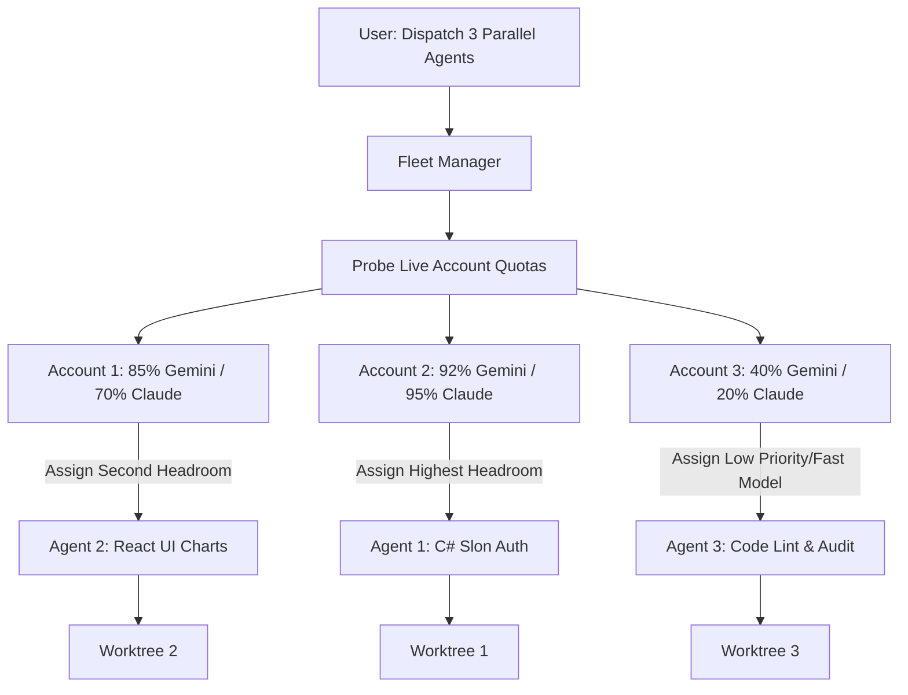

# Multi-Agent ADE (Agent Development Environment) Architecture & UI Design Spec
**Inspired by [Orca](https://www.onorca.dev/) for Google Antigravity (`agy`, `agyswitch`, and `agytui`)**

---

## 1. Executive Summary

[Orca](https://www.onorca.dev/) establishes the paradigm of an **Agent Development Environment (ADE)**: moving beyond simple single-agent chat windows to an environment where **multiple autonomous coding agents execute in parallel across isolated Git worktrees**, with multiplexed terminals, in-app diff review, and centralized fleet management.

This specification details how Google Antigravity (`agy`), the Go `agyswitch` engine, and the .NET `agytui` console can evolve from a multi-account quota switcher into a **worktree-first Multi-Agent ADE**.

```
┌────────────────────────────────────────────────────────────────────────────────────────┐
│                               ANTIGRAVITY ADE ARCHITECTURE                             │
├────────────────────────────────────────────────────────────────────────────────────────┤
│                                                                                        │
│     [User Terminal / agyswitch TUI / Web Sidecar API]                                  │
│                             │                                                          │
│                             ▼                                                          │
│               ┌───────────────────────────┐                                            │
│               │   Fleet Orchestrator      │                                            │
│               │ (agyswitch Fleet Engine)  │                                            │
│               └─────────────┬─────────────┘                                            │
│                             │                                                          │
│         ┌───────────────────┼───────────────────┐                                      │
│         ▼                   ▼                   ▼                                      │
│   Worktree: auth      Worktree: api       Worktree: ui                                 │
│ ┌────────────────┐ ┌────────────────┐ ┌────────────────┐                               │
│ │ Agent 1 (C# EF)│ │ Agent 2 (API)  │ │ Agent 3 (React)│                               │
│ │ Account: acc1  │ │ Account: acc2  │ │ Account: acc3  │ (Quota Load Balanced)         │
│ │ .agents/wt-auth│ │ .agents/wt-api │ │ .agents/wt-ui  │ (Git Branch Isolated)         │
│ └────────┬───────┘ └────────┬───────┘ └────────┬───────┘                               │
│          └──────────────────┼──────────────────┘                                       │
│                             ▼                                                          │
│               ┌───────────────────────────┐                                            │
│               │ In-App Diff Review/Merge  │                                            │
│               │  (Inspect, Test, Commit)  │                                            │
│               └───────────────────────────┘                                            │
└────────────────────────────────────────────────────────────────────────────────────────┘
```

---

## 2. Core Pillars Inspired by Orca

| Orca Feature | Antigravity ADE Equivalent | Implementation Mechanism |
| :--- | :--- | :--- |
| **Worktree-First Isolation** | Per-Task Git Worktrees | `.agents/worktrees/<task-slug>` created via `git worktree add` |
| **Parallel Agent Fleets** | Multi-Agent Subprocesses | Concurrent `agy` processes launched in separate worktree directories |
| **Multi-Agent Quota Balance** | Account Rotation Engine | `agyswitch` rotates across Google accounts so fleets don't hit rate limits |
| **Terminal Multiplexing** | PTY Split Windows & Tabs | Terminal pane switching in `agyswitch` or Tmux/Ghostty integration |
| **In-App Diff & Review** | Staged Diff Review Modal | Real-time git diff preview before merging worktree branches into `main` |
| **Session Trajectory Mining** | Project-Grouped Sessions | Structured parsing of transcripts in `~/.gemini/antigravity-cli/brain/` |

---

## 3. Terminal UI Wireframes (TUI Mode)

### 3.1 Tab 4: Multi-Agent Fleet & Session Manager (Grouped by Project)

```
🛸 AGYSWITCH - Dedicated Antigravity Control Center (Go Engine v2.0)
──────────────────────────────────────────────────────────────────────────────────────────────────
 [1] 🔑 Vault & Quota   [2] 🧩 Skills Hub   [3] 📜 Rules & MCP   [4] 📊 Fleets & Sessions 
──────────────────────────────────────────────────────────────────────────────────────────────────
 Active Context: nhontruongvo   🌐 Web Sidecar API: http://localhost:8080/api/v1/status

 📊 Active Fleets & Sessions (39 sessions across 6 projects · Total Est: $4.2185) · [Grouped View]:

 📁 finance-dashboard (28 sessions · $3.4790 · 3 agents active)
    ├── ⚡ [RUNNING]  wt-auth-v2     | Auth & EF Seeder Specialist   (Steps: 73  · $0.0365 · 12m)
    ├── 🔍 [REVIEW]   wt-api-prune   | API Reduction & Optimization  (Steps: 172 · $0.0860 · 45m)
    ├── ▶ [SELECTED]  wt-ui-charts   | Audit Chart Components & Fix  (Steps: 85  · $0.0425 · 00:34)
    │     Conversation ID: 4f34088f-262b-4b71-a74d-fbf02447bb25
    │     Worktree Dir:    /home/truongnhon/projects/finance-dashboard/.agents/wt-ui-charts
    │     Branch:          feat/ui-chart-audit  (Changes: +142 -38 lines in 4 files)
    │     Account Assigned: fptvttnhon2026 (Quota: 84.5% Remaining)
    └── ✔ [DONE]      wt-db-fix      | scan project fix run local   (Steps: 1587· $0.7935 · 17:50)

 📁 powershell-profile (2 sessions · $0.0955 · 1 agent active)
    ├── ▶ [RUNNING]   wt-switch-ui   | fix UI agy switch & multi-agt (Steps: 154 · $0.0770 · 00:52)
    └── ✔ [DONE]      wt-tui-sync    | Sync Spectre Console aliases  (Steps: 37  · $0.0185 · 00:45)

 📁 BinhDinhFood (6 sessions · $0.5845 · Idle)
    ├── ✔ [DONE]      main           | ry                            (Steps: 711 · $0.3555 · 00:45)
    └── ✔ [DONE]      arch-audit     | Audit Typography & Fonts      (Steps: 119 · $0.0595 · 00:45)

──────────────────────────────────────────────────────────────────────────────────────────────────
 [Showing 1-7 of 39 sessions · Selected #3 · finance-dashboard/wt-ui-charts]
 [Tab/1-4] Switch Tab · [↑/↓ j/k] Nav · [Enter/C] Continue Session · [F] Dispatch Fleet
 [D] Diff Review · [M] Merge Worktree · [G] Group/Flat · [V] Transcript · [Q/Esc] Exit
```

---

### 3.2 In-App Diff Review Modal (`[D]` Keypress)

When selecting a worktree that has agent changes:

```
──────────────────────────────────────────────────────────────────────────────────────────────────
 🔍 Worktree Diff Review: feat/ui-chart-audit (Branch -> main)
 Worktree Path: /home/truongnhon/projects/finance-dashboard/.agents/wt-ui-charts
 Summary: 4 files changed, +142 insertions, -38 deletions
──────────────────────────────────────────────────────────────────────────────────────────────────
 Files:
  [1] ui/src/components/charts/IncomeExpenseChart.tsx  (+64 -18)
  [2] ui/src/components/charts/TrendLineChart.tsx      (+48 -12)
  [3] ui/src/services/analyticsService.ts              (+22 -6)
  [4] ui/src/types/chartTypes.ts                      (+8  -2)

 ─── Unified Diff Preview: IncomeExpenseChart.tsx ────────────────────────────────────────────────
 @@ -42,18 +42,32 @@ export const IncomeExpenseChart = ({ data }: Props) => {
 -    const formattedData = data.map(item => ({ date: item.date, amount: item.value }));
 -    return <ResponsiveContainer><BarChart data={formattedData}>...</BarChart></ResponsiveContainer>;
 +    const memoizedData = useMemo(() => {
 +        return data.filter(d => !isNaN(d.value)).map(item => ({
 +            timestamp: new Date(item.date).toLocaleDateString(),
 +            income: item.category === 'income' ? item.value : 0,
 +            expense: item.category === 'expense' ? Math.abs(item.value) : 0
 +        }));
 +    }, [data]);
 +
 +    return (
 +        <ResponsiveContainer width="100%" height={320}>
 +            <BarChart data={memoizedData}>
 +                <XAxis dataKey="timestamp" stroke="#888888" />
 +                <YAxis tickFormatter={formatCurrency} />
 +                <Tooltip content={<CustomChartTooltip />} />
 +                <Bar dataKey="income" fill="#10b981" radius={[4, 4, 0, 0]} />
 +                <Bar dataKey="expense" fill="#ef4444" radius={[4, 4, 0, 0]} />
 +            </BarChart>
 +        </ResponsiveContainer>
 +    );
──────────────────────────────────────────────────────────────────────────────────────────────────
 [Enter/A] Merge to Main · [C] Continue Prompting · [R] Reject / Delete Worktree · [Esc] Back
```

---

## 4. Git Worktree Lifecycle Engine

### 4.1 Worktree Directory Topology

```
/home/truongnhon/projects/finance-dashboard/
├── .git/
├── .agents/
│   └── worktrees/
│       ├── wt-auth-specialist/      # git worktree on branch 'feat/auth-v2'
│       │   ├── .git -> .../gitdir
│       │   ├── csharp-sln/
│       │   └── ui/
│       ├── wt-api-optimizer/       # git worktree on branch 'perf/api-prune'
│       └── wt-ui-chart-audit/      # git worktree on branch 'feat/ui-charts'
├── csharp-sln/
└── ui/
```

### 4.2 Lifecycle Operations

1. **`Fleet Spawn`**:
   ```bash
   git worktree add -b feat/task-name .agents/worktrees/wt-task-name main
   ```
2. **`Isolated Execution`**:
   - `agyswitch` sets:
     - `Cwd = /home/truongnhon/projects/finance-dashboard/.agents/worktrees/wt-task-name`
     - `GEMINI_HOME = ~/.gemini_<selected_account>` (auto-picked based on highest quota)
   - Executes `agy --dangerously-skip-permissions "<agent_prompt>"`
3. **`Review & Verification`**:
   - `git diff main...HEAD` in the worktree directory.
   - Run verification test commands (e.g. `dotnet test`, `npm test`).
4. **`Merge & Clean`**:
   ```bash
   git merge --squash feat/task-name
   git worktree remove .agents/worktrees/wt-task-name
   git branch -D feat/task-name
   ```

---

## 5. Multi-Account Quota Distribution Algorithm

Running multiple agents simultaneously causes single-account quota exhaustion. `agyswitch` solves this by assigning accounts dynamically based on remaining quota fractions:



---

## 6. CLI Command Suite for Multi-Agent Fleets

Add the following subcommands to `agyswitch`:

```bash
# List all active agent sessions and worktrees across all projects
agyswitch sessions
agyswitch fleet list

# Continue the most recent session in its original workspace
agyswitch sessions resume
agyswitch sessions resume <conversation-id>

# Dispatch a multi-agent task across isolated worktrees
agyswitch fleet run \
  --project "finance-dashboard" \
  --agent "auth:csharp-specialist:Implement demo user seed data" \
  --agent "ui:react-specialist:Audit and fix chart rendering memory leaks"

# Review git diff for an agent worktree
agyswitch worktree diff <worktree-name>

# Merge verified agent worktree back to main
agyswitch worktree merge <worktree-name> --squash
```

---

## 7. Web Sidecar Integration (`localhost:8080`)

The existing HTTP sidecar in `apps/agyswitch/internal/service/server/server.go` will be expanded with the following REST API endpoints:

- `GET /api/v1/sessions` - Returns JSON array of all sessions with project grouping, step counts, cost, and timestamps.
- `GET /api/v1/fleets` - Returns live status of all running agent worktrees (running, review, done, errored).
- `POST /api/v1/sessions/resume` - Payload: `{"conversationId": "...", "account": "..."}`.
- `GET /api/v1/worktrees/:id/diff` - Returns git diff for review in browser.
- `POST /api/v1/worktrees/:id/merge` - Merges worktree branch and purges worktree directory.
