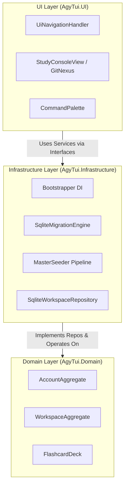

# 🏛️ Clean Architecture & Layer Boundary Specification

> **Category**: Architecture  
> **Subsystem**: Core System Design  
> **Date**: 2026-07-31  
> **Author**: Antigravity AI Engineering Team  
> **Status**: Completed / Active  

---

## Executive Summary
This document specifies the architectural principles, layer boundaries, and dependency inversion rules governing `AgyTui`. It defines the strict separation of pure Domain logic from technical Infrastructure and Spectre.Console UI rendering.

## Table of Contents
- [1. Layered Architecture Principles](#1-layered-architecture-principles)
- [2. Dependency Rules & Architecture Enforcement](#2-dependency-rules--architecture-enforcement)
- [3. Dependency Injection & Bootstrapper Container](#3-dependency-injection--bootstrapper-container)
- [4. Layer Topology Diagram](#4-layer-topology-diagram)
- [5. Cross References](#5-cross-references)

---

## 1. Layered Architecture Principles

`AgyTui` strictly follows Onion / Clean Architecture principles:

```text
┌─────────────────────────────────────────────────────────────┐
│ UI Layer (AgyTui.UI)                                        │
│ Spectre.Console Views, Command Palette, Layout Renderers    │
│ └──────────────┬──────────────────────────────────────────┘ │
│                ▼                                            │
│ Infrastructure Layer (AgyTui.Infrastructure)                 │
│ Persistence, Repositories, DI, Seeding, External Bridges   │
│ └──────────────┬──────────────────────────────────────────┘ │
│                ▼                                            │
│ Domain Layer (AgyTui.Domain)                                │
│ Pure Value Objects, Aggregates, Enums (Zero Infrastructure) │
└─────────────────────────────────────────────────────────────┘
```

1. **Domain Layer (`AgyTui.Domain`)**: Contains zero external dependencies, no database attributes, and no system I/O logic.
2. **Infrastructure Layer (`AgyTui.Infrastructure`)**: Implements persistence interfaces, SQLite connection management, filesystem seeding, and external integrations (Git, AWS, Docker, Ollama).
3. **UI Layer (`AgyTui.UI`)**: Renders interactive Spectre.Console terminal views. Communicates with infrastructure services exclusively through interfaces.

---

## 2. Dependency Rules & Architecture Enforcement

To ensure long-term codebase maintainability, the following reflection rules are enforced automatically by `ArchitectureTests.cs`:

- **Rule 1**: Types in `AgyTui.Domain` MUST NOT reference `AgyTui.Infrastructure` or `AgyTui.UI`.
- **Rule 2**: Types in `AgyTui.Infrastructure` MUST NOT reference `AgyTui.UI`.
- **Rule 3**: Any menu node models or UI command registries (`CommandRegistry.cs`) referencing UI types (`MenuNode`) MUST reside in `AgyTui.UI.Core.Registries`.

---

## 3. Dependency Injection & Bootstrapper Container

Service registration is centralized in `Bootstrapper.cs` (`AgyTui.Infrastructure.Di`):

```csharp
public static IServiceProvider BuildServiceProvider(IServiceCollection? customServices = null)
{
    var services = customServices ?? new ServiceCollection();

    // SQLite Persistence & Seeding
    services.AddSingleton<ISqliteDatabase, SqliteDatabase>();
    services.AddSingleton<SqliteMigrationEngine>();
    services.AddSingleton<IConfigRepository, SqliteConfigRepository>();
    services.AddSingleton<IAgyAccountRepository, SqliteAgyAccountRepository>();
    services.AddSingleton<IWorkspaceRepository, SqliteWorkspaceRepository>();

    // Modular Seeder Pipeline
    services.AddSingleton<ISeeder, AccountSeeder>();
    services.AddSingleton<ISeeder, WorkspaceSeeder>();
    services.AddSingleton<ISeeder, LearningSeeder>();
    services.AddSingleton<ISeeder, ThemeSeeder>();
    services.AddSingleton<ISeeder, ResourceSeeder>();
    services.AddSingleton<ISeeder, SkillSeeder>();
    services.AddSingleton<IMasterSeeder, MasterSeeder>();

    return services.BuildServiceProvider();
}
```

---

## 4. Layer Topology Diagram



---

## 5. Cross References
- [DDD Bounded Contexts](ddd_bounded_contexts.md)
- [Database Persistence Engine](database_persistence.md)
- [Testing & Architecture Rules](../03_developer_guide/testing_and_architecture_rules.md)
