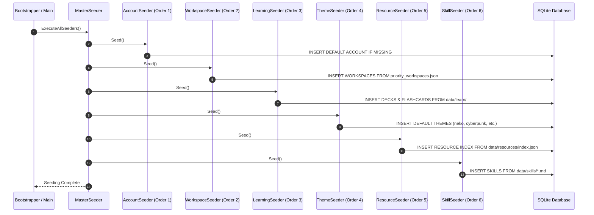

# 🌱 MasterSeeder Data Ingestion Pipeline

> **Category**: Architecture  
> **Subsystem**: Persistence & Data Ingestion  
> **Date**: 2026-07-31  
> **Author**: Antigravity AI Engineering Team  
> **Status**: Completed / Active  

---

## Executive Summary
This document specifies the modular `MasterSeeder` data ingestion pipeline in `AgyTui`. It describes how initial JSON templates, learning assets, workspace manifests, and UI themes are automatically ingested into relational SQLite database tables on application boot or release publishing.

## Table of Contents
- [1. Seeder Pipeline Architecture](#1-seeder-pipeline-architecture)
- [2. Individual Seeders & Data Sources](#2-individual-seeders--data-sources)
- [3. MasterSeeder Execution Sequence](#3-masterseeder-execution-sequence)
- [4. Cross References](#4-cross-references)

---

## 1. Seeder Pipeline Architecture

Seeding logic is cleanly isolated under `AgyTui.Infrastructure.Persistence.Seeding`:

```text
AgyTui.Infrastructure.Persistence.Seeding/
├── ISeeder.cs                  # Generic Seeder Contract (int Order, void Seed())
├── AccountSeeder.cs            # Order 1: Default Account & Metadata
├── WorkspaceSeeder.cs          # Order 2: Priority Workspaces (priority_workspaces.json)
├── LearningSeeder.cs           # Order 3: Flashcards, Decks & Interview Questions
├── ThemeSeeder.cs              # Order 4: UI Palette Themes (neko, cyberpunk, nord, dracula)
├── ResourceSeeder.cs           # Order 5: Learning Resource Index (index.json)
├── SkillSeeder.cs              # Order 6: Markdown Skill Definitions (*.md)
└── MasterSeeder.cs             # Master Pipeline Orchestrator (IMasterSeeder)
```

---

## 2. Individual Seeders & Data Sources

| Seeder Class | Order | Source Data File | Target SQLite Database Table |
| :--- | :---: | :--- | :--- |
| `AccountSeeder` | 1 | Code Default | `accounts` |
| `WorkspaceSeeder` | 2 | `csapp/AgyTui/data/priority_workspaces.json` | `workspaces` |
| `LearningSeeder` | 3 | `csapp/AgyTui/data/learn/**/*.json` | `flashcard_decks`, `flashcards`, `quiz_questions` |
| `ThemeSeeder` | 4 | Code Palette Constants | `themes` |
| `ResourceSeeder` | 5 | `csapp/AgyTui/data/resources/index.json` | `resources` |
| `SkillSeeder` | 6 | `csapp/AgyTui/data/skills/*.md` | `skills` |

---

## 3. MasterSeeder Execution Sequence



---

## 4. Cross References
- [Database Persistence Engine](database_persistence.md)
- [Clean Architecture Overview](overview.md)
