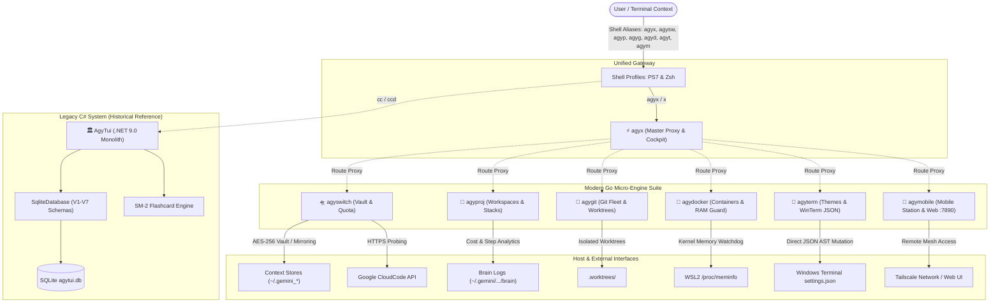

# 🛸 System Architecture, File Tree & Feature Blueprint

> **Category**: Architecture & System Specification  
> **Subsystem**: Core Documentation Suite  
> **Environment**: Ubuntu WSL2 + Windows 11 / VS Code  
> **Date**: September 2026  
> **Status**: Production / Active  
> **Master Gateway**: [docs/README.md](../README.md)  
> **Audit Catalog**: [docs/reports/README.md](../reports/README.md)  
> **Strategic Roadmap**: [AGY_SYSTEM_AUDIT_AND_ROADMAP.md](../../AGY_SYSTEM_AUDIT_AND_ROADMAP.md)  
> **Windows UNC Reference**: `\\wsl.localhost\Ubuntu\home\truongnhon\projects\powershell-profile\docs\01_architecture\system_overview_and_file_tree.md`

---

## Executive Summary

This document provides a comprehensive architectural reference and file tree blueprint for the **Antigravity Developer Ecosystem**. 

The system architecture combines:
1. **Modern Go Engine Suite (7 Micro-Applications)**: High-speed native binaries (`apps/agyswitch`, `apps/agyproj`, `apps/agygit`, `apps/agydocker`, `apps/agyterm`, `apps/agyx`, `apps/agymobile`) providing sub-15ms startup, zero file-locking overhead, and specialized operational cockpits.
2. **Master CLI Orchestrator (`agyx`)**: Unified gateway proxying commands and providing a multi-module interactive TUI cockpit.
3. **Legacy C# Control Center (`apps/agytui`)**: Monolithic .NET 9.0 clean-architecture system preserved as an architectural reference, containing 261 xUnit tests, SQLite WAL relational migrations (V1–V7), and the SuperMemo-2 (SM-2) spaced repetition engine.
4. **Cross-Platform Shell Integrations**: Lean PowerShell 7+ profile (`Microsoft.PowerShell_profile.ps1`) and Ubuntu WSL2 Zsh profiles (`setup-ubuntu.sh`) providing seamless hotkeys and path aliases.

---

## Table of Contents
- [1. System Architecture & Component Topology](#1-system-architecture--component-topology)
- [2. Modern Go Micro-Applications & Feature Catalog](#2-modern-go-micro-applications--feature-catalog)
- [3. Complete Repository File Tree](#3-complete-repository-file-tree)
- [4. Cross References & Sitemap](#4-cross-references--sitemap)

---

## 1. System Architecture & Component Topology



---

## 2. Modern Go Micro-Applications & Feature Catalog

### ⚡ A. Master Orchestrator (`apps/agyx`)
- **CLI Subcommand Proxy**: Transparent command delegation (`agyx switch`, `agyx proj`, `agyx git`, `agyx docker`, `agyx term`, `agyx mobile`).
- **Interactive Multi-Tab Cockpit**: Zero-lag status summaries across all micro-modules in a single view.
- **PTY Session Handover**: Launches child interactive TUIs with preserved terminal state.

### 🔑 B. Multi-Account Authority & Quota Engine (`apps/agyswitch`)
- **Context Mirroring**: Atomic symlink and file replication between isolated account directories (`~/.gemini_<name>`) and active runtime (`~/.gemini`).
- **Encrypted Token Vault**: AES-256-GCM token encryption safeguarding Google OAuth refresh tokens.
- **Live Quota Probing**: Direct HTTPS calls to Google CloudCode quota endpoints.
- **Subprocess Launcher**: Environment sanitizer scrubbing IDE tokens and setting `GEMINI_HOME`.

### 📁 C. Project Workspace Hub (`apps/agyproj`)
- **Technology Stack Auto-Detection**: Heuristically detects .NET, Go, Rust, Node/React, Python, and Docker.
- **AI Session Cost Telemetry**: Scans `transcript.jsonl` files to compute inference steps, model usage, and USD costs.
- **1-Tap IDE Launcher**: Launches VS Code or Neovim directly into projects on Windows or WSL2.

### 🐙 D. Git Fleet & Worktree Orchestrator (`apps/agygit`)
- **Parallel Fleet Scanner**: Discovers all Git repositories under workspace directories and audits uncommitted changes, stashes, and branch tracking.
- **Multi-Agent Worktree Isolation**: Generates `.worktrees/<branch>` directories enabling concurrent Antigravity subagents to code on isolated branches without clobbering main workspaces.

### 🐳 E. Container Fleet & WSL2 RAM Guard (`apps/agydocker`)
- **WSL2 Kernel RAM Guard**: Directly parses `/proc/meminfo` to display live RAM and Swap pressure gauges.
- **Container & Compose Batch Controls**: Start, stop, restart individual containers or batch-toggle entire Compose stacks.
- **Interactive Shell Exec**: 1-key shell attachment (`e`) into running containers.

### 🎨 F. Terminal Themes & System Diagnostics (`apps/agyterm`)
- **Windows Terminal Profile Mutator**: Safely edits `settings.json` across the WSL2/Windows boundary with `.bak` safety backups.
- **Oh-My-Posh ANSI Previewer**: Parses and dynamically renders 80+ `.omp.json` theme files with live color segments.
- **Subsystem Health Diagnostics**: Audits 9 shell tools (Oh-My-Posh, Starship, Zsh history, PSReadLine, fzf, eza, zoxide, bat, Docker).

### 📱 G. Mobile Remote Cockpit (`apps/agymobile`)
- **38-Column Smartphone TUI**: Designed for narrow terminal clients (Termux, ConnectBot) with single-digit hotkeys.
- **Embedded Web Cockpit**: Dark-mode mobile web interface on port 7890 accessible over Tailscale.
- **Kernel Cache Drops**: Remote 1-tap memory reclamation via `/proc/sys/vm/drop_caches`.

### 🏛️ H. Legacy C# Subsystems (`apps/agytui`)
- **Relational SQLite Database**: Structured schema migrations V1 through V7 in WAL mode.
- **SuperMemo-2 (SM-2) Spaced Repetition**: Curated curriculums for Japanese, English, C#, DSA, and STAR interview questions.
- **AWS LocalStack Cloud Tools**: S3 buckets, SQS queues, DynamoDB tables, and Lambda functions.
- Detailed in [08_cs_legacy_system_parity_audit.md](../reports/08_cs_legacy_system_parity_audit.md).

---

## 3. Complete Repository File Tree

```text
powershell-profile/
├── .gitignore                                   # Workspace git ignore rules
├── AGY_SYSTEM_AUDIT_AND_ROADMAP.md              # Master Forensic Audit & Strategic Roadmap
├── AGYX_AGYMOBILE_SECURITY_ROUTING_REPORT.md    # Phase 1 Fix Report: Agyx & Agymobile
├── AGYGIT_AGYPROJ_PERF_UX_REPORT.md             # Phase 1 Fix Report: Agygit & Agyproj
├── AGYDOCKER_AGYTERM_FIX_REPORT.md              # Phase 1 Fix Report: Agydocker & Agyterm
├── AGYMOBILE_PLAN.md                            # Mobile Cockpit Architectural Plan
├── Microsoft.PowerShell_profile.ps1             # PowerShell 7+ Profile Integrator
├── setup-ubuntu.sh                              # Ubuntu WSL2 Environment Provisioning Script
├── apps/                                        # Antigravity Application Suite
│   ├── agyswitch/                               # [Go] Identity, Vault & Quota Engine
│   │   ├── main.go                              # Entrypoint & CLI dispatcher
│   │   ├── launcher/                            # Subprocess environment sanitizer & launcher
│   │   └── internal/                            # Model, service (vault, store, sessions), view
│   ├── agyx/                                    # [Go] Master Proxy & Multi-Tab Cockpit
│   │   ├── main.go                              # Gateway entrypoint
│   │   └── internal/                            # Proxy router & cockpit view
│   ├── agygit/                                  # [Go] Git Fleet & Multi-Agent Worktrees
│   │   ├── main.go                              # Git CLI dispatcher & TUI
│   │   └── internal/                            # Git operations service & interactive view
│   ├── agyproj/                                 # [Go] Workspace Hub & Stack Detector
│   │   ├── main.go                              # Project launcher & TUI
│   │   └── internal/                            # Detector, launcher, registry, view
│   ├── agydocker/                               # [Go] Container Fleet & WSL2 RAM Guard
│   │   ├── main.go                              # Docker CLI & TUI
│   │   └── internal/                            # Dockerops service, meminfo parser, view
│   ├── agyterm/                                 # [Go] Terminal Theme & WinTerm Customizer
│   │   ├── main.go                              # Theme manager entrypoint
│   │   └── internal/                            # WinTerm JSON editor, OMP parser, view
│   ├── agymobile/                               # [Go] Mobile Cockpit & Tailscale Station
│   │   ├── main.go                              # Mobile server & 38-col TUI
│   │   └── internal/                            # Web server (:7890), hostops, agentops, view
│   └── agytui/                                  # [C# .NET 9.0] Legacy Control Center Monolith
│       ├── AgyTui.slnx                          # Solution definition
│       ├── AgyTui/                              # Core C# console project (200+ source files)
│       │   ├── Program.cs                       # C# main dispatcher
│       │   ├── Domain/                          # Pure DDD aggregates (Account, Workspace, Learn)
│       │   ├── Infrastructure/                  # SQLite WAL (V1-V7), DPAPI vault, CLI clients
│       │   └── UI/                              # Spectre.Console 3-pane layout & command router
│       └── AgyTui.Tests/                        # xUnit Test Suite (261 architecture/unit tests)
├── bin/                                         # Compiled standalone native Go binaries
│   ├── agyswitch                                # Compiled agyswitch binary
│   ├── agyx                                     # Compiled agyx master binary
│   ├── agygit                                   # Compiled agygit binary
│   ├── agyproj                                  # Compiled agyproj binary
│   ├── agydocker                                # Compiled agydocker binary
│   ├── agyterm                                  # Compiled agyterm binary
│   └── agymobile                                # Compiled agymobile binary
└── docs/                                        # Centralized Documentation Suite
    ├── README.md                                # Master Gateway & Documentation Sitemap
    ├── 01_architecture/                         # Architecture Specifications & Designs
    │   ├── agyswitch_engine.md                  # Go v2.0 engine architecture & vault
    │   ├── agymobile_tailscale_ssh_plan.md      # Mobile cockpit & Tailscale SSH spec
    │   ├── orca_multi_agent_ade_design.md       # Multi-agent ADE worktree design (Orca-inspired)
    │   ├── skill_and_mcp_management_plan.md     # Dual-scope skill/rule/MCP management
    │   ├── system_overview_and_file_tree.md     # System overview & repository tree (This file)
    │   ├── overview.md                          # C# Clean Architecture & Onion layer boundaries
    │   ├── ddd_bounded_contexts.md              # C# DDD Bounded Contexts & Aggregate Roots
    │   ├── database_persistence.md              # C# SQLite WAL schemas & Migrations V1-V7
    │   └── seeding_pipeline.md                  # C# MasterSeeder data ingestion pipeline
    ├── 02_user_guide/                           # User Manuals & Workstation Setup
    │   ├── agyswitch_cli_tui.md                 # agyswitch hotkeys, CLI syntax, and quota checks
    │   ├── powershell_profile_shortcuts.md      # Profile shortcuts, aliases, and navigation
    │   ├── onboarding_and_setup.md              # Automated setup via PowerShell & bash
    │   └── tui_screen_catalog.md                # Spectre.Console screen catalog
    ├── 03_developer_guide/                      # Developer Workflows & Quality Gates
    │   ├── dual_environment_workflow.md         # Dev sandbox vs. production runtime
    │   ├── testing_and_architecture_rules.md    # Architecture tests & invariant rules
    │   └── release_publishing.md                # Release publishing pipeline
    ├── 04_command_enhancements/                 # CLI Command Enhancements & Tooling
    │   ├── 01_git_enhancement.md                # Git status, branch, and nexus tools
    │   ├── 02_dotnet_enhancement.md             # .NET build, test, and cleanup tools
    │   ├── 03_docker_enhancement.md             # Docker container, compose, and cleanup tools
    │   ├── 04_aws_enhancement.md                # AWS LocalStack, S3, SQS, DynamoDB tools
    │   ├── 05_linux_neovim_ide_flow.md          # Neovim workflow & multiplexing
    │   └── 06_linux_cli_tools.md                # Modern CLI tools (fzf, eza, zoxide, bat)
    ├── reports/                                 # Forensic Audit & Parity Reports
    │   ├── README.md                            # Audit Reports Catalog & Executive Summary
    │   ├── 01_agyswitch_deep_audit.md           # agyswitch deep audit
    │   ├── 02_agyx_proxy_audit.md               # agyx master proxy audit
    │   ├── 03_agygit_fleet_audit.md             # agygit fleet & worktrees audit
    │   ├── 04_agyproj_workspace_audit.md        # agyproj workspaces & cost audit
    │   ├── 05_agydocker_container_audit.md      # agydocker container & RAM guard audit
    │   ├── 06_agyterm_theme_audit.md            # agyterm theme & diagnostics audit
    │   ├── 07_agymobile_cockpit_audit.md        # agymobile mobile cockpit audit
    │   └── 08_cs_legacy_system_parity_audit.md  # C# legacy system audit & parity roadmap
    └── archive/                                 # Historical Blueprints & Interim Reports
        ├── agy_switch_crud_and_sync_flows.md    # Early switch sync flows
        ├── agyswitch_cli_flow_blueprint.md      # Early CLI flow blueprint
        ├── agyswitch_cli_guide.md               # Legacy CLI guide
        ├── agyswitch_tui_enhancement_plan.md    # Early TUI enhancement plan
        ├── cli_clean_architecture_report.md     # Clean architecture refactoring report
        ├── console_app_cli_feature_flow_breakdown.md # Feature flow breakdown
        ├── console_app_cli_master_mockup_blueprint.md# Master mockup blueprint
        ├── console_app_ui_test_folder_audit_report.md# UI test folder reorganization
        ├── console_app_ui_test_rebuild_plan.md  # UI test rebuild plan
        ├── master_documentation_plan.md         # Early documentation plan
        └── tasks_refactor_plan.md               # Early task refactor plan
```

---

## 4. Cross References & Sitemap

- [Documentation Gateway & Sitemap](../README.md)
- [Audit & Deep-Dive Reports Catalog](../reports/README.md)
- [Master System Audit & Product Roadmap](../../AGY_SYSTEM_AUDIT_AND_ROADMAP.md)
- [AGYSWITCH Go Engine Architecture](agyswitch_engine.md)
- [C# Legacy System & Parity Audit](../reports/08_cs_legacy_system_parity_audit.md)
