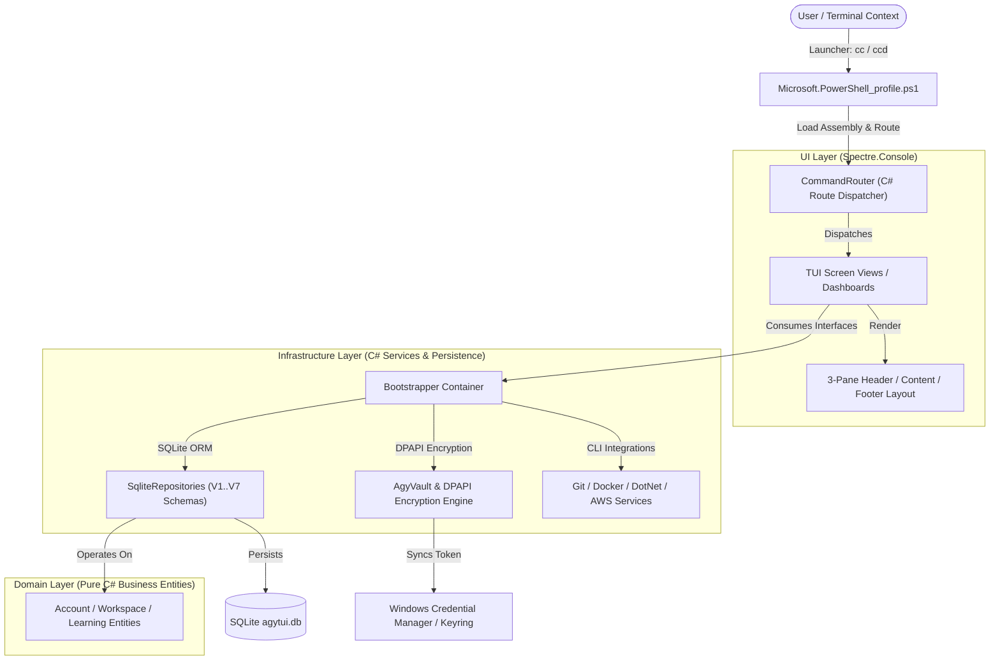

# 🛸 System Architecture, File Tree & Feature Blueprint

> **Category**: Architecture & System Specification  
> **Subsystem**: Core Documentation Suite  
> **Date**: 2026-08-03  
> **Author**: Antigravity AI Engineering Team  
> **Status**: Completed / Active  

---

## Executive Summary
This document provides an exhaustive reference for the **PowerShell Control Center (`AgyTui`)**. It details the **complete repository file tree**, an **annotated catalog of all system features**, the **Clean Architecture component topology**, and the **PowerShell-to-C# interop model**.

---

## Table of Contents
- [1. System Architecture & Component Topology](#1-system-architecture--component-topology)
- [2. Comprehensive Feature Catalog](#2-comprehensive-feature-catalog)
- [3. Complete Repository File Tree](#3-complete-repository-file-tree)
- [4. Cross References & Sitemap](#4-cross-references--sitemap)

---

## 1. System Architecture & Component Topology

`AgyTui` is designed around **Clean / Onion Architecture principles** with a strict **100% C# Domain Logic Centralization** policy.

### Component Layer Topology



---

## 2. Comprehensive Feature Catalog

### 🔑 A. Multi-Account Authority & DPAPI Credential Isolation
- **SQLite Master Account Authority**: Account state, active status (`is_active = 1`), and credentials are managed authoritatively inside SQLite (`accounts` table, Migration V7).
- **DPAPI Encrypted Credential Vault**: OAuth refresh tokens, access tokens, and project configs are DPAPI-encrypted per account.
- **Clean Context Switching Engine**: Switching accounts purges active Windows Keyring tokens (`gemini:antigravity`) and `%USERPROFILE%\.gemini` JSON state files when switching to clean or logged-out target accounts.
- **Account Signature UI**: Renders 5-character key signatures (e.g. `✔ Logged In · Key: ae..awe`) in TUI headers for instant identity verification.

### 🛠️ B. Centralized C# CLI Engine (`CommandRouter`)
- **100% C# Logic Centralization**: **70 out of 70 domain and CLI tool functions** delegate directly to C# via `Load-AgyTuiDll` and `[CommandRouter]::Route`.
- **PowerShell Profile Interop**: `Microsoft.PowerShell_profile.ps1` functions as a thin calling interface.
- **Native CLI Conflict Avoidance**: Clean command isolation ensuring native CLIs (such as official Anthropic `claude.cmd`) run directly without alias collision.

### 🐙 C. Git Integration & VCS Automation (`GitClient.cs`)
- **Git Status & Visual Diff**: Color-coded status tables (`gs`) and diff viewer (`gd`).
- **Interactive Log Graph & Formatting**: Graph log visualization (`glg`), pretty log (`glog`), and interactive Spectre pager log (`glo`).
- **Branch Navigator & Switcher**: Branch listing (`gb`), branch checkout (`co`), branch creation (`cob`), and deletion (`gbd`).
- **Conventional Commit Wizard**: AI-assisted conventional commit message generator (`gcmt`) and commit amend (`gca`).
- **Git Undo & Reset**: Soft reset (`gr`), hard reset (`grh`), and commit undo (`git-undo`).
- **Remote Operations**: Fetch (`gf`), Pull (`gpull`), Push (`gpush`), Force Push (`guf`), and Repo Cloning Assistant (`gclone`).

### 🐳 D. Docker & Container Management (`DockerClient.cs`)
- **Docker Dashboard & Health**: TUI cleanup dashboard (`dkcl`) and health audit widget (`docker-health`).
- **Container Control**: Container listing (`dps`), stop all (`dkstac`), and purge all (`dkrmac`).
- **Docker Compose**: Compose up (`dcup`), compose up build (`dcupb`), and compose down (`dcdown`).
- **Resource Pruning**: Unused volume cleanup (`fix-volume`) and unused image cleanup (`fix-image`).

### ⚡ E. DotNet SDK Integration (`DotNetClient.cs`)
- **Build, Run, Watch & Test**: `dr`, `dw`, `db`, `df`, `dt`, `dwatch`, `dcl`, `dres`.
- **Clean Build Purger**: Binary & Obj directory cleaner (`dclean`).
- **Entity Framework Core Tools**: Database update (`update-db`), add migration (`add-migration`), drop database (`dd`), and remove migration (`dremove`).
- **Solution & Project Generators**: New solution (`sln`), add all projects (`sln-add`), new console (`console`), and new webapi (`webapi`).
- **NuGet Packaging & Publishing**: NuGet pack (`dpack`) and push (`dpubpkg`).

### ☁️ F. AWS LocalStack Integration (`AwsClient.cs`)
- **Resource Dashboards**: LocalStack status (`aws-local`), identity (`aws-whoami`), S3 buckets (`aws-s3`), SQS queues (`aws-sqs`), SSM parameters (`aws-ssm`), SNS topics (`aws-sns`), DynamoDB tables (`aws-dynamodb`), and Lambda functions (`aws-lambda`).
- **Interactive Management**: Create S3 bucket (`s3mb`), create SQS queue (`sqsmb`), purge queue (`sqspurge`), send message (`sqssend`), receive message (`sqsrecv`), and get queue attributes (`sqsattr`).

### 📚 G. Spaced Repetition Learning Suite (`StudyConsoleView.cs`)
- **SM-2 Flashcard Engine**: Spaced repetition flashcards with SM-2 interval calculator.
- **Multiple Domain Decks**: Pre-seeded decks for Japanese (`jp`), English (`en`), C# (`cs`), Data Structures & Algorithms (`dsa`), and Interview Questions (`interview`).

### 🚀 H. Dual-Environment Runtime Pipeline
- **Production Mode (`cc`)**: Resolves and executes optimized single-file production binary (`csapp/AgyTui/dist/AgyTui.exe`).
- **Development Mode (`ccd`)**: Resolves Debug binary or executes live `dotnet run -c Debug`.
- **Master Release Publisher (`build-release.ps1`)**: Single canonical release build script with binary unlocking, test gate validation, single-file publish, and zip packaging.

---

## 3. Complete Repository File Tree

```text
Powershell/
├── .gitignore                                   # Workspace git ignore rules
├── build-release.ps1                            # Master Canonical Release Build Script
├── Microsoft.PowerShell_profile.ps1             # Thin PowerShell Profile Integrator (79 Functions)
├── csapp/                                       # C# Solution Root (.NET 9.0)
│   ├── AgyTui.sln                               # Visual Studio / .NET Solution File
│   ├── AgyTui/                                  # Core Application Project
│   │   ├── AgyTui.csproj                        # .NET 9.0 C# Project Specification
│   │   ├── Program.cs                           # Main Entry Point & Command Dispatcher
│   │   ├── Domain/                              # Pure DDD Bounded Contexts (Zero Dependencies)
│   │   │   ├── Accounts/                        # Account Aggregates & Value Objects
│   │   │   ├── Workspaces/                      # Workspace Models & Enums
│   │   │   └── Learning/                        # Flashcard & Quiz Aggregates
│   │   ├── Infrastructure/                      # Infrastructure & Technical Services
│   │   │   ├── Di/                              # ServiceCollection & Bootstrapper Container
│   │   │   ├── Persistence/                     # SQLite Migration Engine & Repositories
│   │   │   │   ├── Migrations/                  # Migration V1..V7 Schema Handlers
│   │   │   │   └── Repositories/                # Account, Config, Workspace Repositories
│   │   │   ├── Vault/                           # DPAPI Encryption & Vault Helper
│   │   │   ├── Integrations/                    # External Tool Integrations
│   │   │   │   ├── Ai/                          # Claude, Ollama & Multi-Agent Process Runners
│   │   │   │   ├── Git/                         # GitClient & Diff Renderers
│   │   │   │   ├── Docker/                      # DockerClient & Health Auditors
│   │   │   │   ├── DotNet/                      # DotNetClient & EF Helpers
│   │   │   │   └── Aws/                         # AwsClient & LocalStack Wrappers
│   │   │   └── Seeding/                         # MasterSeeder & JSON Seed Handlers
│   │   ├── UI/                                  # Spectre.Console Screen Views & Layouts
│   │   │   ├── Core/                            # CommandRouter, Navigation & Registries
│   │   │   ├── Views/                           # Dashboard, Git, Docker, Study Screens
│   │   │   └── Widgets/                         # Reusable Spectre Headers, Panels, Tables
│   │   ├── dist/                                # Single-File Production Binary (AgyTui.exe)
│   │   └── data/                                # Local SQLite Database File (agytui.db)
│   └── AgyTui.Tests/                            # XUnit Unit Test Suite (261 Tests)
│       ├── AgyTui.Tests.csproj                  # Test Project File
│       ├── Domain/                              # Domain Unit Tests
│       ├── Infrastructure/                      # Repository, Migration & Service Tests
│       └── Architecture/                        # Reflection Architecture Enforcement Tests
├── psapp/                                       # PowerShell Helpers & Tests
│   ├── scripts/                                 # Onboarding & Setup Scripts
│   │   ├── Install-AgyEnvironment.ps1           # Environment Setup & Initial Build
│   │   └── build_dev.ps1                        # Quick Dev Build Helper
│   └── Tests/                                   # Pester PowerShell Unit Tests (20 Tests)
│       ├── run_tests.ps1                        # Test Suite Runner
│       └── Unit/                                # Pester Test Specifications
└── docs/                                        # Master System Documentation Suite
    ├── README.md                                # Documentation Gateway & Sitemap
    ├── 01_architecture/                         # Architecture Specs & DB Schemas
    │   ├── overview.md                          # Clean Architecture Principles & DI
    │   ├── system_overview_and_file_tree.md     # Master File Tree & Feature Blueprint (This File)
    │   ├── database_persistence.md              # SQLite Schema & Migration V7 Detail
    │   ├── ddd_bounded_contexts.md              # Domain Aggregates & Bounded Contexts
    │   └── seeding_pipeline.md                  # MasterSeeder Ingestion Pipeline
    ├── 02_user_guide/                           # End-User Manuals & Catalogs
    │   ├── onboarding_and_setup.md              # Environment Installation Guide
    │   ├── powershell_profile_shortcuts.md      # Command & Alias Reference
    │   └── tui_screen_catalog.md                # TUI Layouts & Keyboard Hotkeys
    └── 03_developer_guide/                      # Developer Workflows
        ├── dual_environment_workflow.md         # Dev vs Production Runtime Workflow
        ├── release_publishing.md                # Single-File Release Publishing Guide
        └── testing_and_architecture_rules.md    # XUnit & Reflection Architecture Rules
```

---

## 4. Cross References & Sitemap

- [Clean Architecture Principles](overview.md)
- [SQLite Database Persistence & Migration V7](database_persistence.md)
- [PowerShell Profile Shortcuts Catalog](../02_user_guide/powershell_profile_shortcuts.md)
- [Production Release Publishing Guide](../03_developer_guide/release_publishing.md)
