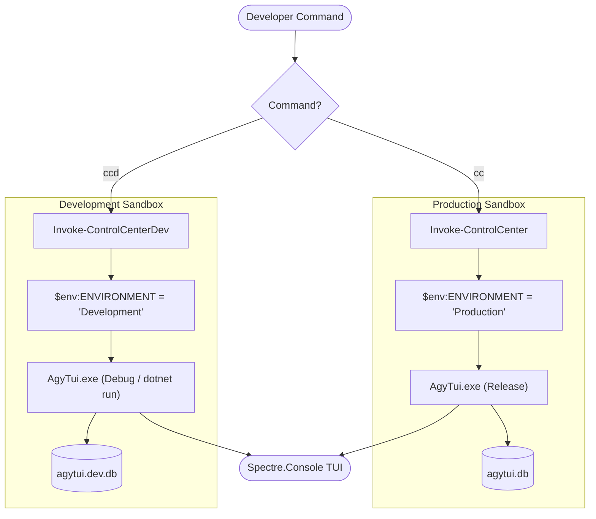

# 🛡️ Dual Environment Isolation Workflow (Dev vs. Production)

> **Category**: Developer Guide  
> **Subsystem**: Runtime Environment & Sandbox  
> **Date**: 2026-07-31  
> **Author**: Antigravity AI Engineering Team  
> **Status**: Active / Approved  

---

## Executive Summary
This document specifies the **Dual Environment Architecture** in `AgyTui`. It explains how local feature development, schema migrations, and test runs are completely isolated in a sandbox environment (`agytui.dev.db`) without risking production user data (`agytui.db`).

## Table of Contents
- [1. Environment Isolation Rationale](#1-environment-isolation-rationale)
- [2. Environment Matrix](#2-environment-matrix)
- [3. Runtime Environment Detection](#3-runtime-environment-detection)
- [4. Trigger Commands (`cc` vs `ccd`)](#4-trigger-commands-cc-vs-ccd)
- [5. Cross References](#5-cross-references)

---

## 1. Environment Isolation Rationale

To prevent developer testing, experimental DB migrations, or mock account generation from corrupting daily productivity data (study progress, tokens, registered project workspaces), `AgyTui` enforces environment isolation at the C# level.

---

## 2. Environment Matrix

| Dimension | Production Environment (`Production`) | Development Environment (`Development`) |
| :--- | :--- | :--- |
| **PowerShell Command** | `cc` | `ccd` |
| **Environment Variable** | `$env:ENVIRONMENT = "Production"` | `$env:ENVIRONMENT = "Development"` |
| **Target Binary** | `csapp/AgyTui/bin/Release/net9.0/AgyTui.exe` | `csapp/AgyTui/bin/Debug/net9.0/AgyTui.exe` |
| **SQLite DB File** | `%APPDATA%/AgyTui/agytui.db` | `%APPDATA%/AgyTui/agytui.dev.db` |
| **Config File** | `profile.config.json` | `profile.config.dev.json` |
| **Data Safety** | Protected Daily Production Data | Isolated Sandbox Wiped & Tested Freely |

---

## 3. Runtime Environment Detection

Environment detection is encapsulated in `EnvironmentProvider.cs` (`AgyTui.Infrastructure.Configuration`):

```csharp
public static class EnvironmentProvider
{
    public static bool IsDevelopment => string.Equals(
        Environment.GetEnvironmentVariable("ENVIRONMENT") ?? Environment.GetEnvironmentVariable("DOTNET_ENVIRONMENT"),
        "Development",
        StringComparison.OrdinalIgnoreCase);

    public static string DatabaseFileName => IsDevelopment ? "agytui.dev.db" : "agytui.db";
}
```

---

## 4. Trigger Commands (`cc` vs `ccd`)



---

## 5. Cross References
- [PowerShell Profile Shortcuts](file:///C:/Users/TruongNhon/Documents/Powershell/docs/02_user_guide/powershell_profile_shortcuts.md)
- [Testing & Architecture Rules](file:///C:/Users/TruongNhon/Documents/Powershell/docs/03_developer_guide/testing_and_architecture_rules.md)
