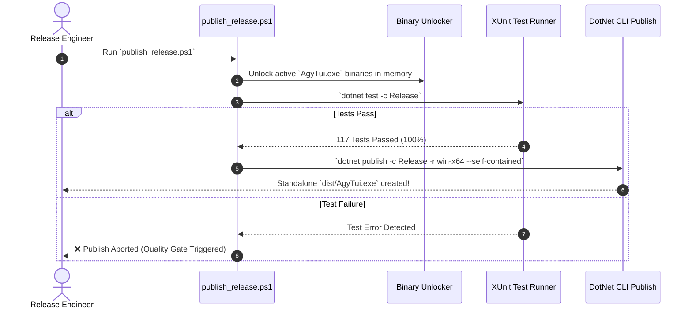

# 📦 Production Release Build & Deployment

> **Category**: Developer Guide  
> **Subsystem**: CI/CD & Production Build  
> **Date**: 2026-07-31  
> **Author**: Antigravity AI Engineering Team  
> **Status**: Active / Approved  

---

## Executive Summary
This document specifies the production release publishing pipeline for `AgyTui`. It details the automated build, binary unlocking, test gate validation, and single-file executable packaging performed by [psapp/scripts/publish_release.ps1](file:///C:/Users/TruongNhon/Documents/Powershell/psapp/scripts/publish_release.ps1).

## Table of Contents
- [1. Release Publish Pipeline Overview](#1-release-publish-pipeline-overview)
- [2. Automated Build Steps](#2-automated-build-steps)
- [3. Running the Release Publish Script](#3-running-the-release-publish-script)
- [4. Output Artifact Details](#4-output-artifact-details)
- [5. Cross References](#5-cross-references)

---

## 1. Release Publish Pipeline Overview



---

## 2. Automated Build Steps

1. **Binary Unlocking**: Temporarily renames locked DLLs/EXEs in active PowerShell processes to prevent MSB3021 file-locking errors.
2. **Automated Test Quality Gate**: Runs `dotnet test csapp/AgyTui.Tests/AgyTui.Tests.csproj -c Release`. Halts build on test failure.
3. **Single-File Compilation**: Publishes self-contained `win-x64` executable:
   ```powershell
   dotnet publish csapp/AgyTui/AgyTui.csproj -c Release -r win-x64 --self-contained true -p:PublishSingleFile=true -p:IncludeNativeLibrariesForSelfExtract=true -o csapp/AgyTui/dist
   ```

---

## 3. Running the Release Publish Script

To trigger a production release build:

```powershell
. "$HOME\Documents\Powershell\psapp\scripts\publish_release.ps1"
```

With an optional version tag:
```powershell
. "$HOME\Documents\Powershell\psapp\scripts\publish_release.ps1" -Version "v2.5.0"
```

---

## 4. Output Artifact Details

- **Output Path**: `csapp/AgyTui/dist/AgyTui.exe`
- **Format**: Self-contained single-file executable (includes .NET 9 runtime and SQLite native binaries).
- **Prerequisites on Target Machine**: Zero. Runs standalone on any Windows x64 machine.

---

## 5. Cross References
- [Automated Machine Setup Guide](file:///C:/Users/TruongNhon/Documents/Powershell/docs/02_user_guide/onboarding_and_setup.md)
- [Testing & Architecture Rules](file:///C:/Users/TruongNhon/Documents/Powershell/docs/03_developer_guide/testing_and_architecture_rules.md)
