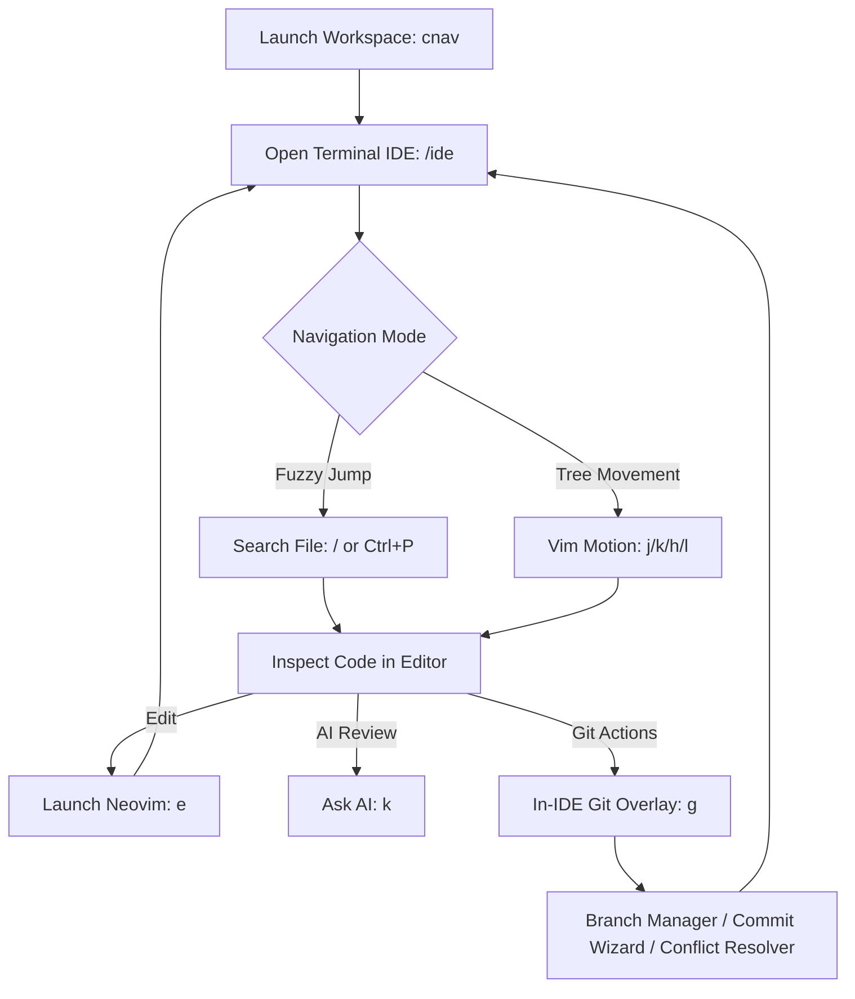

# 🚀 Linux & Neovim Terminal IDE Workflow Guide

This guide documents the keyboard-first, zero-latency modal workflow designed for developers using Linux, Neovim, Tmux, and terminal-first tools.

---

## 🎯 Design Philosophy

1. **Keyboard-First & Modal Efficiency**: Navigate, inspect, edit, and run Git/Dev commands without leaving your keyboard or reaching for a mouse.
2. **Zero-Latency In-Memory Caching**: Explorer trees, file lines, and Git state are cached in memory. Keypresses execute in `< 1ms` with zero screen flicker.
3. **Zero Repository Pollution**: IDE state and recently opened files are persisted centrally in an **SQLite Database** (`~/.gemini/antigravity-cli/agy_system.db`), keeping user source code directories 100% clean without untracked `.agy-context.md` files.

---

## ⌨️ Neovim & Linux Keybinding Reference

### 1. Terminal IDE Navigation (`/ide`)

| Action | Primary Hotkey | Vim Alternative | Description |
| :--- | :--- | :--- | :--- |
| **Move Up / Down** | `↑` / `↓` | `k` / `j` | Move selection line by line in Explorer or scroll Editor preview |
| **Page Up / Down** | `PageUp` / `PageDown` | — | Jump 10 lines in Explorer / 20 lines in Editor |
| **Expand / Collapse Folder** | `→` / `←` | `l` / `h` | Expand or collapse target folder in Explorer |
| **Open File / Toggle Folder** | `Enter` | `Enter` | Load file into editor pane or toggle directory expansion |
| **Focus Toggle** | `Tab` | `Tab` | Toggle focus between Explorer tree and Editor preview |
| **Fuzzy File Telescope** | `/` | `Ctrl+P` | Launch fast fuzzy search picker to jump to any file in workspace |
| **In-IDE Git Overlay** | `g` | `Ctrl+G` | Open popup TUI menu for status, diff, branches, commits, conflicts |
| **Edit File Externally** | `e` | `Ctrl+R` | Open current file in Neovim or default configured editor |
| **AI Assist & Code Review** | `k` | `Ctrl+K` | Pass current file content to AI agent for explanation or review |
| **Toggle Sidebar** | `b` | `Ctrl+B` | Hide/show Explorer sidebar for distraction-free full-width reading |
| **Exit IDE** | `Esc` / `q` | `q` | Return to PowerShell interactive Control Center |

---

## 🔄 Daily Development Flow (Step-by-Step)



### Step 1: Jump to Workspace
Use `/cnav` or `/proj` to hop to any registered project directory:
```powershell
cnav          # Open interactive workspace hopper
```

### Step 2: Open Terminal IDE
Launch the high-performance Terminal IDE:
```powershell
/ide          # Or 'ide'
```

### Step 3: Fast Navigation (`j`/`k`/`l`/`h` or `/`)
- Press `/` to bring up the **Telescope-style file finder**. Type a partial name to jump instantly.
- Use `j` and `k` to scroll through files; use `l` to expand folders and `h` to collapse them.

### Step 4: Edit Code (`e`)
- Press `e` on any selected file to open it in your configured editor (e.g. Neovim, Vim, VS Code).
- Save and close your editor to return directly to the TUI.

### Step 5: In-IDE Git Management (`g`)
- Press `g` inside the IDE to open the **In-IDE Git Overlay**:
  - 🌿 **Git Status & Diff**: View file changes or overall status.
  - 🌿 **Git Branch Manager (`/gbr`)**: Switch or create branches.
  - 💬 **Conventional Commit Wizard (`/gcmt`)**: Stage files and generate formatted commit messages.
  - 🔀 **Conflict Resolver (`/gconflict`)**: Inspect merge conflicts and accept ours/theirs.
  - 📦 **Stash Manager (`/gstash`)**: Save and apply stashes.
  - 🔄 **Rebase Wizard (`/grebase`)**: Rebase branches smoothly.

---

## 🗄️ Database & State Persistence

All workspace metadata is managed via SQLite:
- **Location**: `~/.gemini/antigravity-cli/agy_system.db`
- **Table**: `system_state`
- **Key Format**: `ide_last_file:<workspace_path>`

When you re-enter `/ide` in any workspace, your last active file is automatically restored without creating any temp files on disk.
