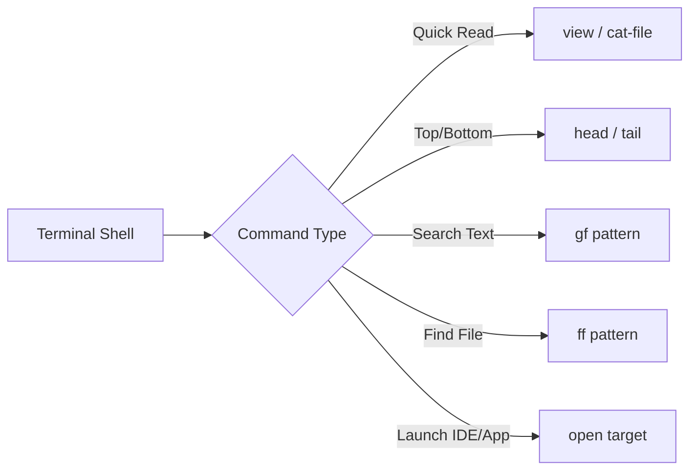

# 🐧 Linux CLI Workspace & File Inspection Flow

This document details the Linux-style CLI tools integrated into the PowerShell profile and AgyTui workspace engine for fast, terminal-native file viewing, opening, and text searching.

---

## 🛠️ Command Summary

| Command / Alias | Linux Equivalent | Description | Usage Example |
| :--- | :--- | :--- | :--- |
| **`view`** / **`cat-file`** | `cat` / `bat` | Quick formatted file viewer with line numbers & line counts | `view README.md` |
| **`open`** | `open` / `xdg-open` | Smart file/directory/URL launcher (opens in IDE or system app) | `open README.md` or `open https://google.com` |
| **`head`** | `head` | View the top $N$ lines of a file with line numbers | `head README.md -n 30` |
| **`tail`** | `tail` | View the bottom $N$ lines of a file | `tail build-release.ps1 -n 15` |
| **`ff`** | `find` | Fast recursive workspace file search | `ff *.cs` or `ff test` |
| **`gf`** | `grep` | Fast workspace text grep with file line references | `gf "CommandRouter"` |

---

## 💡 Workflow Integration



### 1. File Inspection (`view` / `cat-file`)
Instead of launching a full interactive IDE to read a short file, run `view`:
```powershell
view README.md
```

### 2. Fast Smart Opener (`open`)
`open` automatically detects the target type:
- If a text/code file (`.cs`, `.ps1`, `.md`, `.json`), opens in `TerminalIde` (`/ide`).
- If a folder, opens in Windows Explorer / terminal pane.
- If an `http/https` URL, opens in the system web browser.

```powershell
open README.md                     # Opens in Terminal IDE
open https://github.com/nhonvo     # Opens in default Browser
open C:\Users\TruongNhon           # Opens in File Explorer
```

### 3. Workspace File Search & Grep (`ff` & `gf`)
Quickly search for files or string definitions across your project:
```powershell
ff *.cs                            # Find C# files in workspace
gf "GetRequiredService"            # Search code text references
```
