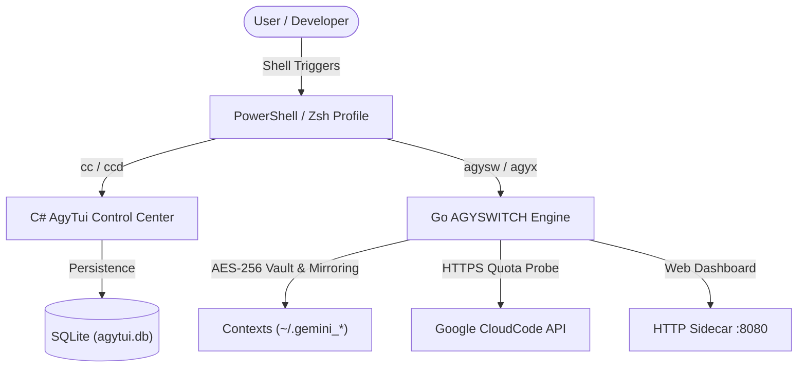

# 🛸 PowerShell Control Center & AGYSWITCH — Documentation Gateway

> **Category**: System Sitemap & Index  
> **Subsystem**: Centralized Documentation Suite  
> **Status**: Production / Active  

---

## Executive Summary
This document serves as the primary sitemap and entry point for the centralized documentation suite covering the **PowerShell Control Center (`AgyTui`)**, the **AGYSWITCH Go Engine (`agyswitch`)**, and **Cross-Platform Linux/WSL2 Integrations**.

---

## 1. System Topology Overview

---

## 2. Quick Navigation Sitemap

### 🏛️ 01. System Architecture
- [AGYSWITCH Go Engine Architecture](01_architecture/agyswitch_engine.md): Go v2.0 engine, multi-account context isolation, AES-256 vault encryption, quota probing, and subprocess launcher.
- [System Overview & File Tree](01_architecture/system_overview_and_file_tree.md): Repository topology and subsystem relationships.
- [Clean Architecture & Layer Boundaries](01_architecture/overview.md): C# Domain, Infrastructure, and UI layer separation rules.
- [DDD Bounded Contexts & Aggregate Roots](01_architecture/ddd_bounded_contexts.md): Account, Workspace, AI Agent, and Learn contexts.
- [SQLite Database Schemas & Persistence](01_architecture/database_persistence.md): Migrations V1-V7, SQLite schemas, and repositories.
- [MasterSeeder Data Ingestion Pipeline](01_architecture/seeding_pipeline.md): Automatic JSON-to-SQLite data seeding.

### 👤 02. User Guide
- [AGYSWITCH CLI & TUI Guide](02_user_guide/agyswitch_cli_tui.md): Interactive hotkeys, headless CLI commands, quota checking, and account switching.
- [Automated Fresh Machine Setup](02_user_guide/onboarding_and_setup.md): Windows environment setup via `Install-AgyEnvironment.ps1` and Linux/WSL via `setup-ubuntu.sh`.
- [PowerShell Profile Shortcuts & Aliases](02_user_guide/powershell_profile_shortcuts.md): Terminal navigation, Git helpers, and launcher aliases (`cc`, `cnav`, `agysw`, `proj`).
- [Spectre.Console TUI Screen Catalog](02_user_guide/tui_screen_catalog.md): C# interactive 3-pane dashboard layout and screens.

### 🛠️ 03. Developer Guide
- [Dual Environment Workflow](03_developer_guide/dual_environment_workflow.md): Isolated Dev sandbox (`agytui.dev.db`) vs. Production (`agytui.db`).
- [Testing & Quality Assurance](03_developer_guide/testing_and_architecture_rules.md): XUnit test suites, parity checks, and Pester tests.
- [Production Release Publishing](03_developer_guide/release_publishing.md): Standalone single-file binary compilation via `build-release.ps1`.

### 🚀 04. Command Enhancements
- [Git Enhancements](04_command_enhancements/01_git_enhancement.md)
- [Dotnet Enhancements](04_command_enhancements/02_dotnet_enhancement.md)
- [Docker Enhancements](04_command_enhancements/03_docker_enhancement.md)
- [AWS Enhancements](04_command_enhancements/04_aws_enhancement.md)
- [Linux Neovim IDE](04_command_enhancements/05_linux_neovim_ide_flow.md)
- [Linux CLI Tools](04_command_enhancements/06_linux_cli_tools.md)

### 🗄️ Archive
- [Archived Sprint Plans & Legacy Reports](archive/): Historical task plans, mockup blueprints, and interim audit reports preserved for auditability.

---

## 3. Technology Stack & Engines

| Subsystem | Technology | Purpose |
| :--- | :--- | :--- |
| **Shell Integration** | PowerShell 7+ & Zsh | Daily shell prompt, aliases, cross-platform shortcuts |
| **Account Switcher** | Go 1.23+ (`agyswitch`) | High-speed multi-account switching, AES-256 keyring, live quota probing |
| **Control Center** | .NET 9.0 (`AgyTui`) | Rich 3-pane terminal UI (Spectre.Console) for workspace & agent management |
| **Persistence** | SQLite & AES-256 Files | Keyring token storage, workspace metadata, and session caches |
