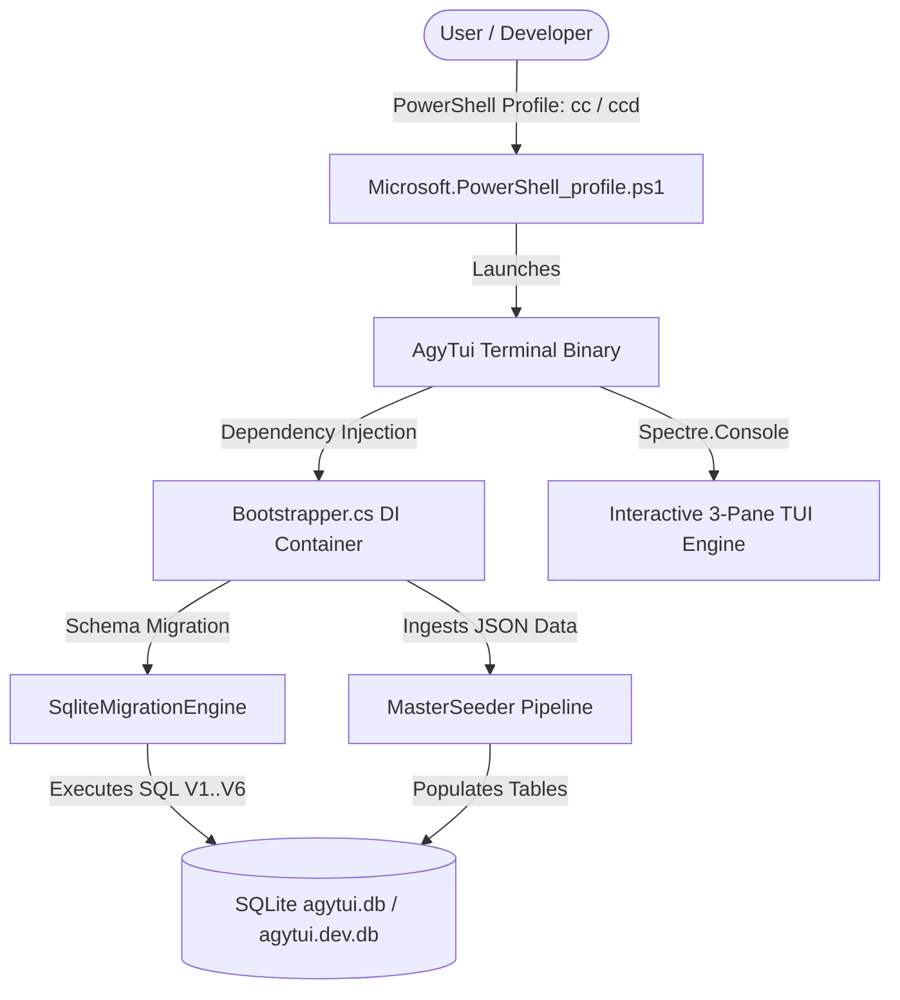

# 🛸 PowerShell Control Center (`AgyTui`) — Documentation Gateway

> **Category**: System Sitemap & Index  
> **Subsystem**: Core Documentation Suite  
> **Date**: 2026-07-31  
> **Author**: Antigravity AI Engineering Team  
> **Status**: Completed / Active  

---

## Executive Summary
This document serves as the primary sitemap and entry point for the **PowerShell Control Center (`AgyTui`)** documentation suite. It provides a visual overview of system architecture, technology stack, directory layout, and quick navigation links to all technical specifications.

## Table of Contents
- [1. System Topology Overview](#1-system-topology-overview)
- [2. Quick Navigation Sitemap](#2-quick-navigation-sitemap)
- [3. Technology Stack & Prerequisites](#3-technology-stack--prerequisites)
- [4. Repository Directory Structure](#4-repository-directory-structure)

---

## 1. System Topology Overview



---

## 2. Quick Navigation Sitemap

### 🏛️ 01. System Architecture
- [System Overview, File Tree & Feature Blueprint](01_architecture/system_overview_and_file_tree.md): Complete repository tree, component topology, and annotated feature blueprint.
- [Clean Architecture & Layer Boundaries](01_architecture/overview.md): Layer rules, DIP, and `Bootstrapper` DI container setup.
- [DDD Bounded Contexts & Aggregate Roots](01_architecture/ddd_bounded_contexts.md): Account, Workspace, AI Agent, and Learning contexts.
- [SQLite Database Schemas & Persistence](01_architecture/database_persistence.md): Migrations V1-V7, ERD diagram, and SqliteRepositoryBase.
- [MasterSeeder Data Ingestion Pipeline](01_architecture/seeding_pipeline.md): Automatic JSON-to-SQLite data seeding.

### 👤 02. User Guide
- [Automated Machine Setup & Onboarding](02_user_guide/onboarding_and_setup.md): Setup via `Install-AgyEnvironment.ps1`.
- [PowerShell Commands & Profile Shortcuts](02_user_guide/powershell_profile_shortcuts.md): `cc`, `ccd`, `cnav`, `proj`, `reset-agy`.
- [Spectre.Console TUI Screen Catalog](02_user_guide/tui_screen_catalog.md): Interactive screens, hotkeys, and navigation.

### 🛠️ 03. Developer Guide
- [Dual Environment Workflow (Dev vs. Stable)](03_developer_guide/dual_environment_workflow.md): Isolated sandbox testing flow.
- [Testing & Architecture Rules](03_developer_guide/testing_and_architecture_rules.md): 117 XUnit tests and reflection rules.
- [Production Release Publishing](03_developer_guide/release_publishing.md): Standalone build script `publish_release.ps1`.

---

## 3. Technology Stack & Prerequisites

- **Core Framework**: .NET 9.0 (C# 13)
- **Persistence Engine**: SQLite (`Microsoft.Data.Sqlite`) with automatic migration engine.
- **UI Framework**: Spectre.Console (ANSI 256-color terminal widgets & reactive 3-pane layout).
- **Shell Integration**: PowerShell 7+ (`Microsoft.PowerShell_profile.ps1`).

---

## 4. Repository Directory Structure

```text
Powershell/
├── Microsoft.PowerShell_profile.ps1          # Main PowerShell Profile Integrator
├── csapp/
│   ├── AgyTui/                               # Core Application Source Code (.NET 9)
│   │   ├── Domain/                           # Pure DDD Domain Bounded Contexts
│   │   ├── Infrastructure/                   # Technical Adapters, Repositories, DI & Seeding
│   │   ├── UI/                               # Spectre.Console Screen Views & Command Handlers
│   │   └── data/                             # SQLite DBs, Learning Assets & Skill Templates
│   └── AgyTui.Tests/                         # Comprehensive XUnit Test Suite
├── psapp/
│   └── scripts/                              # Onboarding & Production Release Scripts
└── docs/                                     # Master Documentation Suite
```
