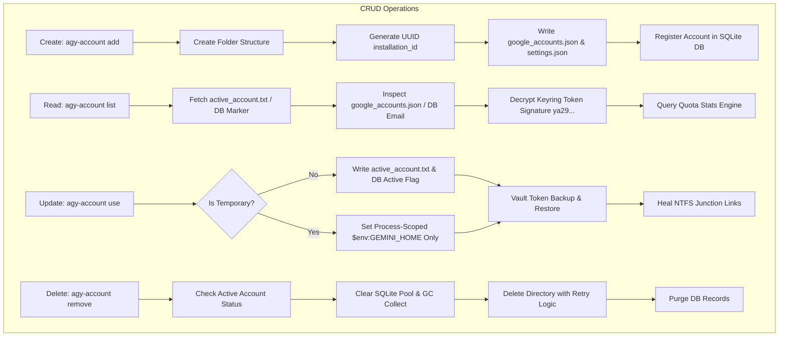
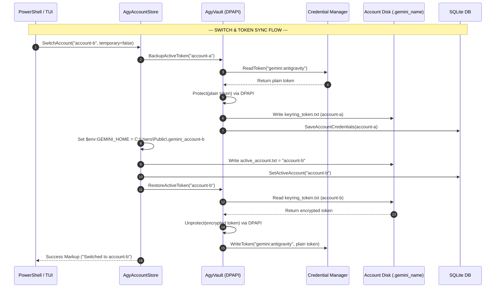
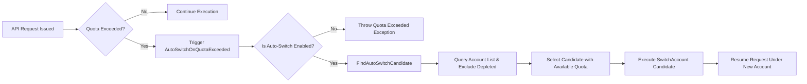

# 🚀 AGY Switch (Multi-Account Manager) & Synchronization Flow Documentation

This document provides a comprehensive technical breakdown of the **AGY Switch** (`agy-account` / `AgyAccountStore`) system, detailing its **CRUD operations**, **account switching mechanisms**, and **synchronization workflows** (Token Sync, Junction Link Healing, Quota Auto-Switch, and Workspace Sync).

---

## 📌 1. Architectural Overview

The **AGY Switch Engine** manages multi-account isolation for the Antigravity CLI (`agy`) by dynamically scoping environment paths and managing token vault secrets.

```
                           +-------------------------------------+
                           |   PowerShell / TUI Shell Context    |
                           +-------------------------------------+
                                              |
                     +------------------------+------------------------+
                     |                                                 |
         +-----------------------+                         +-----------------------+
         |  Environment Scoping  |                         | Secret Vault Syncing  |
         | ($env:GEMINI_HOME)    |                         | (Windows Credential)  |
         +-----------------------+                         +-----------------------+
                     |                                                 |
  +------------------+------------------+           +------------------+------------------+
  |                                     |           |                                     |
  v                                     v           v                                     v
+-------------------------------+ +-------------+ +-------------------------------+ +-------------+
| Account Directory 1           | | Shared      | | Keyring Token (DPAPI)         | | SQLite DB   |
| C:\Users\Public\.gemini_acc1  | | Links       | | DPAPI -> keyring_token.txt    | | Account   |
|  ├── google_accounts.json     | | (Junction)  | | target -> gemini:antigravity | | Metadata  |
|  ├── installation_id          | | config/     | +-------------------------------+ +-------------+
|  ├── settings.json            | | antigravity/|
|  └── keyring_token.txt        | +-------------+
+-------------------------------+
```

### Key Components
* **`GEMINI_HOME`**: Scoped process/user environment variable pointing to `C:\Users\Public\.gemini_<account_name>` (or `~/.gemini/accounts/<name>`).
* **`active_account.txt`**: Located in `~/.gemini/active_account.txt`, tracks the currently active persistent account across shell reboots.
* **`AgyAccountStore`**: C# service managing disk directories, configuration state, and account aggregates.
* **`AgyVault`**: Cryptographic service wrapping **DPAPI** (`ProtectedData.Protect`) to backup and restore tokens to/from Windows Credential Manager (`gemini:antigravity`).
* **`SqliteAgyAccountRepository`**: SQLite database persistence tracking account metadata, token credentials, and quota usage statistics.

---

## 🔄 2. Account CRUD Flow



### Detailed Breakdown

#### 🟢 1. Create Operation (`Add Account`)
* **Trigger**: `agy-account add '<account-name>'` or `IAgyAccountStore.AddAccount(name)`
* **Steps**:
  1. **Validation**: Checks that name is non-empty and not reserved (`default`).
  2. **Directory Setup**: Initializes directory at `C:\Users\Public\.gemini_<account-name>`.
  3. **Subfolder Creation**: Creates subdirectories for `antigravity`, `antigravity-cli`, `config`, `history`, `antigravity-ide`, `wf`, and `learn`.
  4. **GUID Generation**: Generates a new `UUIDv4` string and writes to `installation_id`.
  5. **Config Files**:
     * Writes `google_accounts.json` with user email (`<name>@gmail.com` or custom specified email).
     * Writes `antigravity-cli/settings.json`.
  6. **DB Registration**: Persists account metadata and initial credentials into SQLite database (`SqliteAgyAccountRepository`).
  7. **Cache Clearance**: Clears quota engine statistics cache.

#### 🟦 2. Read Operation (`List & Inspect Accounts`)
* **Trigger**: `agy-account list` or `IAgyAccountStore.GetAccountAggregate(name)`
* **Steps**:
  1. **Active Determination**: Reads `~/.gemini/active_account.txt` and compares against target account name.
  2. **Email Extraction**: Parses `google_accounts.json` or queries `AccountCredentials.Email` from SQLite DB.
  3. **Signature Decoding**:
     * Reads `keyring_token.txt` or Windows Credential Manager entry `gemini:antigravity`.
     * Decrypts DPAPI payload using `AgyVault.Unprotect()`.
     * Formats token preview string (e.g. `ya29..x8z` or `AIza..9ab`).
  4. **Quota Aggregation**: Calculates request counts, remaining quota percentage, and quota status flags (`Normal`, `Warning`, `Exceeded`).

#### 🟨 3. Update Operation (`Switch Context / Token Refresh`)
* **Trigger**: `agy-account use '<account-name>' [-Temporary]` or `IAgyAccountStore.SwitchAccount(name, temporary)`
* **Steps**:
  1. **Clear Quota Cache**: Flushes `AgyQuotaEngine` stats cache.
  2. **Backup Active Account Token**: Calls `AgyVault.BackupActiveToken(oldActive)`:
     * Reads active credential token from Windows Credential Manager (`gemini:antigravity`).
     * Encrypts token with DPAPI (`ProtectedData.Protect`).
     * Writes encrypted token to `keyring_token.txt` inside old account directory.
     * Updates SQLite database `AccountCredentials`.
  3. **Environment Switch**: Sets `$env:GEMINI_HOME` to target account directory for process and User environment scope.
  4. **Persistence Update** *(if NOT temporary)*:
     * Writes target account name into `~/.gemini/active_account.txt`.
     * Updates active account marker in SQLite DB.
  5. **Restore Target Account Token**: Calls `AgyVault.RestoreActiveToken(targetAccount)`:
     * Reads `keyring_token.txt` from target account directory.
     * Decrypts DPAPI payload.
     * Writes token into Windows Credential Manager (`gemini:antigravity`).
  6. **Junction Link Healing**: Re-links shared folders (`config`, `antigravity`).

#### 🟥 4. Delete Operation (`Remove Account`)
* **Trigger**: `agy-account remove '<account-name>'` or `IAgyAccountStore.DeleteAccount(name)`
* **Steps**:
  1. **Active Check**: Prevents direct deletion of currently active account without explicit fallback.
  2. **Connection Pool Cleanup**: Executes `SqliteConnection.ClearAllPools()`, triggers Garbage Collector to release locked file handles.
  3. **Directory Retry Purge**: Executes `DeleteDirectoryWithRetry()` (up to 5 retries with attribute normalization) to remove account directory.
  4. **Database Purge**: Deletes account metadata and credential records from SQLite database.

---

## ⚡ 3. Synchronization Flows (`Flow Sync`)



### 1. Keyring & DPAPI Token Sync (`AgyVault` Sync)
The **Token Sync Engine** ensures that switching accounts seamlessly swaps credentials in Windows Credential Manager without requiring user re-authentication.

* **Backup Mechanism**:
  `Windows Credential Manager ("gemini:antigravity")` $\rightarrow$ `DPAPI Protect` $\rightarrow$ `keyring_token.txt` $\rightarrow$ `SQLite DB`
* **Restoration Mechanism**:
  `keyring_token.txt` $\rightarrow$ `DPAPI Unprotect` $\rightarrow$ `Windows Credential Manager ("gemini:antigravity")`

---

### 2. Junction Link Self-Healing Sync Flow
To prevent duplication of custom skills, prompt templates, and conversation history across isolated accounts, AGY uses Windows **NTFS Junction Links**.

```
Global Primary Directory (~/.gemini/)
 ├── config/       <=== (NTFS Junction Link) === C:\Users\Public\.gemini_acc1\config\
 └── antigravity/  <=== (NTFS Junction Link) === C:\Users\Public\.gemini_acc1\antigravity\
```

* **Self-Healing Trigger**: Runs automatically upon shell boot and account switch.
* **Healing Process**:
  1. Checks if target account directory contains symlink/junction for `config` and `antigravity`.
  2. If missing or pointing to invalid path, creates/re-establishes NTFS junction link back to `~/.gemini/config` and `~/.gemini/antigravity`.

---

### 3. Quota Engine & Auto-Switch Sync Flow (`AgyQuotaEngine`)



* **Cache Synchronization**: `AgyQuotaEngine.ClearStatsCache()` invalidates in-memory quota tracking upon context modification.
* **Auto-Switch Trigger**: When active account receives HTTP 429 / Quota Limit response, `AutoSwitchOnQuotaExceeded()` executes:
  1. Validates `auto_switch_enabled.txt` setting.
  2. Invokes `FindAutoSwitchCandidate()` to find next candidate account with valid remaining quota.
  3. Seamlessly calls `SwitchAccount(candidate)` to perform automated failover.

---

### 4. Workspace & Vault Sync Flows (TUI Integrations)

#### A. Obsidian Vault Sync (`obsidian` / `ObsidianClient.cs`)
* **Vault Scanning**: Recursively indexes markdown notes (`learn/` or external Obsidian vault).
* **Daily Note Appender**: Syncs completed flashcards, algorithm study sessions, and summary notes into daily note format (`YYYY-MM-DD.md`).
* **Deck Pipeline**: Ingests `.md` files into SM-2 spaced repetition study decks.

#### B. Multi-Repo Git Nexus Sync (`gbr` / `GitNexus`)
* **Multi-Repo Live Sync**: Scans workspace repositories in parallel.
* **Status Monitor**: Synchronizes current branch, dirty state file counts, unpushed commits, and ahead/behind remote status across all repos simultaneously.

---

## 📊 Summary Table: Command & API Parity

| Action | PowerShell Alias / Command | C# API (`IAgyAccountStore`) | Primary Output / Persistence |
| :--- | :--- | :--- | :--- |
| **Interactive TUI** | `agy-acc` / `agy-m` | `AgyTuiApp` GUI Launcher | Spectre Interactive Terminal |
| **List Accounts** | `agy-account list` | `GetAccountAggregate()` | Output Console / SQLite Query |
| **Persistent Switch** | `agy-account use <name>` | `SwitchAccount(name, false)` | `active_account.txt` + DPAPI + DB |
| **Temporary Switch** | `agy-account use <name> -Temp` | `SwitchAccount(name, true)` | `$env:GEMINI_HOME` (Process only) |
| **Add Account** | `agy-account add <name>` | `AddAccount(name)` | `.gemini_<name>/` + SQLite DB |
| **Remove Account** | `agy-account remove <name>` | `DeleteAccount(name)` | Directory Purge + DB Record Delete |
| **Auto-Switch Failover** | Automatic on 429 Quota | `AutoSwitchOnQuotaExceeded()` | Context Failover Swap |
