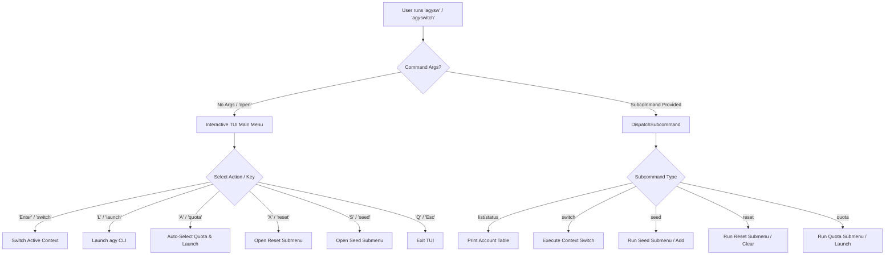
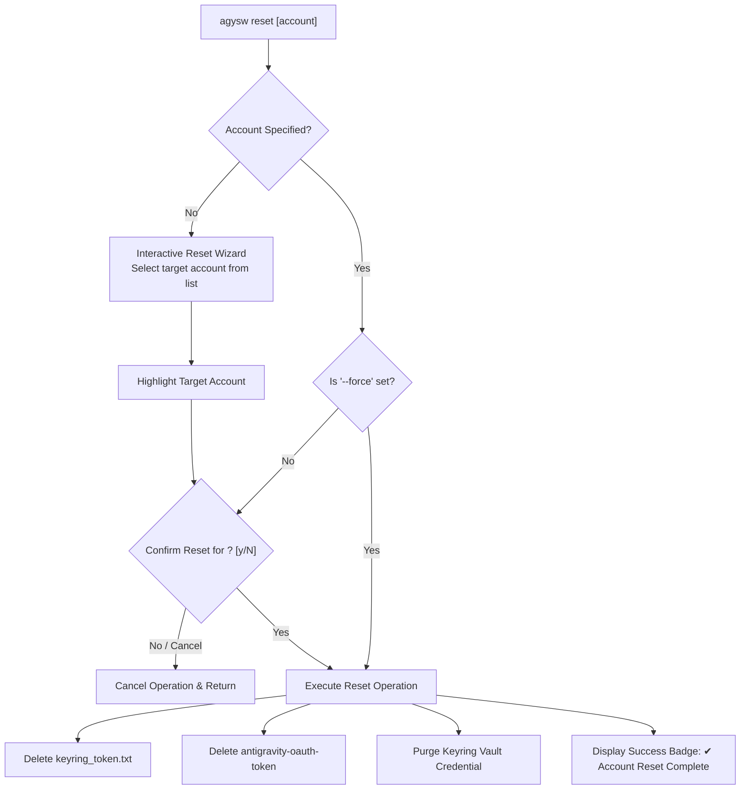

# 🛸 AGYSWITCH CLI — Unified CLI-Only Flow & Submenu Blueprint

> **Architectural Plan & Specifications**: Complete CLI-only menu hierarchy, subcommand structure, interactive flowcharts, and submenu designs for `agysw` / `agyswitch` (Go Engine v1.4.0 proposal).

---

## 📋 Table of Contents
1. [Design Principles & Vision](#1-design-principles--vision)
2. [Master CLI Command Hierarchy (`agysw` Sitemap)](#2-master-cli-command-hierarchy-agysw-sitemap)
3. [Interactive CLI Navigation & Flowcharts](#3-interactive-cli-navigation--flowcharts)
4. [Submenu Specifications](#4-submenu-specifications)
   - [4.1 Main Entry & Interactive Menu (`agysw open`)](#41-main-entry--interactive-menu-agysw-open)
   - [4.2 Account Listing & Quick Inspection (`agysw list`)](#42-account-listing--quick-inspection-agysw-list)
   - [4.3 Account Seeding & Discovery (`agysw seed`)](#43-account-seeding--discovery-agysw-seed)
   - [4.4 Account Reset Submenu (`agysw reset`)](#44-account-reset-submenu-agysw-reset)
   - [4.5 Quota Engine Submenu (`agysw quota`)](#45-quota-engine-submenu-agysw-quota)
5. [Interactive Terminal UI Mockups](#5-interactive-terminal-ui-mockups)
6. [Shell Integration & Alias Blueprint](#6-shell-integration--alias-blueprint)
7. [Implementation & Verification Plan](#7-implementation--verification-plan)

---

## 1. Design Principles & Vision

The `agysw` / `agyswitch` CLI tool is designed around a **100% CLI-First Architecture**. Whether invoked interactively in a terminal UI (TUI) or scriptably in CI/CD automation pipelines, `agysw` provides zero-latency context switching for Google Antigravity (`agy`).

### Core Design Principles:
1. **Dual-Mode Parity**: Every action achievable via the interactive menu is accessible via non-interactive subcommands and flags.
2. **Modular Submenu Hierarchy**: Complex workflows (e.g., Account Reset, Quota Management, Account Seeding) are grouped into intuitive submenus.
3. **Fail-Safe Operation**: High-impact actions (e.g., clearing credentials or resetting accounts) enforce explicit interactive confirmations or `--force` flags.
4. **Instant Visual Feedback**: Clean ANSI colors, Unicode badges, and clear status indicators throughout the terminal interface.

---

## 2. Master CLI Command Hierarchy (`agysw` Sitemap)

```text
agysw (or agyswitch)
 ├── [default] / open       --> Interactive TUI Launcher & Main Menu
 ├── list / ls              --> List all accounts, emails, status & token signatures
 ├── status                 --> Quick overview of active account & system status
 ├── switch <account>       --> Switch active context to target account
 ├── launch <account>       --> Switch context and launch `agy` CLI immediately
 ├── seed                   --> Add / discover / import new account contexts
 │    ├── list              --> Show undiscovered Google accounts
 │    ├── auto              --> Auto-discover accounts from ~/.config or environment
 │    └── add <name> <email>--> Manually register a new account context
 ├── reset                  --> Account Reset Submenu
 │    ├── [interactive]     --> Open interactive reset wizard
 │    ├── account <name>    --> Clear OAuth tokens & keyring for specific account
 │    ├── tokens-only       --> Wipe only token files, keep active context
 │    └── all               --> Emergency wipe of all stored account tokens
 ├── quota                  --> Quota Engine Submenu
 │    ├── [interactive]     --> View interactive quota dashboard
 │    ├── status            --> Check quota health across all accounts
 │    ├── select            --> Print recommended account with healthy quota
 │    ├── launch            --> Auto-select best quota account & launch `agy`
 │    └── refresh           --> Force re-probe quota status endpoints
 └── config                 --> Display or modify agyswitch configuration settings
```

---

## 3. Interactive CLI Navigation & Flowcharts

### 3.1 Master CLI Navigation Flow


### 3.2 Account Reset Submenu Flow


---

## 4. Submenu Specifications

### 4.1 Main Entry & Interactive Menu (`agysw open` / `agysw`)
- **Purpose**: Interactive full-screen terminal dashboard.
- **Key Features**:
  - Displays active account header and token signatures.
  - Interactive search bar triggered via `/`.
  - Quick-switch navigation keys.

### 4.2 Account Listing & Quick Inspection (`agysw list`)
- **Purpose**: Output structured tabular or JSON list of registered accounts.
- **Flags**:
  - `--json`: Output full raw JSON data for shell scripting.
  - `--active-only`: Output name of current active account only.

### 4.3 Account Seeding & Discovery (`agysw seed`)
- **Purpose**: Discover, add, or import Google account contexts.
- **Subcommands**:
  - `agysw seed auto`: Scans local system (`google_accounts.json`, Chrome profiles, environment) for undiscovered accounts and creates `~/.gemini_<name>` directories.
  - `agysw seed add <accountName> <email>`: Manually register a new account context.
  - `agysw seed remove <accountName>`: Unregister an account context from list.

### 4.4 Account Reset Submenu (`agysw reset`)
- **Purpose**: Selectively or globally purge stored OAuth tokens and keyring credentials without losing account structure or settings.
- **Subcommands**:
  - `agysw reset` (Interactive mode): Shows menu listing all accounts with token statuses; pick account to reset.
  - `agysw reset <accountName>`: Resets tokens for specified account.
  - `agysw reset --active`: Resets currently active account.
  - `agysw reset --all`: Wipes tokens across all accounts (requires confirmation).
- **Behavior**:
  - Preserves `google_accounts.json` and `settings.json`.
  - Clears `keyring_token.txt` and system keyring entries (`gemini:antigravity`).
  - Next launch under this account will prompt for clean `agy login`.

### 4.5 Quota Engine Submenu (`agysw quota`)
- **Purpose**: Manage and inspect account quota states, preventing rate limit lockouts.
- **Subcommands**:
  - `agysw quota` / `agysw quota status`: Display quota health table across all accounts (`[✔ Quota OK]`, `[✘ Quota Exhausted]`, `[? Unknown]`).
  - `agysw quota select`: Evaluates active accounts and prints recommended account handle.
  - `agysw quota launch` / `agysw launch-quota`: Auto-switches to best quota account and immediately launches `agy`.
  - `agysw quota refresh`: Force re-fetches token validity and quota headers.

---

## 5. Interactive Terminal UI Mockups

### 5.1 Main Interactive TUI (`agysw open`)
```text
🛸 AGYSWITCH CLI v1.4.0 — Multi-Account Context Vault
──────────────────────────────────────────────────────────────────────────────────
 Active Account Context: [ vothuongtruongnhon2002 ]

  Index  Account Handle         Email Address                  Token Status         Quota Health
 ──────────────────────────────────────────────────────────────────────────────────
  ● [1]  vothuongtruongnhon2002 vothuongtruongnhon2002@gmail.com (✔ Logged In)       [✔ Quota OK]
    [2]  fptvttnhon2020         fptvttnhon2020@gmail.com         (✔ Logged In)       [✔ Quota OK]
    [3]  fptvttnhon2026         fptvttnhon2026@gmail.com         (✘ Logged Out)      [✘ Logged Out]
    [4]  nhontruongvo           nhontruongvo@gmail.com           (✘ Logged Out)      [✘ Logged Out]
──────────────────────────────────────────────────────────────────────────────────
 Navigation: [↑/↓] Move │ [Enter] Switch │ [L] Launch │ [A] Quota Launch │ [X] Reset │ [S] Seed │ [Q] Quit
 Command Prompt: Type '/' to filter accounts...
```

### 5.2 Interactive Reset Submenu (`agysw reset`)
```text
🧹 AGYSWITCH — Account Reset Wizard
──────────────────────────────────────────────────────────────────────────────────
 Select an account to clear OAuth tokens and keyring credentials:

   1. vothuongtruongnhon2002 (Active - Token Present)
   2. fptvttnhon2020         (Token Present)
   3. fptvttnhon2026         (No Token Found)
   4. [Reset All Accounts]   (Wipe all cached tokens)
   5. [Cancel & Return]

 ─────── CONFIRMATION PROMPT ──────────────────────────────────────────────────────
 Reset tokens for account 'fptvttnhon2020'? (This will require re-running 'agy login')
 [y/N]: _
```

### 5.3 Interactive Quota Dashboard (`agysw quota`)
```text
📊 AGYSWITCH — Quota Engine Dashboard
──────────────────────────────────────────────────────────────────────────────────
 Account Name           Status       Last Verified        Recommendation
 ──────────────────────────────────────────────────────────────────────────────────
 vothuongtruongnhon2002 [✔ OK]       2 mins ago           ● Active Context (Primary)
 fptvttnhon2020         [✔ OK]       5 mins ago           ○ Available Fallback
 fptvttnhon2026         [✘ Expired]  10 mins ago          × Needs Re-login
 nhontruongvo           [✘ Expired]  1 hour ago           × Needs Re-login
──────────────────────────────────────────────────────────────────────────────────
 Quick Action: Press [Space] to launch 'agy' under recommended account [vothuongtruongnhon2002].
```

---

## 6. Shell Integration & Alias Blueprint

To ensure seamless CLI-only ergonomics across shells, add the following shortcut aliases:

### 6.1 Zsh / Bash Profile (`~/.zshrc`)
```zsh
# Agyswitch Master CLI Route
export PATH="$HOME/.local/bin:$PATH"

alias agysw="agyswitch"
alias agys="agyswitch"

# Fast Subcommand Shortcuts
alias agys-open="agyswitch open"
alias agys-ls="agyswitch list"
alias agys-seed="agyswitch seed auto"
alias agys-reset="agyswitch reset"
alias agys-quota="agyswitch launch-quota"
```

### 6.2 PowerShell Profile (`$PROFILE`)
```powershell
$AGYSWITCH_BIN = "$HOME\projects\powershell-profile\agyswitch.exe"

function agysw { & $AGYSWITCH_BIN @args }
Set-Alias -Name agys -Value agysw -Option AllScope
Set-Alias -Name agys-quota -Value "agysw launch-quota"
```

---

## 7. Implementation & Verification Plan

### Phase 1: Core Subcommand Router Refactoring (`main.go`)
- Expand CLI flag parser in `agyswitch-go/main.go` to support nested subcommands (`seed`, `reset`, `quota`).

### Phase 2: Submenu Package Modularization
- Create `agyswitch-go/cmd/reset.go` for interactive and non-interactive account reset options.
- Create `agyswitch-go/cmd/seed.go` for account discovery and seeding.
- Create `agyswitch-go/cmd/quota.go` for quota probing and selection.

### Phase 3: Interactive TUI Menu Integration (`tui/tui.go`)
- Integrate submenus directly into TUI hotkey dispatchers (`X` for reset wizard, `S` for seed wizard, `A` for quota auto-launch).

### Phase 4: Test Suite Verification
- Extend Go unit tests in `agyswitch-go/store/store_test.go` and `agyswitch-go/main_test.go`.
- Run cross-platform verification in WSL and Windows PowerShell.

---
*Plan proposed for `agyswitch-go` v1.4.0*.
