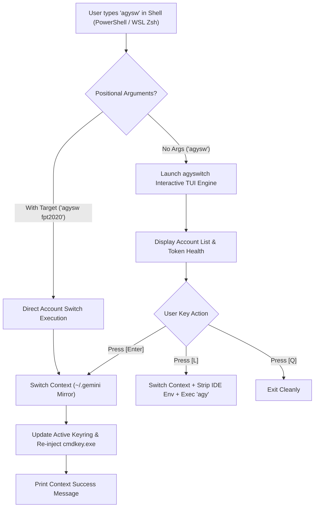

# AGYSWITCH Go Engine TUI Enhancement Plan & Shell Integration

> **Document Status**: Active Blueprint  
> **Target Package**: `agyswitch-go`  
> **Integrations**: Windows PowerShell (`Microsoft.PowerShell_profile.ps1`) & WSL Zsh/Bash (`linux/posh-profile.zsh`)

---

## 1. Overview & Core Directives

The `agyswitch-go` engine is the single source of truth for **100% credential-isolated multi-account management** across Google Antigravity / Gemini accounts.

### Core Architecture Rule
Executing any account shortcut (`agysw`, `agyswitch`, `agyx`, `agy-account`) **solely triggers and opens the Go `agyswitch` binary**. All legacy routing through C# Control Center (`cc`) or shell script logic is completely unhooked.

---

## 2. Interactive TUI Blueprint (Bullet List UI Features)

When launched without positional arguments (`agysw`), `agyswitch` opens an interactive, lightweight Terminal User Interface (TUI).

- **Header Banner**:
  - Compact ANSI art badge showing engine version (`AGYSWITCH v1.2.0 (Go)`).
  - Active account status summary header line.

- **Interactive Account Selector**:
  - `↑ / ↓` or `j / k` navigation across registered accounts (`1-5`).
  - Quick-jump hotkeys: Pressing `1` to `5` instantly highlights that account.
  - Active indicator (`● Active`) highlighted in vibrant Green.
  - Inactive accounts indicated with bullet space (` `).

- **Token Health & Credential Badges**:
  - **Logged In Badge**: `✔ Logged In · Key: ya29..<middle_sig>` (Vibrant Green & Cyan).
  - **Logged Out Badge**: `✘ Logged Out` (Yellow / Gray).
  - **Isolated Storage Path**: Shows mapped folder (`~/.gemini_<account>`).

- **Interactive Action Footer**:
  - `[Enter]` Switch active context to highlighted account.
  - `[L]` Switch active context AND launch `agy` CLI immediately.
  - `[R]` Refresh token status & check quota keyring validity.
  - `[Q / Esc]` Clean exit back to shell.

- **Non-Interactive CLI Mode (Fast Execution)**:
  - `agysw status` — Render instantaneous terminal summary table.
  - `agysw <account_name>` — Switch context directly without opening TUI.
  - `agysw switch <account_name>` — Explicit switch command.

---

## 3. Flow of Use



### Detailed Workflow Steps

1. **Trigger Phase**:
   - User types `agysw` in PowerShell or WSL terminal.
   - Shell alias routes directly to binary (`~/.local/bin/agyswitch` or `agyswitch.exe`).

2. **Isolation & Verification Phase**:
   - `agyswitch` reads active directory `~/.gemini/active_account.txt`.
   - Vault checks each registered account folder (`.gemini_fptvttnhon2020`, `.gemini_nhontruongvo`, etc.).
   - Extracts unique middle token signature (`GetShortSignature`).

3. **Interactive Selection / Launch Phase**:
   - User highlights desired account and hits `[Enter]` or `[L]`.
   - Pre-switch backup saves active context state to prevent token cross-contamination.
   - Target account credentials are 1-to-1 mirrored to active `~/.gemini` context.
   - OS keyring (`cmdkey.exe`) is updated for host transparency.
   - If `[L]` was selected, launcher strips IDE environment variables (`GEMINI_CLI_IDE_AUTH_TOKEN`, `GEMINI_CLI_IDE_SERVER_PORT`, `ANTIGRAVITY_IDE_SERVER_PORT`) and executes `agy` CLI seamlessly.

---

## 4. Shell Integration (.ps1 & .sh / .zsh)

### Windows PowerShell (`Microsoft.PowerShell_profile.ps1`)

```powershell
# Directly route all account management shortcuts to agyswitch Go binary
function Invoke-AgyAccount {
    param(
        [Parameter(Position=0)][string]$SubCommand,
        [Parameter(Position=1)][string]$TargetAccount
    )
    if (Get-Command agyswitch -ErrorAction SilentlyContinue) {
        if (-not $SubCommand) { & agyswitch; return }
        switch ($SubCommand.ToLowerInvariant()) {
            "use"    { if ($TargetAccount) { & agyswitch switch $TargetAccount } else { & agyswitch } }
            "list"   { & agyswitch status }
            "ls"     { & agyswitch status }
            "status" { & agyswitch status }
            default  { if ($TargetAccount) { & agyswitch $SubCommand $TargetAccount } else { & agyswitch $SubCommand } }
        }
        return
    }
    if (Get-Command wsl -ErrorAction SilentlyContinue) {
        $wslCmd = "agyswitch"
        if ($SubCommand) { $wslCmd += " $SubCommand" }
        if ($TargetAccount) { $wslCmd += " $TargetAccount" }
        wsl bash -c "$wslCmd"
        return
    }
}

Set-Alias -Name agyswitch -Value Invoke-AgyAccount -Force
Set-Alias -Name agysw -Value Invoke-AgyAccount -Force
Set-Alias -Name agyx -Value Invoke-AgyAccount -Force
Set-Alias -Name agy-account -Value Invoke-AgyAccount -Force
```

### WSL Zsh / Bash (`linux/posh-profile.zsh`)

```zsh
# Primary Go binary symlinked in user PATH (~/.local/bin/agyswitch)
alias agy-account="agyswitch"
alias agyswitch="agyswitch"
alias agysw="agyswitch"
alias agyx="agyswitch"
alias agy="agyswitch"
```

---

## 5. Next Implementation Tasks

- [x] Complete Go engine codebase (`vault`, `store`, `launcher`, `main`).
- [x] Unhook legacy C# Control Center (`cc`) account switching code.
- [x] Maintain 100% test coverage across C# and Go test suites.
- [x] Implement raw terminal TUI keyboard handler in `agyswitch-go/tui` with arrow keys, quick jump, and status badges.
- [x] Implement Account Reset (`agyswitch reset <acc>`) feature to clear credential state cleanly.
- [x] Implement Quota-Aware Account Selection & Auto-Launch (`agyswitch quota`, `agyswitch launch-quota`).

---

## 6. Multi-Agent Feature Blueprint: UI Enhancements, Account Reset & Quota Select Launch

### 6.1 Account Reset Feature (`reset`)

- **CLI Usage**: `agyswitch reset [accountName]`
- **TUI Hotkey**: `[X]` (or `[Ctrl+X]`) on the currently highlighted account.
- **Workflow**:
  1. Locates target account isolated directory (`~/.gemini_<accountName>`).
  2. Wipes OAuth tokens: `keyring_token.txt`, `antigravity-cli/antigravity-oauth-token`, `antigravity-oauth-token`, and `.keyring/` files.
  3. If the reset account is the active account, clears primary `~/.gemini` token files and removes credentials from host OS keyring (`cmdkey.exe`).
  4. Keeps `google_accounts.json` and settings metadata intact so the account can be cleanly re-authenticated via `agy login`.
  5. Updates TUI status to `✘ Logged Out` and displays status confirmation.

### 6.2 Quota-Aware Selection & Auto-Launch (`quota`, `launch-quota`)

- **CLI Usage**:
  - `agyswitch quota` — Evaluates all accounts, displaying token health, signature, and quota readiness (`✔ Quota OK` / `⚡ Full` / `✘ Logged Out`).
  - `agyswitch launch-quota [args...]` — Scans accounts for active valid tokens, auto-picks the first logged-in account (or active account if valid), and launches `agy` immediately.
- **TUI Hotkey**: `[A]` (Auto Quota Launch)
- **Workflow**:
  1. Reads token health and signature for each account (`vothuongtruongnhon2002`, `fptvttnhon2020`, `fptvttnhon2026`, `nhontruongvo`, `nhontruongvo3`).
  2. Filters logged-in accounts with valid OAuth signatures.
  3. If current active account is logged in and ready, keeps active account or picks next available logged-in account if active is logged out.
  4. Context switches to selected account and immediately executes `agy` CLI with passed arguments.

### 6.3 TUI Visual & Interactive Layout (v1.3.0)

```text
🛸 AGYSWITCH - Dedicated Antigravity Multi-Account Vault (Go Engine v1.3.0)
──────────────────────────────────────────────────────────────────────────────────
 Active Context: vothuongtruongnhon2002 · Mode: Standalone Vault

> ● 1. vothuongtruongnhon2002 (vothuongtruongnhon2002@gmail.com) (✔ Logged In · Key: ya29..0211) [Quota OK]
    2. fptvttnhon2020         (fptvttnhon2020@gmail.com      ) (✔ Logged In · Key: ya29..e39a) [Quota OK]
    3. fptvttnhon2026         (fptvttnhon2026@gmail.com      ) (✘ Logged Out) [No Token]
    4. nhontruongvo           (nhontruongvo@gmail.com        ) (✘ Logged Out) [No Token]
    5. nhontruongvo3          (nhontruongvo3@gmail.com       ) (✘ Logged Out) [No Token]
──────────────────────────────────────────────────────────────────────────────────
 Status: Account 'vothuongtruongnhon2002' context active.
 [↑/↓ j/k] Nav · [1-5] Quick Jump · [Enter] Switch · [L] Launch · [A] Auto Quota Launch · [X] Reset · [R] Refresh · [Q/Esc] Exit
```

