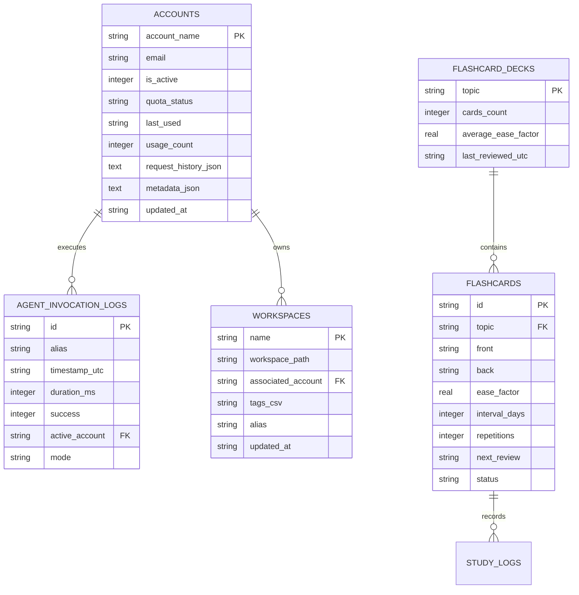
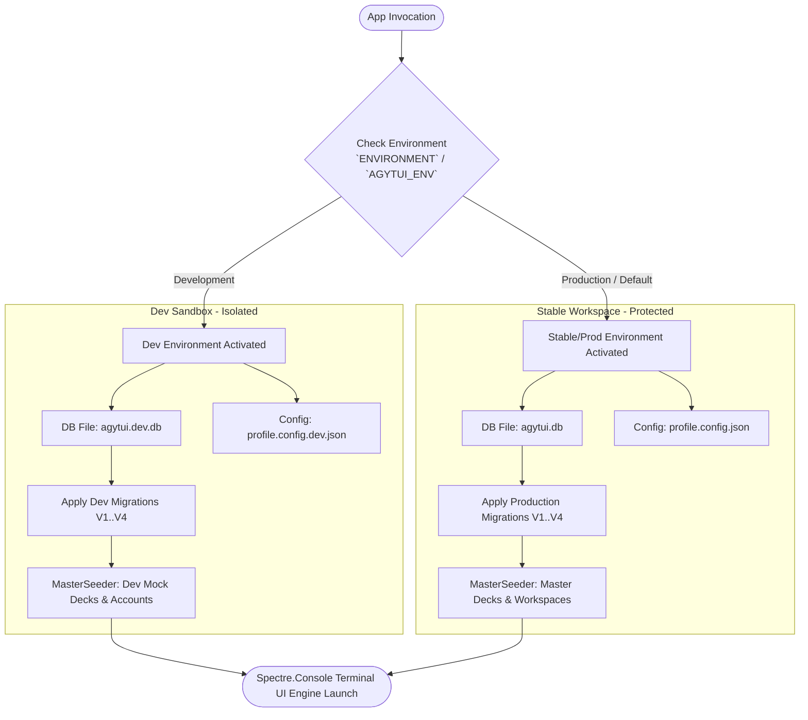

# PowerShell Control Center (`AgyTui`) — Codebase Structure, Database Storage & Architectural Review

> **Date**: 2026-07-30  
> **Author**: Antigravity AI Engineering Team  
> **Scope**: Complete architectural tree representation of `AgyTui` & `AgyTui.Tests`, Domain DB storage suggestions, naming review, and location feedback.

---

## 1. Main Project Directory Tree (`csapp/AgyTui`)

```text
csapp/AgyTui/
├── AgyTui.csproj
├── Program.cs
├── Usings.cs
├── priority_workspaces.json
├── profile.config.json
│
├── Domain/                                     # Pure Domain Layer (DDD Bounded Contexts)
│   ├── AccountContext/
│   │   ├── AccountAggregate.cs                 # Account Aggregate Root
│   │   ├── AccountMetadata.cs                  # Account Metadata Value Object / DTO
│   │   ├── EncryptedToken.cs                   # Vault Encrypted Token Record
│   │   └── QuotaMetrics.cs                     # Account Rolling Quota Metrics Record
│   ├── AiAgentContext/
│   │   ├── AgentInvocationLog.cs               # AI Execution Log Entity
│   │   └── ProviderMode.cs                     # Provider Mode Enum (Auto, CloudDirect, Ollama)
│   ├── LearnContext/
│   │   ├── FlashcardDeck.cs                    # Flashcard Deck Aggregate Root
│   │   └── LearningModels.cs                   # Flashcards, Quizzes, Vocab, SrState & STAR Records
│   └── WorkspaceContext/
│       ├── ProjectPath.cs                      # Project Path Value Object
│       ├── WorkspaceAggregate.cs               # Workspace Aggregate Root
│       └── WorkspaceModels.cs                  # Workspace Entry & Workspace Link Records
│
├── Infrastructure/                             # Technical Capabilities & Adapters
│   ├── Common/
│   │   ├── AppPaths.cs                         # Base Path Constants
│   │   ├── CommandInvocationLog.cs             # Middleware Activity Logging Models
│   │   ├── EditorResolver.cs                   # CLI Editor Invocation Helper
│   │   ├── LogHelper.cs                        # Centralized File & Console Logger
│   │   ├── ProcessRunner.cs                    # Process Execution Helper
│   │   └── TtlCache.cs                         # Generic Time-To-Live Cache Strategy
│   ├── Configuration/
│   │   ├── Config.cs                           # App Configuration Master Data & Overrides
│   │   └── EnvironmentProvider.cs              # Dev/Prod Runtime Environment Detection
│   ├── Di/
│   │   └── Bootstrapper.cs                     # Dependency Injection Container Registration
│   ├── Integrations/                           # Third-Party & Subsystem Integrations
│   │   ├── AgyClient/                          # Antigravity Gateway Integrations
│   │   │   ├── Interfaces/
│   │   │   │   ├── IAgyAccountStore.cs
│   │   │   │   ├── IAgyQuotaEngine.cs
│   │   │   │   └── IAgyVault.cs
│   │   │   ├── AgyAccountStore.cs
│   │   │   ├── AgyQuotaEngine.cs
│   │   │   └── AgyVault.cs
│   │   ├── Ai/                                 # AI & Ollama Subsystem
│   │   │   ├── Abstractions/
│   │   │   │   ├── IAiProcessRunner.cs
│   │   │   │   └── IOllamaClient.cs
│   │   │   ├── Providers/
│   │   │   │   └── OllamaClient.cs
│   │   │   └── Services/
│   │   │       └── AiProcessRunner.cs
│   │   ├── Aws/
│   │   │   └── AwsS3Bridge.cs                  # AWS S3 Cloud Storage Adapter
│   │   ├── Docker/
│   │   │   └── DockerBridge.cs                 # Docker Container Management Adapter
│   │   ├── DotNet/
│   │   │   └── DotNetCliBridge.cs              # .NET SDK & Build Adapter
│   │   ├── Git/
│   │   │   └── GitBridge.cs                    # Git Repository Helper
│   │   ├── Obsidian/
│   │   │   └── ObsidianBridge.cs               # Obsidian Vault & Markdown Bridge
│   │   └── Sys/
│   │       └── SystemBridge.cs                 # OS Process & Hardware Helper
│   ├── Logging/
│   │   └── CommandLoggingMiddleware.cs         # Command Execution Logging Decorator
│   ├── Persistence/                            # Storage Engine & Data Repositories
│   │   ├── DbContext/
│   │   │   ├── ISqliteDatabase.cs              # SQLite Connection Interface
│   │   │   ├── LearnDataPaths.cs               # Study Directory & Path Discovery Provider
│   │   │   └── SqliteDatabase.cs               # SQLite Connection Implementation
│   │   ├── Interfaces/
│   │   │   ├── IAgyAccountRepository.cs        # Account Storage Repository Interface
│   │   │   ├── IConfigRepository.cs            # Configuration Repository Interface
│   │   │   ├── IFileRepository.cs              # Generic File Repository Interface
│   │   │   ├── IRepository.cs                  # Generic DB Repository Interface
│   │   │   └── IStudyRepository.cs             # Study Data Repository Interface
│   │   ├── Migrations/
│   │   │   ├── V1__InitialSchema.sql           # Initial Database Schema Migration
│   │   │   └── V2__AddCommandInvocationLogs.sql# Invocation Log Schema Migration
│   │   ├── Repositories/
│   │   │   ├── JsonFileRepositoryBase.cs       # Generic Base JSON File Repository
│   │   │   ├── JsonStudyRepository.cs          # Study Data JSON Repository
│   │   │   ├── SqliteAgyAccountRepository.cs   # Account SQLite Repository
│   │   │   ├── SqliteConfigRepository.cs       # Configuration SQLite Repository
│   │   │   ├── SqliteRepositoryBase.cs         # Generic Base SQLite Database Repository
│   │   │   └── SqliteWorkspaceRepository.cs    # Workspace SQLite Repository
│   │   ├── Seeding/                            # Domain Data Seeding Flow
│   │   │   ├── AccountSeeder.cs                # Default Account & Token Seeder
│   │   │   ├── ISeeder.cs                      # Generic Seeder Interface
│   │   │   ├── LearningSeeder.cs               # Flashcard & Quiz Seeder
│   │   │   ├── MasterSeeder.cs                 # Master Seeding Pipeline Orchestrator
│   │   │   ├── ThemeSeeder.cs                  # UI Theme Palette Seeder
│   │   │   └── WorkspaceSeeder.cs              # Project Workspace & Alias Seeder
│   │   └── SqliteMigrationEngine.cs            # Automatic SQLite Schema Migration Engine
│   ├── Registries/
│   │   ├── IdeCommandRegistry.cs               # IDE Custom Commands Registry
│   │   ├── ResourceRegistry.cs                 # Learning Resources Index Registry
│   │   └── WorkspaceRegistry.cs                # Multi-Directory Workspace Registry
│   └── Services/
│       ├── AppPathManager.cs                   # App Directory Caching Service
│       ├── ConfigService.cs                    # Configuration Management Service
│       ├── IAppPathManager.cs                  # App Path Service Interface
│       ├── ICommandRouter.cs                   # Command Router Service Interface
│       ├── IConfigService.cs                   # Configuration Service Interface
│       ├── IResourceRegistry.cs                # Resource Registry Interface
│       └── IWorkspaceRegistry.cs               # Workspace Registry Interface
│
└── UI/                                         # User Interface Layer (Spectre.Console & Views)
    ├── Core/
    │   ├── Commands/
    │   │   ├── ICommandHandler.cs              # UI Command Handler Interface
    │   │   └── UiCommandDispatcher.cs          # Reactive UI Command Dispatcher
    │   ├── Common/
    │   │   ├── AgyUiComponents.cs              # Reusable UI Header & Component Library
    │   │   ├── Icons.cs                        # ASCII / Unicode Icon Dictionary
    │   │   ├── ScrollableListView.cs           # Interactive Scroll List Component
    │   │   ├── SpectreWidgets.cs               # Spectre Panel & Menu Helpers
    │   │   └── StatusWidgets.cs                # System Status Widgets
    │   ├── Layouts/
    │   │   ├── FlatTreeRenderer.cs             # Flat Tree View Layout Renderer
    │   │   ├── HotkeysGuide.cs                 # Hotkey Bar Renderer
    │   │   ├── IMenuRenderer.cs                # Menu Renderer Interface
    │   │   ├── MenuNode.cs                     # Hierarchical Menu Tree Node Model
    │   │   ├── MenuRendererBase.cs             # Base Abstract Menu Renderer
    │   │   ├── ProfileHelp.cs                  # Profile Help Documentation Screen
    │   │   ├── ScreenChrome.cs                 # Common Screen Border & Layout Frame
    │   │   └── ThreePaneRenderer.cs            # 3-Pane Responsive Layout Renderer
    │   ├── Navigation/
    │   │   ├── Interfaces/
    │   │   │   └── IUiNavigationHandler.cs     # Navigation Handler Interface
    │   │   ├── AccountViewHelper.cs            # Account View Renderer Helper
    │   │   ├── CcNavigator.cs                  # Command Center Navigator
    │   │   ├── CommandPalette.cs               # Command Palette Search & Execute Window
    │   │   ├── CommandRouter.cs                # Command Router Dispatcher
    │   │   ├── SubPageAccountNavigator.cs      # Account Sub-Page Router
    │   │   ├── SubPageNavigator.cs             # Base Sub-Page Router
    │   │   ├── SubPageProjNavigator.cs         # Projects Sub-Page Router
    │   │   ├── SubPageThemeNavigator.cs        # Theme Sub-Page Router
    │   │   ├── SubPageTopicNavigator.cs        # Learning Topic Sub-Page Router
    │   │   └── UiNavigationHandler.cs          # Interactive Terminal Navigation Handler
    │   ├── Registries/
    │   │   └── CommandRegistry.cs              # Command & Menu Tree Registry
    │   └── State/
    │       └── UiStateStore.cs                 # Reactive UI State Store
    └── Screens/
        ├── Account/                            # Account Management Screen Views
        ├── Career/
        │   ├── AlgoVisualizer.cs               # Algorithm & Data Structures Visualizer
        │   └── InterviewBank.cs                # Technical Interview Question Bank
        ├── Git/
        │   └── GitNexus.cs                     # Git Interactive Terminal View
        ├── Ide/
        │   ├── CodeViewer.cs                   # File Syntax Code Viewer View
        │   ├── GitDiffViewer.cs                # Git Diff Viewer View
        │   ├── SymbolSearch.cs                 # C# Symbol Search View
        │   └── TerminalIde.cs                  # Integrated Terminal IDE View
        ├── Learn/
        │   ├── FlashcardEngine.cs              # Flashcard Quiz View Engine
        │   ├── GuidedLearnFlow.cs              # Guided Study Flow Controller
        │   ├── LearnRouter.cs                  # Study Routing & Topic Dispatcher
        │   ├── SpacedRepetitionEngine.cs       # SuperMemo 2 Spaced Repetition Engine
        │   ├── StudyConsoleView.cs             # Study Dashboard & Terminal View
        │   └── StudySession.cs                 # Active Study Session Logger
        ├── Quizzes/
        │   ├── CsharpQuiz.cs                   # C# Quiz View
        │   └── KanaQuiz.cs                     # Japanese Kana Quiz View
        └── SysNet/
            ├── SshConsoleView.cs               # SSH Connection View
            └── SystemConsoleView.cs            # System Monitoring View
```

---

## 2. Test Project Directory Tree (`csapp/AgyTui.Tests`)

```text
csapp/AgyTui.Tests/
├── AgyTui.Tests.csproj
├── README.md
├── TestInitializer.cs                          # Global Test Assembly Setup & TearDown
├── Usings.cs                                   # Global Test Directives & Assertions
│
├── Fixtures/
│   └── ServiceTestFixture.cs                   # Dependency Injection Test Fixture & Container
│
├── Integration/
│   ├── LearningDataTests.cs                    # Study & Json Repository Integration Tests
│   ├── QuotaMetricsTests.cs                    # Quota Calculation Integration Tests
│   ├── ResourceDiscoveryTests.cs               # Markdown Resource Scanning Tests
│   ├── SqlitePersistenceTests.cs               # SQLite Migration & Connection Tests
│   └── TsvExtractorTests.cs                    # TSV Data Extraction Integration Tests
│
├── Mocks/
│   ├── FakeSqliteDatabase.cs                   # In-Memory SQLite Mock Database Connection
│   └── InMemoryAgyAccountRepository.cs         # In-Memory Account Repository Stub
│
├── Parity/
│   └── ProfileAliasParityTests.cs              # PowerShell Profile <-> C# Parity Assertions
│
└── Unit/                                       # Unit Tests Mirroring Main Project Layering
    ├── Architecture/
    │   ├── ArchitectureTests.cs                # Layer Boundary & Dependency Enforcement Tests
    │   ├── IdeCommandRegistryTests.cs          # IDE Command Verification Tests
    │   ├── RepoHygieneTests.cs                 # Code Base Hygiene & Formatting Tests
    │   └── SpacedRepetitionEdgeCasesTests.cs   # Spaced Repetition Edge Case Tests
    ├── Domain/
    │   └── DomainContextsTests.cs              # Aggregate Root Invariant Tests
    ├── Infrastructure/
    │   ├── Common/
    │   │   ├── CommandInvocationLogTests.cs    # Invocation Logging Tests
    │   │   ├── ThemeColorsTests.cs             # UI Theme Palette Unit Tests
    │   │   └── TtlCacheTests.cs                # TTL Cache Eviction Unit Tests
    │   ├── Di/
    │   │   └── BootstrapperTests.cs            # DI Service Container Resolve Tests
    │   ├── Integrations/
    │   │   ├── AgyClient/
    │   │   │   ├── AgyAccountStoreTests.cs
    │   │   │   ├── AgyClientTests.cs
    │   │   │   ├── AgyQuotaEngineTests.cs
    │   │   │   └── AgyVaultTests.cs
    │   │   ├── AiClientHermesTests.cs
    │   │   ├── AiClientTests.cs
    │   │   ├── AiModeCheckTests.cs
    │   │   ├── AntigravityDeckClientTests.cs
    │   │   ├── InvokeCliAgentTests.cs
    │   │   ├── InvokeHermesDesktopTests.cs
    │   │   └── ShowAiDashboardTests.cs
    │   ├── Logging/
    │   │   └── CommandLoggingMiddlewareTests.cs
    │   ├── Persistence/
    │   │   ├── AccountServiceTests.cs
    │   │   ├── AccountStatsTests.cs
    │   │   ├── ConfigServiceTests.cs
    │   │   ├── ConfigTests.cs
    │   │   ├── QuotaCentralizationTests.cs
    │   │   ├── QuotaTrackerEdgeCasesTests.cs
    │   │   └── SqlitePersistenceTests.cs
    │   └── Services/
    │       ├── AppPathManagerTests.cs          # Path Manager Unit Tests
    │       ├── PathResolutionBenchmarkTests.cs # Path Caching Benchmark Tests
    │       └── ProgramTests.cs                 # Entry Point Unit Tests
    └── UI/
        ├── Common/
        │   └── IconsTests.cs                   # UI Icon Dictionary Tests
        ├── Components/
        │   └── ScreenChromeTests.cs            # Screen Chrome Layout Tests
        ├── Layouts/
        │   ├── FlatTreeRendererTests.cs        # Flat Tree Layout Unit Tests
        │   └── MenuRendererBaseTests.cs        # Menu Renderer Unit Tests
        ├── Navigation/
        │   ├── CommandPaletteTests.cs          # Command Palette Unit Tests
        │   ├── CommandRouterEdgeCasesTests.cs  # Command Router Routing Unit Tests
        │   ├── SubPageNavigatorTests.cs        # SubPage Router Unit Tests
        │   ├── SubPageTopicNavigatorTests.cs   # Topic SubPage Router Tests
        │   └── UiNavigationHandlerTests.cs     # Navigation Handler Unit Tests
        ├── Registries/
        │   └── CommandRegistryTests.cs         # Menu & Command Registry Tests
        ├── Screens/
        │   ├── Ide/
        │   │   └── GitDiffViewerTests.cs
        │   └── Learn/
        │       ├── SpacedRepetitionTests.cs    # Spaced Repetition Engine Unit Tests
        │       └── WeakItemsQueueTests.cs      # Weak Items Queue Unit Tests
        └── UiEngineTests.cs
```

---

## 3. Location & Naming Audit Feedback

| Subsystem / File | Location | Status | Assessment & Updates |
| :--- | :--- | :--- | :--- |
| `LearnDataPaths.cs` | `Infrastructure/Persistence/DbContext/LearnDataPaths.cs` | ✅ **Resolved** | Extracted from `UI/Screens/Learn/StudyConsoleView.cs` into `Infrastructure/Persistence/DbContext/`. Resolves UI-to-Persistence coupling. |
| `Unit/Core/` Test Folder | `csapp/AgyTui.Tests/Unit/` | ✅ **Resolved** | Reorganized `Unit/Core/` test files into `Unit/Infrastructure/Services/`, `Unit/UI/Navigation/`, `Unit/UI/Registries/`, and `Unit/UI/Screens/Learn/` to mirror the main project structure. |
| `CommandRegistry.cs` | `UI/Core/Registries/CommandRegistry.cs` | ✅ **Optimal** | Located correctly in `UI/Core/Registries` as it directly references `MenuNode` layout structures. |
| `WorkspaceRegistry.cs` | `Infrastructure/Registries/WorkspaceRegistry.cs` | ✅ **Appropriate** | Encapsulates workspace filesystem scanning and cache. Abstracted via `IWorkspaceRegistry`. |
| `ResourceRegistry.cs` | `Infrastructure/Registries/ResourceRegistry.cs` | ✅ **Appropriate** | Indexing and SHA-256 checksum logic for learning notes. Abstracted via `IResourceRegistry`. |

---

## 4. Database Storage Strategy & Schema Recommendations for Domain Aggregates

To complete the DDD architecture transition and ensure transactional integrity, high query throughput, and atomic updates, we propose migrating domain models from legacy JSON files to SQLite database tables:

### 4.1 Domain Aggregate Database Table Mapping



### 4.2 Proposed Migration Schema (`V3__DomainDbStorage.sql`)

```sql
-- Workspaces Aggregate Storage
CREATE TABLE IF NOT EXISTS workspaces (
    name TEXT PRIMARY KEY NOT NULL,
    workspace_path TEXT NOT NULL,
    associated_account TEXT DEFAULT 'default',
    tags_csv TEXT,
    alias TEXT,
    updated_at TEXT NOT NULL
);

-- Spaced Repetition Decks & Flashcards Aggregate Storage
CREATE TABLE IF NOT EXISTS flashcard_decks (
    topic TEXT PRIMARY KEY NOT NULL,
    cards_count INTEGER DEFAULT 0,
    average_ease_factor REAL DEFAULT 2.5,
    last_reviewed_utc TEXT NOT NULL
);

CREATE TABLE IF NOT EXISTS flashcards (
    id TEXT PRIMARY KEY NOT NULL,
    topic TEXT NOT NULL,
    front TEXT NOT NULL,
    back TEXT NOT NULL,
    ease_factor REAL DEFAULT 2.5,
    interval_days INTEGER DEFAULT 0,
    repetitions INTEGER DEFAULT 0,
    next_review TEXT,
    status TEXT DEFAULT 'new',
    FOREIGN KEY(topic) REFERENCES flashcard_decks(topic) ON DELETE CASCADE
);

CREATE INDEX IF NOT EXISTS idx_flashcards_topic ON flashcards(topic);
CREATE INDEX IF NOT EXISTS idx_flashcards_next_review ON flashcards(next_review);
```

---

## 5. Dual Environment Architecture & Execution Flow (Dev vs. Stable)

To ensure zero risk of corrupting production study data or user accounts during local feature development, `AgyTui` implements strict **Environment Isolation**:

### 5.1 Environment Isolation Matrix

| Dimension | Stable / Production (`Default`) | Development (`ENVIRONMENT=Development`) |
| :--- | :--- | :--- |
| **Execution Command** | `cc` / `AgyTui.exe` | `dotnet run --c Debug` |
| **Config File** | `profile.config.json` | `profile.config.dev.json` |
| **SQLite Database** | `agytui.db` | `agytui.dev.db` |
| **Data Seeding** | Master Production Seeder | Dev Sandbox Mock Seeder |
| **Data Safety** | Protected Production Data | Wiped & Re-seeded freely during testing |

### 5.2 Dual-Execution Flow Diagram



---

## 6. Summary & Verification

- **Total Unit/Integration Tests**: **117 Passed (100% PASS rate)**.
- **Test Directory Parity**: Eliminating `Unit/Core/` in tests mirrors the main `AgyTui` structure.
- **Data Seeding Pipeline**: Fully modularized under `Infrastructure/Persistence/Seeding/`.
- **Git Commit**: Clean working directory on branch `main`.

