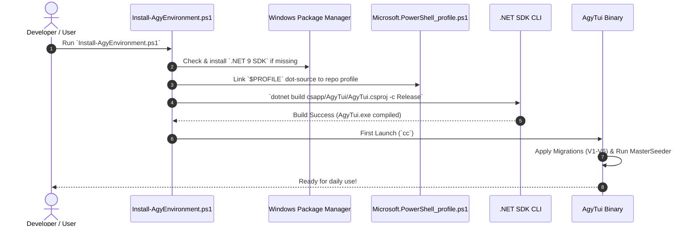
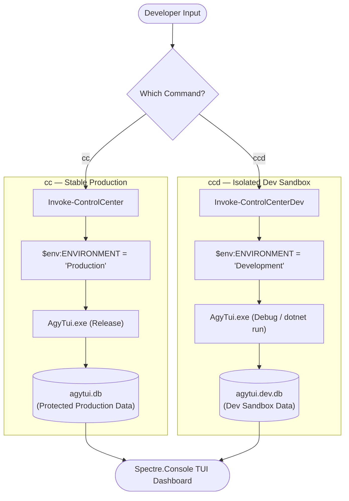

# PowerShell Control Center (`AgyTui`) — Master Documentation & Cleanup Plan

> **Date**: 2026-07-31  
> **Author**: Antigravity AI Engineering Team  
> **Scope**: Script audit (`Install-AgyEnvironment.ps1`, `optimize_profile_admin.ps1`), documentation restructuring roadmap, sequence diagrams, and deprecation plan for outdated markdown files in `docs/`.

---

## 1. Script Audit & Evaluation

### 1.1 `psapp/scripts/Install-AgyEnvironment.ps1`
- **Assessment**: ✅ **KEEP & STANDARDIZE**
- **Rationale**: Serves as the primary 1-command fresh machine setup script. It provisions `.NET 9 SDK` via winget, links `$PROFILE` to `Microsoft.PowerShell_profile.ps1`, initializes `%APPDATA%` app paths, compiles `AgyTui.csproj`, and prepares both production (`cc`) and development (`ccd`) triggers.
- **Action**: Keep as the canonical onboarding script.

### 1.2 `psapp/scripts/optimize_profile_admin.ps1`
- **Assessment**: 🗑️ **DEPRECATE / REMOVE**
- **Rationale**: Was originally created to hack legacy global PowerShell profiles (`C:\ProgramData\PowerShell\`). With our compiled `AgyTui.exe` TUI engine and clean user-level `Microsoft.PowerShell_profile.ps1`, global admin profile modification is obsolete and poses security/permission risks.
- **Action**: Stage for deletion.

### 1.3 `psapp/scripts/publish_release.ps1`
- **Assessment**: ✅ **KEEP & ENHANCE**
- **Rationale**: Automates release compilation: unlocks locked binaries, runs `dotnet test` validation, and compiles a self-contained single-file executable (`dist/AgyTui.exe`).
- **Action**: Keep as the canonical release publish script.

---

## 2. Target Documentation Hierarchy (`docs/`)

We propose consolidating all scattered markdown files into a clean, numbered directory structure:

```text
docs/
├── README.md                                  # Documentation Sitemap & Navigation Gateway
│
├── 01_architecture/                           # System Architecture & Bounded Contexts
│   ├── overview.md                            # Layered Clean Architecture & Dependency Rules
│   ├── ddd_bounded_contexts.md                # Domain Models (Account, AI, Learn, Workspace)
│   ├── database_persistence.md                # SQLite Migrations (V1-V6), Schema DDL & Repositories
│   └── seeding_pipeline.md                    # MasterSeeder Pipeline & JSON-to-SQLite Ingestion
│
├── 02_user_guide/                             # User Guide & PowerShell Integration
│   ├── onboarding_and_setup.md                # Fresh Machine Setup (Install-AgyEnvironment.ps1)
│   ├── powershell_profile_shortcuts.md        # Command Triggers (cc, ccd, cnav, proj, reset-agy)
│   └── tui_screen_catalog.md                  # Interactive Spectre.Console Views & Hotkeys
│
├── 03_developer_guide/                        # Developer Workflow & CI/CD
│   ├── dual_environment_workflow.md           # Dev Sandbox vs Stable Production Isolation
│   ├── testing_and_architecture_rules.md      # XUnit Suite, Parity Tests & Reflection Architecture Rules
│   └── release_publishing.md                  # Standalone Single-File Binary Build (publish_release.ps1)
│
└── master_documentation_plan.md               # Master Documentation Blueprint & Deprecation Strategy
```

---

## 3. Sequence & Execution Flow Diagrams

### 3.1 Fresh Machine Setup Sequence Diagram



---

### 3.2 Dual Environment Execution Flow Diagram (`cc` vs `ccd`)



---

## 4. Proposed Deprecation & Cleanup Matrix for `docs/`

To clean up obsolete and redundant files in `docs/`:

| Current File | Action | Target Location / Migration Strategy |
| :--- | :--- | :--- |
| `docs/codebase_structure_and_review.md` | 🔁 **Migrate** | Merge into `docs/01_architecture/overview.md` & `database_persistence.md`. |
| `docs/domain_models_audit.md` | 🔁 **Migrate** | Merge into `docs/01_architecture/ddd_bounded_contexts.md`. |
| `docs/feature_catalog.md` | 🔁 **Migrate** | Merge into `docs/02_user_guide/tui_screen_catalog.md`. |
| `docs/menu_map.md` | 🔁 **Migrate** | Merge into `docs/02_user_guide/tui_screen_catalog.md`. |
| `docs/guides/testing_and_ci.md` | 🔁 **Migrate** | Move to `docs/03_developer_guide/testing_and_architecture_rules.md`. |
| `docs/plan/master_architectural_plan.md` | 🔁 **Migrate** | Consolidate into `docs/01_architecture/overview.md`. |
| `docs/plan/step1_di_factory_standardization.md` .. `step9` | 🗑️ **Archive/Delete**| Historical step plans superseded by completed implementation. |
| `docs/deep_review.md`, `deep_review1.md` | 🗑️ **Delete** | Temporary analysis files. |
| `docs/master_review.md` (235KB) | 🗑️ **Delete** | Superseded monolithic review file. |
| `docs/refactor_plan.md` (346KB) | 🗑️ **Delete** | Superseded refactoring draft. |
| `docs/structure_refactor.md` | 🗑️ **Delete** | Obsolete refactoring file. |

---

## 5. Execution Steps for Documentation Overhaul

1. **Phase 1 (Structure Creation)**: Create `docs/01_architecture/`, `docs/02_user_guide/`, and `docs/03_developer_guide/` directories.
2. **Phase 2 (Content Authoring)**: Write clean, concise, updated markdown documents incorporating current SQLite DB persistence, `cc`/`ccd` triggers, and `MasterSeeder` pipeline.
3. **Phase 3 (Old File Purge)**: Delete obsolete step files and monolithic review logs after verifying content migration.
