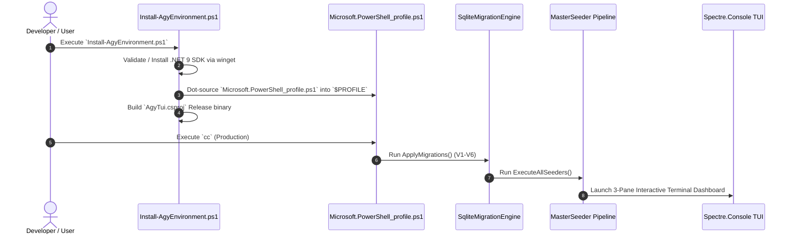

# PowerShell Control Center (`AgyTui`) — Master Documentation Blueprint & Standard Format Specification

> **Date**: 2026-07-31  
> **Author**: Antigravity AI Engineering Team  
> **Scope**: Standardized documentation format, mandatory header templates, granular per-file outlines for `docs/`, sequence diagrams, script audit, and deprecation matrix.

---

## 1. Standard Document Format Specification

Every document created under the `docs/` tree MUST strictly follow this standardized format and header template:

### 1.1 Mandatory Header & Layout Template

```markdown
# [Icon] [Document Title]

> **Category**: Architecture | User Guide | Developer Guide  
> **Subsystem**: [Target Bounded Context / Core Module]  
> **Date**: YYYY-MM-DD  
> **Author**: Antigravity AI Engineering Team  
> **Status**: Approved | Active  

---

## Executive Summary
[Concise 2-3 sentence technical summary of the document's scope, primary objectives, and audience.]

## Table of Contents
- [1. Technical Overview](#1-technical-overview)
- [2. Core Architecture & Component Details](#2-core-architecture--component-details)
- [3. Execution Sequence & Data Models](#3-execution-sequence--data-models)
- [4. Verification & Best Practices](#4-verification--best-practices)
- [5. Cross References](#5-cross-references)

---

## 1. Technical Overview
...

## 2. Core Architecture & Component Details
...

## 3. Execution Sequence & Data Models
...

## 4. Verification & Best Practices
...

## 5. Cross References
- [Link to Related Doc 1](file:///...)
- [Link to Related Doc 2](file:///...)
```

---

## 2. Target Documentation Hierarchy & Detailed File Outlines

```text
docs/
├── README.md                                  # Sitemap, System Overview & Gateway Index
│
├── 01_architecture/                           # System Architecture & Bounded Contexts
│   ├── overview.md                            # Clean Architecture, Layer Boundaries & DI
│   ├── ddd_bounded_contexts.md                # Domain Aggregates (Account, AI, Learn, Workspace)
│   ├── database_persistence.md                # SQLite Schemas (V1-V6), Migration & Repositories
│   └── seeding_pipeline.md                    # MasterSeeder Pipeline & JSON-to-SQLite Ingestion
│
├── 02_user_guide/                             # User Guide & PowerShell Integration
│   ├── onboarding_and_setup.md                # Fresh Machine Setup (Install-AgyEnvironment.ps1)
│   ├── powershell_profile_shortcuts.md        # Command Triggers (cc, ccd, cnav, proj, reset-agy)
│   └── tui_screen_catalog.md                  # Interactive Spectre.Console Views & Hotkeys
│
└── 03_developer_guide/                        # Developer Workflow & CI/CD
    ├── dual_environment_workflow.md           # Dev Sandbox vs Stable Production Isolation
    ├── testing_and_architecture_rules.md      # XUnit Suite, Parity Tests & Reflection Architecture Rules
    └── release_publishing.md                  # Standalone Single-File Binary Build (publish_release.ps1)
```

---

### 2.1 File-by-File Granular Outline Specifications

#### Document 1: `docs/README.md`
- **Header**: `# 🛸 PowerShell Control Center (AgyTui) — Documentation Gateway`
- **Scope**: Central index and visual map of the entire documentation suite.
- **Sections**:
  1. System Architecture Summary & High-Level Topology Diagram.
  2. Quick Navigation Index (links to all 10 core docs).
  3. Technology Stack & Prerequisites (.NET 9, SQLite, Spectre.Console, PowerShell 7+).
  4. Repository Directory Structure Overview.

#### Document 2: `docs/01_architecture/overview.md`
- **Header**: `# 🏛️ Clean Architecture & Layer Boundary Specification`
- **Scope**: Detailed explanation of layer separation (Domain, Infrastructure, UI) and dependency flow.
- **Sections**:
  1. Dependency Inversion Principle (DIP) & Bootstrapper DI Container Registration.
  2. Layer Rules (Domain holds no Infrastructure usings; UI references Infrastructure via interfaces; ArchitectureTests enforcement).
  3. Master C# Class & Interface Hierarchy Diagram.

#### Document 3: `docs/01_architecture/ddd_bounded_contexts.md`
- **Header**: `# 🧩 DDD Bounded Contexts & Aggregate Roots`
- **Scope**: Deep-dive into the 4 domain contexts (`AccountContext`, `WorkspaceContext`, `AiAgentContext`, `LearnContext`).
- **Sections**:
  1. `AccountContext`: `AccountAggregate`, `AccountMetadata`, `EncryptedToken`, `QuotaMetrics`.
  2. `WorkspaceContext`: `WorkspaceAggregate`, `ProjectPath`, `WorkspaceModels`.
  3. `AiAgentContext`: `AgentInvocationLog`, `ProviderMode`.
  4. `LearnContext`: `FlashcardDeck`, `LearningModels` (`SrState`, `FlashCard`, `DeckMeta`, `VocabWord`).

#### Document 4: `docs/01_architecture/database_persistence.md`
- **Header**: `# 💾 SQLite Database Schemas, Repositories & Migrations`
- **Scope**: Comprehensive SQLite persistence engine guide covering schema versions V1 through V6.
- **Sections**:
  1. Complete SQL DDL Schema Statements (Tables: `accounts`, `workspaces`, `flashcard_decks`, `flashcards`, `themes`, `ai_invocation_logs`, `system_state`, `resources`, `skills`, `quiz_questions`).
  2. Entity Relationship Diagram (ERD).
  3. Repositories: `SqliteRepositoryBase<TEntity, TId>`, `SqliteAgyAccountRepository`, `SqliteWorkspaceRepository`, `SqliteConfigRepository`.
  4. Migration Engine (`SqliteMigrationEngine` transaction & version tracking).

#### Document 5: `docs/01_architecture/seeding_pipeline.md`
- **Header**: `# 🌱 MasterSeeder Data Ingestion Pipeline`
- **Scope**: Modular seeder architecture that parses JSON templates on startup/publish.
- **Sections**:
  1. `ISeeder` Interface & Order Prioritization.
  2. Individual Seeders: `AccountSeeder`, `WorkspaceSeeder`, `LearningSeeder`, `ThemeSeeder`, `ResourceSeeder`, `SkillSeeder`.
  3. `MasterSeeder` Pipeline Execution Flow & Error Handling.

#### Document 6: `docs/02_user_guide/onboarding_and_setup.md`
- **Header**: `# 🚀 Automated Fresh Machine Setup Guide`
- **Scope**: Step-by-step guide for setting up a fresh machine using `Install-AgyEnvironment.ps1`.
- **Sections**:
  1. Automated Prerequisites Audit (.NET 9 SDK via winget).
  2. Profile Linking (`$PROFILE` dot-sourcing `Microsoft.PowerShell_profile.ps1`).
  3. Automatic DB Creation & Master Data Seeding.

#### Document 7: `docs/02_user_guide/powershell_profile_shortcuts.md`
- **Header**: `# ⚡ PowerShell Profile Commands & Command Center Aliases`
- **Scope**: Catalog of PowerShell aliases and utility functions.
- **Sections**:
  1. `cc`: Launch Production Control Center.
  2. `ccd`: Launch Isolated Development Sandbox.
  3. Navigation & Utilities: `cnav`, `proj`, `reset-agy`, `purge-accounts`, `dotnet-info`.

#### Document 8: `docs/02_user_guide/tui_screen_catalog.md`
- **Header**: `# 🖥️ Spectre.Console TUI Screen Catalog`
- **Scope**: Visual and functional guide to terminal UI screens.
- **Sections**:
  1. Navigation & Layouts: 3-Pane Layout Renderer, Flat Tree Renderer, Command Palette (`Ctrl+P`).
  2. Subsystem Screens: Account Dashboard, Learn Console, Git Nexus, IDE Code Viewer, System Console.

#### Document 9: `docs/03_developer_guide/dual_environment_workflow.md`
- **Header**: `# 🛡️ Dual Environment Isolation Workflow (Dev vs. Production)`
- **Scope**: Developer guide explaining environment isolation (`agytui.db` vs `agytui.dev.db`).
- **Sections**:
  1. Environment Detection (`EnvironmentProvider.cs`).
  2. Command Triggers (`cc` vs `ccd`).
  3. Database and Config File Separation.

#### Document 10: `docs/03_developer_guide/testing_and_architecture_rules.md`
- **Header**: `# 🧪 Test Suite, Architecture Enforcement & Quality Assurance`
- **Scope**: Complete guide to unit, integration, parity, and reflection tests.
- **Sections**:
  1. Test Project Overview (`csapp/AgyTui.Tests`).
  2. Architecture Tests (`ArchitectureTests.cs` enforcing zero Infrastructure -> UI dependencies).
  3. Parity Tests (`ProfileAliasParityTests.cs`).
  4. Running Tests (`dotnet test`).

#### Document 11: `docs/03_developer_guide/release_publishing.md`
- **Header**: `# 📦 Production Release Build & Deployment`
- **Scope**: Guide for building standalone release binaries using `psapp/scripts/publish_release.ps1`.
- **Sections**:
  1. Build Pipeline Steps (Binary Unlocking, Automated Test Gate, Single-File Compilation).
  2. Publish Script Parameters & Output Location (`csapp/AgyTui/dist/AgyTui.exe`).

---

## 3. Execution Flow Diagrams

### 3.1 Onboarding & Build Sequence Diagram



---

## 4. Script Audit Summary

| Script | Status | Action & Recommendation |
| :--- | :--- | :--- |
| `psapp/scripts/Install-AgyEnvironment.ps1` | ✅ **KEEP** | Standard onboarding script for fresh machines. |
| `psapp/scripts/publish_release.ps1` | ✅ **KEEP** | Standard production release build script with automated test validation. |
| `psapp/scripts/optimize_profile_admin.ps1` | 🗑️ **DEPRECATE** | Legacy global profile optimizer. Obsolete. |

---

## 5. Deprecation & Cleanup Matrix for Legacy Markdown Files

| Legacy Document | Action | Target Clean Location |
| :--- | :--- | :--- |
| `docs/codebase_structure_and_review.md` | 🔁 **Migrate** | `docs/01_architecture/overview.md` & `database_persistence.md` |
| `docs/domain_models_audit.md` | 🔁 **Migrate** | `docs/01_architecture/ddd_bounded_contexts.md` |
| `docs/feature_catalog.md` & `menu_map.md` | 🔁 **Migrate** | `docs/02_user_guide/tui_screen_catalog.md` |
| `docs/guides/testing_and_ci.md` | 🔁 **Migrate** | `docs/03_developer_guide/testing_and_architecture_rules.md` |
| `docs/plan/master_architectural_plan.md` | 🔁 **Migrate** | `docs/01_architecture/overview.md` |
| `docs/plan/step1_...md` through `step9_...md` | 🗑️ **Delete** | Obsolete historical step plans |
| `docs/master_review.md` & `refactor_plan.md` | 🗑️ **Delete** | Obsolete monolithic review logs |
