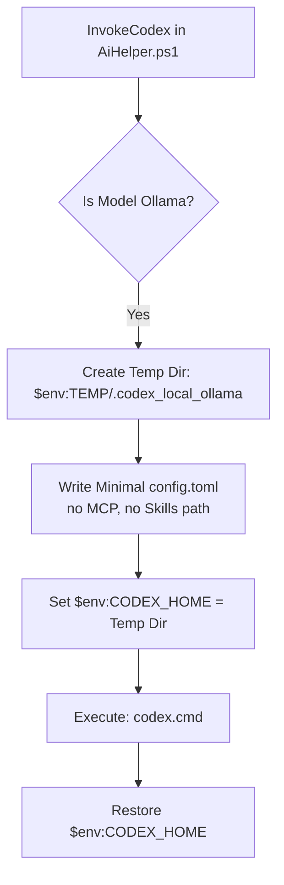

# Local AI Integration Plan (Ollama, Claude Code, Hermes, Codex)

This document outlines the plan to update the local AI integrations in the PowerShell profile, specifically focusing on leveraging new native Ollama commands, isolating Codex CLI local configurations, removing Antigravity (`agy`) credentials from local execution contexts, and adding TUI menus for local model management.

---

## 1. Claude Code & Hermes Native Integrations

We will update the AI launchers to support the official integrations documented in Ollama's integration guidelines:

### A. Claude Code Integration
*   **Documentation Ref:** `https://docs.ollama.com/integrations/claude-code`
*   **Proposed Logic:**
    We will update the `InvokeClaude` helper in `AiHelper.ps1` to support two execution modes:
    1.  **Native Launch (Default):** Run the official `ollama launch claude` command.
    2.  **CLI Launch Fallback:** If the `claude` global npm package is installed, set `$env:ANTHROPIC_BASE_URL = "http://localhost:11434/v1"` and run `claude` directly.

### B. Hermes Integration
*   **Documentation Ref:** `https://docs.ollama.com/integrations/hermes`
*   **Proposed Logic:**
    Update the `InvokeHermes` and `InvokeHermesDesktop` helpers to support:
    1.  **Hermes Agent:** Launch using `ollama launch hermes`.
    2.  **Hermes Desktop:** Launch using `ollama launch hermes-desktop`.
    3.  **CLI Fallback:** If the standalone `hermes` executable is installed locally, run it using the configured local endpoint `http://127.0.0.1:11434/v1`.

---

## 2. Isolating Codex CLI from Global Skills & MCP

When running Codex CLI locally with Ollama, autoloading user-defined skills and Model Context Protocol (MCP) servers is unnecessary and adds latency. We will isolate the execution environment.



### Proposed Logic in `InvokeCodex`:
1.  Check if the target model provider is `ollama_custom`.
2.  If so, define a sandbox path: `$SandboxPath = Join-Path $env:TEMP ".codex_local_ollama"`.
3.  Ensure the directory exists, and write a minimal `config.toml` that omits global `[mcp_servers]` and redirects the skills directory to a clean empty scratch folder:
    ```toml
    # Temp sandbox configuration generated at $SandboxPath/config.toml
    [codex]
    model_provider = "ollama"
    model = "qwen2.5-coder:7b"
    api_base = "http://127.0.0.1:11434/v1"
    skills_directory = "C:/Users/TruongNhon/.gemini/antigravity/scratch/empty_skills"

    [mcp_servers]
    # Intentionally empty to disable external tool description loads
    ```
4.  Temporarily set `$env:CODEX_HOME = $SandboxPath`.
5.  Launch `codex.cmd`.
6.  Restore the original `$env:CODEX_HOME` in a `finally` block to protect the user's global Codex configuration.

---

## 3. Disentangling Antigravity (`agy`) from Local Ollama Contexts

Ollama is a strictly local model provider and does not support Antigravity accounts or credentials. We will remove any cross-contamination.

### Proposed Changes:
1.  **Remove Agy Options:** In the `ai` command parameters (like switches or tab-completions), ensure that choosing Ollama does not query the `AgyAccountManager` or request account selection.
2.  **Clear Separations:** In `Get-CustomCommands` and the main Control Center, explicitly handle `ai` execution independently from `agy` account context.

---

## 4. Ollama Model Management in TUI Menu

We will add a new category called `[Ollama Management]` in the `ai` agent selector menu (`InvokeMultiAgent` in `AiHelper.ps1`) to perform model management operations directly:

```text
  Select AI Agent
  ===========================================
  [Codex] Codex CLI (local Ollama)
  [Ollama] Ollama (interactive)
  [Hermes] Hermes (local reasoning)
  [Claude] Claude Code (local Ollama)
  -------------------------------------------
  > [Ollama: Pull] Pull a new model
    [Ollama: List] List installed models
    [Ollama: Set]  Change default model
    [Ollama: Logs] View server logs
```

### Sub-menu Implementation:
*   **Pull a Model:** Prompts the user with `Read-Host "Enter model name to pull (e.g. qwen2.5-coder:7b)"` and runs `ollama pull <model>`.
*   **List Models:** Runs `ollama list` and displays the results in the terminal.
*   **Set Default Model:** Calls the existing `SetOllamaModel` dynamic menu.
*   **View Logs:** Calls the existing `ShowOllamaLogs` helper.

---

## 5. Verification Plan

### Manual Verification
1.  Run `ai` and select `[Ollama: List]`. Verify that installed Ollama models are listed correctly.
2.  Select `[Ollama: Pull]`, type a lightweight model (e.g., `tinyllama`), and verify that the download starts and completes.
3.  Select `[Codex] Codex CLI` and verify it launches. Confirm that no custom skills or MCP servers are loaded in the session.
4.  Run `claude` (Claude Code) and `hermes` to verify they communicate with your local Ollama backend via `ollama launch`.

---

## 6. Tasks
- [x] Update `InvokeClaude` helper to support native `ollama launch claude` and npm fallback.
- [x] Update `InvokeHermes`/`InvokeHermesDesktop` to support native launch and local API fallback.
- [x] Implement temp folder isolation for Codex CLI (`$env:CODEX_HOME` sandbox).
- [x] Remove `agy` account validation checks from local Ollama execution paths.
- [x] Add `[Ollama Management]` options (Pull, List, Set, Logs) to the AI selector menu.
- [x] Verify model listing, downloading, Codex sandbox startup, and tool executions.
