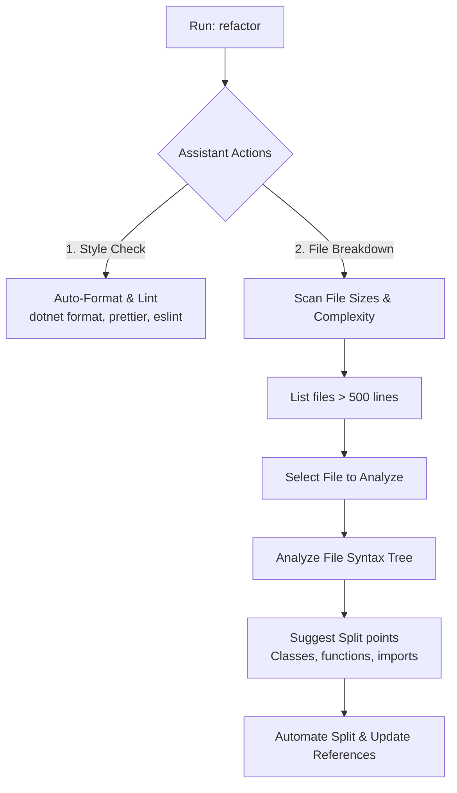

# Specification: Code Style & Refactoring Assistant (Later Implementation)

This document details the specifications for a future development tool: **Code Style & File Breakdown Assistant** (`code-check` / `refactor`). It automates code formatting, style verification, and guides the developer in breaking down large, monolithic files into smaller, modular files.

---

## 1. Feature Architecture & Core Actions



---

## 2. Interactive User Experience (Human Mode)

### A. Style Checker & Formatter Dashboard
Selects the appropriate formatter based on the active project type (.NET, JavaScript/TypeScript, Python) and shows a clean progress report:
```text
  Code Style & Format Checker
  ===========================================
  [1/3] 🔍 Running Prettier (Formatting JS/TS)...
  [2/3] 🔍 Running ESLint (Checking code style)...
  
  Format Results:
  ✔ Aliases.ps1: Code style clean.
  ⚠ TerminalMenu.ps1: Formatted 4 indentation lines.
  ===========================================
  Press any key to return...
```

### B. File Breakdown Assistant (`refactor -breakdown`)
Helps split massive monolithic files.
1.  **Scan Output:** Lists files exceeding complexity thresholds (e.g., >500 lines):
    ```text
      Monolithic Files Detected
      ======================================================
      > [1] ProfileNavigator.ps1       (123 lines) - OK
        [2] AgyAccountManager.ps1     (1279 lines) - COMPLEX (Action Recommended)
        [3] TerminalMenu.ps1           (760 lines)  - MEDIUM
    ```
2.  **Breakdown Suggestions:** Selecting `AgyAccountManager.ps1` parses the file structure and lists logical blocks that can be split off:
    ```text
      Breakdown Analysis: AgyAccountManager.ps1
      ======================================================
      Select block to split into a separate file:
      > [1] Class: AgyAccountManager (Core logic)
        [2] Helper: GetPrivateDirectorySize (Filesystem utility)
        [3] TUI: ShowAllAccountsSummary (Visual layout code)
        [4] TUI: ManageAccountsInteractive (Menu logic)
    ```
3.  **Automated Extraction:** Selecting `[3] TUI: ShowAllAccountsSummary` will:
    - Extract lines 702-747 to a new helper file: `AgyAccountTuiHelper.ps1`.
    - Automatically inject a dot-source reference or module import in the parent file to maintain compatibility.
    - Print verification status.

---

## 3. Token-Saving Mode (AI Agent Mode)

If `$Global:AiMode -eq $true`, the tool skips interactive TUI wizards:

*   **Syntax:**
    `refactor -CheckOnly` or `refactor -Scan`
*   **AI Mode Output:** Prints a clean, raw list of style errors or large files in key-value format for easy parsing:
    ```text
    FILE:AgyAccountManager.ps1;LINES:1279;COMPLEXITY:High;RECOMMENDATION:Split TUI methods
    FILE:TerminalMenu.ps1;LINES:760;COMPLEXITY:Medium;RECOMMENDATION:Split ScrollableHelper
    ```

---

## 4. Verification Plan

1.  **Parsing Safety:** Verify that extracting code blocks (using regex syntax trees or AST parsing in PowerShell) preserves formatting, scopes, and variable contexts.
2.  **Import Checks:** Confirm that split files are automatically referenced in the main files without breaking profile execution.

---

## 5. Scheduling & Sequencing
> [!NOTE]
> This feature is a high-level development assistant and is scheduled to be implemented **after** all core profile features, multi-account helpers, and system/git TUI tools are fully complete and verified.

---

## 6. Tasks
- [ ] Implement lint/format dashboard using Prettier, ESLint, and dotnet format.
- [ ] Implement monolithic file scan (`refactor -breakdown`) listing files > 500 lines.
- [ ] Implement breakdown AST parsing to identify split points.
- [ ] Automate splitting code blocks into new files and updating parent references.
- [ ] Implement AI Mode `-CheckOnly` and `-Scan` returning structured key-value lines.
- [ ] Verify syntax safety, dot-source mapping, and reference resolution.
