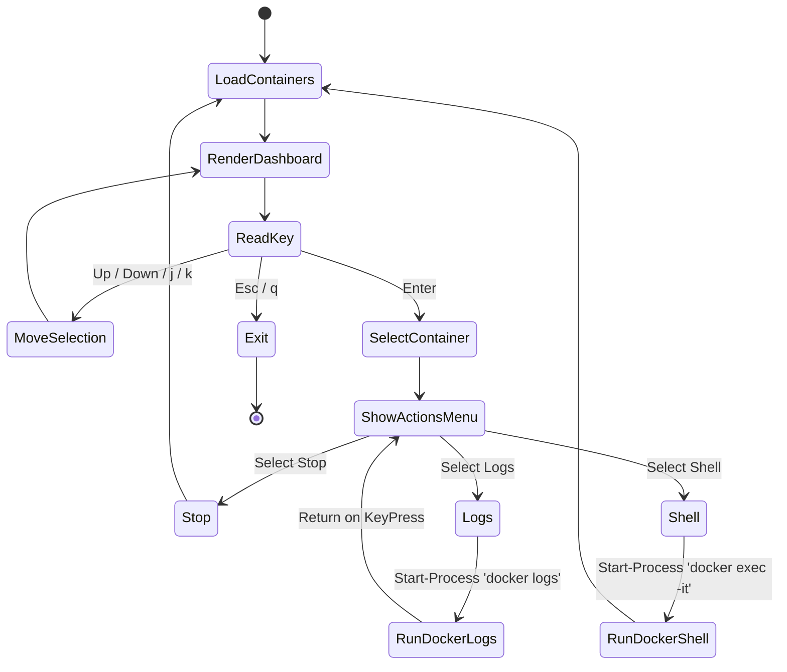

# Specification: Interactive Docker TUI Dashboard

This document details the design specifications for the Docker container manager (`dkcl` / `docker-dashboard`) which provides a terminal-based dashboard to view logs, execute commands, start/stop, and manage containers.

---

## 1. Interface Design & Layout

When the user runs `dkcl` without arguments (in Human Mode), it renders a live list of containers.

```text
  Docker Container Manager  [Containers: 3]
  ==============================================================
  > 🟢 Up 3 hours      | finance-db             | postgres:15
    🔴 Exited (137)    | web-app                | node:20
    🟢 Up 10 minutes   | localstack             | localstack/localstack
  ==============================================================
  [j/k] Up/Down | [Enter] Actions Menu | [q/Esc] Exit Dashboard
```

Selecting a container (e.g. `finance-db`) opens a sub-menu:
```text
  Actions for: finance-db (Status: Running)
  ========================================
  > [1] ⏹ Stop Container
    [2] 🪵 View Logs (tail -n 100 -f)
    [3] 💻 Open Interactive Shell (bash)
    [4] 🔄 Restart Container
    [5] ❌ Remove Container (force)
```

### A. Docker Compose Grouping (v2.1)
To simplify multi-container application operations, `dkcl` will read container labels (e.g., `com.docker.compose.project`) and group them visually in the TUI:
```text
  Docker Container Manager  [Containers: 3]
  ==============================================================
  📂 Project: finance-stack [Compose]
  > 🟢 Up 3 hours      | finance-db             | postgres:15
    🔴 Exited (137)    | web-app                | node:20
  📂 Project: standalone-tools
    🟢 Up 10 minutes   | localstack             | localstack/localstack
  ==============================================================
```
Selecting a Project header (e.g., `📂 Project: finance-stack`) opens a project-wide actions sub-menu to `Stop Project`, `Restart Project`, or `View Combined Logs` (multiplexed log output).

---

## 2. Dynamic Input Routing & State Machine



---

## 3. Human vs. AI Agent Modes

To ensure the AI agent can query and interact with containers without token bloat, the output changes dynamically:

### A. Human Mode
Uses `TerminalMenu` with progress markers, box boundaries, status colors (`🟢`/`🔴`), and interactive key-handlers.

### B. AI Agent Mode
Bypasses TUI completely.
*   Prints a clean, tab-separated table of containers using `docker ps -a` layout with zero visual drawings:
    ```text
    CONTAINER ID   IMAGE                   STATUS         NAMES
    a3e4d9b2c1f0   postgres:15             Up 3 hours     finance-db
    d9f8e7d6c5b4   node:20                 Exited (137)   web-app
    ```
*   This matches the standard `docker ps` command output format, which is compact and easy for the AI agent to parse.
*   Disables the interactive selection prompt.

---

## 4. Tasks
- [x] Design the interactive container dashboard layout for `dkcl` in Human Mode.
- [x] Implement container action submenu (Stop, Logs, Shell, Restart, Remove).
- [x] Implement input event loop/state machine for navigation and action routing.
- [x] Implement AI Agent Mode to output a clean, non-interactive tab-separated table.
- [x] Verify state transitions, command execution, and AI mode outputs.
- [x] Parse `com.docker.compose.project` labels to group containers in list views.
- [x] Add project-wide execution options (Stop/Restart group).
