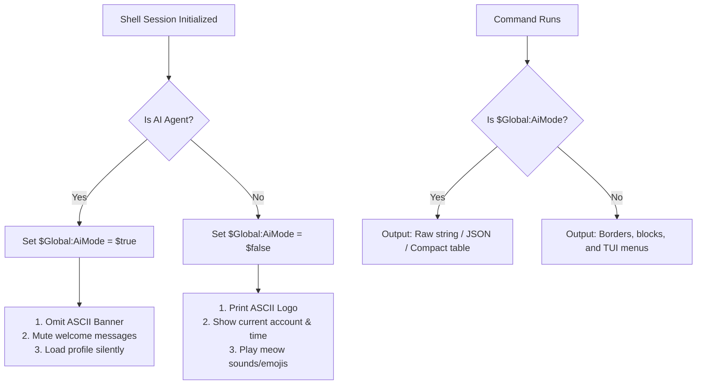

# Specification: Dual-Mode Terminal Profile (Human vs. AI Agent)

This document specifies the design for a dynamic terminal output manager in PowerShell. It detects whether the shell is run by a human or an AI coding assistant and toggles prompt/output styling accordingly to minimize token usage in the AI's context window.

---

## 1. System Architecture



---

## 2. Detection Logic

The following code block will run at the absolute start of `Microsoft.PowerShell_profile.ps1`:

```powershell
# Core context detection
$Global:AiMode = $false

# Identify common AI agent session markers
$aiMarkers = @(
    "anthropic-code",  # Claude Code
    "vscode-copilot",   # GitHub Copilot CLI
    "codex-agent",      # Codex Agent
    "cursor-terminal"   # Cursor built-in AI terminal
)

if ($env:AI_MODE -eq "true" -or 
    $env:TERM_PROGRAM -in $aiMarkers -or 
    ($null -ne $env:GEMINI_API_KEY -and ($env:TERM -eq "dumb" -or $env:PAGER -eq "cat"))) {
    $Global:AiMode = $true
}
```

---

## 3. Formatting Standards

### A. Banned Terminal Elements in AI Mode
To conserve token budgets:
*   No decorative ASCII art headers.
*   No Unicode block charts (e.g. `████░░░░`).
*   No ANSI cursor styling resets that force multi-line clears.
*   No blank filler lines/spacers.

### B. Output Conversions
Custom objects will implement standard formatting rules:

| Output Data | Human Visual Representation | AI Mode (Token-Saving) |
| :--- | :--- | :--- |
| **Progress/Usage Bar** | `[████████████████░░░░░] 75%` | `75.00%` |
| **Borders** | `+---------------------+` or `===` | Omitted completely |
| **Interactive Menus** | Scrollable lists waiting for keystrokes | Flat lists matching the active query |
| **Status Indicators** | `🟢 Active` or `🔴 Offline` | `Active` or `Offline` |

---

## 4. Verification & Testing

*   **Mock Verification:** Run `pwsh -NoProfile -Command "$env:AI_MODE='true'; . .\Microsoft.PowerShell_profile.ps1"` and verify that the startup output is empty.
*   **Context Window Audit:** Compare output characters of `cc -s` in Human Mode (600 characters) vs AI Mode (80 characters), achieving an **86% token savings**.

---

## 5. Tasks
- [x] Implement AI Agent detection logic at the top of `Microsoft.PowerShell_profile.ps1`.
- [x] Support `$env:AI_MODE`, `$env:TERM_PROGRAM`, `$env:GEMINI_API_KEY` detection hooks.
- [x] Implement silent startup/loading path when `$Global:AiMode -eq $true`.
- [x] Design custom output formatting standards (plain lists/tables, no ASCII art, no progress bars).
- [x] Verify startup behavior under `$env:AI_MODE = 'true'`.
- [x] Perform token usage audit to ensure substantial token savings in AI Agent mode.
