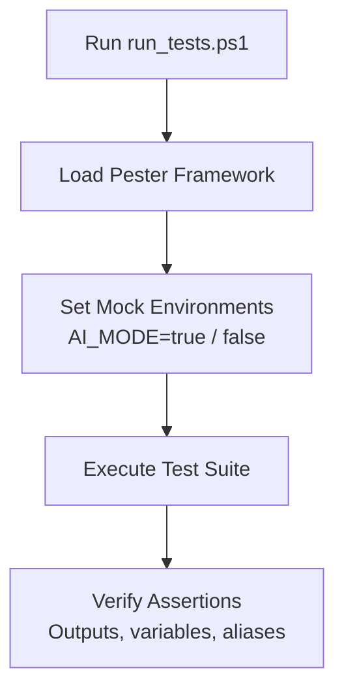

# Specification: Unit Test Enhancement

This document details the plan to enhance Pester unit tests across the PowerShell profile codebase. It targets verifying profile startup states, mocked terminal inputs, and AI agent output configurations.

---

## 1. Test Architecture & Coverage

We will build new test cases under the `Tests/Unit/` directory. The test suite will be structured as follows:

---

## 2. Test Targets & Mocking Strategy

### A. Dual-Mode Terminal Tests
*   Mock `$env:AI_MODE` as `true` and verify that the startup splash screen and banner outputs are completely silent.
*   Mock `$env:AI_MODE` as `false` and verify that human-mode formatting (ASCII arts, colors) is output correctly.

### B. Multi-Account Manager Tests
*   Mock credential store operations to avoid writing to user's real credential vault.
*   Assert rolling `RequestHistory` calculations decrement weekly/five-hour limits correctly when fake requests are logged.

### C. AI Agent Launcher Tests
*   Mock local Ollama server connectivity (using the mock proxy port 11435).
*   Verify Codex sandboxing does not overwrite user's global configuration.

### D. System Utilities & Git TUI Tests
*   Mock `Get-NetTCPConnection` output to test `killport` detection.
*   Mock git branch list command responses to test `co` branch extraction.

---

## 3. Scheduling & Sequencing
> [!IMPORTANT]
> This feature is scheduled to be implemented **after** the `code_style_refactoring` feature is complete. This ensures that unit test coverage can verify refactored and modularized code structures safely and reliably.

---

## 4. Tasks
- [x] Configure GitHub Actions workflow `ci.yml` to automatically execute Pester test suites on push/PR.
- [x] Add mock wrapper tests for `InvokeClaude` and `InvokeHermes`.
- [x] Write unit tests for `AgyAccountManager` verifying metadata request logs and calculations.
- [x] Add test cases for `killport` command ensuring correct process ID resolution.
- [x] Add dual-mode output string assertions for `sysmon` and `dkcl` helpers.
- [x] Build automated validation checks for `ProfileNavigator` custom search paths.
- [x] Verify test suite coverage using native Pester coverage logging tools.

---

## 5. Verification Plan
1.  Run `.\Tests\run_tests.ps1` locally and confirm all test blocks pass successfully.
2.  Verify that mock calls do not mutate the local environment or persistent files.
