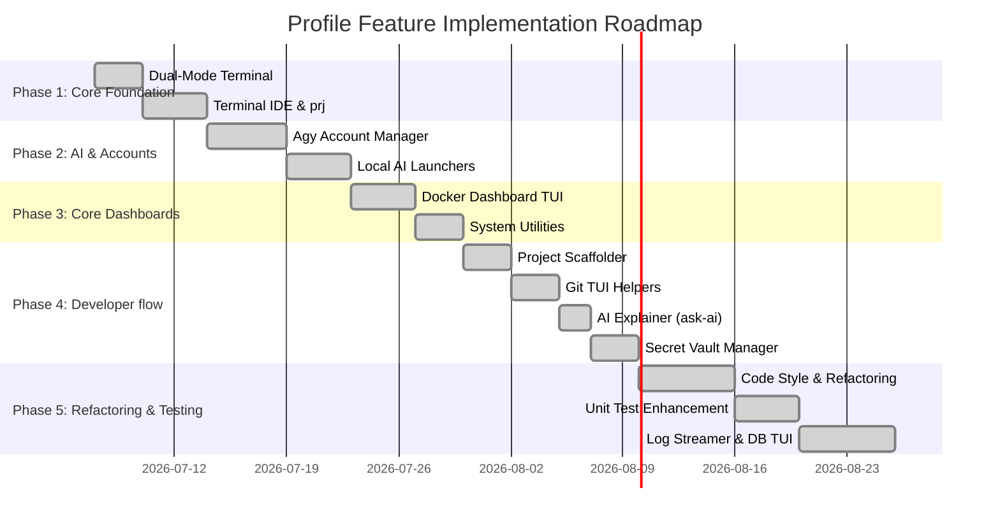

# Centralized Feature Roadmap & Implementation Decision Matrix

This document centralizes all planned, suggested, and newly explored features for the Enhanced PowerShell Profile. It provides a formal decision matrix evaluating features based on token savings, developer experience (UX) value, implementation complexity, and schedules them in a prioritized queue.

---

## 1. Feature Catalog

### Core Planned Features
1.  **Dual-Mode Terminal Profile:** Auto-detects AI Agent shells and toggles styling.
2.  **Terminal IDE (Micro/Neovim):** Integrates visual sidebar editors with workspace navigations.
3.  **Antigravity Multi-Account (Agy):** Manages account toggles, usage histories, and rolling quota displays.
4.  **Local AI Agent Integration:** Configures Ollama base layers, Claude Code launchers, and Hermes runtimes.
5.  **Docker Dashboard TUI (`dkcl`):** Interactive container status manager and log reader.
6.  **System Utilities (`sysmon` / `killport`):** CPU/RAM gauges and port blockers terminator.
7.  **Project Scaffolder (`new-project`):** Template-driven code bootstrap engine.
8.  **Git TUI Helpers (`co` / `gcmt`):** Branch switchers and Conventional Commit wizards.

### Newly Explored Proposed Features
9.  **AI Command Explainer (`??` / `ask-ai`):** Uses local Ollama contexts to explain console errors or suggest cmdlets instantly.
10. **Environment & Secret Vault Manager (`sec` / `vault`):** Encrypts and dynamically loads API keys/secrets using Windows DPAPI.
11. **Database Schema & Query TUI (`db-tui`):** TUI SQL navigator to explore schemas and query PostgreSQL, SQLite, and SQL Server tables.
12. **Multi-Log Stream Tailer (`logstream`):** Aggregates and colorizes local log files, Docker container streams, and application traces.

---

## 2. Decision & Evaluation Matrix

We evaluate each feature based on four metrics to determine the optimal implementation order:
*   **Token Savings:** Character-count reduction when executed by an AI agent.
*   **Human UX Value:** Interactive enhancement and convenience for human developer sessions.
*   **Complexity:** Technical effort required (Low / Medium / High).
*   **Priority:** Order of execution (P0: Critical, P1: High, P2: Medium).

| Feature Name | Token Savings | Human UX Value | Complexity | Priority | Focus |
| :--- | :--- | :--- | :--- | :--- | :--- |
| **1. Dual-Mode Terminal** | Critical (80%+) | Low (Silence) | Low | **P0** | Foundation / AI-Safe |
| **2. Terminal IDE** | High | High | Medium | **P0** | Workspace Nav |
| **3. Agy Account Manager** | Medium | High | High | **P0** | Quota Control |
| **4. Local AI Launcher** | High (Codex MCP) | High | Medium | **P0** | Ollama Native |
| **5. Docker Dashboard** | High | High | Medium | **P1** | Container Mgmt |
| **6. System Utilities** | High | High | Medium | **P1** | System Diagnostics |
| **7. Project Scaffolder** | Medium | High | Low | **P1** | Scaffolding |
| **8. Git TUI Helpers** | Medium | High | Low | **P1** | VCS Helpers |
| **9. AI Explainer (`ask-ai`)** | N/A (Human only) | High | Low | **P1** | Local AI Helpers |
| **10. Secret Vault (`sec`)** | Medium (Security) | High | Medium | **P2** | Security / Vault |
| **11. Code Refactoring Assistant**| High | High | High | **P2** | Style / AST Analysis |
| **12. Unit Test Enhancement** | Medium (CI Safety) | Medium | Medium | **P2** | Verification |
| **13. Log Streamer (`logstream`)**| Low | High | Medium | **P2** | Diagnostics |
| **14. Database TUI (`db-tui`)** | Low | High | High | **P2** | DB Explorer |

---

## 3. Prioritized Implementation Sequence

Based on the decision matrix above, features are grouped into five sequential phases. All phases have been successfully implemented and validated.

### Phase 1: Core Foundation (AI Detection & Workspaces) - [Completed]
*   **Target:** Establish safety bounds so AI agents do not get stuck, and set up the IDE interface.
*   **Why First:** If AI detection and token-saving silent boots are not configured first, testing subsequent features will generate massive prompt noise and lock interactive loops.

### Phase 2: Account & API Isolation - [Completed]
*   **Target:** Secure API keys and decouple local Ollama clients from Antigravity metrics.
*   **Why Second:** Essential for developers using multiple workspace profiles or shifting between local offline runs and paid API networks.

### Phase 3: Operations & Diagnostics - [Completed]
*   **Target:** Build container monitors (`dkcl`) and live system tools (`sysmon`, `killport`).
*   **Why Third:** Provides standard operating tooling directly inside the integrated shell Control Center.

### Phase 4: Developer Workflow Helpers - [Completed]
*   **Target:** Launch templating tools (`new-project`), branch operations (`co`), commit formatters (`gcmt`), local AI explainers (`ask-ai`), and encrypted credentials (`sec`).
*   **Why Fourth:** Increases coding velocity once the base shells and dashboards are stabilized.

### Phase 5: Linting, Quality & Database Exploration - [Completed]
*   **Target:** Roll out `refactor` checkers, Pester unit test suites, log streams, and database TUIs.
*   **Why Last:** Refactoring features and unit tests require completed implementations of all earlier features to be effective. Database and log viewers are non-critical optimizations.

---

## 4. Tasks for Phase 4 & 5 Newly Explored Features

### AI Command Explainer (`ask-ai`)
- [x] Implement short aliases `??` and `ask-ai` routing to Ollama local prompt queries.
- [x] Bind context scanner to send the last printed error (via `$error[0]`) automatically if requested.
- [x] Format responses using compact markdown text streams.

### Secret Vault Manager (`sec`)
- [x] Implement `sec-set` and `sec-get` using Windows Data Protection API (DPAPI).
- [x] Support secure storage of API tokens in `$HOME/.config/profile_vault.bin` (DPAPI-encrypted secrets.json).
- [x] Implement auto-injection of decrypted environment secrets during profile startup.

### Log Stream Tailer (`logstream`)
- [x] Create `logstream` script matching regex patterns to highlight errors and warnings.
- [x] Implement log multiplexing to read from Docker logs and .NET application log files simultaneously.

### Database TUI (`db-tui`)
- [x] Integrate SQLite schema readers using standard ADO.NET connections / sqlite3 CLI.
- [x] Implement table selection menus and row limits to prevent massive token bloats.

---

## 5. Advanced Enhancements to Existing Features (v2.1)

### Multi-Account (`agy` / `acc` / `AgyAccountManager`)
*   **Workspace-Contextual Auto-Switching:** Auto-detects project folders and silently updates environment variables/credential sets.
*   **Offline Mode Fallback:** Load local caches with an `[Offline]` badge in headers to bypass active authentication API delays when offline.
*   **Tasks:**
    - [x] Map directories to specific credential profiles in `Projects.ps1`.
    - [x] Add auto-trigger switch hooks to the global navigator controller functions.
    - [x] Implement non-blocking ping checks to bypass credentials validation if offline.

### Project Navigator (`prj` / `ProfileNavigator`)
*   **Git Status Badging:** Displays branch names and modified file counts directly on list rows.
*   **Quick-Actions Overlay:** Integrates single-character routing hotkeys (`c` for Code, `i` for IDE, `t` for tests, `d` for Docker) inside selector list views.
*   **Tasks:**
    - [x] Add async/non-blocking git CLI queries for each workspace row in search menus.
    - [x] Implement keypress detection overlays to capture action switches from project selections.

### Docker Dashboard (`dkcl` / `DockerHelper`)
*   **Docker Compose Grouping:** Groups containers by project labels and allows project-wide operations (start, stop, logs).
*   **Tasks:**
    - [x] Parse `com.docker.compose.project` labels to group containers in list views.
    - [x] Add project-wide execution options (Stop/Restart group).

### Git TUI Helpers (`co` / `gcmt` / `GitHelper`)
*   **Stage Verification:** Bypasses Conventional Commit wizard if no staged changes exist.
*   **AI Message Prefills:** Auto-generates descriptions using local Ollama model context from staged diffs on tab-press.
*   **Tasks:**
    - [x] Implement stage validation check in `gcmt` to block empty commits.
    - [x] Implement `[Tab]` handler to invoke local Ollama backend for AI commit message generation based on cached diffs.
