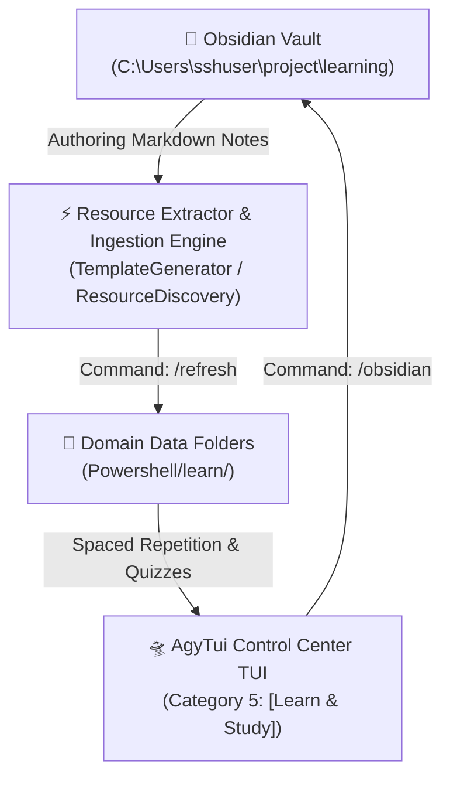

# 🧠 Learning System Architecture & Plan 🛸

## 📌 Executive Summary

The **Learning System** provides a unified, dual-engine learning ecosystem combining:
1. **Obsidian Knowledge Base Vault** (`C:\Users\sshuser\project\learning`): Markdown-based note taking, card creation, and concept mapping.
2. **AgyTui Learning Suite** (`AgyTuiApp`): High-performance Spectre.Console interactive review engine with SuperMemo SM-2 Spaced Repetition scoring, step-by-step ASCII Algorithm Visualizers, and domain-categorized practice modules.

---

## 🏗️ Architecture & Dual-Engine Integration



---

## 📂 Domain Folder Hierarchy (`Powershell/learn/`)

All study data is organized into clean domain sub-directories matching the TUI command suites:

```
Powershell/learn/
├── 🎌 japanese/               # /kana, /kanji, /jlpt, /grammar
│   ├── kana.json              # Hiragana & Katakana character sets
│   ├── kanji.json             # Radical & stroke count lookup data
│   ├── N5.json & N4.json      # 1,653 JLPT vocabulary flashcards
│   └── grammar_n5..n3.json    # Japanese grammar patterns by level
├── 📖 english/                # /vocab, /word-of-day, /grammar
│   ├── vocab/                 # Intermediate & Advanced vocabulary drills
│   ├── word_bank.json         # Word of the Day candidate bank
│   └── grammar.json           # English tenses, conditionals & modals
├── 💻 csharp/                 # /quiz, /snippets
│   ├── csharp_quiz.json       # C# & .NET 9 multiple choice questions
│   └── snippets/              # Reusable code snippet library
├── 🧩 dsa/                    # /algo, /complexity, /problems
│   ├── complexity.json        # Big-O time & space complexity matrices
│   └── problems.json          # LeetCode / Coding problem tracker
├── 💼 career/                 # /interview, /star, /mock
│   ├── interview_questions.json # 34 Behavioral & Technical questions
│   └── star_answers.json        # STAR method answer builder storage
├── 🎴 certifications/          # /flashcard
│   └── decks/                 # 94 generated flashcard decks (AWS, Azure, Copilot...)
├── 📄 cheatsheets/            # /sheets
│   └── *.txt                  # 978 Developer cheat sheet reference files
└── 📊 stats/                  # /stats
    └── study_log.json         # Spaced repetition session review history
```

---

## 🚀 Feature Checklist & Implementation Status

| Module / Feature | Command | Status | Implementation Details |
| :--- | :--- | :--- | :--- |
| **Master Router** | `/learn` | ✅ Complete | Dynamic domain sub-menu with 5 learning suites |
| **Obsidian Browser** | `/obsidian` | ✅ Complete | Search notes, browse tags, view daily notes, render graph |
| **Vault Sync Engine** | `/refresh` | ✅ Complete | Ingests 2,009 files, 3,600 cards, 94 decks, 978 sheets |
| **Vault Folder Launcher**| `/vault-open`| ✅ Complete | Opens vault in Explorer / Obsidian Desktop |
| **Japanese JLPT** | `/jlpt` | ✅ Complete | 1,653 N5 & N4 vocabulary words with example sentences |
| **Kana & Kanji** | `/kana`, `/kanji`| ✅ Complete | Spaced-repetition Kana quiz & Kanji radical search |
| **Grammar Drills** | `/grammar` | ✅ Complete | Japanese N5–N3 & English tenses/conditionals |
| **Flashcard Decks** | `/flashcard`| ✅ Complete | 94 decks with SuperMemo SM-2 scoring engine |
| **C# Masterclass** | `/quiz` | ✅ Complete | Multiple choice C# & .NET 9 quizzes |
| **Algorithm Visualizer**| `/algo` | ✅ Complete | Step-by-step Bubble, Quick, Merge, BFS, DP Fibonacci |
| **Interview Prep** | `/interview`| ✅ Complete | STAR Method answer builder & timed mock sessions |
| **TUI UI & Hotkeys** | `SpectreWidgets`| ✅ Complete | Vim keys (j/k/d/u/g/G), search (/), colored badges |

---

## 🔄 Dual-Engine Synchronization Protocol

1. **Write Notes**: Create Markdown tables or tagged notes in Obsidian (`C:\Users\sshuser\project\learning`).
2. **Rescan & Sync**: Execute **`/refresh`** (or **`/sync`**) inside `cc` TUI to parse tables, headings, and checkboxes into `Powershell/learn/`.
3. **Practice**: Launch `/learn`, `/flashcard`, `/jlpt`, `/quiz`, or `/algo` for interactive review.
4. **Vault Direct Access**: Launch `/obsidian` or `/vault-open` anytime to jump back to Obsidian notes.
