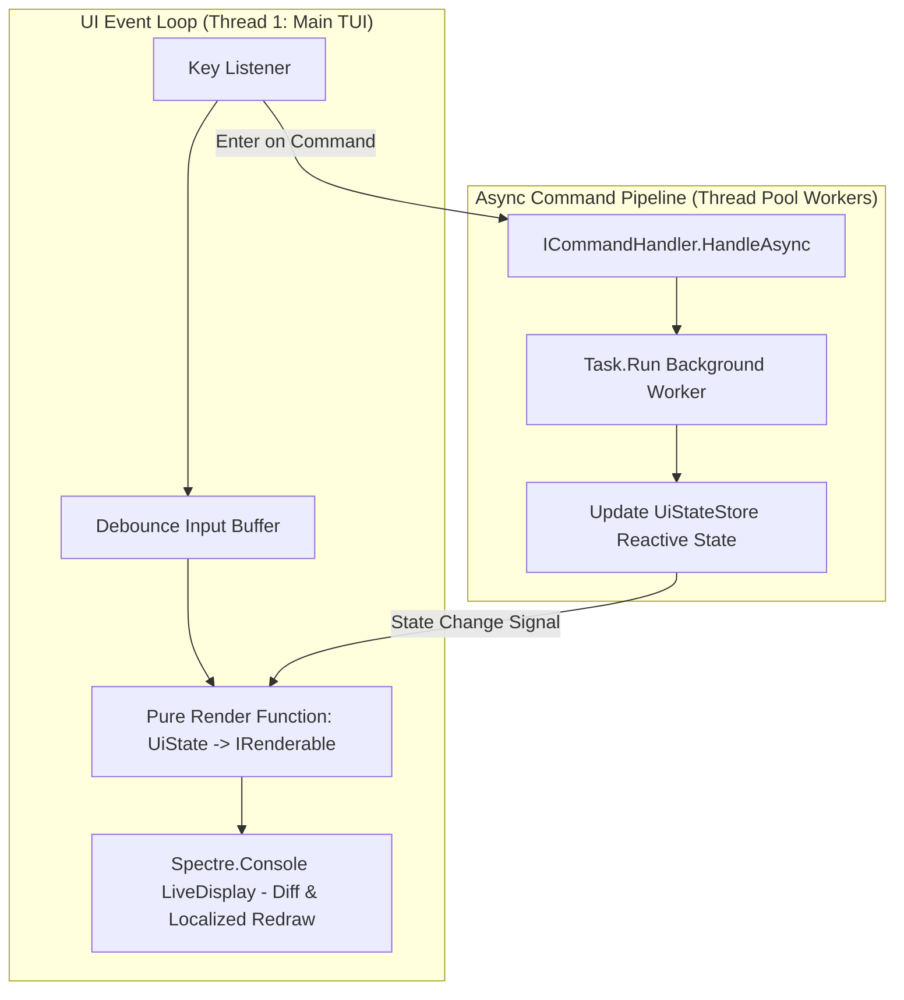
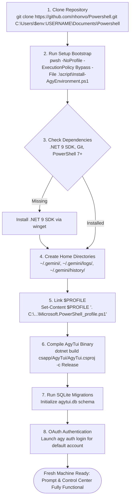

# Master Architectural, DDD & Enterprise Release Plan for PowerShell Control Center (`AgyTui`)

## Executive Summary
This document defines the comprehensive master engineering blueprint for transforming **PowerShell Control Center (`AgyTui`)** into an enterprise-grade, Domain-Driven Design (DDD) terminal application. It details our WebAPI-style DI factory standardization, prohibition of direct `new ServiceObject()` instantiations, solution-wide interface scanning, `ServiceTestFixture` test injection framework, strict Dev vs Release environment separation, smooth non-blocking TUI rendering principles, SQLite persistence (`agytui.db` vs `agytui.dev.db`), Domain Bounded Contexts, automated CI/CD pipelines, fresh machine onboarding flows, path resolution caching, security/vault protection, and developer testing/knowledge documentation architecture.

---

## 🗺️ Detailed Step Execution Breakdown Index

Each major architectural pillar is broken down into a dedicated detailed plan file in the `docs/plan/` directory:

| Step # | Major Architectural Pillar | Detailed Plan Document Link | Status |
| :---: | :--- | :--- | :---: |
| **Step 1** | DI Audit, Prohibition of `new`, & ServiceTestFixture | [step1_di_factory_standardization.md](file:///C:/Users/TruongNhon/Documents/Powershell/docs/plan/step1_di_factory_standardization.md) | **COMPLETED (PLAN)** |
| **Step 2** | Path Resolution & File I/O Optimization | [step2_path_io_optimization.md](file:///C:/Users/TruongNhon/Documents/Powershell/docs/plan/step2_path_io_optimization.md) | **READY** |
| **Step 3** | Domain-Driven Design (DDD) & Bounded Contexts | [step3_ddd_bounded_contexts.md](file:///C:/Users/TruongNhon/Documents/Powershell/docs/plan/step3_ddd_bounded_contexts.md) | **PLANNED** |
| **Step 4** | SQLite Storage & Automated Migration Engine | [step4_sqlite_migration_engine.md](file:///C:/Users/TruongNhon/Documents/Powershell/docs/plan/step4_sqlite_migration_engine.md) | **PLANNED** |
| **Step 5** | PS1 Profile to C# Engine Migration & Parity | [step5_ps1_to_cs_migration.md](file:///C:/Users/TruongNhon/Documents/Powershell/docs/plan/step5_ps1_to_cs_migration.md) | **PLANNED** |
| **Step 6** | UI Architecture, Smooth Rendering & Handlers | [step6_ui_flowchart_hierarchy.md](file:///C:/Users/TruongNhon/Documents/Powershell/docs/plan/step6_ui_flowchart_hierarchy.md) | **COMPLETED (PLAN)** |
| **Step 7** | Dev vs Release Strategy, Build & Onboarding | [step7_build_release_onboarding.md](file:///C:/Users/TruongNhon/Documents/Powershell/docs/plan/step7_build_release_onboarding.md) | **PLANNED** |
| **Step 8** | Testing Strategy, Fixtures & Knowledge Base | [step8_testing_knowledge_base.md](file:///C:/Users/TruongNhon/Documents/Powershell/docs/plan/step8_testing_knowledge_base.md) | **PLANNED** |

---

## 1. Solution-Wide Dependency Injection & Prohibition of `new ServiceObject()`

> 📄 **Detailed Step Plan**: [step1_di_factory_standardization.md](file:///C:/Users/TruongNhon/Documents/Powershell/docs/plan/step1_di_factory_standardization.md)

### 1.1 Prohibition of `new ServiceObject()` Audit Rule
**Direct instantiation of service objects using `new ServiceObject()` across classes is strictly prohibited.** Every service consumed by another class MUST be requested via constructor DI or top-level `Func<T>` factory delegates, backed by clean interfaces (`I<ServiceName>`) registered in `Bootstrapper.cs`.

```csharp
namespace AgyTui.Infrastructure.Integrations.AgyClient;

public class AgyAccountStore : IAgyAccountStore
{
    private readonly IAgyAccountRepository _accountRepo;
    private readonly Func<IAgyQuotaEngine> _quotaEngineFactory;
    private readonly Func<IAgyVault> _vaultFactory;
    private readonly IOptions<AppPathOptions> _pathOptions;

    public AgyAccountStore(
        IAgyAccountRepository accountRepo,
        IOptions<AppPathOptions> pathOptions,
        Func<IAgyQuotaEngine>? quotaEngineFactory = null,
        Func<IAgyVault>? vaultFactory = null)
    {
        _accountRepo = accountRepo;
        _pathOptions = pathOptions;
        _quotaEngineFactory = quotaEngineFactory ?? 
                              (() => Bootstrapper.ServiceProvider.GetRequiredService<IAgyQuotaEngine>());
        _vaultFactory = vaultFactory ?? 
                        (() => Bootstrapper.ServiceProvider.GetRequiredService<IAgyVault>());
    }

    public AgyAccountStore() 
        : this(new SqliteAgyAccountRepository(new SqliteDatabase()), Microsoft.Extensions.Options.Options.Create(new AppPathOptions())) { }
}
```

### 1.2 Anti-Pattern vs Standardized Solution Table

| Anti-Pattern (`new ServiceObject()`) | Standardized DI Solution |
| :--- | :--- |
| `new AiProcessRunner().RunInteractive(...)` | `var runner = _processRunnerFactory(); runner.RunInteractive(...)` |
| `private static readonly IAgyVault _vault = new AgyVault();` | `private static readonly Func<IAgyVault> _vaultFactory = () => Bootstrapper.ServiceProvider.GetRequiredService<IAgyVault>();` |
| `public AgyAccountStore() : this(new SqliteAgyAccountRepository(new SqliteDatabase()))` | Primary constructor with DI fallback `Bootstrapper.ServiceProvider.GetRequiredService<IAgyAccountRepository>()` |
| `public AgyQuotaEngine() : this(new AgyAccountStore())` | Primary constructor with `Func<IAgyAccountStore>` fallback |
| `new AccountTreeWidget()`, `new QuotaChartWidget()` | Instantiated via DI `IServiceProvider` in `StatusWidgetRegistry` |
| Inline `Bootstrapper.ServiceProvider.GetRequiredService` inside method bodies | Top-level `private static readonly Func<T> Factory = ...` |

---

## 2. Smooth Terminal Rendering Principles & UI Command Handling

> 📄 **Detailed Step Plan**: [step6_ui_flowchart_hierarchy.md](file:///C:/Users/TruongNhon/Documents/Powershell/docs/plan/step6_ui_flowchart_hierarchy.md)

### 2.1 Smooth Rendering Architecture



---

## 3. Fresh Computer Onboarding & Automated Setup Flow

> 📄 **Detailed Step Plan**: [step7_build_release_onboarding.md](file:///C:/Users/TruongNhon/Documents/Powershell/docs/plan/step7_build_release_onboarding.md)



---

> [-NOTE]
> All detailed step markdown files are linked above and located inside `C:\Users\TruongNhon\Documents\Powershell\docs\plan\`.
