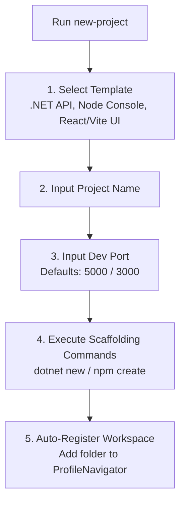

# Specification: Project Scaffolding Wizard (`new-project`)

This document details the specifications for the `new-project` templating wizard. It bootstraps projects and registers them automatically in the workspace navigator.

---

## 1. Interactive Scaffolding Wizard Flow (Human Mode)

When the user runs `new-project`, it opens a dynamic menu wizard:



### Wizard Screens
*   **Step 1: Select Template**
    ```text
      Select Project Template:
      > [1] .NET 8.0 Web API (C#)
        [2] .NET 8.0 Console (C#)
        [3] React + Vite (Typescript)
        [4] Node.js Console app (Javascript)
    ```
*   **Step 2: Enter Project Details**
    ```text
      Enter project name: finance-dashboard
      Enter development port [default 5000]: 5080
    ```
*   **Step 3: Auto-Registration**
    The tool runs the initialization script and appends the path to `ProfileNavigator.ps1` priority lists:
    ```powershell
    # Registers directory in background
    [ProfileNavigator]::RegisterWorkspace("finance-dashboard", $newProjectPath)
    ```

---

## 2. Token-Saving Flow (AI Agent Mode)

If an AI Agent is running the terminal, interactive prompts block execution indefinitely. We decouple the wizard:

1.  **Direct CLI Command Arguments:**
    The `new-project` utility will accept standard non-interactive parameters:
    ```powershell
    new-project -Template "dotnet-webapi" -Name "finance-dashboard" -Port 5080
    ```
2.  **AI Mode Safe Check:**
    If `$Global:AiMode -eq $true` and parameters are missing, the tool prints usage syntax and immediately exits:
    ```text
    Usage: new-project -Template <TemplateName> -Name <ProjectName> [-Port <PortNumber>]
    Templates: dotnet-webapi, dotnet-console, react-vite, node-console
    ```
    This prevents the AI agent from getting stuck.

---

## 3. Tasks
- [x] Build interactive `new-project` picker (templates for .NET, React, Node).
- [x] Implement details prompt (name, port) and scaffold generation commands.
- [x] Integrate auto-registration of new projects in the workspace navigator.
- [x] Implement non-interactive CLI parameters for AI Agent Mode.
- [x] Verify project creation and navigator registration flows.
