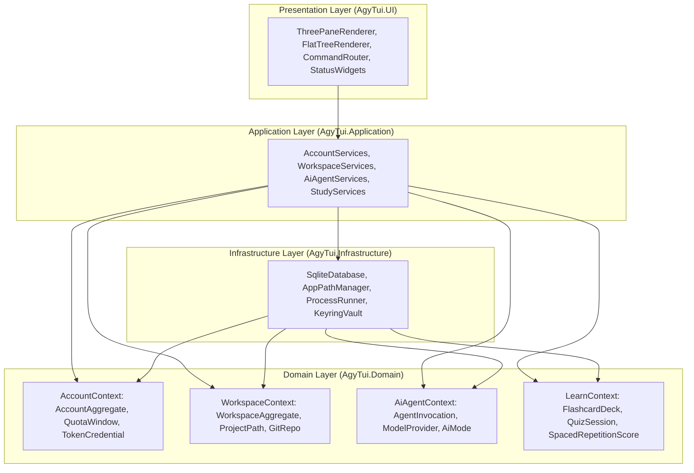

# Detailed Plan - Step 3: Domain-Driven Design (DDD) & Bounded Context Solution Restructuring

## 1. Objective
Restructure `csapp/AgyTui` into clean, decoupled Domain Bounded Contexts following Domain-Driven Design (DDD) principles.

---

## 2. Bounded Context Architecture

---

## 3. Core Aggregates & Value Objects

1. **Account Context**:
   - `AccountAggregate`: Root entity tracking `AccountName`, `Email`, `IsActive`, `QuotaExceeded`, and `RequestHistory`.
   - `QuotaMetrics` (Value Object): Immutable snapshot of 5-hour rolling usage and 168-hour (weekly) capacity.
   - `EncryptedToken` (Value Object): Protected DPAPI token representation.

2. **Workspace Context**:
   - `WorkspaceAggregate`: Root entity tracking `WorkspacePath`, `CorpusName`, `IsActive`, and `GitBranch`.
   - `ProjectPath` (Value Object): Validated, normalized Windows absolute path.

3. **AI Agent Context**:
   - `AgentInvocationLog`: Audit record entity storing `Alias`, `TimestampUtc`, `DurationMs`, `SuccessStatus`, and `ActiveAccount`.
   - `ProviderMode` (Enum Value Object): `Auto`, `CloudDirect`, `LocalOllama`.

4. **Learn Context**:
   - `Flashcard` & `Quiz`: Value objects tracking SM-2 spaced repetition scores (`IntervalDays`, `EaseFactor`, `Repetitions`, `NextReviewUtc`).

---

## 4. Implementation Checklist

- [ ] Create `AgyTui.Domain` directory structure for Bounded Contexts.
- [ ] Define `AccountAggregate` and `QuotaMetrics` value objects.
- [ ] Define `WorkspaceAggregate` and `ProjectPath` value objects.
- [ ] Define `AgentInvocationLog` entity and `ProviderMode` enum.
- [ ] Implement Application services mapping presentation commands to domain aggregates.
