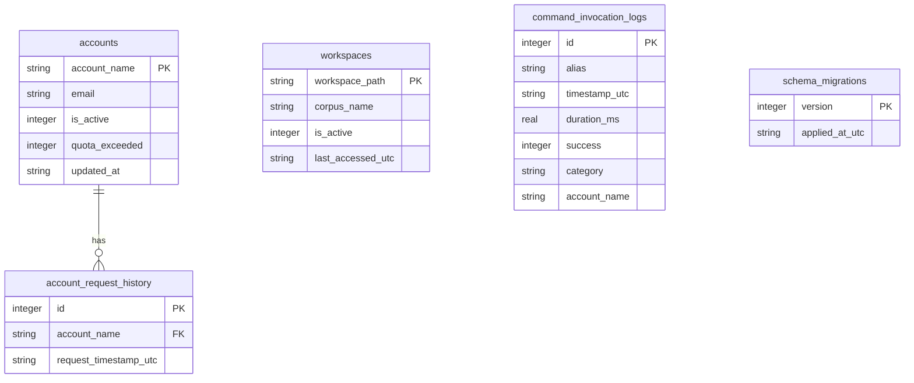

# Detailed Plan - Step 4: SQLite Database Storage & Automated Migration Engine

## 1. Objective
Establish a single SQLite database (`agytui.db`) and an automated, embedded DDL migration runner (`SqliteMigrationEngine`) to manage schema versioning safely across environments.

---

## 2. Database Schema Diagram (`agytui.db`)



---

## 3. Migration Engine Implementation (`SqliteMigrationEngine.cs`)

```csharp
namespace AgyTui.Infrastructure.Persistence;

public class SqliteMigrationEngine
{
    private readonly ISqliteDatabase _db;

    public SqliteMigrationEngine(ISqliteDatabase db)
    {
        _db = db;
    }

    public void ApplyMigrations()
    {
        using var conn = _db.CreateConnection();
        conn.Open();

        using var cmd = conn.CreateCommand();
        cmd.CommandText = @"
            CREATE TABLE IF NOT EXISTS schema_migrations (
                version INTEGER PRIMARY KEY,
                applied_at_utc TEXT NOT NULL
            );";
        cmd.ExecuteNonQuery();

        int currentVersion = GetCurrentVersion(conn);
        var scripts = GetEmbeddedMigrationScripts(); // V1__InitialSchema.sql, V2__AddLogs.sql

        foreach (var (version, sql) in scripts.Where(s => s.Version > currentVersion))
        {
            using var tx = conn.BeginTransaction();
            using var migrateCmd = conn.CreateCommand();
            migrateCmd.Transaction = tx;
            migrateCmd.CommandText = sql;
            migrateCmd.ExecuteNonQuery();

            using var recordCmd = conn.CreateCommand();
            recordCmd.Transaction = tx;
            recordCmd.CommandText = "INSERT INTO schema_migrations (version, applied_at_utc) VALUES (@v, @dt);";
            recordCmd.Parameters.AddWithValue("@v", version);
            recordCmd.Parameters.AddWithValue("@dt", DateTime.UtcNow.ToString("o"));
            recordCmd.ExecuteNonQuery();

            tx.Commit();
        }
    }
}
```

---

## 4. Implementation Checklist

- [x] Create `SqliteAgyAccountRepository.cs` and `accounts` table creation.
- [ ] Create `SqliteMigrationEngine.cs` class.
- [ ] Add `V1__InitialSchema.sql` embedded resource script.
- [ ] Add `V2__AddCommandLogs.sql` embedded resource script.
- [ ] Register `SqliteMigrationEngine` in `Bootstrapper.cs` and execute during application startup.
- [ ] Add integration tests in `SqlitePersistenceTests.cs`.
