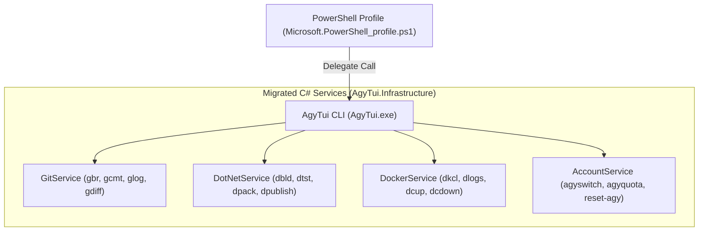

# Detailed Plan - Step 5: PowerShell Profile to C# Engine Migration & Parity Testing

## 1. Objective
Migrate simple wrapper functions in `Microsoft.PowerShell_profile.ps1` to compiled C# services inside `AgyTui.Infrastructure`, delegating calls cleanly to `AgyTui.exe` or C# CLI modules while verifying 100% test parity.

---

## 2. Delegation Architecture



---

## 3. Function Migration Inventory

| PS1 Function / Alias | Current PS1 Implementation | Target C# Implementation |
| :--- | :--- | :--- |
| `Show-GitDiff` (`gd`) | `git diff $args` | `GitClient.ShowDiffInteractive()` with Spectre colorized diff parser |
| `Show-GitStatus` (`gs`) | `git status --short` | `GitClient.GetStatusSummary()` with Spectre status table |
| `Invoke-ConventionalCommit` (`gcmt`) | Read-Host prompts | `GcmtWizard.Run()` Spectre interactive wizard |
| `Reset-AgyAccountData` (`reset-agy`) | Inline `Bootstrapper` lookup | `IAgyAccountStore.PurgeAllNonDefaultAccounts()` |
| `Show-DockerHealth` (`docker-health`) | `docker stats --no-stream` | `DockerClient.GetContainerHealth()` with live resource table |

---

## 4. Parity Testing Strategy (`ProfileAliasParityTests.cs`)

```csharp
namespace AgyTui.Tests.Parity;

public class ProfileAliasParityTests
{
    [Theory]
    [InlineData("gs")]
    [InlineData("gbr")]
    [InlineData("dbld")]
    [InlineData("agyswitch")]
    public void Alias_In_Registry_Has_Matching_Router_Handler(string alias)
    {
        var entry = CommandRegistry.GetByAlias(alias);
        Assert.NotNull(entry);
    }
}
```

---

## 5. Implementation Checklist

- [x] Update `CommandRegistry.cs` to include all profile aliases (`cnav`, `reset-agy`, `purge-accounts`, `dotnet-info`).
- [x] Update `CommandRouter.cs` to handle execution for newly added aliases.
- [x] Refactor `Microsoft.PowerShell_profile.ps1` to delegate function calls directly to `AgyTui <alias>`.
- [x] Create `ProfileAliasParityTests.cs` in `csapp/AgyTui.Tests/Parity/`.
- [x] Verify all 91+ unit tests pass.
