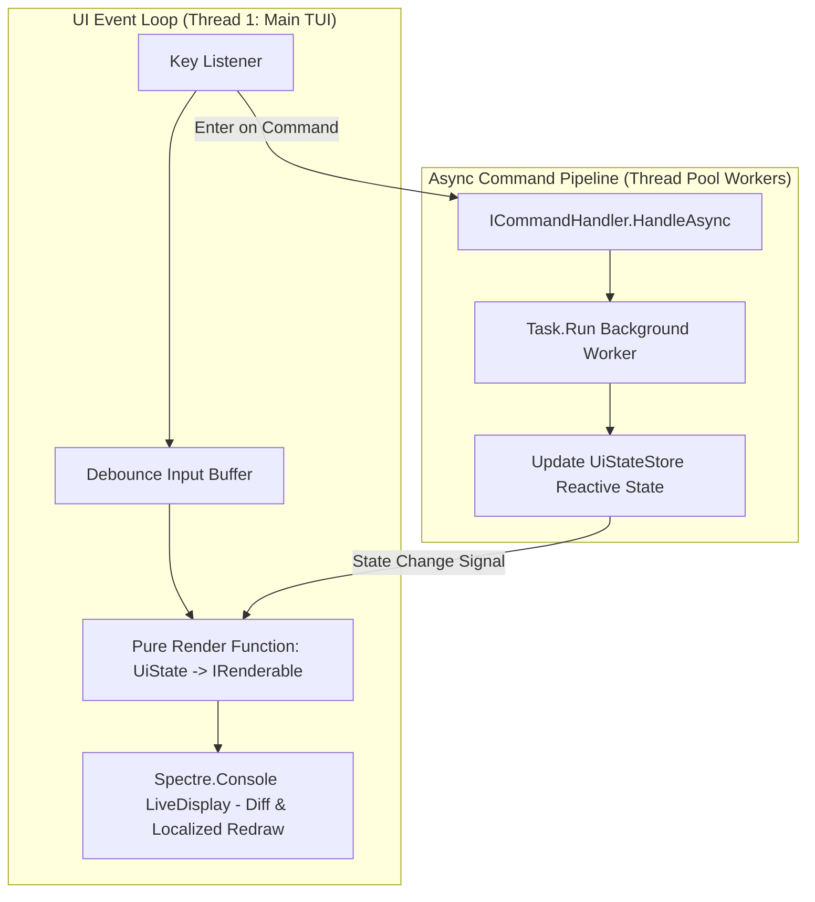
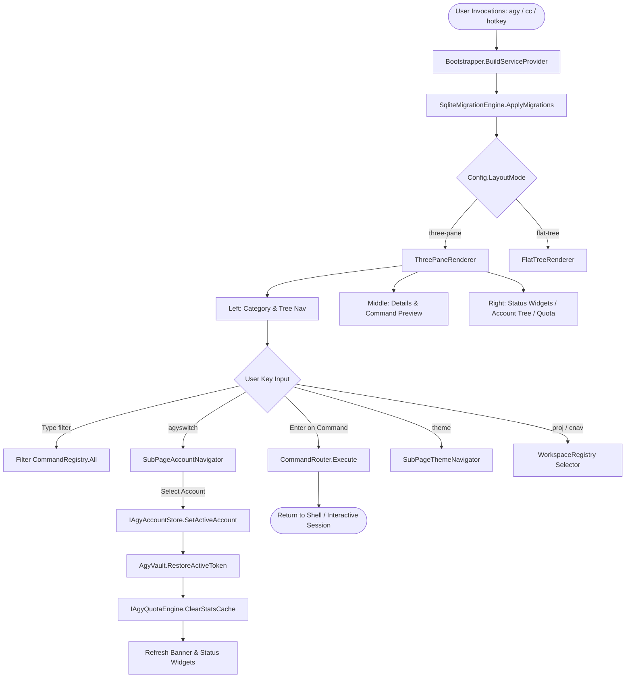

# Detailed Plan - Step 6: UI Architecture, Command Handling & Smooth Rendering Pipeline

## 1. Executive Summary
This document defines the architecture for standardizing UI command handling, decoupling rendering from command execution, and enforcing **Smooth Terminal Rendering Principles** across `AgyTui`. This ensures zero terminal screen flicker, no blocking UI main looper threads, and sub-16ms layout render passes.

---

## 2. Smooth Terminal Rendering Principles



### Core Rendering Rules
1. **No Screen Flicker (`AnsiConsole.Clear` Prohibition)**:
   - Never invoke full terminal clear operations (`AnsiConsole.Clear()`) during live typing or navigation.
   - Utilize Spectre.Console `AnsiConsole.Live(...)` or in-place ANSI cursor repositioning to update only changed buffer regions.
2. **Zero UI Thread Blocking**:
   - All I/O calls (git status queries, disk scans, network requests, AI agent spawns) execute asynchronously on worker threads.
   - The TUI thread remains responsive at 60 FPS while background spinners render status updates in the right pane.
3. **Pure State-Driven Rendering**:
   - Renderers (`ThreePaneRenderer`, `FlatTreeRenderer`) are pure functions: `(UiState) => IRenderable`.
   - `UiState` is immutable and updated via a centralized state store (`UiStateStore`).

---

## 3. WebAPI-Style UI Command Handling Engine

### 3.1 Command Dispatcher & Handler Architecture (`IUiCommandDispatcher`)

```csharp
namespace AgyTui.UI.Core.Commands;

public interface IUiCommandDispatcher
{
    Task DispatchAsync<TCommand>(TCommand command, CancellationToken ct = default) where TCommand : class;
}

public class UiCommandDispatcher : IUiCommandDispatcher
{
    private readonly IServiceProvider _serviceProvider;

    public UiCommandDispatcher(IServiceProvider serviceProvider)
    {
        _serviceProvider = serviceProvider;
    }

    public async Task DispatchAsync<TCommand>(TCommand command, CancellationToken ct = default) where TCommand : class
    {
        var handler = _serviceProvider.GetService<ICommandHandler<TCommand>>();
        if (handler != null)
        {
            await handler.HandleAsync(command, ct);
        }
    }
}
```

### 3.2 Non-Blocking Background Command Execution Handler Example

```csharp
namespace AgyTui.UI.Core.Commands.Handlers;

public record RunGitStatusQueryCommand();

public class RunGitStatusQueryCommandHandler : ICommandHandler<RunGitStatusQueryCommand>
{
    private readonly IGitClient _gitClient;
    private readonly IUiStateStore _stateStore;

    public RunGitStatusQueryCommandHandler(IGitClient gitClient, IUiStateStore stateStore)
    {
        _gitClient = gitClient;
        _stateStore = stateStore;
    }

    public async Task HandleAsync(RunGitStatusQueryCommand command, CancellationToken ct = default)
    {
        // 1. Mark status widget state as loading
        _stateStore.Update(state => state with { IsGitQueryLoading = true });

        // 2. Offload heavy git execution to ThreadPool worker
        var result = await Task.Run(() => _gitClient.GetShortStatusSummary(), ct);

        // 3. Update reactive UI state off-thread
        _stateStore.Update(state => state with { 
            GitStatusSummary = result, 
            IsGitQueryLoading = false 
        });
    }
}
```

---

## 4. Interactive Menu Rendering Lifecycle & Categorization Tree



---

## 5. Implementation Checklist

- [x] Create `proposed_command_menu_tree.md` artifact detailing all menu categories.
- [x] Update `CommandRegistry.cs` to add `cnav`, `reset-agy`, `purge-accounts`, `dotnet-info`.
- [x] Update `CommandRouter.cs` to execute new menu items.
- [x] Create `UiStateStore.cs` for reactive, immutable UI state management.
- [x] Refactor `ThreePaneRenderer` to accept `UiState` as a pure render function.
- [x] Implement `IUiCommandDispatcher` and non-blocking background command handlers.
- [x] Add compact auto-wrapping Spectre tables for mobile density mode (`mobile-setup`).
- [x] Enhance real-time HSL color gradients in `QuotaChartWidget` and `LiveDashboard`.
