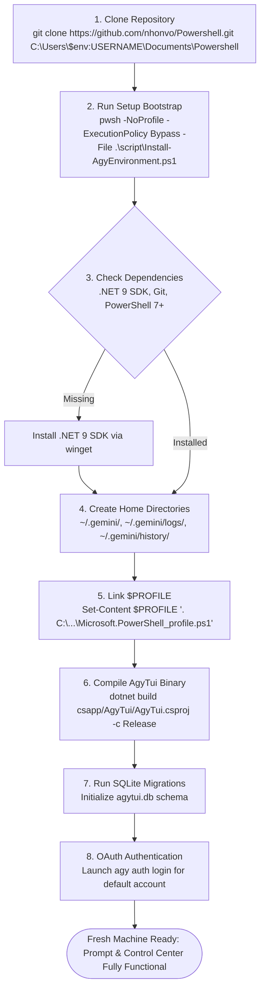

# Detailed Plan - Step 7: Dev vs Production Release Strategy & Onboarding Flow

## 1. Executive Summary
This document defines the strict separation between **Development (Dev)** and **Production (Release/Prod)** environments, versioning policies, automated fresh computer setup (`Install-AgyEnvironment.ps1`), single-file AOT packaging, and GitHub Actions CI/CD release pipelines.

---

## 2. Dev vs Production Environment Separation

To prevent developer testing from polluting production state, `AgyTui` enforces strict environment separation based on `ENVIRONMENT` / `DOTNET_ENVIRONMENT` variables:

| Component / Setting | Development Environment (`Dev`) | Production Environment (`Release`) |
| :--- | :--- | :--- |
| **Environment Flag** | `ENVIRONMENT=Development` | `ENVIRONMENT=Production` |
| **Version Scheme** | `v1.0.0-dev.{BUILD_NUMBER}` (e.g. `v1.0.0-dev.142`) | Semantic Versioning `v1.0.0` |
| **SQLite Database** | `%USERPROFILE%\.gemini\agytui.dev.db` | `%USERPROFILE%\.gemini\agytui.db` |
| **Build Binary Path** | `csapp/AgyTui/bin/Debug/net9.0/AgyTui.exe` | `dist_release/AgyTui.exe` (Single-File) |
| **Logging Level** | `Verbose` / `Debug` (console & file logging) | `Warning` / `Error` (audit log only) |
| **AOT Trimming** | Disabled (fast incremental build) | Enabled (`PublishSingleFile=true`, Trimmed) |
| **Feature Flags** | Experimental features enabled by default | Stable features only |

---

## 3. Environment Configuration & Database Isolation

```csharp
namespace AgyTui.Core.Configuration;

public static class EnvironmentProvider
{
    public static bool IsDevelopment => string.Equals(
        Environment.GetEnvironmentVariable("ENVIRONMENT") ?? Environment.GetEnvironmentVariable("DOTNET_ENVIRONMENT"),
        "Development",
        StringComparison.OrdinalIgnoreCase);

    public static string DatabaseFileName => IsDevelopment ? "agytui.dev.db" : "agytui.db";
}
```

---

## 4. Fresh Computer Setup & Onboarding Flow



---

## 5. Bootstrap Setup Script (`script/Install-AgyEnvironment.ps1`)

```powershell
# Install-AgyEnvironment.ps1 — Automated Fresh Machine Onboarding
[CmdletBinding()]
param(
    [string]$TargetDir = "$HOME\Documents\Powershell",
    [switch]$DevEnvironment = $false
)

Write-Host "🚀 Starting PowerShell Control Center Fresh Machine Setup..." -ForegroundColor Cyan

if ($DevEnvironment) {
    $env:ENVIRONMENT = "Development"
    Write-Host "⚠️ Setting up DEVELOPMENT environment (agytui.dev.db)..." -ForegroundColor Yellow
} else {
    $env:ENVIRONMENT = "Production"
}

# 1. Ensure .NET 9 SDK is installed
if (-not (Get-Command "dotnet" -ErrorAction SilentlyContinue)) {
    Write-Host "📦 Installing .NET 9 SDK via winget..." -ForegroundColor Yellow
    winget install Microsoft.DotNet.SDK.9 --silent --accept-package-agreements --accept-source-agreements
}

# 2. Ensure .gemini home directories exist
$geminiHome = Join-Path $HOME ".gemini"
@($geminiHome, (Join-Path $geminiHome "logs"), (Join-Path $geminiHome "history"), (Join-Path $geminiHome "data")) | ForEach-Object {
    if (-not (Test-Path $_)) { New-Item -ItemType Directory -Path $_ -Force | Out-Null }
}

# 3. Configure PowerShell Profile link
$profilePath = $PROFILE.CurrentUserAllHosts
$profileDir = Split-Path $profilePath
if (-not (Test-Path $profileDir)) { New-Item -ItemType Directory -Path $profileDir -Force | Out-Null }

$profileSource = Join-Path $TargetDir "Microsoft.PowerShell_profile.ps1"
$profileDotSource = ". '$profileSource'"

if (-not (Test-Path $profilePath) -or -not (Get-Content $profilePath | Select-String -Pattern [regex]::Escape($profileSource))) {
    Add-Content -Path $profilePath -Value "`n# PowerShell Control Center Profile`n$profileDotSource"
    Write-Host "✅ Linked PowerShell profile to $profileSource" -ForegroundColor Green
}

# 4. Restore & Compile AgyTui Binary
Write-Host "🔨 Compiling AgyTui Control Center binary..." -ForegroundColor Cyan
Push-Location $TargetDir
try {
    dotnet restore csapp/AgyTui/AgyTui.csproj
    dotnet build csapp/AgyTui/AgyTui.csproj -c Release
    Write-Host "✅ AgyTui binary built successfully!" -ForegroundColor Green
} finally {
    Pop-Location
}

# 5. Initialize SQLite Database & Environment Variable
$env:GEMINI_HOME = $geminiHome
Write-Host "🎉 Onboarding complete! Run 'rterm' or restart PowerShell to launch AgyTui Control Center." -ForegroundColor Green
```

---

## 6. Single-File Production Build & Release Pipeline

### Local Production Build (`build-release.ps1`)
```powershell
# Compile single-file Production Release binary
dotnet publish csapp/AgyTui/AgyTui.csproj `
    -c Release `
    -r win-x64 `
    --self-contained true `
    -p:PublishSingleFile=true `
    -p:EnableCompressionInSingleFile=true `
    -p:IncludeNativeLibrariesForSelfExtract=true `
    -o ./dist_release
```

### GitHub Actions CI/CD Production Release Workflow (`.github/workflows/release.yml`)
```yaml
name: AgyTui Production Release Pipeline

on:
  push:
    tags:
      - 'v*'

jobs:
  build-and-release:
    runs-on: windows-latest
    steps:
      - uses: actions/checkout@v4
      - name: Setup .NET 9 SDK
        uses: actions/setup-dotnet@v4
        with:
          dotnet-version: 9.0.x
      - name: Restore & Run Tests
        run: dotnet test csapp/AgyTui.Tests/AgyTui.Tests.csproj -c Release
      - name: Build Production Single-File Binary
        run: dotnet publish csapp/AgyTui/AgyTui.csproj -c Release -r win-x64 --self-contained true -p:PublishSingleFile=true -o ./dist
      - name: Create GitHub Release Artifact
        uses: softprops/action-gh-release@v1
        with:
          files: ./dist/AgyTui.exe
```

---

## 7. Implementation Checklist

- [ ] Create `EnvironmentProvider.cs` to manage Dev vs Prod DB filenames (`agytui.dev.db` vs `agytui.db`).
- [ ] Create `script/Install-AgyEnvironment.ps1` with `-DevEnvironment` switch.
- [ ] Create `build-release.ps1` local single-file publish script.
- [ ] Create `.github/workflows/release.yml` GitHub Actions pipeline.
- [ ] Verify test suite runs against Dev environment without mutating production state.
