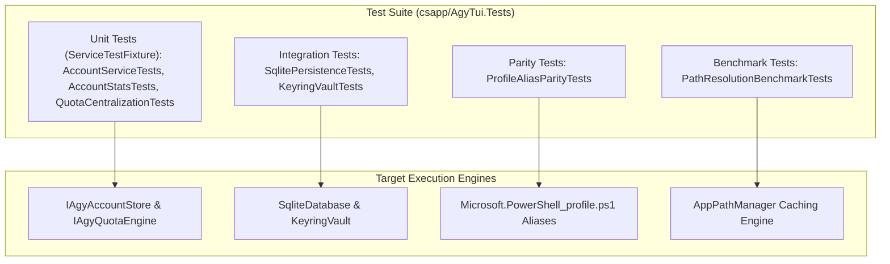

# Detailed Plan - Step 8: Multi-Layered Testing Strategy, Test Fixtures & Knowledge Base Architecture

## 1. Executive Summary
This document defines the multi-layered testing framework and developer knowledge documentation architecture for `csapp/AgyTui`. It details unit test injection fixtures (`ServiceTestFixture`), database integration tests, PowerShell profile alias parity testing, and Obsidian knowledge base synchronization.

---

## 2. Test Injection Fixture Architecture (`ServiceTestFixture`)

To eliminate hardcoded global state or live file operations during automated testing, all unit and integration tests instantiate dependencies via `ServiceTestFixture`:

```csharp
namespace AgyTui.Tests.Fixtures;

public class ServiceTestFixture : IDisposable
{
    public IServiceCollection Services { get; } = new ServiceCollection();
    public IServiceProvider ServiceProvider => Services.BuildServiceProvider();

    public ServiceTestFixture()
    {
        // 1. Register Default Test / In-Memory Services
        Services.AddSingleton<ISqliteDatabase, FakeSqliteDatabase>();
        Services.AddSingleton<IAgyAccountRepository, InMemoryAgyAccountRepository>();
        Services.AddSingleton<IAppPathManager, TestAppPathManager>();
        Services.AddSingleton<IAgyQuotaEngine, TestAgyQuotaEngine>();
        Services.AddSingleton<IAgyVault, TestAgyVault>();
        Services.AddSingleton<IAgyAccountStore, AgyAccountStore>();
    }

    public ServiceTestFixture WithMock<TService>(TService mockInstance) where TService : class
    {
        Services.RemoveAll(typeof(TService));
        Services.AddSingleton(mockInstance);
        return this;
    }

    public void Dispose()
    {
        // Clean up temporary test data directories
    }
}
```

---

## 3. Testing Layers Breakdown



### 3.1 Unit Testing Layer (`Unit/`)
- Tests business logic, quota window math, and account selection.
- Uses `ServiceTestFixture` with `InMemoryAgyAccountRepository` and mock factories.
- Execution speed: `< 50 ms` per test class.

### 3.2 Integration Testing Layer (`Integration/`)
- Tests real SQLite database DDL migrations (`agytui.dev.db`) and DPAPI keyring operations.
- Verifies transaction rollbacks and database schema consistency.

### 3.3 PowerShell Profile Parity Testing Layer (`Parity/`)
- `ProfileAliasParityTests.cs`: Asserts that every function and alias declared in `Microsoft.PowerShell_profile.ps1` has a matching registered command in `CommandRegistry.cs` and a handler in `CommandRouter.cs`.

---

## 4. Implementation Checklist

- [x] Maintain 91/91 unit test pass rate across `csapp/AgyTui.Tests`.
- [ ] Create `ServiceTestFixture.cs` in `csapp/AgyTui.Tests/Fixtures/`.
- [ ] Refactor existing test classes to consume `ServiceTestFixture`.
- [ ] Create `SqlitePersistenceTests.cs` for SQLite CRUD verification.
- [ ] Create `ProfileAliasParityTests.cs` for PS1 function signature parity.
- [ ] Create `docs/guides/testing_and_ci.md` developer guide.
