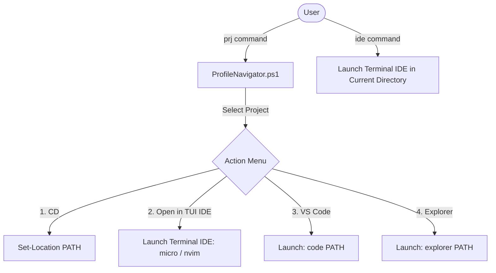

# Terminal IDE & Control Center TUI Integration Plan

This document outlines the plan to:
1. Integrate an existing, fully-featured terminal IDE (either **Micro** or **NeoVim**) into the PowerShell project navigator (`prj`/`Enter-Project`) and alias system.
2. Enhance the Control Center (`cc`) Project Selection option to directly show the TUI list of all projects instead of prompting with a query box.
3. Establish robust search paths for resolving projects and diagnose missing project listings.
4. Solve the TUI rendering duplication bug when sub-actions scroll the terminal screen.
5. **Integrate all new features** (System Resource Monitor, Docker Dashboard, Git Checkout Selector, Port Inspector, Project Scaffolder, and Refactoring Helper) directly into the main Control Center (`cc`) menu.

---

## 1. Selected Solutions Overview

We compare the two best existing terminal-based TUI editors that provide sidebars, VS Code/NeoVim keybindings, and mouse support out of the box.

### Option A: Micro Editor (Recommended for VS Code Keybindings)
*   **Editor:** [Micro Editor](https://github.com/zyedidia/micro)
*   **Keybindings:** Natively uses standard VS Code keyboard shortcuts (`Ctrl+S` to save, `Ctrl+Q` to quit, `Ctrl+C`/`Ctrl+V` to copy/paste, `Ctrl+F` to search).
*   **Mouse Support:** Full mouse clicking, scrolling, and cursor positioning out of the box.
*   **Sidebar:** Toggleable file manager tree plugin (`filemanager`).
*   **Focus Toggle:** Switch focus between the file tree sidebar and the editor pane using `Ctrl+W`.

### Option B: NeoVim (For Modal Editor Users)
*   **Editor:** [NeoVim](https://github.com/neovim/neovim)
*   **Keybindings:** Modal keybindings, highly customizable.
*   **IDE Framework:** Can be paired with pre-configured setups like **LazyVim** or **AstroNvim** which include the `neo-tree` / `nvim-tree` sidebar, tabs, and `telescope` fuzzy finder.

---

## 2. Integration Architecture & User Experience Flow

Below is the conceptual flow of how the user accesses the terminal IDE through the PowerShell profile:



---

## 3. Auto-Configuration & Setup Logic

To make the integration seamless, we will implement a profile function/script to configure the selected editor (using **Micro** as the default):

### A. Directory Tree Sidebar Configuration (`Ctrl+B`)
Micro's keybindings and settings are managed in JSON files. We will programmatically check if the configuration exists under the user profile (`~/.config/micro/`) and apply these default settings:

1.  **Install the Sidebar Plugin:**
    ```bash
    micro -plugin install filemanager
    ```
2.  **Bind `Ctrl+B` to Toggle the Tree Sidebar:**
    Append to `~/.config/micro/bindings.json`:
    ```json
    {
        "Ctrl-b": "command:filemanager.toggle_tree"
    }
    ```
3.  **Auto-Open Sidebar on Start:**
    Append to `~/.config/micro/settings.json`:
    ```json
    {
        "filemanager.openonstart": true
    }
    ```

### B. Path / Executable Verification
Before launching the IDE, the PowerShell profile helper will verify the editor executable:
1.  Check if `micro` is available on the `$env:PATH` using `Get-Command micro -ErrorAction SilentlyContinue`.
2.  If not found, prompt the user to automatically install it via Winget:
    ```powershell
    winget install zyedidia.micro
    ```
3.  Once installed, verify again and run the configuration commands.

---

## 4. Control Center TUI Refinements & Bug Fixes

### A. Direct Project List Selection (No Prompting)
*   **The Issue:** Currently, selecting Option 2 (`[Project]`) in the Control Center Dashboard menu (`cc`) prompts the user with `Enter project name / search query:`.
*   **The Solution:** Replace this prompt with a direct call to `Enter-Project` with no arguments to trigger the interactive `TerminalMenu` project list directly.

### B. Diagnosing & Fixing Empty Projects List
*   **The Solution:** Allow custom search paths by checking if a global list `$Global:ProfileNavigatorSearchPaths` is set, falling back to the default list. Check for the actual active workspace location and ensure it is not matched by `$excludeFolders`.

### C. Fixing the TUI Rendering Duplication Bug
*   **The Solution:** Dynamically re-evaluate the cursor coordinate after returning from any sub-action that prints to the console. We update `$startRow = [Console]::CursorTop` inside the `while` loop at the end of the action blocks.

---

## 5. Advanced Project Navigator Enhancements (v2.1)

### A. TUI Git Status Overlay (Performance Optimized)
In the interactive `prj` search menu, each project row will dynamically display its Git branch and dirty-file status. To avoid shell render lag:
1.  **Fast Queries:** Query status using `git status --porcelain=v1 -b --ignore-submodules=all`. This bypasses deep index scanning and returns immediately.
2.  **Caching Mechanism:** Cache results in a global memory hashtable (`$Global:GitStatusCache`).
3.  **Background Resolution:** If the cache is cold, spawn a lightweight PowerShell background job (`Start-Job`) to resolve it, displaying a loading indicator `(...)` in the menu until the job completes and updates the cache.
4.  **Formatting:** `[ProjectName] ★ (main) [3 files changed]` (Green highlight for clean branch, yellow for dirty changes).

### B. Workspace Quick Actions Menu
Instead of only performing a directory jump (`Set-Location`), selecting a project from the menu will capture specific keybinds to execute rapid tasks:
*   **`[c]` VS Code:** Runs `Start-Process code -ArgumentList (Protect-String $projectPath)` and returns to shell.
*   **`[i]` Terminal IDE:** Runs `Invoke-TerminalIde -Path $projectPath` in-place.
*   **`[d]` Docker Compose:** Spawns a new shell running compose: `Start-Process pwsh -ArgumentList "-NoExit", "-Command", "Set-Location '$projectPath'; docker-compose up"`.
*   **`[t]` Run Tests:** Executes the test script in a pop-up window: `Start-Process pwsh -ArgumentList "-NoExit", "-Command", "Set-Location '$projectPath'; if (Test-Path .\run_tests.ps1) { .\run_tests.ps1 } else { dotnet test }"`.
*   **`[Enter]` Normal Jump:** Executes `Set-Location $projectPath` and exits TUI.

---

## 6. Main Control Center (`cc`) Integrated Layout

We will integrate all the new features directly into the main Control Center TUI selection menu. This provides a central launch hub for all your local terminal operations.

### Proposed `cc` Menu Interface (Human Mode)
When the user executes `cc`, the menu layout will look like this:

```text
  ▄████▄   ▄████▄     Powershell Profile CLI v2.0
 █▀     ▀ █▀     ▀    System dashboard and control suite.
 █        █           
 █▄     ▄ █▄     ▄    Active Account: default
  ▀████▀   ▀████▀     Time:   2026-07-07 00:33
=========================================================

Profile Control Center Dashboard
================================
  >  [Account]   Manage Antigravity Accounts & Credentials (acc)
     [AI Agent]  Select & Run local AI Agents (Claude, Codex, Hermes)
     [Project]   Navigate or Open Workspaces (prj / Terminal IDE)
     [Docker]    Interactive Container Dashboard (dkcl)
     [System]    Live Resource Monitor (sysmon) & Port Inspector (killport)
     [Scaffold]  Bootstrap a New Project Template (new-project)
     [Git TUI]   Interactive Checkout (co) & Conventional Commits
     [Refactor]  Check Code Style & File Breakdown Helpers
     [Exit]      Exit Control Center
```

### Action Mappings within `cc` Menu Loop:
Selecting an item triggers its respective controller helper and resets the cursor coordinates upon returning:

1.  **`[Account]`** -> Launches `[AgyAccountManager]::ManageAccountsInteractive()` (using simplified `acc` logic).
2.  **`[AI Agent]`** -> Launches `[AiHelper]::InvokeMultiAgent()`.
3.  **`[Project]`** -> Launches `Enter-Project` directly to show the TUI projects list.
4.  **`[Docker]`** -> Launches the interactive Docker Container Dashboard.
5.  **`[System]`** -> Opens a sub-menu to launch the `sysmon` monitor or the `killport` tool.
6.  **`[Scaffold]`** -> Launches the template scaffolding wizard.
7.  **`[Git TUI]`** -> Opens a sub-menu to select a branch or run the conventional commit builder.
8.  **`[Refactor]`** -> Launches the Code Style & File Breakdown Assistant.

---

## 7. Verification & Testing Steps

1.  **Rendering Test:** Navigate deep into category menus in the Control Center, go back, and verify the console header is redrawn exactly in-place without duplicating the `Profile Control Center Dashboard` block.
2.  **Interactive Selection Flow:** Select each option in `cc` and confirm it launches the correct dashboard helper.
3.  **Search Path Diagnostics:** Verify that registering a custom path in `$Global:ProfileNavigatorSearchPaths` is immediately picked up by the project manager.

---

## 8. Tasks
- [x] Add check for `micro` on the `$env:PATH` and auto-install fallback via winget.
- [x] Programmatically configure Micro editor bindings and settings under `~/.config/micro/`.
- [x] Configure `filemanager` plugin and bind `Ctrl+B` to toggle sidebar tree.
- [x] Modify `cc` to run `Enter-Project` directly on Option 2 selection.
- [x] Fix empty projects listing by checking `$Global:ProfileNavigatorSearchPaths`.
- [x] Resolve TUI rendering duplication bug by dynamically updating cursor coordinates.
- [x] Integrate all new tools (System, Docker, Git, Scaffold, Refactor) into the `cc` TUI menu.
- [x] Verify TUI menu operations and screen redraw behavior.
- [x] Implement Git status checks for project paths to render status tags in `prj`.
- [x] Build key-listener overlays for quick-actions (VS Code, Micro, Docker, Test execution) on selection.
