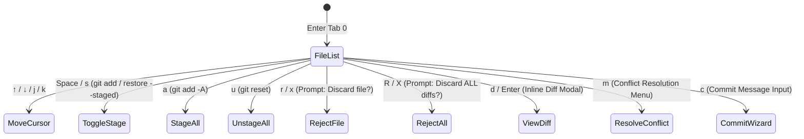

# 🐙 AGYGIT: Selective File Staging, Change Rejection & Conflict Resolution Architecture

> **Category**: Feature Specification & Strategic Plan  
> **Subsystem**: Git Operations & Multi-Agent VCS (`apps/agygit`)  
> **Environment**: Ubuntu WSL2 + Windows 11 / VS Code  
> **Date**: September 8, 2026  
> **Status**: In Active Execution  
> **Clickable Reference**: [AGYGIT_STAGING_REJECT_CONFLICT_PLAN.md](./AGYGIT_STAGING_REJECT_CONFLICT_PLAN.md)  
> **Windows UNC Path**: `\\wsl.localhost\Ubuntu\home\truongnhon\projects\powershell-profile\AGYGIT_STAGING_REJECT_CONFLICT_PLAN.md`  
> **Master Gateway**: [docs/README.md](./docs/README.md)  
> **Reports Catalog**: [docs/reports/README.md](./docs/reports/README.md)

---

## 1. Executive Summary

In response to developer workflows requiring precise control over uncommitted working tree changes, this specification designs an **Interactive File Selector & Conflict Resolution Engine** for `agygit` (Tab 0: Status & Commit).

Previously, `agygit` Tab 0 dumped porcelain status lines as static text and only supported coarse-grained `git add -A` (`a`) or `git reset` (`u`). Developers could not:
1. Navigate individual changed files with arrow keys.
2. Selectively stage or unstage specific files (`Space` / `s`).
3. Reject / discard working changes for a single file (`r` / `x`).
4. Reject all uncommitted changes across the working tree (`R` / `X` with confirmation).
5. Inspect per-file diffs inline (`d` / `Enter`).
6. Detect and resolve three-way merge conflicts (`UU`, `AA`, `UD`, `DU`) with automated `--ours` / `--theirs` resolution strategies.

---

## 2. Interactive File Porcelain Model

### 2.1 Structured File Item
Instead of raw strings, `agygit` parses `git status --porcelain=v1` into structured items:

```go
type ChangedFile struct {
    IndexStatus   byte   // X column in porcelain: 'M', 'A', 'D', 'R', 'C', '?'
    WorkTreeStatus byte  // Y column in porcelain: 'M', 'D', '?', 'U'
    Path          string
    OriginalPath  string // For renames (R)
    IsStaged      bool
    IsUntracked   bool
    IsConflict    bool
}
```

### 2.2 Porcelain Status Classification Table

| Porcelain XY | Classification | Staged State | Display Badge |
| :--- | :--- | :--- | :--- |
| `M ` | Modified (Staged) | Staged | `\033[32m[+Staged]  \033[0m` |
| ` M` | Modified (Unstaged) | Working Tree | `\033[33m[~Modified]\033[0m` |
| `MM` | Partially Staged | Both | `\033[36m[±Partial] \033[0m` |
| `A ` | Added to Index | Staged | `\033[32m[+Added]   \033[0m` |
| `D ` | Deleted in Index | Staged | `\033[31m[-Deleted] \033[0m` |
| ` D` | Deleted in WorkTree | Working Tree | `\033[31m[-Deleted] \033[0m` |
| `??` | Untracked File | Untracked | `\033[37m[?Untrack] \033[0m` |
| `UU` | Both Modified (Conflict) | Conflict | `\033[1;37;41m ⚠️ CONFLICT \033[0m` |
| `AA` | Both Added (Conflict) | Conflict | `\033[1;37;41m ⚠️ CONFLICT \033[0m` |
| `UD` / `DU` | Modified/Deleted Conflict | Conflict | `\033[1;37;41m ⚠️ CONFLICT \033[0m` |

---

## 3. Keyboard Interaction Architecture (Tab 0: Status & Commit)



### 3.1 Hotkey Matrix

| Key | Action | Git Execution Command |
| :--- | :--- | :--- |
| `↑` / `↓`, `k` / `j` | **Move File Selection** | Navigates the active changed file cursor |
| `Space`, `s` | **Toggle Stage / Unstage** | If unstaged: `git add <file>`. If staged: `git restore --staged <file>` |
| `a`, `A` | **Stage All** | `git add -A` |
| `u` | **Unstage All** | `git reset` |
| `r`, `x` | **Reject File Changes** | Prompts confirmation. If modified: `git restore <file>`. If untracked: `rm -rf <file>` |
| `R`, `X` | **Reject ALL Changes** | Red confirmation banner. `git restore .` + `git clean -fd` |
| `d`, `Enter` | **Inspect File Diff** | Shows syntax-highlighted diff for selected file (`git diff -- <file>` or `--staged`) |
| `m`, `M` | **Resolve Conflict** | Interactive menu: `[1] Accept Ours`, `[2] Accept Theirs`, `[3] Edit Conflict` |
| `c`, `C` | **Commit Staged** | Prompts for commit message; commits only staged files (`git commit -m "..."`) |
| `U` | **Undo Last Commit** | `git reset --soft HEAD~1` (preserving changes in working tree) |
| `Tab` / `1`-`5` | **Switch Tabs** | Preserves state and allows seamless navigation without blocking |

---

## 4. Conflict Resolution Workflow

When merge or rebase conflicts occur:
1. `agygit` detects conflict status codes (`UU`, `AA`, `UD`, `DU`).
2. Conflict files are highlighted with a prominent red background banner: `⚠️ CONFLICT: <path>`.
3. Pressing `m` on a conflicting file triggers the **Conflict Resolver**:
   ```text
   ⚔️ Conflict Resolution: internal/view/app.go
   ───────────────────────────────────────────────────────
    [1] Accept Ours   (Keep current HEAD changes: git checkout --ours)
    [2] Accept Theirs (Accept incoming branch changes: git checkout --theirs)
    [3] Edit File     (Open file in editor with conflict markers)
    [Esc] Cancel
   ───────────────────────────────────────────────────────
   ```
4. Upon selecting option `1` or `2`, `agygit` executes `git checkout --ours/--theirs <file>` followed by `git add <file>` to mark the conflict as resolved.
5. If all conflicts are resolved, `agygit` displays `✔ All merge conflicts resolved. Press [c] to complete merge commit.`

---

## 5. CLI Subcommand Extensions

```bash
agygit stage <file>                  # Stage a single file
agygit unstage <file>                # Unstage a single file
agygit reject <file>                 # Discard changes in a file (git restore / clean)
agygit reject-all                    # Discard all working tree changes with prompt
agygit diff <file>                   # Display diff for specific file
agygit conflicts                     # List files currently in conflict state
agygit resolve <file> --ours         # Accept ours for a conflicting file
agygit resolve <file> --theirs       # Accept theirs for a conflicting file
```

---

## 6. Implementation & Verification Protocol

1. **`apps/agygit/internal/service/gitops/gitops.go`**:
   - Add `GetChangedFiles(repoPath string) ([]model.ChangedFile, error)`.
   - Add `StageFile(repoPath, file string) error`.
   - Add `UnstageFile(repoPath, file string) error`.
   - Add `RejectFile(repoPath, file string, isUntracked bool) error`.
   - Add `RejectAll(repoPath string) error`.
   - Add `GetFileDiff(repoPath, file string, staged bool) (string, error)`.
   - Add `ResolveConflict(repoPath, file string, strategy string) error`.
2. **`apps/agygit/internal/view/app.go`**:
   - Update `renderStatusTab` to render the interactive changed files table with cursor `▶ `, status badges, and pagination.
   - Bind keys `Space`/`s`, `r`/`x`, `R`/`X`, `d`/`Enter`, `m` for conflict resolution.
   - Maintain non-blocking polling and instant cursor movement.
3. **Verification**:
   - Unit tests covering parsing, staging, unstaging, rejection, and conflict resolution.
   - 100% test pass rate in `cd apps/agygit && go test -v ./...`.
