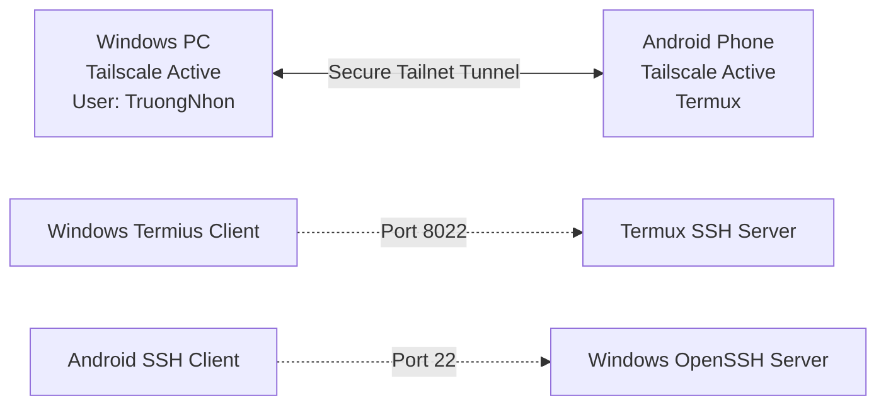

# Guide: Tailscale & SSH Setup (Windows & Android)

This guide details how to configure secure, bidirectional SSH connections between your Windows PC and Android (Termux) device using Tailscale VPN.

---

## 📋 System Architecture



---

## 🌐 Phase 1: Tailscale Setup (Both Devices)

1. **On Android:** Install **Tailscale** from the Play Store or F-Droid, log in, and switch it to **Active**.
2. **On Windows:** Ensure the Tailscale service is running. Find your devices' Tailscale IP addresses (e.g., `100.x.y.z`) by running:
   ```powershell
   tailscale status
   ```

---

## 💻 Phase 2: Connect from Windows (Termius) to Android (Termux)

### 1. Set Up Termux SSH Host:
Open **Termux** on your Android device and run:
```bash
# Update packages
pkg update && pkg upgrade -y

# Install OpenSSH
pkg install openssh -y

# Set your access password
passwd

# Get your Termux username
whoami

# Start the SSH server (runs on port 8022)
sshd
```

### 2. Connect from Termius (Windows):
1. Open **Termius** on your Windows PC.
2. Click **Add > New Host**.
3. Fill in the connection properties:
   * **Address/Hostname:** Android's Tailscale IP (e.g., `100.72.107.110`)
   * **Port:** `8022`
   * **Username:** The username retrieved from `whoami` in Termux.
   * **Password:** The password you set via `passwd`.
4. Click **Save** and double-click the host to connect.

---

## 📱 Phase 3: Connect from Android (Termux) to Windows (OpenSSH)

This uses passwordless SSH Key authentication for the default Administrator user `TruongNhon`.

### 1. Generate SSH Key on Android (Termux):
```bash
ssh-keygen -t ed25519 -C "termux-to-windows"
# Press Enter to accept defaults.

# Output your public key to copy:
cat ~/.ssh/id_ed25519.pub
```

### 2. Authorize the Key on Windows:
Open **PowerShell as Administrator** on your Windows PC and execute:
```powershell
# Replace with the public key output copied from Termux above:
$newKey = "ssh-ed25519 AAAAC3NzaC1lZDI1NTE5..." 
$authFilePath = "C:\ProgramData\ssh\administrators_authorized_keys"

# Append the public key
Add-Content -Path $authFilePath -Value "`r`n$newKey" -Force

# Secure the key file permissions (OpenSSH security requirements)
$acl = Get-Acl $authFilePath
$acl.SetAccessRuleProtection($true, $false)
$adminsRule = New-Object System.Security.AccessControl.FileSystemAccessRule("Administrators", "FullControl", "Allow")
$systemRule = New-Object System.Security.AccessControl.FileSystemAccessRule("SYSTEM", "FullControl", "Allow")
$acl.AddAccessRule($adminsRule)
$acl.AddAccessRule($systemRule)
Set-Acl $authFilePath $acl
```

### 3. Connect from Android (Termux):
Run the command (no password required):
```bash
ssh TruongNhon@<windows-tailscale-ip>
```

---

## 🛠️ Service Management

### Windows Services (Auto-start on boot):
Verify that both SSH and Tailscale run automatically at system startup:
```powershell
Get-Service sshd, tailscale | Select-Object Name, StartType
```

### Termux Services (Auto-start on launch):
To auto-start `sshd` whenever you open the Termux app, run:
```bash
echo "sshd" >> ~/.bashrc
```

---

## 📱 PowerShell Profile Connection Helpers

The following helper functions are defined in your PowerShell profile to simplify terminal control configuration:

### 1. View network status and active sessions:
```powershell
ssh-info
```
Displays Tailscale IP address, local network IPs, active client connection sources on port 22, and quick connect terminal command.

### 2. Authorize public SSH key for passwordless login:
```powershell
ssh-addkey -Key "ssh-ed25519 AAAAC3NzaC1lZDI1NTE5..." -Account "sshuser"
```
Appends the key to the specified user's `.ssh\authorized_keys` file and applies strict NTFS permissions to satisfy OpenSSH server security rules.

