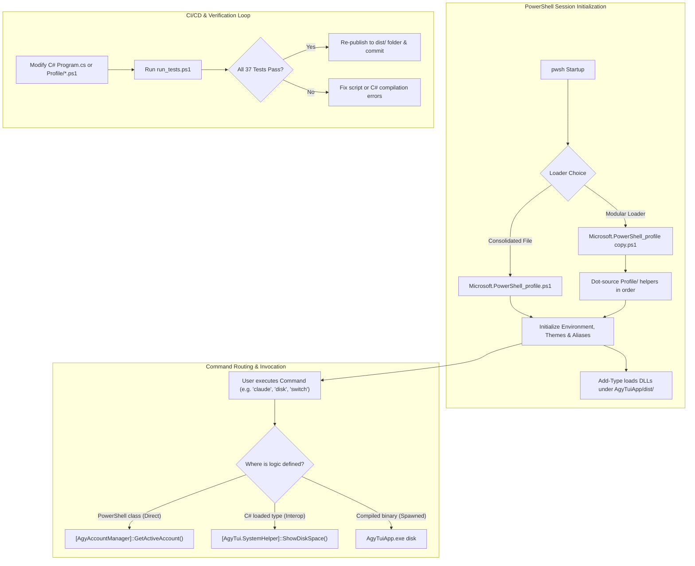

# Antigravity CLI Developer Workflow & Integration Guide

Welcome to the development guide for the **Antigravity PowerShell & C# TUI Application**. This document describes the execution flow, environment setup, and compilation workflows, and provides answers to common questions about extending the project cleanly.

---

## 🛸 Architecture & Execution Flow

The system leverages a hybrid approach: **PowerShell** provides shell integration (aliases, autocomplete, cmdlets, path hooks, environment bindings), while **C# (.NET 10 & Spectre.Console)** handles the interactive terminal UI (TUI) dashboards, heavy logic processing, and spaced-repetition engines.



---

## 🛠️ Environment Setup

To begin developing, verify that the following dependencies are installed and available on your system:

### 1. Core Runtimes & Tooling
* **.NET 10.0 SDK** (Verify via `dotnet --version`)
* **PowerShell Core 7.x** or higher (`pwsh`)
* **Node.js & npm** (Required for AI tool integrations)

### 2. External CLI Applications
Ensure these are in your system PATH (verified during profile loading):
* **Git** (Required for code versioning and conventional commit helper)
* **Docker & Docker Compose** (Required for docker container monitor tools)
* **Ollama** (Required for local LLM routing)
* **GitHub CLI (gh)** (Required for GitHub workspace credentials mapping)
* **Claude / Codex / OpenClaw NPM packages** (Used by AI wrappers)

---

## 🔄 Execution & Code Update Flow (CI/CD)

Whenever you introduce new code changes, follow this cycle to build, test, and apply updates:

### Phase 1: Write Code
* Edit TUI screens, logic class methods, or algorithms in [Program.cs](file:///C:/Users/TruongNhon/Documents/Powershell/AgyTuiApp/Program.cs).
* Edit environment configurations, keybindings, or console aliases in [Profile/Core/Aliases.ps1](file:///C:/Users/TruongNhon/Documents/Powershell/Profile/Core/Aliases.ps1) or [Profile/Core/ProfileEnvironment.ps1](file:///C:/Users/TruongNhon/Documents/Powershell/Profile/Core/ProfileEnvironment.ps1).

### Phase 2: Build & Publish
Compile the C# code and publish it directly to the target `dist` directory so the PowerShell profile loader can bind to the new DLL:
```powershell
# Navigate to C# project folder
cd C:\Users\TruongNhon\Documents\Powershell\AgyTuiApp

# Compile and publish in Release mode
dotnet publish -c Release -o ./dist
```

### Phase 3: Execute Tests
Run the test harness to verify that all syntax, type resolutions, external tools, and Pester tests are passing:
```powershell
pwsh -File C:\Users\TruongNhon\Documents\Powershell\Tests\run_tests.ps1
```

### Phase 4: Reload Shell
If you are developing inside an active PowerShell terminal, apply the modifications instantly by calling the reload profile function:
```powershell
Reload-Profile  # or use the shorthand alias: rl
```

---

## ❓ Developer Q&A

### Q1: How do I add a new alias/command without duplicating C# and PS1 code?
> [!IMPORTANT]
> **Rule of Thumb**: Keep logic in C# (`.cs`) and expose routing wrapper functions in PowerShell (`.ps1`). Do not copy class definitions or logic routines between both languages.

**Steps to add a clean command:**
1. Define the command logic in a `public static` class method inside [Program.cs](file:///C:/Users/TruongNhon/Documents/Powershell/AgyTuiApp/Program.cs). E.g.:
   ```csharp
   namespace AgyTui {
       public static class MyNewHelper {
           public static void RunGreeting(string userName) {
               AnsiConsole.MarkupLine($"[bold green]Hello, {userName.EscapeMarkup()}![/]");
           }
       }
   }
   ```
2. In the `Program.Main()` method routing block (around line 6536), add a CLI switch matching the argument:
   ```csharp
   case "greet":
       var user = args.Length > 1 ? args[1] : "Developer";
       MyNewHelper.RunGreeting(user);
       break;
   ```
3. Expose the command in [Profile/Core/Aliases.ps1](file:///C:/Users/TruongNhon/Documents/Powershell/Profile/Core/Aliases.ps1) using the loaded type interop (without re-writing the C# logic in PowerShell):
   ```powershell
   # Helper wrapper calling loaded C# assembly type directly
   function Invoke-Greeting {
       param([string]$Name = "Developer")
       [AgyTui.MyNewHelper]::RunGreeting($Name)
   }

   # Setup the Alias
   Set-Alias -Name greet -Value Invoke-Greeting -Force
   ```
This setup ensures the C# implementation remains the single source of truth, and the PowerShell session accesses it cleanly.

---

### Q2: What is the difference between `Microsoft.PowerShell_profile.ps1` and `Microsoft.PowerShell_profile copy.ps1`?
* **[Microsoft.PowerShell_profile copy.ps1](file:///C:/Users/TruongNhon/Documents/Powershell/Microsoft.PowerShell_profile%20copy.ps1) (Modular Loader)**:
  * Recommended for **development**. It acts as a lightweight launcher that scans the `Profile/` sub-folders and loads files individually.
  * Easy to isolate, modify, and unit-test since files (like `DatabaseHelper.ps1`, `GitHelper.ps1`) are separate.
* **[Microsoft.PowerShell_profile.ps1](file:///C:/Users/TruongNhon/Documents/Powershell/Microsoft.PowerShell_profile.ps1) (Consolidated Profile)**:
  * Recommended for **production/distribution**. It compiles all scripts into a single, high-performance profile file to reduce shell startup times by avoiding disk I/O scans.

---

### Q3: Why do we use `[System.IO.File]::WriteAllText` instead of `Out-File`?
In PowerShell testing contexts (especially when using Pester mocks), mocking cmdlets like Out-File that constraint properties to `[System.Text.Encoding]` can lead to casting failures (`PSInvalidCastException`) when strings are supplied. Using raw .NET writes (e.g. `[System.IO.File]::WriteAllText($path, $text)`) completely bypasses these cmdlet-binding bugs and makes the profile helper scripts robust across different shell hosts.

---

## 🛡️ TUI & Profile Invariants

1. **Markup Tag Safety**: All user input, command descriptions, and panel headers rendered via Spectre.Console MUST use `.EscapeMarkup()`. Literal brackets (`[+]`, `[-]`) and slashes (`[/]`) MUST be escaped as `[[+]]`, `[[-]]`, and `[[/]]`.
2. **Subprocess Isolation**: PowerShell profile shortcuts (`cc`, `cg`, `cnet`, etc.) MUST launch `AgyTuiApp.exe` directly as a subprocess to prevent Windows assembly locking and runtime version conflicts.
3. **Slash-Command Normalization**: TUI search filters MUST sanitize queries using `searchBuffer.TrimStart('/')` to allow seamless `/command` searches without returning empty results.

