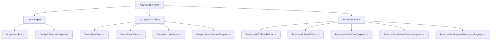

# 🛸 Antigravity UI & Code Modularization Refactoring Plan

This refactoring plan outlines how to decouple and modularize the compiled C# application [Program.cs](file:///C:/Users/TruongNhon/Documents/Powershell/AgyTuiApp/Program.cs) and the PowerShell profile script [Microsoft.PowerShell_profile.ps1](file:///C:/Users/TruongNhon/Documents/Powershell/Microsoft.PowerShell_profile.ps1). It guarantees that all existing UI/UX elements, hotkeys, search operations, and account caching remain identical to the original `agy-cli` look and feel, while upgrading the option selection panes to utilize the new slash-command UI layout.

---

## 🎨 1. UI/UX Global Design Layout

To enforce a state-of-the-art developer CLI aesthetic, the **Slash Command Selection UI** is applied to option menus, commands list selection, and sub-page menus, while preserving the standard categorization in the Left Pane.

### 🖥️ Main Screen Dashboard (Three-Pane Layout)
The main navigation screen (`cc` dashboard) maintains its **three-pane layout** rendered using Spectre.Console panels:

*   **Left Pane (Menu)**: Width-restrained sidebar listing the primary categories as standard text menu items (e.g., `[Workspace & Dev]`, `[AI Agent & Ollama]`).
*   **Middle Pane (Options)**: Renders as the **Slash Command Prompt Selector** containing options matching the active category.
*   **Right Pane (Details)**: Instantly renders details, help instructions, metadata status, or contextual info tables (e.g. Ollama daemon status).

```
=================================================================
 ▄████▄ ▄████▄   🛸 Powershell Profile Control Center v3.0 🛸
=================================================================
 [Tab/→] Navigate Panes | [←/Esc] Go Back | [Enter] Select & Run
=================================================================

╭─Menu (Left)──────────────╮ ╭─Options (Middle)─────────────────────────────────────────────────╮ ╭─Details (Right)──────────────╮
│  [Workspace & Dev]       │ │ ──────────────────────────────────────────────────────────────── │ │ [AI Agent & Ollama]          │
│ > [AI Agent & Ollama]    │ │ > /                                                              │ │                              │
│  [AGY Account Switch]    │ │ ──────────────────────────────────────────────────────────────── │ │ Description or dynamically   │
│  [Docker & Databases]    │ │ > /claude-cloud      Launch Claude Code CLI utilizing cloud APIs │ │ loaded status widget         │
│  ...                     │ │   /claude-ollama     Run Claude Code routed locally via Ollama   │ │ (e.g. Ollama daemon status)  │
╰──────────────────────────╯ │   /codex-cloud       Launch Gemini's Codex CLI (Cloud)           │ ╰──────────────────────────────╯
                             │    ↓ 6 more                                                      │
                             │                                                                  │
                             │   ↑/↓ Navigate · enter Select · tab Complete                     │
                             ╰──────────────────────────────────────────────────────────────────╯
```

### ⚙️ Mechanics of the Global Slash Layout:
1.  **Left Category Pane**: Keeps standard category labels (e.g., `[AI Agent & Ollama]`). Highlighting a category displays category-specific options in the middle pane.
2.  **Middle Options Pane**: Formatted as a Slash Command prompt. Commands are prefixed with `/` (e.g., `/claude-cloud`, `/openclaw`, `/hermes`).
3.  **Submenus / Modals / Lists**: Selecting sub-views (like Select Shell Theme, Select Active Account, or Navigate Workspace) transitions the active selection viewport into a slash selection prompt listing child options (e.g. `/vothuongtruongnhon2002@gmail.com`).
4.  **🌿 In-Line Tree Expansion on `Enter`**: Nested groupings (like `.NET Project Tools`) expand dynamically in-line:
    ```
      / item1
      > /dotnet-tools       Grouped .NET commands (Press Enter to Expand/Collapse)
        ├── /dbld           Build project
        ├── /dtst           Test project
        └── /clean-build    Clean build artifacts
      / item2
    ```

---

## ⌨️ 2. Advanced Hotkeys & Interactive Search Flow

The keyboard interaction flow is split into two distinct states to ensure flawless text entry, navigation, and child menu execution.

### 🟢 State A: Normal Navigation (Search Inactive)

#### 1. Main Category Menu (Left Pane)
When the keyboard focus is locked on the Left Category Pane:
*   **UpArrow / DownArrow / J / K**: Scroll through the 10 core categories defined in [menu_map.md](file:///C:/Users/TruongNhon/Documents/Powershell/menu_map.md). Highlighting a category instantly loads its child options in the Middle Options Pane (e.g., highlighting `[Workspace & Dev]` dynamically refreshes the options pane with `/proj`, `/ide`, `/gs`, etc., and displays category summaries in the Right Pane).
*   **Tab / RightArrow / L / Enter**: shifts focus to the Middle Options Pane, locking focus on the first command option.
*   **/** (Slash key): Immediately displays the search prompt globally and focuses on the Middle Pane, letting the user query across all categories at once.
*   **Escape / Q**: Exits the Control Center application cleanly.

#### 2. Child Command Options Menu (Middle Pane)
When keyboard focus transitions to the Middle Options Pane:
*   **UpArrow / DownArrow / J / K**: Scroll through the category-specific commands. The Right Pane updates in real-time, loading help topics, configurations, or live widgets (e.g. the Ollama models list).
*   **LeftArrow / Escape / H**: Returns focus back to the Left Pane Category Selector.
*   **Enter**: Executes the highlighted command immediately (e.g. launching `/claude-cloud` subprocess). If the item is a container grouping (e.g. `/dotnet-tools`), pressing `Enter` expands it in-line showing its child list.
*   **/** (Slash key): Focuses the search input in the Middle Pane prompt header, letting the user type characters to filter.

#### 3. Sub-page Selection Menus (Child Lists)
When executing submenus (like Select Active Account, Select Shell Theme, Pomodoro Focus topics, or Workspace navigation lists):
*   **UpArrow / DownArrow / J / K**: Scrolls the list of options. The active selection index wraps around safely.
*   **Enter**: Confirms selection. For example, selecting `/fptvttnhon2026@gmail.com` under Accounts switches credentials instantly, and selecting `/cobalt` under Themes updates files and environment variables.
*   **Special Operations Hotkeys**:
    *   **`A`** (Add): Triggers account creation prompt (Account view only).
    *   **`D`** (Delete): Deletes the highlighted profile folder with confirmation (Account view only).
    *   **`O`** (Logout): Logs out and clears keyring credentials (Account view only).
*   **Escape / Q / LeftArrow / H**: Cancels sub-page menu selection and returns the viewport focus to the parent command options list.

---

### 🔵 State B: Active Search (Search Engaged)
Once `/` is pressed and text characters are in the query buffer:
*   **Input Buffering**:
    *   Any alphanumeric or space key press appends characters to the search buffer (e.g., typing `/clau` updates the filter).
    *   `Backspace` → Deletes the last character in the query buffer.
*   **Navigation & Autocomplete**:
    *   `UpArrow` / `DownArrow` / `J` / `K` → Safely navigate the *filtered* list without closing the search.
    *   `Tab` → Autocompletes the search buffer with the highlighted item's command alias.
    *   `Enter` → Confirms the highlighted selection, runs the command, and exits search mode.
*   **Escape Search**:
    *   `Escape` → Instantly exits search mode, clears the query buffer, and restores the full menu list.
*   **Key Overrides**:
    *   All single-key action handlers (such as pressing `A` for Add, `D` for Delete, or `O` for Logout) are **suppressed** while typing in the search box to prevent accidental triggers.

---

## 📦 3. Refactoring [Program.cs](file:///C:/Users/TruongNhon/Documents/Powershell/AgyTuiApp/Program.cs) (C# Monolith)

Currently, `Program.cs` is a monolithic file containing over **8,500 lines of code**. It houses the main execution loop, UI helper classes, external tool wrappers, and quiz engines.

### 🔍 Current Issues
*   **Mixing of Concerns**: Mixes terminal UI rendering (`Spectre.Console`), database access, HTTP client calls, system process management, and quiz state.
*   **Compilation Overhead**: Modifying a single feature requires recompiling the entire application, and resolving git merge conflicts in a single large file is complex.
*   **Naming Inconsistencies**: Mixed naming conventions (e.g. standard C# `PascalCase` vs. javascript-style `camelCase` variable abbreviations like `catIdx`, `destDirLoc`, `psi`).

### 🗺️ Proposed Architecture Splitting
We propose dividing `Program.cs` into modular files grouped under clean namespaces inside the `AgyTuiApp` project:



### 🗂️ Proposed File Structures

#### 1. Core Engine
*   **[Program.cs](file:///C:/Users/TruongNhon/Documents/Powershell/AgyTuiApp/Program.cs)**: Minimal bootstrap class that handles command-line arguments and launches the Control Center.
*   **`Config.cs`**: Handles deserialization of `profile.config.json` and system preferences.

#### 2. Component/UI Wrappers (Namespace: `AgyTui.UI`)
*   **`SpectreWidgets.cs`**: Consolidates custom Spectre.Console components:
    *   [SpectreMenu](file:///C:/Users/TruongNhon/Documents/Powershell/AgyTuiApp/Program.cs#L43) (menus with search, lists, grids)
    *   [SpectrePanel](file:///C:/Users/TruongNhon/Documents/Powershell/AgyTuiApp/Program.cs#L243) (formatted alerts/cards)
    *   [SpectreTable](file:///C:/Users/TruongNhon/Documents/Powershell/AgyTuiApp/Program.cs#L378) (grid displays)

#### 3. View Models & TUI Layouts (Namespace: `AgyTui.Views`)
*   **`MainView.cs`**: The core [CcNavigator](file:///C:/Users/TruongNhon/Documents/Powershell/AgyTuiApp/Program.cs#L7314) loop.
*   **`LearnView.cs`**: Sub-pages for flashcards, English drills, algorithms visualizer, and STAR builder.
*   **`AccountView.cs`**: Sub-pages for credentials quotas, live status, and keyring switches.

#### 4. Feature Service Domains (Namespace: `AgyTui.Features.*`)
*   **`AgyAiCore.cs`**: Orchestrates Claude Code, Codex, and OpenClaw integrations.
*   **`OllamaHelper.cs`**: Starts daemon, checks status, pulls models, and streams server logs.
*   **`QuizEngines.cs`**: Integrates spaced repetition, kana quizzes, and Kanji lookups.
*   **`SystemHelpers.cs`**: Houses disk diagnostics, Tailscale checks, SSH settings, and SQLite viewers.
*   **`WorkspaceRegistry.cs`**: Scans directories, updates `selected_project.txt`, and tracks workspace logs.

### 📝 Code Style & Naming Alignment
*   **Naming Convention**: Standardize all methods, classes, and properties to standard `PascalCase` (e.g. change `GetOllamaStatusWidget` to `GetOllamaStatusWidget`, and change abbreviation names like `destDirLoc` to `destinationDirectoryLocation`).
*   **Class Separation**: Move static classes into their own files. E.g. [AgyAccountCore](file:///C:/Users/TruongNhon/Documents/Powershell/AgyTuiApp/Program.cs#L672) should live in `AgyAccountCore.cs` instead of inside the file representing the TUI main loop.

---

## ⚡ 3. PowerShell Profile Modularization

The [Microsoft.PowerShell_profile.ps1](file:///C:/Users/TruongNhon/Documents/Powershell/Microsoft.PowerShell_profile.ps1) script will be modularized by using a clean compile build script.

### 🔄 Bundle Build Approach
*   **Development**: Developers modify isolated topic scripts inside `Profile/Core/` and `Profile/Helpers/`.
*   **Compilation**: A compilation script `scirpts/compile-profile.ps1` aggregates all of these individual files into a single optimized profile `Microsoft.PowerShell_profile.ps1`.
*   **Benefit**: This maintains ultra-fast shell startup (avoiding multiple disk file reads during shell execution) while allowing modular code maintenance.

### 🔒 Bypassing Process DLL Lock
To allow seamless rebuilding of the C# application without file lock issues in running terminal hosts:
1.  Configure the profile wrapper `cc` to launch the standalone published executable `AgyTuiApp.exe` directly as a subprocess (`& $exePath`) instead of loading and running the C# types in-process via `Add-Type`.
2.  Upon exit, the parent PowerShell host will inspect `selected_project.txt` and `active_account.txt` to sync directories and active profile contexts. This prevents DLL file locking entirely.

---

## 🛡️ 4. Guardrails (Do Not Break Current Changes!)

To protect your latest changes:
*   **Directory Caching**: Keep the static thread-safe dictionary checks in `GetPrivateDirectorySize` inside `AccountCore.cs` to prevent lag when navigating account lists.
*   **Ollama Check Restrictions**: The Ollama status widget must **only** be triggered by navigating to the dedicated `ollama-status` option. Do not reintroduce any global port polling during Category select frames.
*   **Keyring Token DPAPI Base64 interop**: Retain the unified DPAPI-based `EncryptToken` and `DecryptToken` logic to prevent account switches from failing credential vault writes.
*   **Unit Tests Compatibility**: The refactored structure will maintain full backward compatibility with all unit tests inside [Tests/Unit/AI-Tools.Tests.ps1](file:///C:/Users/TruongNhon/Documents/Powershell/Tests/Unit/AI-Tools.Tests.ps1) and [Tests/Unit/New-Features.Tests.ps1](file:///C:/Users/TruongNhon/Documents/Powershell/Tests/Unit/New-Features.Tests.ps1).
